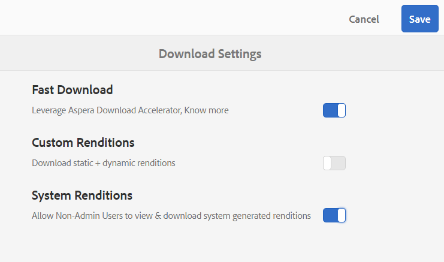

# 加速品牌入口網站下載{#guide-to-accelerate-downloads-from-brand-portal}

Brand Portal與IBM Aspera Connect整合，讓大型資產檔案的下載效能得以提升，後者是隨選安裝應用程式。 該應用程式使用專有技術來消除TCP開銷，並幫助提高資產檔案的傳輸速度。 此整合可確保增強的下載體驗。

>[!NOTE]
>
>下載速度因網路頻寬、伺服器延遲和用戶端地理位置等因素而異。

預設會啟用&#x200B;**[!UICONTROL 快速下載]**&#x200B;組態，大幅降低從品牌入口網站下載所需資產檔案所花的時間。

## 加速檔案下載的先決條件{#prerequisites-to-accelerate-file-download}

若要更快速下載檔案，請確定下列事項：

* 導覽至&#x200B;**[!UICONTROL 工具]** > **[!UICONTROL 下載]**，並驗證&#x200B;**[!UICONTROL 下載設定]**&#x200B;中已啟用&#x200B;**[!UICONTROL 快速下載]**&#x200B;組態。
* 確保防火牆上的埠33001（TCP和UDP）已開啟。 有關先決條件的詳細資訊，請參見[IBM Aspera Connect Client文檔](https://downloads.asperasoft.com/en/documentation/8)。
* [使用管理員權限，在瀏覽器的擴](https://www.ibm.com/support/knowledgecenter/SSXMX3_3.9.9/kc/connect_welcome.html) 充功能中安裝IBM Aspera Connect 3.9.9。
* 有關Aspera傳輸客戶端的平台支援，請參見[IBM Aspera Connect平台支援清單](https://www.asperasoft.com/company/support/transfer-clients/)。

## 下載網域{#download-domains}

以下是不同地理位置的下載網域：

| 地區代碼 | 網域 |
|---|---|
| 不適用或1 | downloads-na1.brand-portal.adobe.com |
| 北美VA5 | downloads-na2.brand-portal.adobe.com |
| EMEA LON5 | downloads-emea1.brand-portal.adobe.com |
| 亞太SIN2 | downloads-apac1.brand-portal.adobe.com |

## 使用檔案加速器{#expected-download-performance-using-file-accelerator}的下載效能範例

下表顯示使用Aspera Connect檔案下載加速器的2 GB檔案下載效能：

*觀察到的結果會因網路頻寬、伺服器延遲和用戶端位置等因素而有所不同，因為Brand Portal伺服器位於俄勒岡（美國）。*

| 用戶端位置 | 客戶端與伺服器之間的延遲（毫秒） | 使用Aspera Connect檔案傳輸加速器(MBps)加速 | 下載含Aspera檔案傳輸加速器的2 GB檔案所花的時間（秒） |
|---------------------------|-----------------------------------|---------------------------------------------|-------------------------------------------------------------------------|
| 美國西部（北美）加州) | 18 | 36 | 57 |
| 美國西部（俄勒岡） | 42 | 36 | 57 |
| 美國東部(N.維吉尼亞) | 85 | 35 | 58 |
| 亞太地區（東京） | 124 | 36 | 57 |
| Noida（印度） | 275 | 13塊3毛6 | 153 |
| 雪梨 | 175 | 29 | 70 |
| 倫敦 | 179 | 35 | 58 |
| 新加坡 | 196 | 34 | 60 |

## 使用檔案加速器{#download-workflow-using-file-accelerator}下載工作流程

若要更快速地從品牌入口網站下載資產：

1. 使用支援的瀏覽器登入品牌入口網站。
1. 瀏覽並選取您要下載的檔案夾或資產。 在頂端的工具列中，按一下&#x200B;**[!UICONTROL 下載]**&#x200B;圖示。 出現&#x200B;**[!UICONTROL Download]**&#x200B;對話方塊，預設會選取&#x200B;**[!UICONTROL Asset(s)]**&#x200B;和&#x200B;**[!UICONTROL Enable download acceleration]**&#x200B;核取方塊。

   

   >[!NOTE]
   >
   >目前不支援傳送電子郵件通知及下載資產連結的功能，同時啟用更快速的下載。

   

1. 按一下&#x200B;**[!UICONTROL 下載]**。

   若要加速品牌入口網站租用戶帳戶的下載體驗，您必須在瀏覽器的擴充功能中安裝Aspera Connect用戶端應用程式。

1. **下載Aspera Connect用戶端**

   如果系統未安裝Aspera Connect客戶端或現有Aspera Connect客戶端已過期，則瀏覽器頁面上將顯示提示，您可以從中選擇&#x200B;**[!UICONTROL 下載最新版]**&#x200B;下載特定系統的Aspera Connect客戶端。

   

   若要從[https://downloads.asperasoft.com/connect2/](https://downloads.asperasoft.com/connect2/)下載最新版Aspera Connect，請選擇&#x200B;**[!UICONTROL Download Now]**&#x200B;並依照指示進行。

1. **安裝Aspera Connect客戶端**

   要安裝IBM Aspera Connect客戶端設定，請從IBM Aspera Connect客戶端應用程式的。msi檔案運行設定，然後遵循安裝嚮導。

1. 成功安裝客戶機後，請刷新瀏覽器頁面並再次啟動下載步驟。

   首次使用Aspera Connect時，瀏覽器會提示使用&#x200B;**[!UICONTROL IBM Aspera Connect]**&#x200B;開啟連結。 要以後跳過此對話框，請啟用&#x200B;**[!UICONTROL 記住我對FASP連結的選擇]**。

   >[!NOTE]
   >
   >這則訊息在不同的瀏覽器上不同。

1. 對話框確認是否繼續傳輸。 選擇&#x200B;**[!UICONTROL 允許]**開始。
要在以後跳過此對話框，請啟用**[!UICONTROL 對與此主機的所有連接使用我的選擇]**。
下載開始。 對話方塊顯示下載進度。 使用對話方塊來下載**[!UICONTROL pause]**、**[!UICONTROL resume]**&#x200B;或&#x200B;**[!UICONTROL cancel]**。
Aspera Connect應用程式提供系統上的「活動視窗」，讓使用者可檢視和管理所有傳輸作業。 如需詳細資訊，請參閱[Aspera Connect Client檔案](https://downloads.asperasoft.com/en/documentation/8)。

成功完成下載後，對話方塊會顯示資產下載至使用者系統的位置。 如果發生故障，則顯示錯誤。

>[!NOTE]
>
>Aspera Connect客戶端應用程式有已知的限制，如果&#x200B;**[!UICONTROL Preferences]**&#x200B;中的頁籤&#x200B;**[!UICONTROL Transfers]**&#x200B;下啟用了「始終詢問我要在何處保存下載的檔案」，則不會出現選擇下載位置的提示。 ]****[!UICONTROL &#x200B;在下載開始之前，請在文字方塊中提供位置&#x200B;**[!UICONTROL 將下載的檔案儲存至]**。

## 在Microsoft Edge瀏覽器{#using-file-accelerator-on-microsoft-edge-browser}上使用檔案加速器

Microsoft Edge以增強保護模式(EPM)運行，在同一專用網路或受信任站點上，防止與Aspera Connect伺服器通信。 因此，每次建立與伺服器的連線時，都會出現快顯視窗。

若要在Microsoft Edge上使用加速下載功能，請從受信任的網站清單中移除品牌入口網站。

1. 開啟控制面板（**[!UICONTROL 窗口鍵+ X]**，然後選擇&#x200B;**[!UICONTROL 控制面板]**）。
1. 前往「**[!UICONTROL 網路與網際網路]** > **[!UICONTROL 網際網路選項]**」。 按一下&#x200B;**[!UICONTROL Security]**&#x200B;頁籤。
1. 按一下&#x200B;**[!UICONTROL 受信任站點區域]** ，然後按一下&#x200B;**[!UICONTROL 站點]**。
1. 從清單中移除品牌入口網站。

## Aspera Connect客戶端首選項{#aspera-connect-client-preferences}

在IBM Aspera Connect Client偏好設定中，可以使用滑鼠右鍵按一下圖示並選取&#x200B;**[!UICONTROL 偏好設定]**&#x200B;來設定一些有用的偏好設定。

您可以設定預設的下載位置。

此外，Aspera Connect用戶端也可標籤為在系統啟動時自動啟動，如此連線用戶端就會執行，並可供下載，開始更快速。

## 疑難排解下載加速{#troubleshoot-issues-with-download-acceleration}的問題

如果下載加速無法為您運作，請依照下列步驟進行疑難排解：

1. 從您的電腦訪問[https://test-connect.asperasoft.com](https://test-connect.asperasoft.com/) ，檢查埠是否未被阻止。

   如果埠不正常，請聯繫您的網路團隊，並確保Ports 33001（包括TCP和UDP）未在防火牆中被阻止。

1. 如果埠正常，則使用[https://www.speedtest.net/](https://www.speedtest.net/)測量可用頻寬來檢查網路是否不慢。

   如果頻寬為幾(1-10 Mbps)或Kbps，則使用Aspera偏好設定並嘗試限制等於可用頻寬的頻寬。

1. 若要確認來自Aspera示範伺服器的下載是否正常運作，請使用[https://demo.asperasoft.com/aspera/user](https://demo.asperasoft.com/aspera/user)。\
   (登入： asperweb，密碼： 德摩斯佩拉

1. 如果上述疑難排解步驟無法運作，請取消選取「啟用下載加速」選項，然後使用一般下載。
