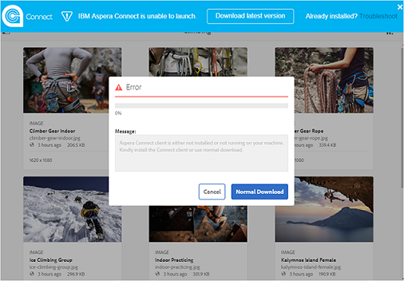
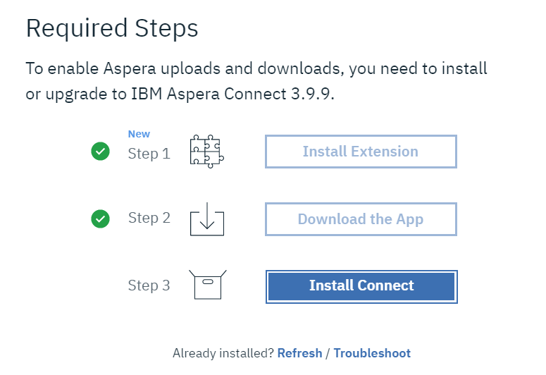
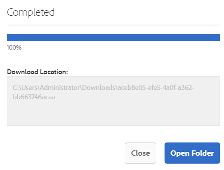
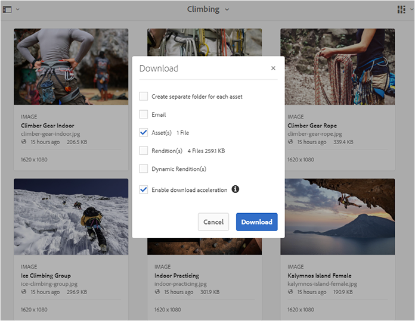
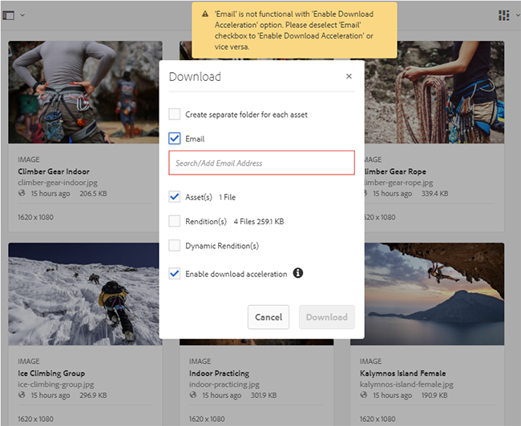
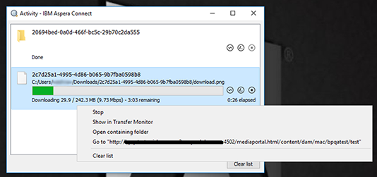
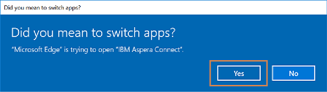
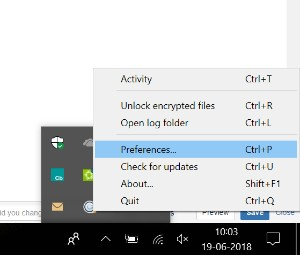
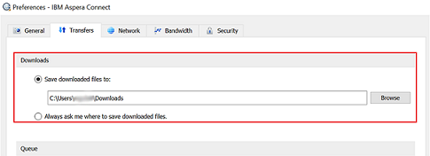
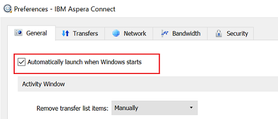

# 加快Brand Portal下載速度 {#guide-to-accelerate-downloads-from-brand-portal}

<!-- This topic is woefully out of date. It talks at length about using a third party application whose URLs have a variety of problems. Topic should either be deleted or updated entirely to not talk about a specific third party application that Adobe has no control over. It also appears that the third party app is NOT free anymore. -->

Adobe Experience Manager Assets Brand Portal可整合IBM® Aspera Connect （隨選安裝應用程式），以提升大型資產檔案的下載效能。 應用程式使用專有技術移除TCP間接費用，並幫助改善資產檔案的傳輸速度。 此整合可確保增強下載體驗。

>[!NOTE]
>
>下載速度因使用者而異，因為它取決於網路頻寬、伺服器延遲和使用者端地理位置等因素。

此 **[!UICONTROL 快速下載]** 設定預設為啟用，可大幅縮短從Brand Portal下載所需資產檔案的時間。

## 加速檔案下載的必要條件 {#prerequisites-to-accelerate-file-download}

若要更快下載檔案，請確定以下事項：

* 導覽至 **[!UICONTROL 工具]** > **[!UICONTROL 下載]** 並確認 **[!UICONTROL 快速下載]** 設定已啟用於 **[!UICONTROL 下載設定]**.
* 確定防火牆上的連線埠33001 （TCP和UDP）已開啟。 如需必要條件的詳細資訊，請參閱 [IBM® Aspera Connect Client檔案](https://downloads.asperasoft.com/en/documentation/8).
* **安裝IBM® Aspera Connect 3.9.9** 在瀏覽器的擴充功能中使用管理員許可權(`https://www.ibm.com/docs/en/aspera-connect/3.9.9`)。
* 如需Aspera傳輸使用者端的平台支援，請參閱 [IBM® Aspera Connect平台支援對照表](https://www.asperasoft.com/company/support/transfer-clients/).

>[!NOTE]
>
>IBM® Aspera Connect有一個已知問題。 快速下載無法搭配IBM® Aspera Connect 3.10版及更新版本使用。

## 下載網域 {#download-domains}

以下是不同地理位置的下載網域：

| 地區代碼 | 網域 |
|---|---|
| NA或1 | downloads-na1.brand-portal.adobe.com |
| NA VA5 | downloads-na2.brand-portal.adobe.com |
| 歐洲、中東及非洲地區LON5 | downloads-emea1.brand-portal.adobe.com |
| APAC SIN2 | downloads-apac1.brand-portal.adobe.com |

## 使用檔案加速器下載效能範例 {#expected-download-performance-using-file-accelerator}

下表顯示使用Aspera Connect檔案下載加速器時2 GB之檔案的下載效能：

*考慮到Brand Portal伺服器位於美國奧勒岡，觀察到的結果會因網路頻寬、伺服器延遲和使用者端位置等因素而有所不同。*

| 使用者端位置 | 使用者端與伺服器之間的延遲（毫秒） | 使用Aspera Connect File Transfer Accelerator (MBps)加速的速度 | 使用Aspera File Transfer Accelerator下載2 GB的檔案所花的時間（秒） |
|---------------------------|-----------------------------------|---------------------------------------------|-------------------------------------------------------------------------|
| 美國西部（北加州） | 18 | 36 | 57 |
| 美國西部（奧勒岡州） | 42 | 36 | 57 |
| 美國東部（維吉尼亞北部） | 85 | 35 | 58 |
| APAC （東京） | 124 | 36 | 57 |
| Noida （印度） | 275 | 13.36 | 153 |
| 雪梨 | 175 | 29 | 70 |
| 倫敦 | 179 | 35 | 58 |
| 新加坡 | 196 | 34 | 60 |

## 下載資產 {#download-assets}

若要從Brand Portal更快下載資產：

1. 登入您的Brand Portal租使用者。 根據預設， **[!UICONTROL 檔案]** 檢視會開啟，其中包含所有已發佈的資產和資料夾。

   執行下列任一項作業：

   * 選取您要下載的資產或資料夾。 在頂端的工具列中，按一下 **[!UICONTROL 下載]** 圖示。

      

   * 若要下載資產的特定資產轉譯，請將指標暫留在資產上，然後按一下 **[!UICONTROL 下載]** 圖示供快速動作縮圖使用。

      

1. 此 **[!UICONTROL 下載]** 列出所有選定資產的對話方塊隨即開啟。

   若要在下載資產時保留Brand Portal資料夾階層，請選取 **[!UICONTROL 為每個資產建立個別的資料夾]** 核取方塊。

   下載按鈕會反映所選專案的計數。 套用完規則後，請按一下 **[!UICONTROL 下載專案]**. 若要進一步瞭解如何套用規則，請參閱 [下載資產](../using/brand-portal-download-assets.md#download-assets).

   

1. 根據預設 **[!UICONTROL 快速下載]** 中的設定已啟用 **[!UICONTROL 下載設定]**. 因此，會顯示確認方塊，以使用IBM® Aspera Connect下載資產。

   如果您是第一次下載資產，而且瀏覽器中未安裝IBM® Aspera Connect，或是現有版本已過期，系統會提示您安裝Aspera下載加速器(`https://www.ibm.com/docs/en/aspera-connect/3.9.9`)。

   

1. **安裝Aspera Connect使用者端**

   若要安裝IBM® Aspera Connect使用者端安裝程式，請從IBM® Aspera Connect使用者端應用程式的.msi檔案執行安裝程式，然後依照安裝精靈操作。

   

1. 成功安裝使用者端後，請重新整理瀏覽器頁面，並再次起始下載步驟。

1. 若要繼續使用 **[!UICONTROL 快速下載]**，按一下 **[!UICONTROL 允許]**. 所有選取的轉譯都會使用IBM® Aspera Connect下載到zip資料夾中。

   成功完成下載後，對話方塊會顯示資產下載到使用者系統的位置。

   

   如果您不想使用IBM® Aspera Connect，請按一下 **[!UICONTROL 拒絕]**. 若 **[!UICONTROL 快速下載]** 被拒絕或失敗，系統會填入錯誤訊息。 按一下 **[!UICONTROL 一般下載]** 按鈕以繼續下載資產。

>[!NOTE]
如果 **[!UICONTROL 快速下載]** 管理員會關閉此設定，系統不會使用IBM® Aspera Connect，直接將選取的轉譯下載到zip資料夾中。

<!-- 
On successful completion of the download, a dialog box shows the location where assets are downloaded onto the user's system. If there is a failure, it shows error.

   >[!NOTE]
   >
   >There is a known limitation in Aspera Connect client application that no prompt to select download location appears if **[!UICONTROL Always ask me where to save downloaded files]** is enabled under the tab **[!UICONTROL Transfers]** within **[!UICONTROL Preferences]**. Before any download begins, provide the location in the text box **[!UICONTROL Save downloaded files to]**.

1. Log in to Brand Portal using a supported browser.
1. Browse and select the folders or assets you want to download. From the toolbar at the top, click the **[!UICONTROL Download]** icon. the **[!UICONTROL Download]** dialog appears with the **[!UICONTROL Asset(s)]** and **[!UICONTROL Enable download acceleration]** check boxes selected by default. 

   

   >[!NOTE]
   >
   >The functionality to send email notification with the link to download assets is presently not supported while faster downloads are enabled.

   

1. Click **[!UICONTROL Download]**.

   To speed up the download experience on your Brand Portal tenant account, you need to have Aspera Connect client application installed in your browser's extension.

1. **Download Aspera Connect Client**

   If Aspera Connect client is not installed on your system or the existing Aspera Connect client is out of date, a prompt is displayed on the browser page from where you can download the system-specific Aspera Connect client by selecting **[!UICONTROL Download Latest Version]**.

   

   To download the latest version of Aspera Connect from [https://downloads.asperasoft.com/connect2/](https://downloads.asperasoft.com/connect2/), select **[!UICONTROL Download Now]** and follow the instructions.

1. **Install Aspera Connect Client**

   To install IBM Aspera Connect client setup, run the setup from  .msi  file of IBM Aspera Connect client application and follow the installation wizard.

1. Once the client is successfully installed, refresh the browser page and initiate the download steps again.

   When using Aspera Connect for the first time, the browser prompts to open the link using **[!UICONTROL IBM Aspera Connect]**. To skip this dialog in future, enable **[!UICONTROL Remember my choice for FASP links]**.

   >[!NOTE]
   >
   >This message is different on the different browsers.

1. A dialog box confirms whether to proceed the transfer or not. Select **[!UICONTROL Allow]** to begin.
To skip this dialog in future, enable **[!UICONTROL Use my choice for all connections with this host]**.
Download begins. A dialog box shows the progress of the download. Use the dialog box to **[!UICONTROL pause]**, **[!UICONTROL resume]**, or **[!UICONTROL cancel]** the download.
Aspera Connect application provides an Activity Window on the system where user can view and manage all transfer sessions. For more information, refer [Aspera Connect Client documentation](https://downloads.asperasoft.com/en/documentation/8).

On successful completion of the download, a dialog box shows the location where assets are downloaded onto the user's system. If there is a failure, it shows error.

   >[!NOTE]
   >
   >There is a known limitation in Aspera Connect client application that no prompt to select download location appears if **[!UICONTROL Always ask me where to save downloaded files]** is enabled under the tab **[!UICONTROL Transfers]** within **[!UICONTROL Preferences]**. Before any download begins, provide the location in the text box **[!UICONTROL Save downloaded files to]**.
-->

## 在Microsoft® Edge瀏覽器上使用檔案加速器 {#using-file-accelerator-on-microsoft-edge-browser}

Microsoft® Edge會在增強保護模式(EPM)中執行，以防止在相同的私人網路或受信任的站台上與Aspera Connect伺服器通訊。 因此，每次建立與伺服器的連線時，都會顯示快顯視窗。

若要在Microsoft® Edge上使用加速下載功能，請從信任的網站清單中移除Brand Portal網站。

1. 開啟「控制面板」(**[!UICONTROL Window鍵+ X]**，然後選取 **[!UICONTROL 控制面板]**)。
1. 前往 **[!UICONTROL 網路與網際網路]** > **[!UICONTROL 網際網路選項]**. 按一下 **[!UICONTROL 安全性]** 標籤。
1. 按一下 **[!UICONTROL 信任的網站區域]**，然後按一下 **[!UICONTROL 網站]**.
1. 從清單中移除Brand Portal網站。

## Aspera Connect使用者端偏好設定 {#aspera-connect-client-preferences}

在IBM® Aspera Connect Client偏好設定中可以設定一些實用的偏好設定，方法是按一下右鍵圖示並選取 **[!UICONTROL 偏好設定]**.

您可以設定預設下載位置。

此外，Aspera Connect使用者端可標示為在系統啟動時自動啟動，以便connect使用者端正在執行，並且可供下載以更快開始。

## 疑難排解加速下載的問題 {#troubleshoot-issues-with-download-acceleration}

如果加速下載對您無效，請嘗試下列建議：

1. 檢查連線埠是否未被封鎖。 使用Google搜尋來尋找選項，讓您根據使用的作業系統檢查連線埠是否遭到封鎖。  <!-- THIS URL IS 404 AND DOES NOT REDIRECT [https://test-connect.asperasoft.com](https://test-connect.asperasoft.com/) from your computer. -->

   如果連線埠不正常，請連絡您的網路群組，並確保連線埠33001 （TCP和UDP）不會在防火牆中遭到封鎖。

1. 如果連線埠正常，則透過測量可用的頻寬來檢查您的網路是否不慢 [https://www.speedtest.net/](https://www.speedtest.net/).

   如果頻寬為幾個(1-10 Mbps)或以Kbps為單位，則使用Aspera偏好設定並嘗試將頻寬限製為等於可用頻寬。

   <!-- The URL in this step is giving a 404 error. 1. To confirm whether the downloads from Aspera demo server are working, use [https://demo.asperasoft.com/aspera/user](https://demo.asperasoft.com/aspera/user).  
   (login:  asperaweb , password:  demoaspera ) -->

1. 如果上述的疑難排解步驟都無法運作，請取消選取「啟用加速下載」選項，並使用一般下載。
