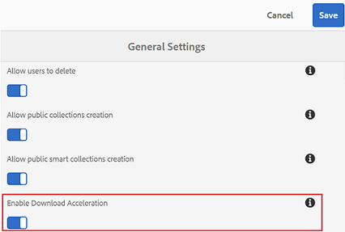

# 加速品牌入口網站下載 {#guide-to-accelerate-downloads-from-brand-portal}

品牌入口網站可透過與IBM Assa Connect(這是隨選應用程式)整合，來增強大型資產檔案的下載效能。此應用程式使用專利技術來移除TCP標題，並有助於改善資產檔案的傳輸速度。此項整合可確保下載體驗的增強。

>[!NOTE]
>
>下載速度因使用者而異，因為它取決於網路頻寬、伺服器延遲和客戶地理位置等因素。

如果啓用此功能，品牌入口網站使用者可透過安裝Assera Connect用戶端，大幅降低從品牌入口網站或透過共用連結下載所需資產檔案的時間。

## 加速檔案下載的必要條件 {#prerequisites-to-accelerate-file-download}

若要更快速下載檔案，請確定下列項目：

* **[!UICONTROL 從管理工具面板]** 中的 [!UICONTROL 一般設定] 啓用「下載加速」(預設停用)。
* 連接埠33001(TCP和UDP)會在防火牆上開啓。如需有關必要條件的詳細資訊，請參閱 [Assera Connect用戶端文件](https://downloads.asperasoft.com/en/documentation/8)。
* 使用管理員權限安裝AsPera Connect。
* 如需Asperia傳輸用戶端的平台支援，請參閱 [Assera Connect平台支援矩陣](https://www.asperasoft.com/company/support/transfer-clients/)。

## 下載網域 {#download-domains}

以下是不同地理區域的下載網域：

| 地區代碼 | 網域 |
|---|---|
| 北美或北美 | downloads-na1.brand-portal.adobe.com |
| 北美VA5 | downloads-na2.brand-portal.adobe.com |
| EMEA LON5 | downloads-emea1.brand-portal.adobe.com |
| APAC SIN2 | downloads-apac1.brand-portal.adobe.com |

## 使用檔案加速器範例下載效能 {#expected-download-performance-using-file-accelerator}

下表顯示使用AsPera Connect檔案下載加速器的2GB檔案下載效能：

**觀察到的結果因網路頻寬、伺服器延遲和用戶端位置等因素而異，因為Brand Portal伺服器位於Oregon(美國)。*

| 用戶端位置 | 用戶端與伺服器之間的延遲(毫秒) | 使用Assera Connect檔案傳輸加速器(MBPS)加快速度 | 使用AsPera檔案傳輸加速器(秒)下載2GB檔案的時間 |
|---------------------------|-----------------------------------|---------------------------------------------|-------------------------------------------------------------------------|
| U.S. West(N. California) | 18 | 36 | 57 |
| U.S. West(Oregon) | 42 | 36 | 57 |
| U.S. 東部(N. Virginia) | 85 | 35 | 58 |
| 亞太地區(東京) | 124 | 36 | 57 |
| Noida(印度) | 275 | 13.36 | 153 |
| 雪梨 | 175 | 29 | 70 |
| 倫敦 | 179 | 35 | 58 |
| 新加坡 | 196 | 34 | 60 |

## 使用檔案加速器下載工作流程 {#download-workflow-using-file-accelerator}

若要更快從品牌入口網站下載資產：

1. 使用支援的瀏覽器登入品牌入口網站。
2. 瀏覽並選取要下載的資產檔案、資料夾或系列。點選/點選下載選項。
「下載」對話方塊會出現，並選取 [「啓用下載加速] 」選項。
   

   >[!NOTE]
   >
   >目前不支援傳送內含下載資產連結的電子郵件通知，同時啓用更快速的下載。

   

3. 點選/按一下 **[!UICONTROL 「下載]** 」選項。
若要加速您的品牌入口用戶帳戶上的下載體驗，您必須在系統上安裝Assera Connect用戶端應用程式。

4. **下載AsPera Connect用戶端：**如果您的系統未安裝AsPera
Connect用戶端，或已安裝的AsPera Connect用戶端過期，則瀏覽器頁面上會出現提示，您可以從下載系統特定的AsPera Connect用戶端下載 **[!UICONTROL 最新版本]**。

   

   若要從 [https://downloads.asperasoft.com/connect2/](https://downloads.asperasoft.com/connect2/)下載最新版本的AsPera Connect，請選取 **[!UICONTROL 「立即下載」]** 並依照指示進行。

5. **安裝Assera Connect用戶端**若要安裝IBM
Assa Connect用戶端設定，請從IBM AsPera Connect用戶端應用程式的. msi檔案執行設定，然後遵循安裝精靈。

6. 成功安裝用戶端後，重新整理瀏覽器頁面並重新啓動下載步驟，或選取「 **[!UICONTROL 在]** 資產 **[!UICONTROL 下載中重新啓動」]** 對話方塊(步驟#2)。
第一次使用Assera Connect時，瀏覽器會提示您使用 **[!UICONTROL IBM Assera Connect開啓連結]**。若要在未來跳過此對話方塊，請記住 **[!UICONTROL 我的FASP連結選擇]**。

   >[!NOTE]
   >
   >此訊息在不同瀏覽器上不同。

7. 對話方塊會確認是否繼續傳輸。選取 **[!UICONTROL 「允許]** 」開始。
若要在未來略過此對話方塊，請啓用 **[!UICONTROL 此主機]**的所有連線。
下載開始。對話方塊會顯示下載進度。使用對話方塊 **[!UICONTROL 暫停]**、 **[!UICONTROL 繼續]**&#x200B;或 **[!UICONTROL 取消]** 下載。
Assera Connect應用程式提供系統上的「活動視窗」，使用者可檢視並管理所有傳輸工作階段。如需詳細資訊，請參閱 [AsPera Connect用戶端文件](https://downloads.asperasoft.com/en/documentation/8)。

在下載完成後，對話方塊會顯示下載資產至使用者系統的位置。如果發生失敗，則會顯示錯誤。

>[!NOTE]
>
>如果 **[!UICONTROL 「偏好設定」中的「]**[!UICONTROL 傳輸][!UICONTROL 」索引標籤處於「傳輸」下方]，則Asperia Connect用戶端應用程式不會出現任何提示，讓您無法選取下載位置的提示。在任何下載開始之前，請在文字方塊中提供位置，將下載的檔案 **[!UICONTROL 儲存]**&#x200B;至。

## 在Microsoft Edge瀏覽器上使用檔案加速器 {#using-file-accelerator-on-microsoft-edge-browser}

Microsoft Edge可在增強保護模式(EPM)中執行，防止與Aspera Connect伺服器通訊，同時在同一個私人網路或受信任網站上進行通訊。因此，每次與伺服器連線時，就會顯示快顯視窗。

若要在Microsoft Edge上使用加速下載功能，請從受信任的網站清單移除品牌入口網站。

1. 開啓「控制台」(按 **[!UICONTROL 視窗鍵+ X]**，然後選取 **[!UICONTROL 「控制台」]**)。
2. 前往 **[!UICONTROL 網路和網際網路&gt;網際網路選項]**。按一下 **[!UICONTROL 「安全性]** 」標籤。
3. 按一下 **[!UICONTROL 受信任網站區域]**，然後按一下 **[!UICONTROL 網站]**。
4. 從清單中移除品牌入口網站網站。

## Assera Connect用戶端偏好設定 {#aspera-connect-client-preferences}

有一些有用的偏好設定可在IBM AsPera Connect用戶端偏好設定中設定，方法是按一下圖示並選取 **[!UICONTROL 偏好設定]**。

您可以設定預設下載位置。

此外，Assera Connect用戶端可標示為在系統啓動時自動啓動，讓連線用戶端執行並可供下載開始更快。

## 疑難排解下載加速問題 {#troubleshoot-issues-with-download-acceleration}

如果下載加速無法供您使用，請依照下列步驟進行疑難排解：

1. 請從電腦瀏覽 [https://test-connect.asperasoft.com](https://test-connect.asperasoft.com/) ，檢查連接埠是否未被封鎖。

   如果連接埠不確定，請聯絡您的網路團隊，並確定連接埠33001(TCP&amp; UDP)不會在防火牆中封鎖。

2. 如果連接埠是「確定」，則請使用 [https://www.speedtest.net/測量可用頻寬，檢查網路是否緩慢](https://www.speedtest.net/)。

   如果頻寬為少數(1-10Mbps)或Kbps，則使用Assera Preferences並嘗試限制頻寬等於可用頻寬。

3. 若要確認從Assera展示伺服器下載是否正常運作，請使用 [https://demo.asperasoft.com/aspera/user](https://demo.asperasoft.com/aspera/user)。\
   (登入：asperaweb，password：demasperia)

4. 如果上述疑難排解步驟沒有作用，請取消選取「啓用下載加速」選項並使用正常下載。
