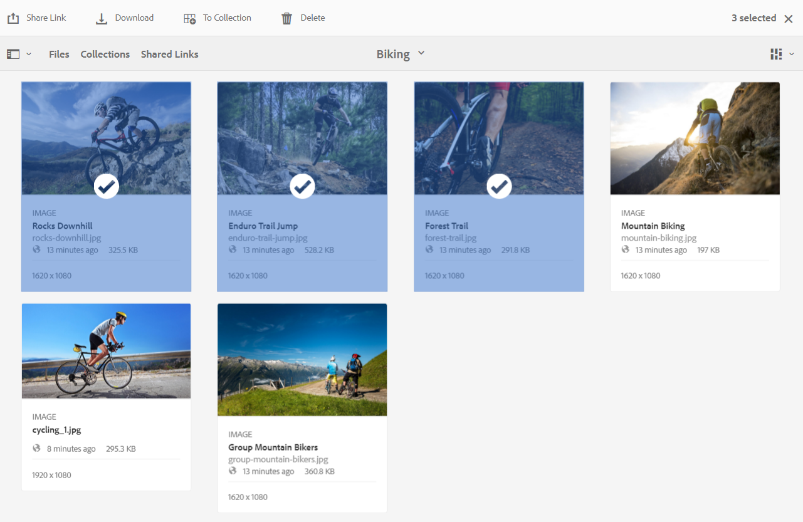

# 加快Brand Portal下載 {#guide-to-accelerate-downloads-from-brand-portal}

Adobe Experience Manager Assets Brand Portal公司通過與IBMAspera Connect整合，提高大資產檔案的下載效能。 該應用程式使用專有技術來消除TCP開銷，並幫助提高資產檔案的傳輸速度。 此整合可確保增強的下載體驗。

>[!NOTE]
>
>下載速度因用戶而異，因為它取決於網路頻寬、伺服器延遲和客戶端地理位置等因素。

的 **[!UICONTROL 快速下載]** 預設情況下，配置處於啟用狀態，這大大減少了從Brand Portal下載所需資產檔案所花的時間。

## 加快檔案下載的先決條件 {#prerequisites-to-accelerate-file-download}

要更快地下載檔案，請確保：

* 導航到 **[!UICONTROL 工具]** > **[!UICONTROL 下載]** 並驗證 **[!UICONTROL 快速下載]** 在中啟用配置 **[!UICONTROL 下載設定]**。
* 確保防火牆上的埠33001（TCP和UDP）已開啟。 有關先決條件的詳細資訊，請參見 [IBMAspera Connect客戶端文檔](https://downloads.asperasoft.com/en/documentation/8)。
* **安裝IBMAspera Connect 3.9.9** 在瀏覽器的擴展中使用管理員權限(`https://www.ibm.com/docs/en/aspera-connect/3.9.9`)。
* 有關Aspera傳輸客戶端的平台支援，請參見 [IBMAspera Connect平台支援清單](https://www.asperasoft.com/company/support/transfer-clients/)。

>[!NOTE]
>
>IBMAspera Connect存在已知問題。 快速下載與IBMAspera Connect 3.10及更高版本不相容。

## 下載域 {#download-domains}

以下是不同地理位置的下載域：

| 區域代碼 | 網域 |
|---|---|
| NA或1 | downloads-na1.brand-portal.adobe.com |
| VA5 | downloads-na2.brand-portal.adobe.com |
| EMEA LON5 | downloads-emea1.brand-portal.adobe.com |
| APAC SIN2 | downloads-apac1.brand-portal.adobe.com |

## 使用檔案加速器的下載效能示例 {#expected-download-performance-using-file-accelerator}

下表顯示了使用Aspera Connect檔案下載加速器的2 GB檔案下載效能：

*由於Brand Portal伺服器位於俄勒岡州（美國），觀察到的結果確實因網路頻寬、伺服器延遲和客戶端位置等因素而異。*

| 客戶端位置 | 客戶端和伺服器之間的延遲（毫秒） | 使用Aspera連接檔案傳輸加速器(MBps)加速 | 使用Aspera檔案傳輸加速器下載2 GB檔案所花的時間（秒） |
|---------------------------|-----------------------------------|---------------------------------------------|-------------------------------------------------------------------------|
| 美國西部（北美）加利福尼亞) | 18 | 36 | 57 |
| 美國西部（俄勒岡） | 42 | 36 | 57 |
| 美國東部（北部）維吉尼亞) | 85 | 35 | 58 |
| APAC（東京） | 124 | 36 | 57 |
| 諾伊達語（印度） | 275 | 13.36 | 153 |
| 雪梨 | 175 | 29 | 70 |
| 倫敦 | 179 | 35 | 58 |
| 新加坡 | 196 | 34 | 60 |

## 下載資產 {#download-assets}

要更快地從Brand Portal下載資產：

1. 登錄到你的Brand Portal租客。 預設情況下， **[!UICONTROL 檔案]** 將開啟包含所有已發佈資產和資料夾的視圖。

   執行下列操作之一：

   * 選擇要下載的資產或資料夾。 在頂部的工具欄中，按一下 **[!UICONTROL 下載]** 表徵圖

      

   * 要下載資產的特定資產格式副本，請將指針懸停在資產上，然後按一下 **[!UICONTROL 下載]** 表徵圖在快速操作縮略圖中可用。

      

1. 的 **[!UICONTROL 下載]** 列出所有選定資產的對話框。

   要在下載資產時保留Brand Portal資料夾層次結構，請選擇 **[!UICONTROL 為每個資產建立單獨的資料夾]** 的子菜單。

   下載按鈕反映所選項的計數。 完成應用規則後，按一下 **[!UICONTROL 下載項目]**。 有關如何應用規則的詳細資訊，請參閱 [下載資產](../using/brand-portal-download-assets.md#download-assets)。

   

1. 預設情況下， **[!UICONTROL 快速下載]** 設定在 **[!UICONTROL 下載設定]**。 因此，將出現一個確認框，用於使用IBMAspera Connect下載資產。

   如果您是首次下載資產，並且未在瀏覽器中安裝IBM·阿斯佩拉連接，或現有版本已過期，則會提示您安裝Aspera下載加速器(`https://www.ibm.com/docs/en/aspera-connect/3.9.9`)。

   

1. **安裝Aspera Connect客戶端**

   要安裝IBMAspera Connect客戶端安裝程式，請從IBMAspera Connect客戶端應用程式的.msi檔案運行安裝程式，然後按照安裝嚮導進行操作。

   

1. 成功安裝客戶端後，刷新瀏覽器頁並再次啟動下載步驟。

1. 繼續使用 **[!UICONTROL 快速下載]**&#x200B;按一下 **[!UICONTROL 允許]**。 所有選定的格式副本都使用IBMAspera Connect下載到一個zip資料夾中。

   成功完成下載後，對話框將顯示資產下載到用戶系統的位置。

   

   如果不想使用IBM·阿斯佩拉連接，請按一下 **[!UICONTROL 拒絕]**。 如果 **[!UICONTROL 快速下載]** 被拒絕或失敗，系統將填充錯誤消息。 按一下 **[!UICONTROL 正常下載]** 按鈕繼續下載資產。

>[!NOTE]
>
>如果 **[!UICONTROL 快速下載]** 設定由管理員關閉，選定的格式副本將直接下載到zip資料夾中，而不使用IBMAspera連接。

<!-- 
On successful completion of the download, a dialog box shows the location where assets are downloaded onto the user's system. If there is a failure, it shows error.

   >[!NOTE]
   >
   >There is a known limitation in Aspera Connect client application that no prompt to select download location appears if **[!UICONTROL Always ask me where to save downloaded files]** is enabled under the tab **[!UICONTROL Transfers]** within **[!UICONTROL Preferences]**. Before any download begins, provide the location in the text box **[!UICONTROL Save downloaded files to]**.

1. Log in to Brand Portal using a supported browser.
1. Browse and select the folders or assets you want to download. From the toolbar at the top, click the **[!UICONTROL Download]** icon. the **[!UICONTROL Download]** dialog appears with the **[!UICONTROL Asset(s)]** and **[!UICONTROL Enable download acceleration]** check boxes selected by default. 

   

   >[!NOTE]
   >
   >The functionality to send email notification with the link to download assets is presently not supported while faster downloads are enabled.

   

1. Click **[!UICONTROL Download]**.

   To speed up the download experience on your Brand Portal tenant account, you need to have Aspera Connect client application installed in your browser's extension.

1. **Download Aspera Connect Client**

   If Aspera Connect client is not installed on your system or the existing Aspera Connect client is out of date, a prompt is displayed on the browser page from where you can download the system-specific Aspera Connect client by selecting **[!UICONTROL Download Latest Version]**.

   

   To download the latest version of Aspera Connect from [https://downloads.asperasoft.com/connect2/](https://downloads.asperasoft.com/connect2/), select **[!UICONTROL Download Now]** and follow the instructions.

1. **Install Aspera Connect Client**

   To install IBM Aspera Connect client setup, run the setup from  .msi  file of IBM Aspera Connect client application and follow the installation wizard.

1. Once the client is successfully installed, refresh the browser page and initiate the download steps again.

   When using Aspera Connect for the first time, the browser prompts to open the link using **[!UICONTROL IBM Aspera Connect]**. To skip this dialog in future, enable **[!UICONTROL Remember my choice for FASP links]**.

   >[!NOTE]
   >
   >This message is different on the different browsers.

1. A dialog box confirms whether to proceed the transfer or not. Select **[!UICONTROL Allow]** to begin.
To skip this dialog in future, enable **[!UICONTROL Use my choice for all connections with this host]**.
Download begins. A dialog box shows the progress of the download. Use the dialog box to **[!UICONTROL pause]**, **[!UICONTROL resume]**, or **[!UICONTROL cancel]** the download.
Aspera Connect application provides an Activity Window on the system where user can view and manage all transfer sessions. For more information, refer [Aspera Connect Client documentation](https://downloads.asperasoft.com/en/documentation/8).

On successful completion of the download, a dialog box shows the location where assets are downloaded onto the user's system. If there is a failure, it shows error.

   >[!NOTE]
   >
   >There is a known limitation in Aspera Connect client application that no prompt to select download location appears if **[!UICONTROL Always ask me where to save downloaded files]** is enabled under the tab **[!UICONTROL Transfers]** within **[!UICONTROL Preferences]**. Before any download begins, provide the location in the text box **[!UICONTROL Save downloaded files to]**.
-->

## 在Microsoft邊緣瀏覽器上使用檔案加速器 {#using-file-accelerator-on-microsoft-edge-browser}

Microsoft邊緣在增強保護模式(EPM)下運行，在同一專用網路或受信任站點上，該模式阻止與Aspera Connect伺服器通信。 因此，每次與伺服器建立連接時都會出現一個彈出窗口。

要在Microsoft邊緣上使用加速下載功能，請從受信任的站點清單中刪除Brand Portal站點。

1. 開啟控制面板(**[!UICONTROL 窗口鍵+ X]**，然後選擇 **[!UICONTROL 控制面板]**)。
1. 轉到 **[!UICONTROL 網路和網際網路]** > **[!UICONTROL Internet選項]**。 按一下 **[!UICONTROL 安全]** 頁籤。
1. 按一下 **[!UICONTROL 受信任站點區域]**，然後按一下 **[!UICONTROL 站點]**。
1. 從清單中刪除Brand Portal站點。

## Aspera連接客戶端首選項 {#aspera-connect-client-preferences}

通過按一下右鍵表徵圖並選擇「IBMAspera連接客戶端」首選項，可以設定一些有用的首選項 **[!UICONTROL 首選項]**。

可以設定預設下載位置。

此外，Aspera Connect客戶端可被標籤為在系統啟動時自動啟動，以便連接客戶端正在運行並可用於下載以更快地開始。

## 解決下載加速問題 {#troubleshoot-issues-with-download-acceleration}

如果下載加速不適合您，請按照以下步驟進行故障排除：

1. 通過訪問 [https://test-connect.asperasoft.com](https://test-connect.asperasoft.com/) 從你的機器里。

   如果埠不正常，請聯繫您的網路團隊，確保防火牆中沒有阻止埠33001（TCP和UDP）。

1. 如果埠正常，則使用測量可用頻寬來檢查網路是否不慢 [https://www.speedtest.net/](https://www.speedtest.net/)。

   如果頻寬是幾個(1-10 Mbps)或以Kbps為單位，則使用Aspera首選項並嘗試限制與可用頻寬相等的頻寬。

1. 要確認從Aspera演示伺服器下載的內容是否正常，請使用 [https://demo.asperasoft.com/aspera/user](https://demo.asperasoft.com/aspera/user)。\
   (登錄：asperweb ，密碼：德馬斯

1. 如果上述故障排除步驟均無效，請取消選擇「Enable Download Acceleration（啟用下載加速）」選項，然後使用正常下載。
