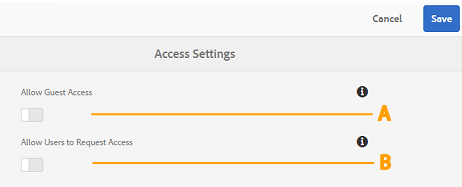
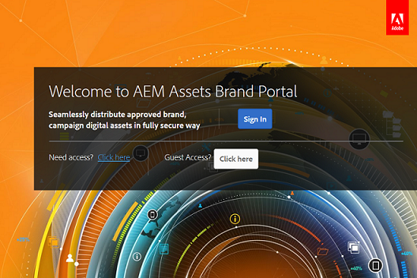

# 在 Brand Portal 上管理使用者存取 {#administer-user-access-on-brand-portal}

AEM Assets Brand Portal 6.4.2以上版本可授權管理員設定訪客存取權，並讓使用者要求其組織之Brand Portal的存取權。 這些設定已作為「管理」面板上的&#x200B;**[!UICONTROL 存取設定]**&#x200B;設定提供。 預設會停用這兩項設定。

****   使用訪客存取在Brand Portal上允許訪客 **[!UICONTROL 存取的設定？]** Brand Portal歡迎畫面上的連結。（預設為停用）

****   BConfiguration，允許使用者使用「需要」存取權來要 **[!UICONTROL 求存取Brand Portal?]** Brand Portal歡迎畫面上的連結。（預設為停用）

## 允許訪客存取 {#allow-guest-access}

透過允許訪客存取，使用者無需登入Brand Portal即可存取公用資產。
要允許來賓訪問，管理員必須執行以下步驟：

1. 從頂端的工具列選取AEM標誌以存取管理工具。
1. 從管理工具面板中，選擇&#x200B;**[!UICONTROL Access]**&#x200B;以開啟&#x200B;**[!UICONTROL Access Settings]**&#x200B;頁。
1. 啟用&#x200B;**[!UICONTROL 允許來賓訪問]**&#x200B;配置。
1. **[!UICONTROL 儲存變更。]**
1. 登出以讓變更生效。

## 允許使用者索取存取權限 {#allow-users-to-request-access}

管理員可讓組織使用者從歡迎畫面要求存取Brand Portal。 不過，管理員必須啟用&#x200B;**[!UICONTROL 允許使用者請求存取]**&#x200B;設定，才能在歡迎畫面上顯示請求存取連結。

若要讓組織使用者要求Brand Portal的存取權，管理員必須：

1. 從頂端的工具列選取AEM標誌以存取管理工具。
1. 從管理工具面板中，選擇&#x200B;**[!UICONTROL Access]**&#x200B;以開啟&#x200B;**[!UICONTROL Access Settings]**&#x200B;頁。
1. 啟用&#x200B;**[!UICONTROL 允許用戶請求訪問]**&#x200B;配置。
1. **[!UICONTROL 儲存變更。]**
1. 登出以讓變更生效。
