# 管理使用者、群組和使用者角色 {#manage-users-groups-and-user-roles}

管理員可以使用Adobe Admin Console建立AEM Assets Brand Portal使用者和產品設定檔，並使用Brand Portal使用者介面管理其角色。 檢視器和編輯器無法使用此權限。

在[[!UICONTROL Admin Console]](https://adminconsole.adobe.com/enterprise/overview)中，您可以檢視與您的組織相關聯的所有產品。 產品可以是任何Experience Cloud解決方案，例如Adobe Analytics、Adobe Target或AEM Brand Portal。 您必須選擇AEM Brand Portal產品，然後建立產品設定檔。

<!--
Comment Type: draft

<note type="note">

Product Profiles (formerly known as product configurations*). 

* The nomenclature has changed from product configurations to product profiles in the new Adobe Admin Console.

</note>
-->
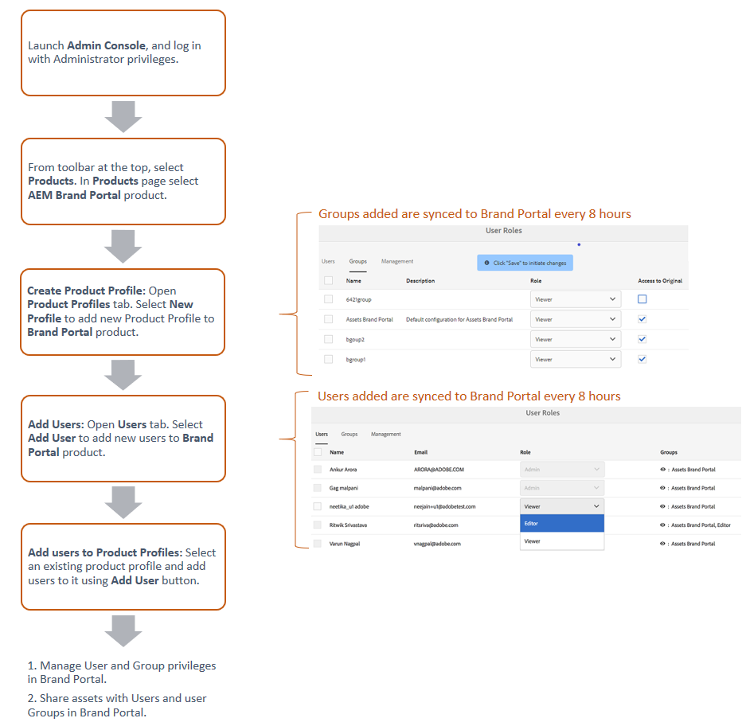

這些產品設定檔會每8小時與Brand Portal使用者介面同步，並在Brand Portal中顯示為群組。 在您新增使用者並建立產品設定檔，以及將使用者新增至這些產品設定檔後，就可以在Brand Portal中將角色指派給使用者和群組。

>[!NOTE]
>
>若要在Brand Portal中建立群組，請從Adobe[!UICONTROL Admin Console]使用&#x200B;**[!UICONTROL 產品>產品設定檔]**，而非&#x200B;**[!UICONTROL 使用者頁面>使用者群組]**。 Adobe[!UICONTROL Admin Console]中的產品設定檔可用來在Brand Portal中建立群組。

## 新增使用者 {#add-a-user}

如果您是產品管理員，請使用Adobe[[!UICONTROL Admin Console]](https://adminconsole.adobe.com/enterprise/overview)來建立使用者，並將其指派給產品設定檔（*先前稱為產品設定檔*），這些設定檔在Brand Portal中顯示為群組。 您可以使用群組來執行大量作業，例如角色管理和資產共用。

>[!NOTE]
>
>無權存取Brand Portal的新使用者可從Brand Portal的登入畫面要求存取權。 如需詳細資訊，請參閱[要求存取Brand Portal](../using/brand-portal.md#request-access-to-brand-portal)。 在通知區域中收到訪問請求通知後，按一下相關通知，然後按一下&#x200B;**[!UICONTROL 授予訪問權]**。 或者，請依照收到的存取要求電子郵件中的連結操作。 接下來，要通過[Adobe[!UICONTROL Admin Console]](https://adminconsole.adobe.com/enterprise/overview)添加用戶，請遵循以下步驟中的步驟4-7。

>[!NOTE]
>
>您可以直接或從Brand Portal登入[Adobe[!UICONTROL Admin Console]](https://adminconsole.adobe.com/enterprise/overview)。 如果您直接登入，請依照下列程式中的步驟4-7新增使用者。

1. 在頂端的AEM工具列中，按一下Adobe標誌以存取管理工具。

   

1. 在管理工具面板中，按一下&#x200B;**[!UICONTROL 用戶]**。

   

1. 在[!UICONTROL 使用者角色]頁面中，按一下&#x200B;**[!UICONTROL 管理]**&#x200B;標籤，然後按一下&#x200B;**[!UICONTROL 啟動Admin Console]**。

   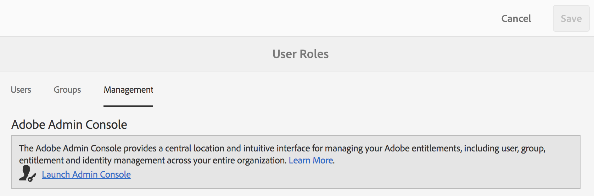

1. 在Admin Console中，執行下列任一操作以建立新用戶：

   * 從頂端的工具列按一下&#x200B;**[!UICONTROL 概述]**。 在[!UICONTROL 概述]頁面中，按一下Brand Portal產品卡中的&#x200B;**[!UICONTROL 指派使用者]** 。

   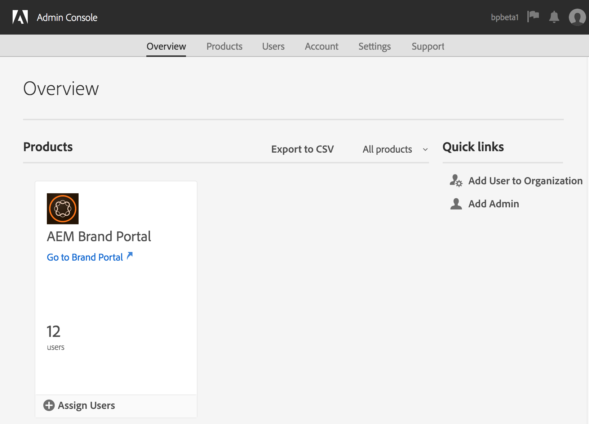

   * 從頂端的工具列按一下&#x200B;**[!UICONTROL 使用者]**。 在[!UICONTROL 使用者]頁面中，預設會選取左側邊欄中的[!UICONTROL 使用者]。 按一下「**[!UICONTROL 添加用戶]**」。

   

1. 在「新增使用者」對話方塊中，輸入您要新增之使用者的電子郵件ID，或從您輸入時顯示的建議清單中選取該使用者。

   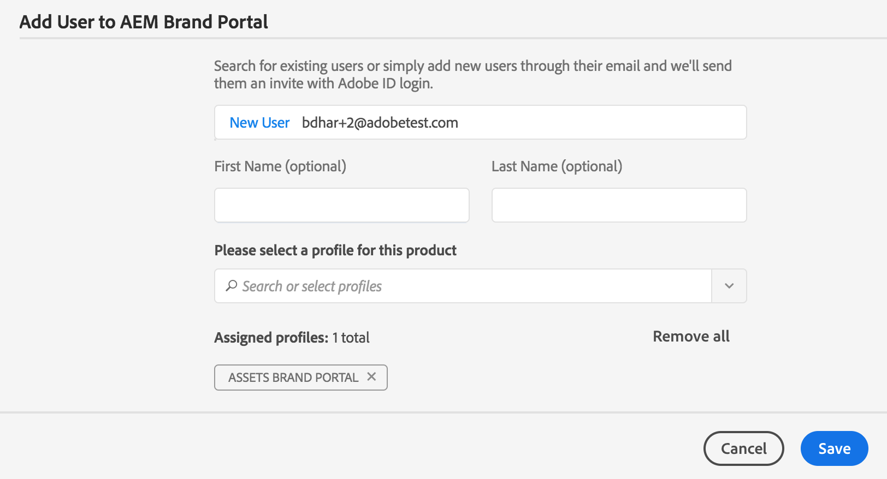

1. 將使用者指派至少一個產品設定檔（先前稱為產品設定檔），讓使用者可以存取Brand Portal。 從&#x200B;**[!UICONTROL 中選擇相應的產品配置檔案。請為此產品]**&#x200B;欄位選擇配置檔案。
1. 按一下「**[!UICONTROL 儲存]**」。會傳送歡迎電子郵件給新新增的使用者。 受邀的使用者可以按一下歡迎電子郵件中的連結，以存取Brand Portal。 使用者可以使用Admin Console中設定的電子郵件ID([!UICONTROL Adobe ID]、[!UICONTROL Enterprise ID]或[!UICONTROL 摘要ID])登入。 如需詳細資訊，請參閱[首次登入體驗](../using/brand-portal-onboarding.md)。

   >[!NOTE]
   >
   >如果使用者無法登入Brand Portal，組織的管理員應瀏覽Adobe[!UICONTROL Admin Console]，並檢查該使用者是否存在且已新增至至少一個產品設定檔。

   有關授予用戶管理權限的資訊，請參閱[為用戶提供管理員權限](../using/brand-portal-adding-users.md#provideadministratorprivilegestousers)。

## 新增產品設定檔 {#add-a-product-profile}

[!UICONTROL Admin Console]中的產品設定檔（舊稱為產品設定）可用來在Brand Portal中建立群組，以便您執行大量作業，例如在Brand Portal中執行角色管理和資產共用。 **Brand Portalis** 提供預設的產品設定檔；您可以建立更多產品設定檔，並將使用者新增至新的產品設定檔。

>[!NOTE]
>
>您可以直接或從Brand Portal登入[[!UICONTROL Admin Console]](https://adminconsole.adobe.com/enterprise/overview)。 如果您直接登入[!UICONTROL Admin Console]，請依照以下程式中的步驟4-7新增產品設定檔。

1. 在頂端的AEM工具列中，按一下Adobe標誌以存取管理工具。

   

1. 在管理工具面板中，按一下&#x200B;**[!UICONTROL 用戶]**。

   

1. 在[!UICONTROL 使用者角色]頁面中，按一下&#x200B;**[!UICONTROL 管理]**&#x200B;標籤，然後按一下&#x200B;**[!UICONTROL 啟動Admin Console]**。

   

1. 從頂端的工具列按一下&#x200B;**[!UICONTROL Products]**。
1. 在[!UICONTROL Products]頁面中，預設會選取[!UICONTROL 產品設定檔]。 按一下「**[!UICONTROL 新建配置檔案]**」。

   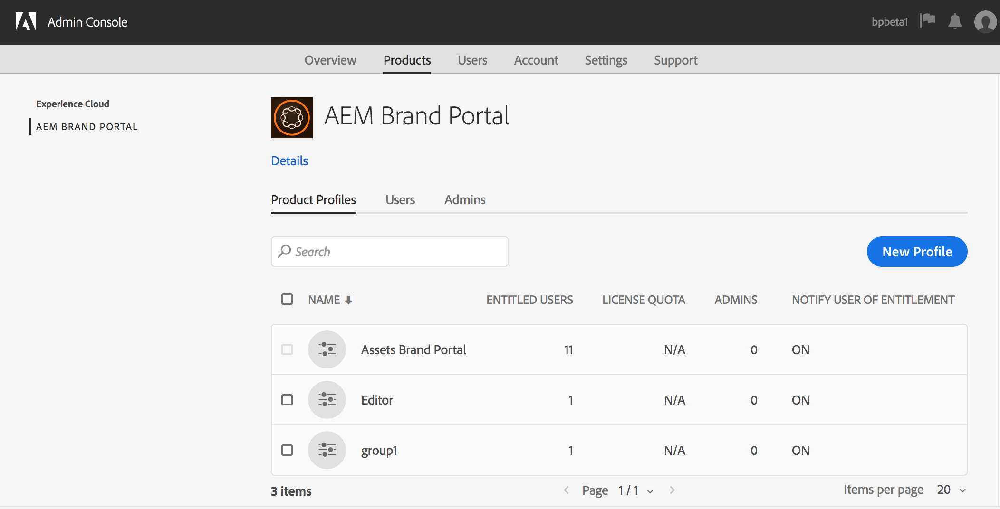

1. 在[!UICONTROL 建立新配置檔案]頁中，提供配置檔案名稱、顯示名稱、配置檔案說明，並選擇是否要在用戶添加到配置檔案或從配置檔案中刪除時通過電子郵件通知用戶。

   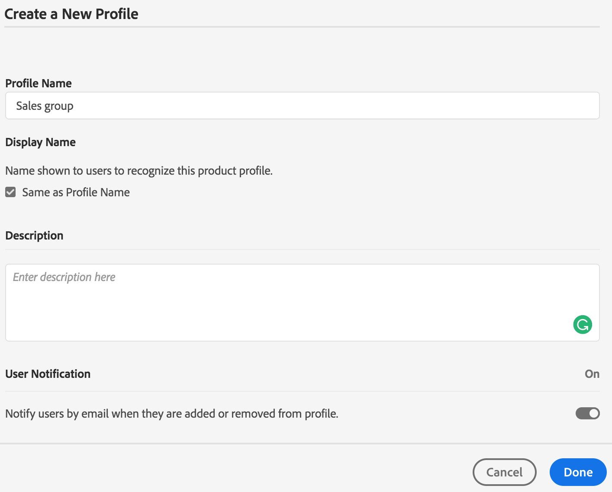

1. 按一下&#x200B;**[!UICONTROL Done]**。 產品設定群組（例如&#x200B;**[!UICONTROL Sales group]**）會新增至Brand Portal。

   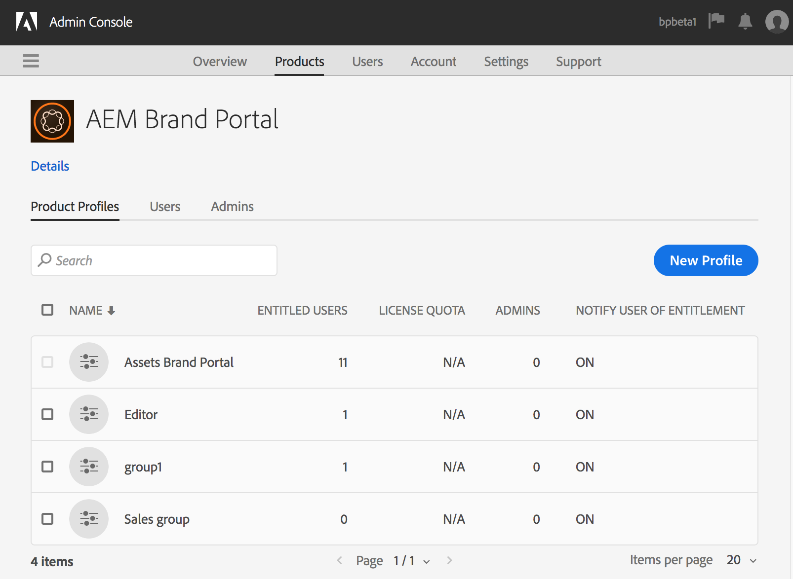

## 將使用者新增至產品設定檔 {#add-users-to-a-product-profile}

若要將使用者新增至Brand Portal群組，請將使用者新增至[!UICONTROL Admin Console]中的對應產品設定檔（舊稱產品設定檔）。 您可以個別或大量新增使用者。

>[!NOTE]
>
>您可以直接或從Brand Portal登入[[!UICONTROL Admin Console]](https://adminconsole.adobe.com/enterprise/overview)。 如果您直接登入Admin Console，請依照下列程式中的步驟4-7，將使用者新增至產品設定檔。

1. 在頂端的AEM工具列中，按一下Adobe標誌以存取管理工具。

   

1. 在管理工具面板中，按一下&#x200B;**[!UICONTROL 用戶]**。

   

1. 在[!UICONTROL 使用者角色]頁面中，按一下&#x200B;**[!UICONTROL 管理]**&#x200B;標籤，然後按一下&#x200B;**[!UICONTROL 啟動Admin Console]**。

   ![啟動 [!DNL Admin Console]](assets/launch_admin_console.png)

1. 從頂端的工具列按一下&#x200B;**[!UICONTROL Products]**。
1. 在[!UICONTROL Products]頁面中，預設會選取[!UICONTROL 產品設定檔]。 開啟您要新增使用者的產品設定檔，例如[!UICONTROL Sales group]。

   

1. 若要將個別使用者新增至產品設定檔，請執行下列動作：

   * 按一下「**[!UICONTROL 添加用戶]**」。

   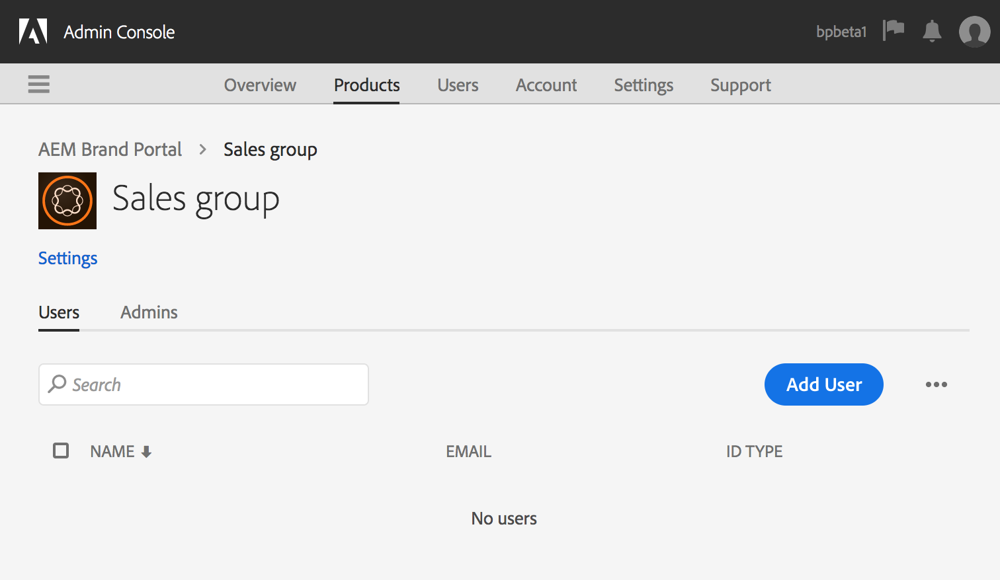

   * 在[!UICONTROL 將用戶添加到銷售組]頁中，鍵入要添加的用戶的電子郵件ID，或從鍵入時顯示的建議清單中選擇該用戶。

   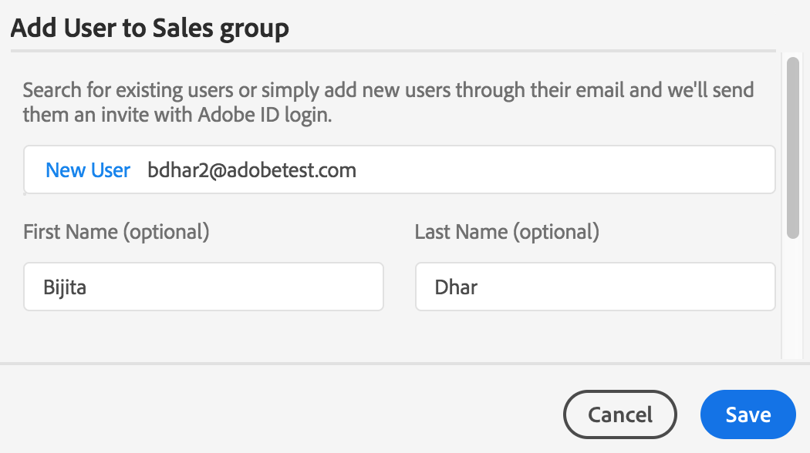

   * 按一下「**[!UICONTROL 儲存]**」。

1. 若要將大量使用者新增至產品設定檔，請執行下列動作：

   * 選擇&#x200B;**[!UICONTROL 刪節號(...)> 「通過CSV添加用戶」]**。

   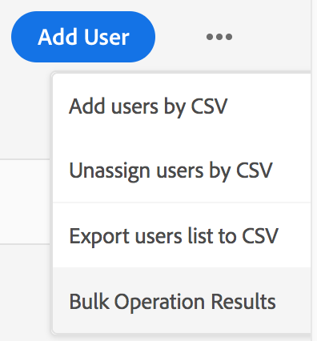

   * 在&#x200B;**[!UICONTROL 「透過CSV新增使用者」頁面中，下載CSV範本或拖放CSV檔案。]**

   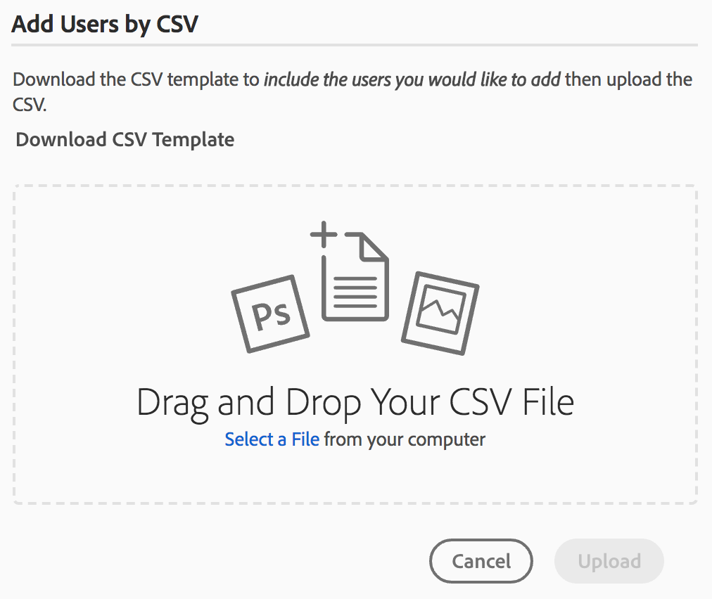

   * 按一下&#x200B;**[!UICONTROL Upload]**。
   如果您將使用者新增至預設的產品設定檔(亦即Brand Portal)，則歡迎電子郵件會傳送至您新增使用者的電子郵件ID。 受邀的使用者可按一下歡迎電子郵件中的連結，並使用[!UICONTROL Adobe ID]登入，以存取Brand Portal。 如需詳細資訊，請參閱[首次登入體驗](../using/brand-portal-onboarding.md)。

   新增至自訂或新產品設定檔的使用者不會收到電子郵件通知。

## 為用戶提供管理員權限 {#provide-administrator-privileges-to-users}

您可以向Brand Portal使用者提供系統管理員或產品管理員權限。 請勿提供[!UICONTROL Admin Console]中可用的其他管理權限，如產品配置檔案管理員、用戶組管理員和支援管理員。 要了解有關這些角色的詳細資訊，請參閱[管理角色](https://helpx.adobe.com/enterprise/using/admin-roles.html)。

>[!NOTE]
>
>您可以直接或從Brand Portal登入[[!UICONTROL Admin Console]](https://adminconsole.adobe.com/enterprise/overview)。 如果您直接登入[!UICONTROL Admin Console]，請依照下列程式中的步驟4-8，將使用者新增至產品設定檔。

1. 在頂端的AEM工具列中，按一下Adobe標誌以存取管理工具。

   

1. 在管理工具面板中，按一下&#x200B;**[!UICONTROL 用戶]**。

   

1. 在[!UICONTROL 使用者角色]頁面中，按一下&#x200B;**[!UICONTROL 管理]**&#x200B;標籤，然後按一下&#x200B;**[!UICONTROL 啟動Admin Console]**。

   

1. 從頂端的工具列按一下&#x200B;**[!UICONTROL 使用者]**。
1. 在[!UICONTROL 使用者]頁面中，預設會選取左側邊欄中的[!UICONTROL 使用者]。 按一下要向其提供管理員權限的用戶的用戶名。

   

1. 在用戶配置檔案頁中，找到底部的&#x200B;**[!UICONTROL 管理權限]**&#x200B;部分，然後選擇&#x200B;**[!UICONTROL 刪節號(...)>編輯管理權限]**。
   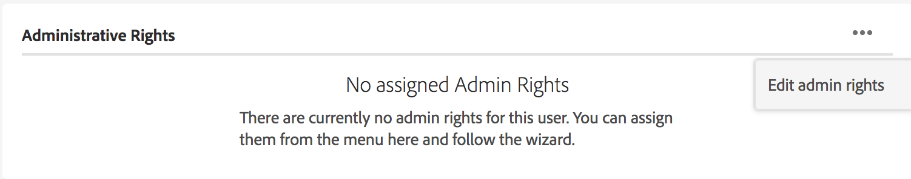

1. 在[!UICONTROL 編輯管理員]頁中，選擇系統管理員或產品管理員。

   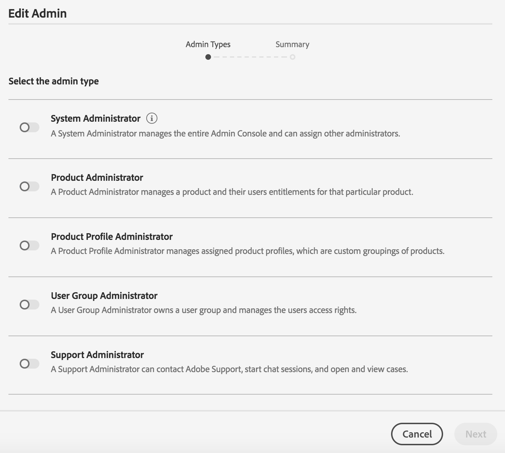

   >[!NOTE]
   >
   >Brand Portal僅支援系統管理員和產品管理員角色。
   >
   >Adobe建議您避免使用系統管理員角色，因為該角色授予組織內所有產品的管理員權限。 例如，包含三個marketing cloud產品之組織的系統管理員擁有這三個產品的完整權限集。 只有系統管理員可以設定AEM Assets，以便將資產從AEM Assets發佈至Brand Portal。 如需詳細資訊，請參閱[使用Brand Portal設定AEM Assets](../using/configure-aem-assets-with-brand-portal.md)。
   >
   >相反地，產品管理員角色僅授予特定產品的管理員權限。 如果您想在Brand Portal中強制執行更精細的存取控制，請使用產品管理員角色，並選取產品作為Brand Portal。

   >[!NOTE]
   >
   >Brand Portal不支援產品設定檔管理員（舊稱組態管理員）權限。 避免將產品設定檔管理員權限指派給使用者。

1. 查看管理類型選擇，然後按一下&#x200B;**[!UICONTROL 保存]**。

   >[!NOTE]
   >
   >要撤銷用戶的管理員權限，請在&#x200B;**[!UICONTROL 編輯管理員]**&#x200B;頁中進行適當的更改，然後按一下&#x200B;**[!UICONTROL 保存]**。

## 管理使用者角色 {#manage-user-roles}

管理員可修改Brand Portal中使用者的角色。

除了管理員角色，Brand Portal還支援下列角色：

* [!UICONTROL 檢視器]:具有此角色的用戶可以查看管理員與其共用的檔案和資料夾。檢視器也可以搜尋及下載資產。 不過，檢視器無法與其他使用者共用內容（檔案、資料夾、[!UICONTROL 集合]）。
* [!UICONTROL 編輯者]:具有此角色的使用者擁有檢視器的所有權限。此外，編輯者可以與其他使用者共用內容（資料夾、[!UICONTROL 集合]、連結）。

1. 在頂端的AEM工具列中，按一下Adobe標誌以存取管理工具。

   

1. 在管理工具面板中，按一下&#x200B;**[!UICONTROL 用戶]**。

   

1. 在[!UICONTROL 用戶角色]頁中，預設選擇[!UICONTROL 用戶]頁簽。 對於要更改其角色的用戶，從&#x200B;**[!UICONTROL Role]**&#x200B;下拉清單中選擇&#x200B;**[!UICONTROL Editor]**&#x200B;或&#x200B;**[!UICONTROL Viewer]**。

   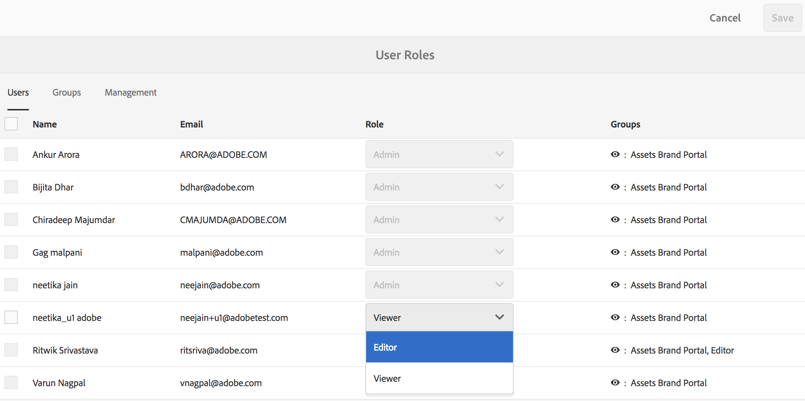

   要同時修改多個用戶的角色，請選擇用戶並從&#x200B;**[!UICONTROL Role]**&#x200B;下拉清單中選擇適當的角色。

   >[!NOTE]
   >
   >管理員用戶的[!UICONTROL 角色]清單被禁用。 不能選擇這些用戶來修改其角色。

   >[!NOTE]
   >
   >如果用戶是編輯器組的成員，則用戶角色也將被禁用。 要撤消用戶的編輯權限，請從編輯器組中刪除該用戶，或將整個組的角色更改為查看器。

1. 按一下「**[!UICONTROL 儲存]**」。已為相應用戶修改角色。 如果您選取了多個使用者，系統會同時修改所有使用者的角色。

   >[!NOTE]
   >
   >只有在使用者重新登入Brand Portal後，使用者權限的變更才會反映在&#x200B;**[!UICONTROL 使用者角色]**&#x200B;頁面中。

## 管理組角色和權限 {#manage-group-roles-and-privileges}

管理員可將特定權限與Brand Portal上的[group](../using/brand-portal-adding-users.md#main-pars-title-278567577)使用者建立關聯。 **[!UICONTROL 使用者角色]**&#x200B;頁面上的&#x200B;**[!UICONTROL 群組]**&#x200B;標籤可讓管理員：

* 將角色指派給使用者群組
* 限制使用者群組從Brand Portal下載影像檔案(.jpeg、.tiff、.png、.bmp、.gif、.pjpeg、x-portable-anymap、x-portable-bitmap、x-portable-graymap、x-portable-pixmap、x-rgb、x-xbitmap、x-xpixmap、x-icon、image/photoshop、.psd、image/vnd.adobe.photoshop)的原始轉譯。

>[!NOTE]
>
>對於以連結形式共用的資產，會根據共用資產之使用者的權限，套用存取影像檔案原始轉譯的權限。

要修改角色並訪問特定組成員的原始格式副本的權限，請執行以下步驟：

1. 在&#x200B;**[!UICONTROL 使用者角色]**&#x200B;頁面，導覽至&#x200B;**[!UICONTROL 群組]**&#x200B;標籤。
1. 選擇要更改其角色的組。
1. 從&#x200B;**[!UICONTROL Role]**&#x200B;下拉清單中選擇適當的角色。

   允許組的成員訪問影像檔案的原始格式副本(.jpeg、.tiff、.png、.bmp、.gif、.pjpeg、x-portable-anymap、x-portable-bitmap、x-portable-graymap、x-portable-pixmap、x-rgb、x-xbitmap、x-xpixmap、x-icon、image/photoshop、.x-photoshop、.psd、image/vnd.adobe.poshop)，這些成員可從入口或共用連結下載，保持&#x200B;**[!UICONTROL 訪問為該組選定的原始a]**&#x200B;選項。 預設情況下，會為所有用戶選擇&#x200B;**[!UICONTROL 訪問原始]**&#x200B;選項。 若要防止使用者群組存取原始轉譯，請取消選取與該群組對應的選項。

   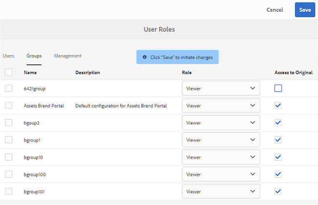

   >[!NOTE]
   >
   >如果將使用者新增至多個群組，且其中一個群組有限制，則限制將套用至該使用者。
   >
   >此外，即使管理員是受限組的成員，訪問影像檔案的原始格式副本的限制也不適用於管理員。

1. 按一下「**[!UICONTROL 儲存]**」。會修改對應群組的角色。

   >[!NOTE]
   >
   >使用者對群組的關聯或使用者的群組成員資格，會每8小時同步至Brand Portal一次。 對用戶或組角色的更改在下次同步作業運行後生效。
