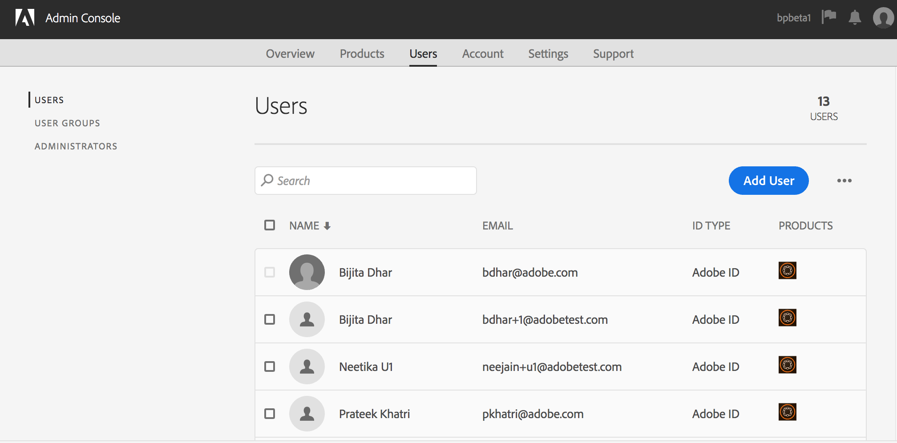

# Manage Users, Groups, and User Roles {#manage-users-groups-and-user-roles}

管理員可以使用Adobe Admin Console來建立AEM Assets Brand Portal使用者和產品設定檔，並使用品牌入口網站使用者介面來管理其角色。 檢視器和編輯者無法使用此權限。

在 [[!UICONTROL Admin Console]](http://adminconsole.adobe.com/enterprise/overview)，您可以檢視與您組織相關的所有產品。 產品可以是任何Experience Cloud解決方案，例如Adobe Analytics、Adobe Target或AEM品牌入口網站。 您必須選擇AEM Brand Portal產品，並建立產品設定檔。

<!--
Comment Type: draft

<note type="note">

Product Profiles (formerly known as product configurations*). 

* The nomenclature has changed from product configurations to product profiles in the new Adobe Admin Console.

</note>
-->

這些產品設定檔會每8小時與品牌入口網站使用者介面同步，並顯示為品牌入口網站中的群組。 在您新增使用者並建立產品設定檔，以及將使用者新增至這些產品設定檔後，您就可以在Brand Portal中為使用者和群組指派角色。

>[!NOTE]
>
>若要在品牌入口網站中建立群組，請從Adobe [!UICONTROL Admin Console]，使用「 **[!UICONTROL 產品>產品設定檔]**」，而非「使 **[!UICONTROL 用者頁面>使用者群組」]**。 Adobe [!UICONTROL Admin Console中的產品設定檔] ，可用來在品牌入口網站中建立群組。

## 新增使用者 {#add-a-user}

如果您是產品管理員，請使用Adobe [[!UICONTROL Admin Console]](http://adminconsole.adobe.com/enterprise/overview) ，來建立使用者並將他們指派至產品設定檔(*先前稱為產品設定*)，這些設定檔在品牌入口網站中顯示為群組。 您可以使用群組來執行大量作業，例如角色管理和資產共用。

>[!NOTE]
>
>沒有品牌入口網站存取權的新使用者可以從品牌入口網站的登入畫面要求存取權。 如需詳細資訊，請參 [閱「要求存取品牌入口網站」](../using/brand-portal.md#request-access-to-brand-portal)。 在通知區域收到存取要求通知後，按一下相關通知，然後按一下「授 **[!UICONTROL 予存取權」]**。 或者，請依照收到的存取要求電子郵件中的連結進行。 接下來，若要透過 [Adobe [!UICONTROL Admin Console新增使用者]](http://adminconsole.adobe.com/enterprise/overview)，請依照下列步驟執行步驟4-7。

>[!NOTE]
>
>您可以直接或 [從 [!UICONTROL 品牌入口網站登入Adobe Admin Console]](http://adminconsole.adobe.com/enterprise/overview) 。 如果您直接登入，請依照下列程式中的步驟4-7新增使用者。

1. 從頂端的AEM工具列，按一下Adobe標誌以存取管理工具。

   

1. 在管理工具面板中，按一下「使 **[!UICONTROL 用者」]**。

   

1. 在「使用 [!UICONTROL 者角色] 」頁面中，按一下「 **[!UICONTROL 管理]** 」標籤，然後按一 **[!UICONTROL 下「啟動管理控制台」]**。

   

1. 在「管理控制台」中，執行下列其中一項動作以建立新使用者：

   * 在頂端的工具列中，按一下「 **[!UICONTROL 概述」]**。 在「概 [!UICONTROL 述」頁] ，按一下 **[!UICONTROL 品牌入口網站產品卡中的]** 「指派使用者」。

   

   * 在頂端的工具列中，按一下「使 **[!UICONTROL 用者」]**。 在「使 [!UICONTROL 用者] 」頁面中，  預設會選取左側導軌中的「使用者」。 按一 **[!UICONTROL 下「新增使用者]**」。

   

1. 在「新增使用者」對話方塊中，輸入您要新增之使用者的電子郵件ID，或從您輸入時顯示的建議清單中選取使用者。

   

1. 將使用者指派至少一個產品設定檔（先前稱為產品設定），讓使用者可以存取品牌入口網站。 從「請為此產品選擇配 **[!UICONTROL 置檔案」欄位中選擇適當的產品配置]** 檔案。
1. 按一下&#x200B;**[!UICONTROL 「儲存」]**。歡迎電子郵件會傳送給您新增的使用者。 受邀的使用者可以按一下歡迎電子郵件中的連結，並使用 [!UICONTROL Adobe ID登入，以存取品牌入口網站]。 如需詳細資訊，請 [參閱首次登入體驗](../using/brand-portal-onboarding.md)。

   >[!NOTE]
   >
   >如果使用者無法登入品牌入口網站，組織的管理員應造訪Adobe [!UICONTROL Admin Console] ，並檢查使用者是否存在，以及是否已新增至至少一個產品設定檔。

   有關向用戶授予管理權限的資訊，請參 [閱向用戶提供管理員權限](../using/brand-portal-adding-users.md#provideadministratorprivilegestousers)。

## 新增產品設定檔 {#add-a-product-profile}

在 [!UICONTROL Admin Console] （管理控制台）中，產品設定檔（舊稱產品設定）可用來在品牌入口網站中建立群組，以便您在品牌入口網站中執行大量作業，例如角色管理和資產共用。 **品牌入口網站** 是預設的可用產品設定檔； 您可以建立更多產品設定檔，並將使用者新增至新的產品設定檔。

>[!NOTE]
>
>您可以直接或 [[!UICONTROL 從品牌入口]](http://adminconsole.adobe.com/enterprise/overview) ，登入Admin Console。 如果您直接登入 [!UICONTROL Admin Console] ，請依照下列程式中的步驟4-7新增產品設定檔。

1. 從頂端的AEM工具列，按一下Adobe標誌以存取管理工具。

   

1. 在管理工具面板中，按一下「使 **[!UICONTROL 用者」]**。

   

1. 在「使用 [!UICONTROL 者角色] 」頁面中，按一下「 **[!UICONTROL 管理]** 」標籤，然後按一 **[!UICONTROL 下「啟動管理控制台」]**。

   

1. 在頂端的工具列中，按一下「產 **[!UICONTROL 品」]**。
1. 在「產 [!UICONTROL 品] 」頁面中， [!UICONTROL 預設會選取「產品描述檔] 」。 按一 **[!UICONTROL 下「新增描述檔]**」。

   

1. 在「建 [!UICONTROL 立新描述檔] 」頁面中，提供描述檔名稱、顯示名稱、描述檔說明，並選擇當使用者新增至描述檔或從描述檔移除時，您要透過電子郵件通知使用者。

   

1. 按一 **[!UICONTROL 下完成]**。 產品設定群組(例如 **[!UICONTROL 銷售群組]**)會新增至品牌入口網站。

   

## 新增使用者至產品設定檔 {#add-users-to-a-product-profile}

若要將使用者新增至品牌入口網站群組，請將使用者新增至 [!UICONTROL Admin Console中的對應產品設定檔(先前稱為產品設定])。 您可以個別或大量新增使用者。

>[!NOTE]
>
>您可以直接或 [[!UICONTROL 從品牌入口]](http://adminconsole.adobe.com/enterprise/overview) ，登入Admin Console。 如果您直接登入Admin Console，請依照下列程式中的步驟4-7，將使用者新增至產品設定檔。

1. 從頂端的AEM工具列，按一下Adobe標誌以存取管理工具。

   

1. 在管理工具面板中，按一下「使 **[!UICONTROL 用者」]**。

   

1. 在「使用 [!UICONTROL 者角色] 」頁面中，按一下「 **[!UICONTROL 管理]** 」標籤，然後按一 **[!UICONTROL 下「啟動管理控制台」]**。

   ![啟動 [!DNL Admin Console]](assets/launch_admin_console.png)

1. 在頂端的工具列中，按一下「產 **[!UICONTROL 品」]**。
1. 在「產 [!UICONTROL 品] 」頁面中， [!UICONTROL 預設會選取「產品描述檔] 」。 開啟您要新增使用者的產品設定檔，例如「銷售 [!UICONTROL 」群組]。

   

1. 若要將個別使用者新增至產品設定檔，請執行下列動作：

   * 按一 **[!UICONTROL 下「新增使用者]**」。

   

   * 在「將 [!UICONTROL 使用者新增至銷售群組] 」頁面中，輸入您要新增之使用者的電子郵件ID，或從您鍵入時顯示的建議清單中選取該使用者。

   

   * 按一下&#x200B;**[!UICONTROL 「儲存」]**。

1. 若要將大量使用者新增至產品設定檔，請執行下列動作：

   * 選擇 **[!UICONTROL 省略號(...)>「依CSV新增使用者」]**。

   

   * 在「依 **[!UICONTROL CSV新增使用者]** 」頁面中，下載CSV範本或拖放CSV檔案。

   

   * 按一下 **[!UICONTROL 上傳]**。
   如果您將使用者新增至預設的產品設定檔（即品牌入口網站），歡迎電子郵件會傳送至您新增使用者的電子郵件ID。 受邀的使用者可以按一下歡迎電子郵件中的連結，並使用 [!UICONTROL Adobe ID登入，以存取品牌入口網站]。 如需詳細資訊，請 [參閱首次登入體驗](../using/brand-portal-onboarding.md)。

   新增至自訂或新產品設定檔的使用者不會收到電子郵件通知。

## 為用戶提供管理員權限 {#provide-administrator-privileges-to-users}

您可以為品牌入口網站使用者提供系統管理員或產品管理員權限。 請勿提供Admin Console中可用的其 [!UICONTROL 他管理權限]，例如產品設定檔管理員、使用者群組管理員和支援管理員。 要瞭解有關這些角色的詳細資訊，請參 [閱管理角色](https://helpx.adobe.com/enterprise/using/admin-roles.html)。

>[!NOTE]
>
>您可以直接或 [[!UICONTROL 從品牌入口]](https://adminconsole.adobe.com/enterprise/overview) ，登入Admin Console。 如果您直接登入 [!UICONTROL Admin Console] ，請依照下列步驟步驟4-8，將使用者新增至產品設定檔。

1. 從頂端的AEM工具列，按一下Adobe標誌以存取管理工具。

   

1. 在管理工具面板中，按一下「使 **[!UICONTROL 用者」]**。

   

1. 在「使用 [!UICONTROL 者角色] 」頁面中，按一下「 **[!UICONTROL 管理]** 」標籤，然後按一 **[!UICONTROL 下「啟動管理控制台」]**。

   

1. 在頂端的工具列中，按一下「使 **[!UICONTROL 用者」]**。
1. 在「使 [!UICONTROL 用者] 」頁面中，  預設會選取左側導軌中的「使用者」。 按一下要向其提供管理員權限的用戶的用戶名。

   

1. 在使用者描述檔頁面中，找 **[!UICONTROL 到底部的]** 「管理權限」區段，然後選擇 **[!UICONTROL 省略號(...)>編輯管理權限]**。
   

1. 在「編 [!UICONTROL 輯管理員] 」頁面中，選擇「系統管理員」或「產品管理員」。

   

   >[!NOTE]
   >
   >品牌入口網站僅支援系統管理員和產品管理員角色。
   >
   >
   >Adobe建議您避免使用系統管理員角色，因為它授予組織內所有產品的管理員權限。 例如，組織的系統管理員（包括3種Marketing Cloud產品）擁有這3種產品的完整權限集。 只有系統管理員可以設定AEM資產，以便從AEM資產發佈至品牌入口網站。 For more information, see [Configure AEM Assets with Brand Portal](../using/configure-aem-assets-with-brand-portal.md).
   >
   >相反地，「產品管理員」角色僅授予特定產品的管理員權限。 如果您想要在品牌入口網站中實施更精細的存取控制，請使用產品管理員角色並選取產品作為品牌入口網站。

   >[!NOTE]
   >
   >品牌入口網站不支援產品設定檔管理員（舊稱組態管理員）權限。 避免將產品描述檔管理員權限指派給使用者。

1. 檢閱管理類型選擇，然後按一下「 **[!UICONTROL 儲存]**」。

   >[!NOTE]
   >
   >若要撤銷使用者的管理員權限，請在「編輯管理員」頁面中進 **[!UICONTROL 行適當的變更]** ，然後按一下「 **[!UICONTROL 儲存」]**。

## 管理使用者角色 {#manage-user-roles}

管理員可修改品牌入口網站中使用者的角色。

除了管理員角色外，品牌入口網站還支援下列角色：

* [!UICONTROL 檢視器]: 具有此角色的用戶可以查看管理員與他們共用的檔案和資料夾。 檢視器也可以搜尋及下載資產。 不過，檢視器無法與其他使用者共用內容(檔案 [!UICONTROL 、檔案夾]、系列)。
* [!UICONTROL 編輯器]: 具有此角色的使用者擁有檢視器的所有權限。 此外，編輯人員可與其他使用者共用內容(資 [!UICONTROL 料夾]、系列、連結)。

1. 從頂端的AEM工具列，按一下Adobe標誌以存取管理工具。

   

1. 在管理工具面板中，按一下「使 **[!UICONTROL 用者」]**。

   

1. 在「用 [!UICONTROL 戶角色] 」頁中，預設 [!UICONTROL 選擇「用戶] 」頁籤。 對於要更改其角色的用戶，從「角色」( **[!UICONTROL Role]** )下拉 **[!UICONTROL 式清單中選]** 擇「編輯器 **[!UICONTROL 」(Editor)或「查看器」(Viewer]** )。

   

   要同時修改多個用戶的角色，請選擇用戶並從「角色」( **[!UICONTROL Role]** )下拉菜單中選擇相應的角色。

   >[!NOTE]
   >
   >管理員 [!UICONTROL 用戶的] 「角色」清單被禁用。 您無法選擇這些用戶來修改其角色。

   >[!NOTE]
   >
   >如果用戶是編輯器組的成員，則用戶角色也會被禁用。 若要撤銷使用者的編輯權限，請將使用者從「編輯器」群組中移除，或將整個群組的角色變更為「檢視器」。

1. 按一下&#x200B;**[!UICONTROL 「儲存」]**。將為相應用戶修改角色。 如果您選擇了多個用戶，則會同時修改所有用戶的角色。

   >[!NOTE]
   >
   >使用者權限的變更只有在使用者 **[!UICONTROL 重新登入品牌入口網站後]** ，才會反映在「使用者角色」頁面中。

## 管理群組角色和權限 {#manage-group-roles-and-privileges}

管理員可將特定權限與品牌入口網站 [上的](../using/brand-portal-adding-users.md#main-pars-title-278567577) 一組使用者建立關聯。 「用 **[!UICONTROL 戶角色]** 」頁上的「組 **** 」頁籤允許管理員：

* 將角色分配給用戶組
* 限制使用者群組從Brand Portal下載影像檔案(.jpeg、.tiff、.png、.bmp、.gif、.pjpeg、x-portable-anymap、x-portable-bitmap、x-portable-graymap、x-rgb、x-xbitmap、x-icon、image/photoshop、image/x-photoshop、.psd、image/vnd.adobe.photoshop)的原始轉譯本。

>[!NOTE]
>
>對於共用為連結的資產，會根據共用資產的使用者權限，套用存取影像檔案原始轉譯的權限。

要修改角色並有權訪問特定組成員的原始轉譯，請執行以下步驟：

1. 在「使 **[!UICONTROL 用者角色]** 」頁面上，導覽至「群 **[!UICONTROL 組]** 」標籤。
1. 選擇要更改角色的組。
1. 從「角色」( **[!UICONTROL Role]** )下拉式清單中選取適當的角色。

   允許群組成員存取影像檔案的原始轉譯(.jpeg、.tiff、.png、.bmp、.gif、.pjpeg、x-portable-anymap、x-portable-bitmap、x-portable-graymap、x-portable-pixmap、x-rgb、x-xbitmap、x-icon、image/photoshop、.pshop、.psk)從入口網站或共用連結下載，請保留該群 **[!UICONTROL 組的「存取原始]** 」選項。 依預設， **[!UICONTROL 會為所有使用者選取「存取原始]** 」選項。 若要防止使用者群組存取原始轉譯，請取消選取該群組對應的選項。

   

   >[!NOTE]
   >
   >如果將使用者新增至多個群組，且其中一個群組有限制，則限制將套用至該使用者。
   >
   >
   >此外，管理員即使是受限制群組的成員，也無法存取影像檔案的原始轉譯的限制。

1. 按一下&#x200B;**[!UICONTROL 「儲存」]**。將修改相應組的角色。

   >[!NOTE]
   >
   >使用者對群組的關聯或使用者的群組成員資格，每8小時會同步至品牌入口網站。 對用戶或組角色的更改在下次同步作業運行後生效。

