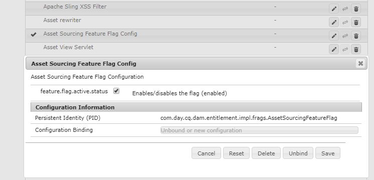
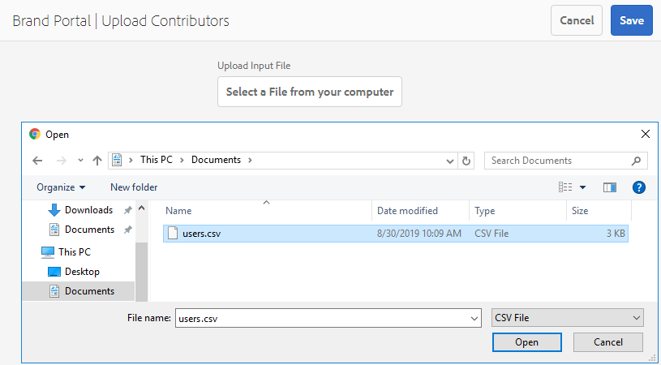

# 資產來源補充概述{#overview-asset-sourcing-in-bp}

**AEM** 使用者（管理員/非管理員使用者）可透過額外的Asset Contribution屬性來建立新資料夾，確保所建立的新資 **** 料夾可供Brand Portal使用者開啟，方便資產提交。這會自動觸發在新建立的&#x200B;**Contribution**&#x200B;資料夾內建立另外兩個子資料夾（稱為&#x200B;**SHARED**&#x200B;和&#x200B;**NEW**）的工作流程。 然後，AEM管理員將應新增至貢獻資料夾的資產類型以及一組基準資產上傳至&#x200B;**SHARED**&#x200B;資料夾以確保BP使用者具備所需的參考資訊，借此定義需求。 然後，管理員可先將新建立的&#x200B;**Contribution**&#x200B;資料夾發佈至Brand Portal，將該貢獻資料夾的作用中Brand Portal使用者存取權授予。 使用者在&#x200B;**NEW**&#x200B;資料夾中新增內容後，就可以將貢獻資料夾發佈回AEM製作環境。 請注意，完成匯入並反映AEM Assets中新發佈的內容可能需要幾分鐘的時間。

此外，所有現有功能均維持不變。 Brand Portal使用者可以從貢獻資料夾以及其他允許的資料夾檢視、搜尋和下載資產。 管理員也可以進一步共用貢獻資料夾、修改屬性，以及新增資產至集合。

>[!VIDEO](https://video.tv.adobe.com/v/29365/?quality=12)

## 必備條件 {#prerequisites}

* AEM Assets作為Cloud Service例項，AEM Assets 6.5.2或更新版本。
* 確認您的AEM Assets執行個體已使用Brand Portal進行設定。 請參閱[使用Brand Portal設定AEM Assets](../using/configure-aem-assets-with-brand-portal.md)。

<!--
* Ensure that your Brand Portal tenant is configured with one AEM Assets author instance.
-->

>[!NOTE]
>
>AEM Assets as aCloud ServiceAEM Assets 6.5.9及更新版本預設會啟用「資產來源補充」功能。
>
>現有設定在舊版中仍可繼續運作。

>[!NOTE]
>
>AEM Assets 6.5.4有一個已知問題。升級至Adobe開發人員控制台時，Brand Portal使用者無法將貢獻資料夾的資產發佈至AEM Assets。
>
>此問題已在AEM 6.5.5中修正。您可以將AEM Assets執行個體升級至最新的Service Pack AEM 6.5.5和[升級Adobe開發人員主控台上的設定](https://docs.adobe.com/content/help/zh-Hant/experience-manager-65/assets/brandportal/configure-aem-assets-with-brand-portal.html#upgrade-integration-65)。
>
>若要立即修正AEM 6.5.4，建議您[下載hotfix](https://www.adobeaemcloud.com/content/marketplace/marketplaceProxy.html?packagePath=/content/companies/public/adobe/packages/cq650/hotfix/cq-6.5.0-hotfix-33041)並安裝在您的製作執行個體上。

<!--
## Configure Asset Sourcing {#configure-asset-sourcing}

**Asset Sourcing** is configured from within the AEM Assets author instance. The administrators can enable the Asset Sourcing feature flag configuration from the **AEM Web Console Configuration** and upload the active Brand Portal users list in **AEM Assets**.

>[!NOTE]
>
>Asset Sourcing is by default enabled on AEM Assets as a Cloud Service. The AEM administrator can directly upload the active Brand Portal users to allow them access to the Asset Sourcing feature.

>[!NOTE]
>
>Before you begin with the configuration, ensure that your AEM Assets instance is configured with Brand Portal. See, [Configure AEM Assets with Brand Portal](../using/configure-aem-assets-with-brand-portal.md). 

The following video demonstrates, how to configure Asset Sourcing on your AEM Assets author instance:

>[!VIDEO](https://video.tv.adobe.com/v/29771)
-->

<!--
### Enable Asset Sourcing {#enable-asset-sourcing}

AEM administrators can enable the Asset Sourcing feature flag from within the AEM Web Console Configuration (a.k.a Configuration Manager).

>[!NOTE]
>
>This step is not applicable for AEM Assets as a Cloud Service.

**To enable Asset Sourcing:**
1. Log in to your AEM Assets author instance and open Configuration Manager. 
Default URL: http:// localhost:4502/system/console/configMgr.
1. Search using the keyword **Asset Sourcing** to locate **[!UICONTROL Asset Sourcing Feature Flag Config]**.
1. Click **[!UICONTROL Asset Sourcing Feature Flag Config]** to open the configuration window.
1. Select the **[!UICONTROL feature.flag.active.status]** check box.
1. Click **[!UICONTROL Save]**.

-->

### 上傳Brand Portal使用者清單{#upload-bp-user-list}

AEM管理員可上傳Brand Portal使用者設定(.csv)檔案，其中包含AEM Assets中作用中的Brand Portal使用者清單，以允許他們存取Asset Sourcing功能。

貢獻資料夾只能與使用者清單中定義的作用中Brand Portal使用者共用。 管理員也可以在設定檔案中新增使用者，並上傳已修改的使用者清單。

>[!NOTE]
>
>確認您的AEM Assets執行個體已使用Brand Portal進行設定。 請參閱[使用Brand Portal設定AEM Assets](../using/configure-aem-assets-with-brand-portal.md)。

>[!NOTE]
>
>CSV檔案的格式與大量使用者匯入Admin Console支援的格式相同。 電子郵件、名字和姓氏是必填欄位。

管理員可以在AEMAdmin Console中新增使用者，如需詳細資訊，請參閱[管理使用者](brand-portal-adding-users.md) 。 在Admin Console中新增使用者後，可將這些使用者新增至Brand Portal使用者設定檔案，然後指派存取貢獻資料夾的權限。

**上傳Brand Portal使用者清單：**
1. 登入您的AEM Assets執行個體。
1. 從&#x200B;**工具**&#x200B;面板，導覽至&#x200B;**[!UICONTROL 資產]** > **[!UICONTROL Brand Portal使用者]**。

1. Brand Portal上傳貢獻者視窗隨即開啟。
從本機電腦瀏覽並上傳**包含作用中Brand Portal使用者清單的設定(.csv)檔案**。
1. 按一下「**[!UICONTROL 儲存]**」。

   

管理員可在設定貢獻資料夾時，從此使用者清單提供特定使用者的存取權。 只有指派給貢獻資料夾的使用者才能存取貢獻資料夾，並將資產從Brand Portal發佈至AEM Assets。

## 另請參閱 {#reference-articles}

* [設定貢獻資料夾並將其發佈至Brand Portal](brand-portal-publish-contribution-folder-to-brand-portal.md)

* [將貢獻資料夾發佈至AEM Assets](brand-portal-publish-contribution-folder-to-aem-assets.md)
