# 自訂桌布、頁首和電子郵件訊息 {#customize-wallpaper-header-and-email-message}

[!DNL Brand Portal] 管理員可以對顯示給使用者的介面進行有限的自訂。您可以為 [!DNL Brand Portal] 登入頁面選擇特定背景影象(桌布)。您也可以新增頁首影像並自訂資產共用電子郵件，以符合客戶的品牌。

## 自訂登入畫面桌布 {#customize-the-login-screen-wallpaper}

如果沒有自訂的品牌牆紙影像，則會在登入頁面上顯示預設的桌布。

1. 從上方的 [!DNL AEM] 工具列，按一下Adobe標誌以存取管理工具。

   

2. 在管理工具面板中，按一下 **品牌**。

   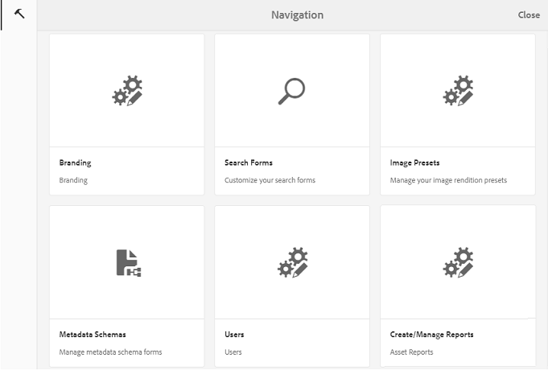

3. **在「設定品牌** 」頁面的左側導軌上，預設會選取 **Wallaper** 。隨即顯示出現在登入頁面上的預設背景影象。

   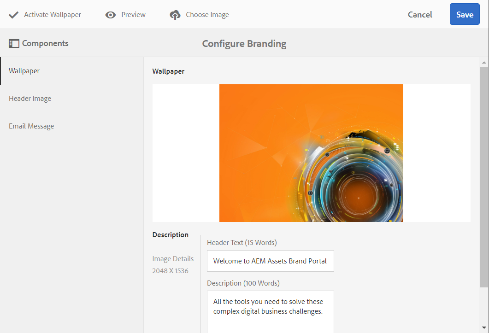

4. 若要新增背景影象，請按一下頂端工具列 **中的「選擇影像** 」圖示。

   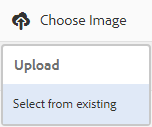

   執行下列其中一項作業：

   * 若要從電腦上傳影像，請按一下 **「上傳**」。導覽至必要的影像並上傳它。
   * 若要使用現有的品牌入口網站影像，請按一下 **「選取範圍**」。使用資產選擇器選擇影像。
   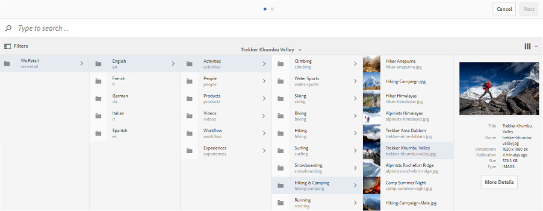

5. 指定背景影象的標題文字和說明。若要儲存變更，請從頂端的工具列按一下 **「儲存** 」。

6. 從上方的工具列，按一下 **「預覽** 」圖示以產生品牌入口網站介面與影像的預覽。

   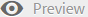

   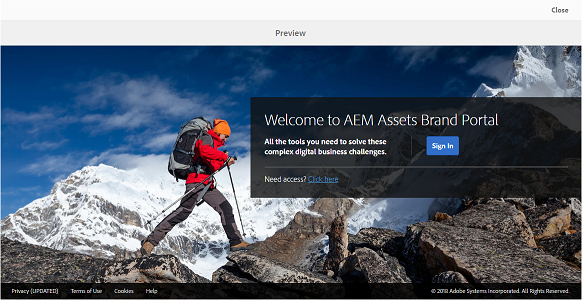

7. 若要啓用或停用預設的桌布，請在 **「設定品牌** &gt; **塗鴉牆」** 頁面中執行下列動作：

   * 若要在品牌入口網站登入頁面上顯示預設的桌布影像，請從頂端的工具列按一下 **「停用布紙」** 。會顯示一則訊息，確認自訂影像已停用。
   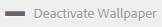

   * 若要還原品牌入口網站登入頁面上的自訂影像，請按一下工具列 **中的「啓動Wallaper** 」。會顯示訊息，確認影像已還原。
   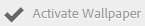

   * 按一下 **「儲存** 」以儲存變更。

## 自訂標題 {#customize-the-header}

登入品牌入口網站後，標題會顯示在各種品牌入口網站頁面上。

1. 從上方的AEM工具列，按一下Adobe標誌以存取管理工具。

   

2. 在管理工具面板中，按一下 **品牌**。

   

3. 若要自訂品牌入口網站介面的頁首，請在 **「設定品牌** 」頁面上，從左側導軌選取 **「頁首影像** 」。預設標題影像隨即顯示。

   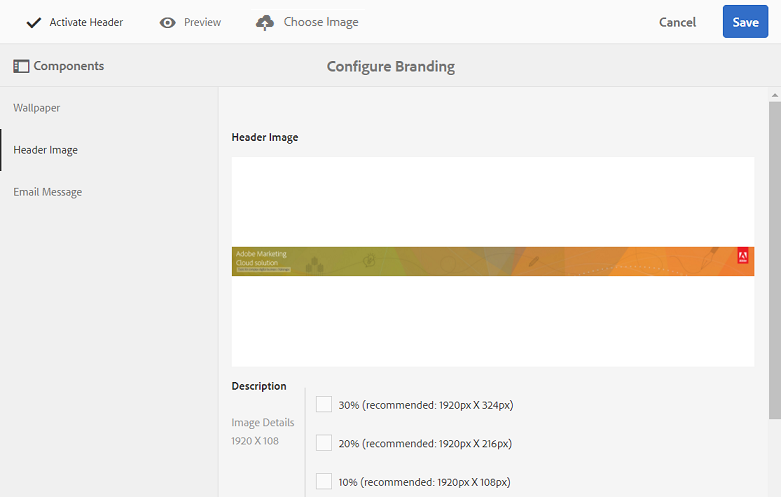

4. 若要上傳頁首影像，請按一下 **「選擇影像** 」圖示並選擇 **「上傳**」。

   若要使用現有 [!DNL Brand Portal] 的影像，請選擇 **「從現有選取」**。

   

   使用資產選擇器選擇影像。

   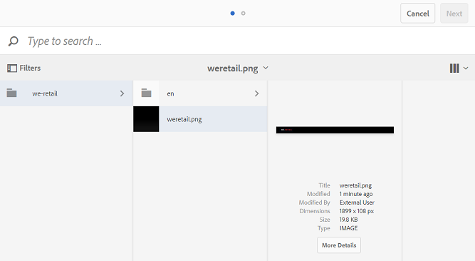

5. 若要在頁首影像中加入URL，請在 **「影像URL** 」方塊中指定該URL。您可以指定外部或內部URL。內部連結也可以是相對連結，例如
   `/mediaportal.html/content/dam/mac/tenant_id/tags`.
此連結會將使用者導向至標籤資料夾。
若要儲存變更，請從頂端的工具列按一下 **「儲存** 」。

   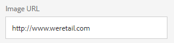

6. 從頂端的工具列，按一下 **「預覽** 」圖示，以產生與標題影像 [!DNL Brand Portal] 的介面預覽。

   
   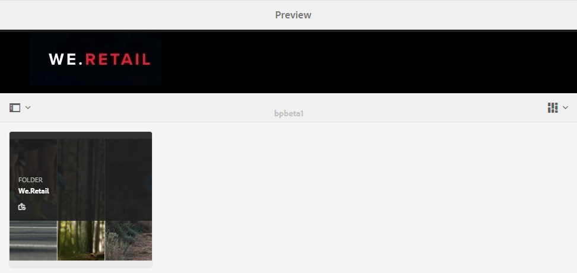

7. 若要啓用或停用頁首影像，請在 **「設定品牌** &gt; **頁首影像** 」頁面中執行下列動作：

   * 若要防止頁首影像出現在 [!DNL Brand Portal] 頁面上，請從頂端的工具列按一下 **「停用標題」** 。會將訊息確認為停用影像。
   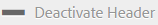

   * 若要讓頁首影像重新顯示在 [!DNL Brand Portal] 頁面上，請從頂端的工具列按一下 **「啓動標題」** 。會出現一則訊息，確認影像已啓動。
   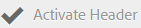

   * 按一下 **「儲存** 」以儲存變更。

## 自訂電子郵件訊息 {#customize-the-email-messaging}

將資產共用為連結時，使用者會收到包含連結的電子郵件。管理員可以自訂這些電子郵件的訊息，即標誌、說明和頁尾。

1. 從上方的 [!DNL AEM] 工具列，按一下Adobe標誌以存取管理工具。

   

2. 在管理工具面板中，按一下 **品牌**。

   

3. 將資產共用為連結或透過電子郵件下載時，當共用 [!UICONTROL 系列] 時，會傳送電子郵件通知給使用者。若要自訂電子郵件訊息，請在 **「設定品牌** 」頁面上，從左側導軌選取 **「電子郵件訊息** 」。

   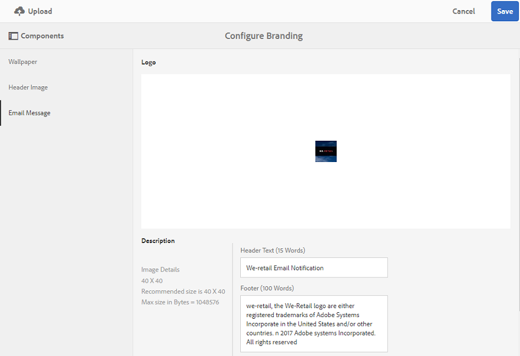

4. 若要新增標誌至傳出電子郵件，請從頂端的工具列按一下 **「上傳」** 。

5. 在 **「說明」** 區段中，指定電子郵件頁首和頁尾文字。若要儲存變更，請從頂端的工具列按一下 **「儲存** 」。

   >[!NOTE]
   >
   >如果您不使用標誌的建議大小，或頁首和頁尾文字超出建議的字詞數目，電子郵件訊息中的內容可能會出現亂碼。
