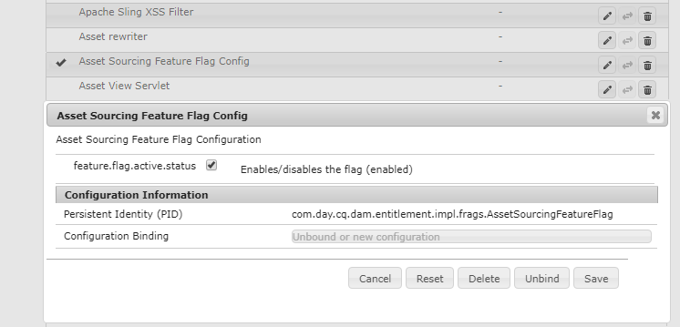
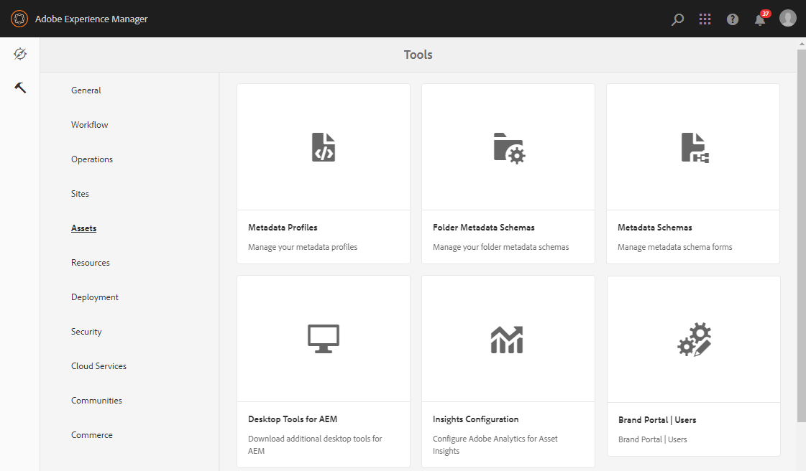
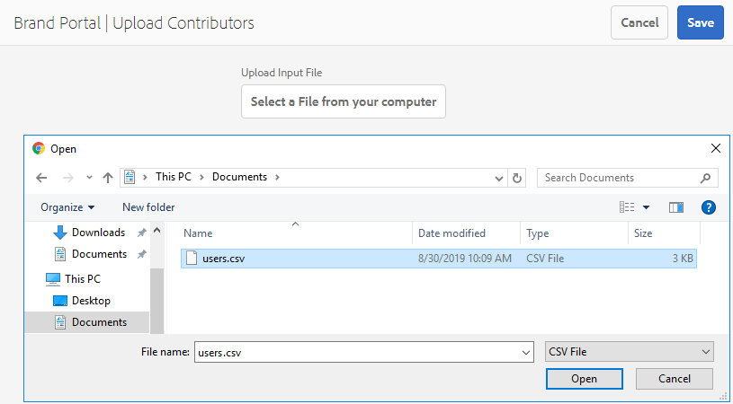

# 配置資產來源補充 {#configure-asset-sourcing}

AEM管理員可以在AEM **作者例項中設定「資產來源補充** 」。 管理員會從 **AEM Web Console Configuration啟用「資產來源補充」功能標幟設定** ，並在 **AEM Assets中上傳作用中的品牌入口網站使用者清單**。

>[!NOTE]
>
>在您從設定開始之前，請確定您的AEM Assets例項已設定為品牌入口網站。 請參閱「 [設定AEM資產與品牌入口網站](../using/configure-aem-assets-with-brand-portal.md)」。

下列影片示範如何在您的AEM作者例項上設定資產來源補充：

>[!VIDEO](https://video.tv.adobe.com/v/29771)

## 啟用資產來源補充 {#enable-asset-sourcing}

AEM管理員可以在AEM Web Console設定（亦即「設定管理員」）中啟用「資產來源補充」。

**要啟用資產來源補充，請執行以下操作：**
1. 登入您的AEM作者實例並開啟「設定管理員」預設URL:http:// localhost:4502/system/console/configMgr
1. 使用關鍵字「資 **產來源補充** 」搜索以 **[!UICONTROL 查找「資產來源補充功能標幟配置」]**
1. 按一下「 **[!UICONTROL 資產來源補充功能標籤配置]** 」(Asset Sourcing Feature Flag Config)以開啟配置窗口
1. 啟用核取 **[!UICONTROL 方塊feature.flag.active.status]**
1. 按一下&#x200B;**[!UICONTROL 「儲存」]**。

## 上傳品牌入口網站使用者清單 {#upload-bp-user-list}

AEM管理員可以上傳「品牌入口網站」使用者設定(.csv)檔案，其中包含AEM Assets中的作用中品牌入口網站使用者清單。 貢獻資料夾只能與使用者清單中定義的作用中品牌入口網站使用者共用。 管理員也可以在配置檔案中添加新用戶，並上傳修改的用戶清單。

>[!NOTE]
>
>CSV檔案的格式與Admin Console支援的大量使用者匯入格式相同。 電子郵件、名字和姓氏是必填的。

管理員可在AEM Admin Console中新增使用者，請參閱「管 [理使用者](brand-portal-adding-users.md) 」以取得詳細資訊。 在Admin Console中新增使用者後，這些使用者可以新增至品牌入口網站使用者設定檔案，然後指派存取貢獻資料夾的權限。

**若要上傳品牌入口網站使用者清單：**
1. 登入您的AEM作者例項預設URL:http:// localhost:4502/aem/start.html
1. 從「工 **具** 」面板  ，導覽至「資產>品 **[!UICONTROL 牌入口網站使用者」]**
   
1. 「品牌入口網站上傳參與者」視窗隨即開啟。
從本機電腦瀏覽並上傳包 **含作用中品牌入口網站使用者清單** 的設定(.csv)檔案。
1. 按一下&#x200B;**[!UICONTROL 「儲存」]**。
   

管理員可在設定貢獻資料夾時，從此使用者清單提供對特定使用者／群組的存取權。

如需詳細資訊，請參閱「設 [定貢獻資料夾](brand-portal-contribution-folder.md)」。
