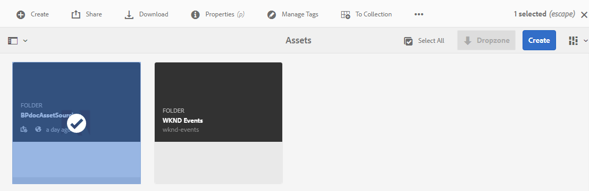
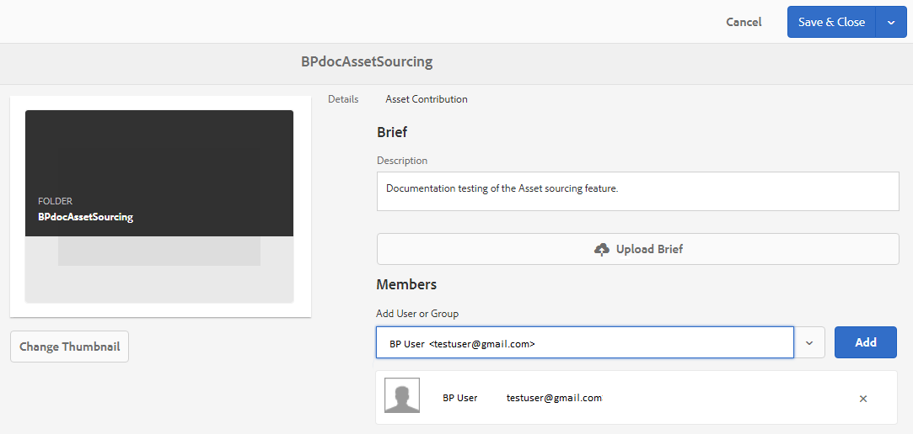

# 設定貢獻資料夾屬性 {#configure-contribution-folder-properties}

AEM管理員在設定貢獻檔案夾的屬性時，會執行下列活動。

* **添加說明**:提供貢獻資料夾的高階說明。
* **上傳簡介**: 上載包含資產相關資訊的資產需求文檔。
* **新增參與者**:新增品牌入口網站使用者或群組，以授與他們對貢獻資料夾的存取權。

資產需求是指管理員提供的詳細資訊，以協助參與者（品牌入口網站使用者）瞭解貢獻資料夾的需求和需求。 管理員上傳資產需求檔案，其中包含應新增至貢獻檔案夾的資產類型及資產相關資訊的簡介，例如用途、影像類型、最大大小等。

然後，管理員可以先授與品牌入口網站使用者／群組的貢獻資料夾存取權，再將新建立的貢獻資料夾發佈至品牌入口網站。

**若要設定貢獻資料夾屬性：**
1. 登入您的AEM作者例項預設URL:http:// localhost:4502/aem/start.html
1. 導覽至「 **[!UICONTROL 資產>檔案]** 」，並找出貢獻檔案夾。
1. 選取貢獻資料夾，然後按一 **[!UICONTROL 下屬性]**。 資料夾屬性窗口開啟。
   
1. 導覽至「 **[!UICONTROL 資產貢獻]** 」標籤。
1. 輸入貢獻資 **[!UICONTROL 料夾的]** 「高階說明」。
1. 按一 **[!UICONTROL 下「上傳簡]** 報  」，從本機電腦瀏覽並上傳資 **產需求檔案**。
1. 在「 **[!UICONTROL 新增使用者或群組]**」中，搜尋並新 **** 增品牌入口網站使用者或您要與其共用貢獻資料夾的群組。
這些品牌入口網站使用者／群組將擁有存取貢獻資料夾和從其品牌入口網站介面上傳內容的權限，而不需存取AEM作者實例。
1. 按一下&#x200B;**[!UICONTROL 「儲存」]**。
   

>[!NOTE]
>
>搜尋結果是以AEM Assets中設定的品牌入口網站使用者清單為基礎。 請確定您有更新的品牌入口網站使用者清單。 請參閱「上 [傳品牌入口網站使用者清單](brand-portal-configure-asset-sourcing.md)」。