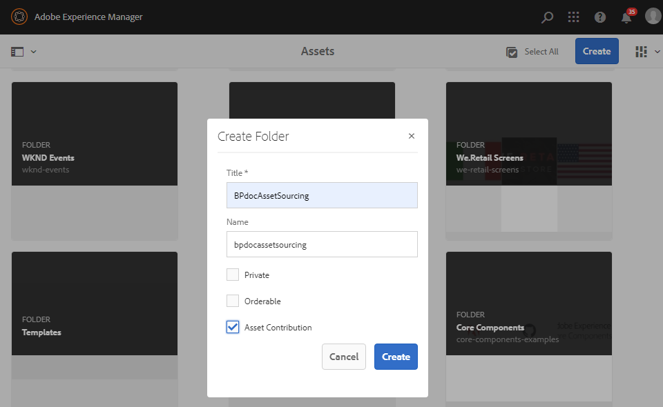
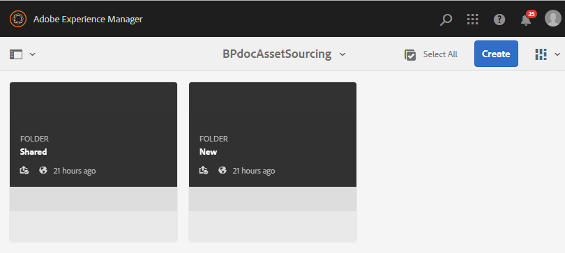

# Create contribution folder {#create-contribution-folder}

AEM管理員和擁有建立新檔案夾權限的非管理員使用者，可以在AEM Assets中建立貢獻檔案夾。
若要建立貢獻檔案夾，請建立新的「資產貢獻」類型檔案夾，以確保建立的新檔案夾可由品牌入口網站使用者提交資產。  這會自動觸發工作流程，此工作流程會在貢獻資料夾中建立另外兩個子資料夾，稱為SHARED和NEW。

>[!NOTE]
>
>您可以在資料夾中建立多個貢獻資料夾，但不得在其他貢獻資料夾中建立貢獻資料夾。

要建立貢獻資料夾：
1. 登入您的AEM作者實例。

   預設URL為http:// localhost:4502/aem/start.html。

1. 導覽至「 **[!UICONTROL 資產]** >檔 **[!UICONTROL 案」]**。 它會列出AEM Assets儲存庫中的所有現有資料夾。

1. Click **[!UICONTROL Create]** to create a new folder. **[!UICONTROL 「建立資料夾]** 」(Create Folder)對話框開啟。

1. 輸入 **[!UICONTROL 資料夾的Title]** and **[!UICONTROL Name]** （標題和名稱），然後選取「 **[!UICONTROL 資產貢獻]** 」核取方塊。
建議您使用小寫字母，而不需任何空格來命名資料夾。

1. 按一下&#x200B;**[!UICONTROL 建立]**。您可以在AEM Assets儲存庫中看到列出的貢獻資料夾。

   >[!NOTE]
   >
   >非管理員使用者可以建立和共用資產貢獻資料夾，但無法修改或刪除它。

   

1. 按一下以開啟貢獻資料夾，您會看到兩個子資料夾-**[!UICONTROL SHARED]****[!UICONTROL 和NEW]** -會自動在貢獻資料夾中建立。

   

您現在可以 [設定貢獻資料夾屬性](brand-portal-configure-contribution-folder-properties.md)。

