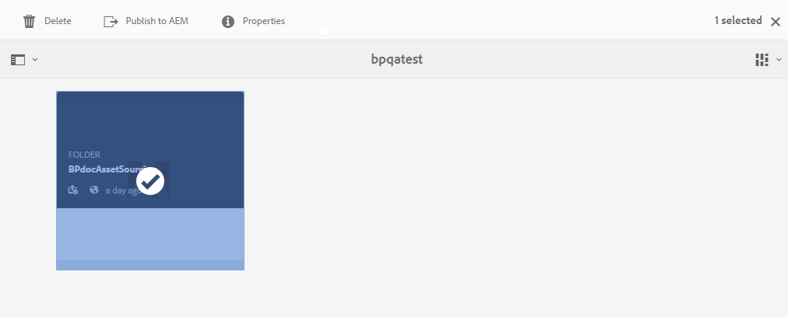
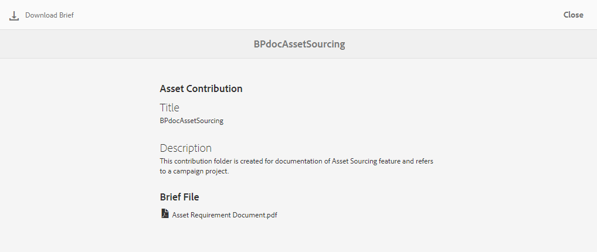
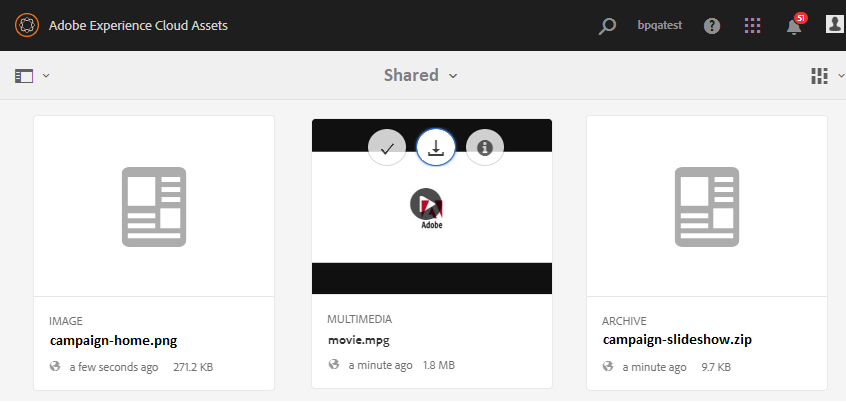

# 下載資產需求 {#using-asset-souring-in-bp}

每當AEM使用者共用貢獻檔案夾時，品牌入口網站的使用者都會自動收到電子郵件／脈衝通知，讓他們從 **SHARED** 檔案夾下載簡短（資產需求）檔案，以及下載基準資產（參考內容），以確保他們瞭解資產需求。

品牌入口網站使用者會執行下列活動以下載資產需求：

* **下載簡介**:下載附在貢獻檔案夾中的簡短（資產需求檔案），該檔案夾包含資產相關資訊，例如資產類型、用途、支援的格式、最大資產大小等。
* **下載基準資產**:下載可用來瞭解所需資產類型的基準資產。 品牌入口網站使用者可使用這些資產作為參考，以建立新資產以作貢獻。

「品牌入口網站」控制面板會反映品牌入口網站使用者允許的所有現有資料夾，以及新共用的貢獻資料夾。 在此範例中，品牌入口網站使用者僅能存取新建立的貢獻資料夾，不會與使用者共用其他現有資料夾。

**若要下載資產需求：**

1. 登入您的品牌入口網站實例。
1. 從「品牌入口網站」控制面板選取貢獻資料夾。
1. 按一 **[!UICONTROL 下屬性]**。 屬性視窗隨即開啟，顯示「資產貢獻」檔案夾詳細資訊。
   
1. 按一 **[!UICONTROL 下「下載簡]** 介  」，在本機電腦上下載資產需求檔案。
   
1. 返回品牌入口網站儀表板。
1. 按一下以開啟貢獻資料夾，您可在貢獻資料夾中看到兩個子&#x200B;**[!UICONTROL 資料夾]** - **[!UICONTROL SHARED]** 和NEW。 SHARED資料夾包含管理員共用的所有基準資產（參考內容）。
1. 您可以下載 **[!UICONTROL SHARED]** 資料夾，其中包含本機電腦上的所有基準資產。
或者，您可以開啟 **[!UICONTROL SHARED]** 檔案夾，然後按一下「下載 **」圖示** 以下載個別檔案／檔案夾。
   

請詳閱簡介（資產需求檔案），並參考基準資產以瞭解資產需求。 現在，您可以建立新的貢獻資產，並將其上傳至貢獻資料夾。 請參閱， [上傳資產至貢獻資料夾](brand-portal-upload-assets-to-contribution-folder.md)。

