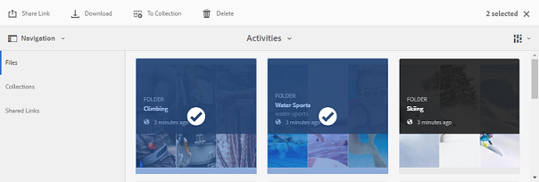
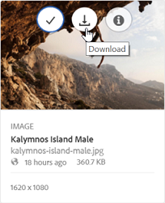
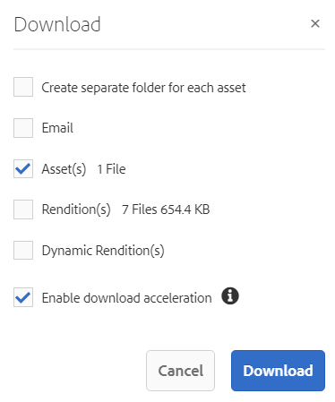
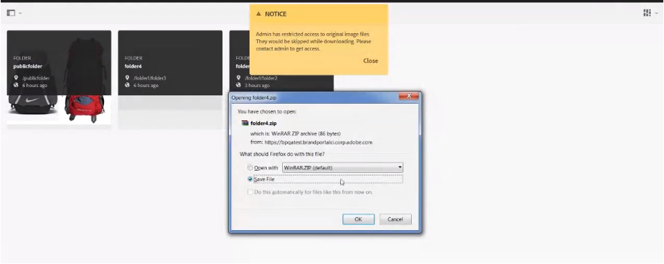
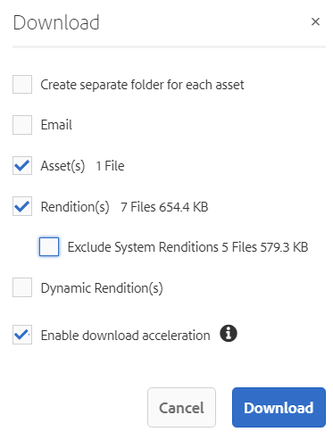
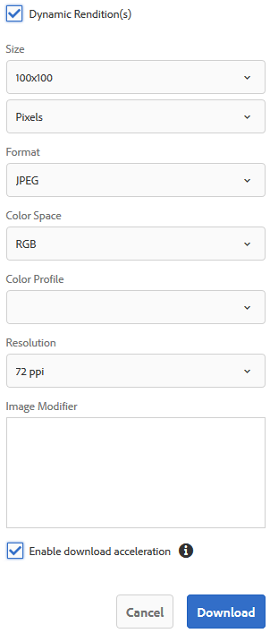

# 下載資產 {#download-assets}

<!-- Before update in Download experience - 26th Aug 2020 by Vishabh.
 All users can simultaneously download multiple assets and folders accessible to them from Brand Portal. This way, approved brand assets can be securely distributed for offline use. Read on to know how to download approved assets from Brand Portal, and what to expect from the [download performance](../using/brand-portal-download-assets.md#main-pars-header).
-->

Adobe Experience Manager Assets Brand Portal可讓使用者同時下載多個資產和資料夾，讓他們從Brand Portal存取這些資產和資料夾，以增強下載體驗。 如此，就可安全地散發核准的品牌資產，以供離線使用。 閱讀以瞭解如何從品牌入口網站下載已核准的資產，以及從下載效能中預 [期的](../using/brand-portal-download-assets.md#expected-download-performance)。

>[!NOTE]
>
>從Brand Portal下載資產前，請先在瀏覽器的擴充功能中安裝IBM Aspera Connect 3.9.9。

<!--
**Types of renditions in Brand Portal:**

* Original asset rendition

  It is the original binary of the asset uploaded in AEM Assets. 
  
  
* System renditions

  These are the thumbnail renditions which are automatically generated in AEM Assets based on the "DAM update asset" workflow. 
  
* Custom renditions

  These are the additional renditions that an asset might have and its dynamic renditions. Any user can create additional custom renditions, whereas, only the AEM administrator can create dynamic renditions of an image in AEM Assets. To know more, see [how to apply image presets or dynamic renditions](../using/brand-portal-image-presets.md).     
-->

## 設定資產下載 {#configure-download}

下載設定可讓品牌入口網站管理員定義一組可供品牌入口網站使用者下載資產的轉譯。 管理員可從品牌入口網 **[!UICONTROL 站介面]** ，設定資產下載設定。

可用的配置包括：

* **[!UICONTROL 快速下載]**

   可快速下載資產。 如需詳細資訊，請參 [閱指南以加速從品牌入口網站下載](../using/accelerated-download.md)。

* **[!UICONTROL 自訂轉譯]**

   下載資產的自訂和（或）動態轉譯。
所有資產轉譯（原始資產和系統產生的轉譯除外）都稱為自訂轉譯。 它包含資產可用的靜態和動態轉譯。 任何使用者都可以在AEM Assets中建立自訂靜態轉譯，但只有AEM管理員可以建立自訂動態轉譯。 如需詳細資訊，請參 [閱如何套用影像預設集或動態轉譯](../using/brand-portal-image-presets.md)

* **[!UICONTROL 系統轉譯]**

   下載系統產生的資產轉譯。 這些縮圖是根據「DAM更新資產」工作流程自動在AEM Assets中產生的。

以管理員身分登入您的品牌入口網站租戶，並導覽至「工 **[!UICONTROL 具]** >下 **[!UICONTROL 載]**」。 依預設，「下 **[!UICONTROL 載設定」中]** ，會啟用「快速下 **[!UICONTROL 載」設定]**。

管理員可以啟用任何組合來設定資產下載程式。

根據此設定，單機資產、多個資產、包含資產的檔案夾、授權或未授權資產，以及使用共用連結下載資產的下載工作流程將維持不變。

* 如果「自 **[!UICONTROL 訂轉譯]****** 」和「系統轉譯」設定都已關閉，則會下載資產的原始轉譯，而不會向使用者顯示任何其他對話方塊。

<!--
If all the three download configurations are turned-off, or only the **[!UICONTROL Fast Download]** configuration is enabled, the original assets are directly downloaded on your local system with no additional step required.
Test.. 
-->

* 如果任何「自訂轉譯 **[!UICONTROL 」或「]********** 系統轉譯」設定已啟用，則會出現另一個「下載」對話方塊，您可在其中選擇是下載原始資產及其轉譯，還是只下載特定轉譯。

>[!NOTE]
>
>只有管理員才能下載過期的資產。 如需過期資產的詳細資訊，請參 [閱「管理資產的數位權限」](../using/manage-digital-rights-of-assets.md)。

## 下載資產的步驟 {#steps-to-download-assets}

以下是從品牌入口網站下載包含資產的資產或檔案夾的步驟：

1. 從品牌入口網站介面，執行下列其中一項作業：

   * 選取您要下載的檔案夾或資產。 從頂端的工具列，按一下「下 **[!UICONTROL 載]** 」圖示。

      

   * 若要下載特定資產或檔案夾，請將指標暫留在資產或檔案夾上，然後按一下快速動作縮圖中 **[!UICONTROL 的]** 「下載」圖示。

      

      >[!NOTE]
      >
      >如果您是第一次下載資產，但瀏覽器中未安裝IBM Aspera Connect，則會提示您安裝Aspera下載加速器。

      >[!NOTE]
      >
      >如果您下載的資產也包含授權資產，則會將您重新導向至「版權 **[!UICONTROL 管理]** 」頁面。 在本頁中，選取資產，按一下「 **[!UICONTROL 同意]**」，然後按一下「 **[!UICONTROL 下載」]**。 如果您選擇不同意，則不會下載授權資產。
      > 
      >受授權保護的資產 [附加了授權合約](https://helpx.adobe.com/experience-manager/6-5/assets/using/drm.html#DigitalRightsManagementinAssets) ，這是透過在Experience Manager Assets中設定資產的 [中繼資料屬性](https://helpx.adobe.com/experience-manager/6-5/assets/using/drm.html#DigitalRightsManagementinAssets) 來完成的。

      

      <!--
     >>[!NOTE]
     >
     >Ensure to select all the required asset renditions while downloading them from the asset details page, and click **[!UICONTROL Download]**. The selected renditions are downloaded to your local machine.
     > 
     >Once you download, the **[!UICONTROL Download]** button is disabled to avoid creating duplicate copies of the downloaded renditions. To download more (missing or another copy of renditions), refresh the browser to re-enable the download button.
     >
     -->

      如果在「 **[!UICONTROL Download Settings]** ( **[!UICONTROL Download Settings]** )」中啟用了任何「自訂轉譯 **[!UICONTROL 」或「系統轉譯」配置，則「]********** DownloadRenditions(s)」對話框將顯示預設選中的CondloadAsset(s)check Box。 如果啟 **[!UICONTROL 用「快速下載]** 」設定，預設會選 **[!UICONTROL 取「啟用下載加速]** 」核取方塊。

      

      >[!NOTE]
      >
      >如果下載資產是影像檔案，而您只在「下載」對話方塊中選取「資產」核取方塊，但管理員未授權您存取影像檔案的原始轉譯 ******** ，則不會下載影像檔案，並會顯示通知，指出管理員已限制您存取原始轉譯。

      

1. 若要下載除原始資產以外的轉譯，請選取「轉 **[!UICONTROL 譯」核取方塊]** 。 不過，如果您想要下載系統產生的轉譯以及自訂轉譯，請清除「排除系統轉譯」核 **[!UICONTROL 取方塊]** 。

   

   * 若要僅下載轉譯，請清除「 **[!UICONTROL 資產」核取方塊]** 。

      >[!NOTE]
      >
      >依預設，只會下載資產。 但是，如果管理員未授權您存取影像檔的原 [始轉譯，則不會下載影像檔的原始轉譯](../using/brand-portal-adding-users.md#main-pars-procedure-202029708)。

   * 若要透過連結與其他使用者共用選取的資產，請選取「電子郵 **[!UICONTROL 件]** 」核取方塊。 會透過下載連結傳送電子郵件通知給使用者。 若要瞭解如何從共用連結下載資產，請參閱從 [共用連結下載資產](../using/brand-portal-link-share.md#main-pars-header-1703469193)。

      

      >[!NOTE]
      >
      >電子郵件通知的下載連結會在45天後過期。
      >
      >管理員可使用品牌功能自訂電子郵件訊息，即標誌、說明和頁 [尾](../using/brand-portal-branding.md) 。

   * 您可以選取預先定義的影像預設集，或從「下載」對話方塊建立自訂 **[!UICONTROL 動態]** 轉譯。

      若要將自訂 [影像預設集套用至資產及其轉譯](../using/brand-portal-image-presets.md#applyimagepresetswhendownloadingimages)，請選取「 **** 動態轉譯」核取方塊。 指定影像預設集屬性（例如大小、格式、色域、解析度和影像修飾元），以便在下載資產及其轉譯時套用自訂影像預設集。 若要僅下載動態轉譯，請清除「 **[!UICONTROL 資產」核取方塊]** 。

      

      >[!NOTE]
      >
      >品牌入口網站支援在Hybird和Scene 7模式中設定動態媒體。
      >
      >(如&#x200B;*果AEM作者例項是在&#x200B;**Dynamic Media Hybrid模式上執行***)
      >
      >若要預覽或下載資產的動態轉譯，請確定已啟用動態媒體，且資產的Pyramidtiff轉譯存在於AEM Assets作者例項中，該資產是從該例項發佈的。 當資產發佈至品牌入口網站時，也會發佈其金字塔轉譯。

   * 若要在下載資產時保留品牌入口網站檔案夾階層，請選取「為每個 **[!UICONTROL 資產建立個別檔案夾]** 」核取方塊。 依預設，會忽略品牌入口網站檔案夾階層，所有資產都會下載到您本機系統的一個檔案夾中。

1. 按一 **[!UICONTROL 下下載]**。

   資產（若已選取，則轉譯）會以zip檔案的形式下載至您的本機資料夾。 不過，如果下載單一資產而未包含任何轉譯，則不會建立任何zip檔案。

   如果管理員未授 [權您存取原始轉譯](../using/brand-portal-adding-users.md#main-pars-procedure-202029708)，則不會下載所選資產的原始轉譯。

   >[!NOTE]
   >
   >個別下載的資產會顯示在資產下載報表中。 不過，如果下載了包含資產的檔案夾，該檔案夾和資產不會顯示在資產下載報表中。

## 預期的下載效能 {#expected-download-performance}

不同用戶端位置的使用者檔案下載體驗可能會因本端網際網路連線和伺服器延遲等因素而有所不同。 在美國俄勒岡州的Brand Portal伺服器上，在不同用戶端位置觀察到的2-GB檔案的預期下載效能如下：

| 用戶端位置 | 客戶端和伺服器之間的延遲 | 預期的下載速度 | 下載2-GB檔案所花的時間 |
|-------------------------|-----------------------------------|-------------------------|------------------------------------|
| 美國西部（北美）加州) | 18毫秒 | 7.68 MB/秒 | 4分鐘 |
| 美國西部（俄勒岡） | 42毫秒 | 3.84 MB/秒 | 9分鐘 |
| 美國東部(N.維吉尼亞) | 85毫秒 | 1.61 MB/秒 | 21分鐘 |
| 亞太地區（東京） | 124毫秒 | 1.13 MB/秒 | 30 分鐘 |
| 努瓦達 | 275毫秒 | 0.5 MB/秒 | 68分鐘 |
| 雪梨 | 175毫秒 | 0.49 MB/秒 | 69分鐘 |
| 倫敦 | 179毫秒 | 0.32 MB/秒 | 106分鐘 |
| 新加坡 | 196毫秒 | 0.5 MB/秒 | 68分鐘 |

>[!NOTE]
>
>引用的資料是在測試條件下觀察到的，不同位置的使用者會看到不同的延遲和頻寬。
