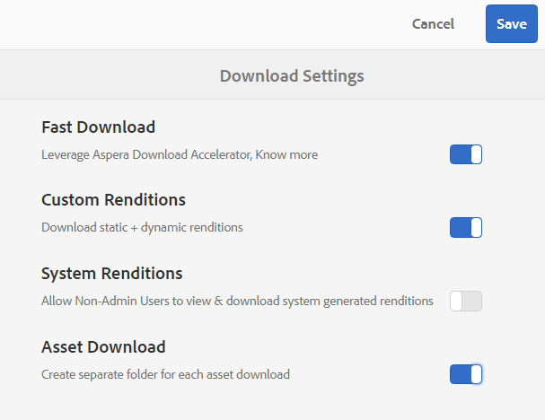
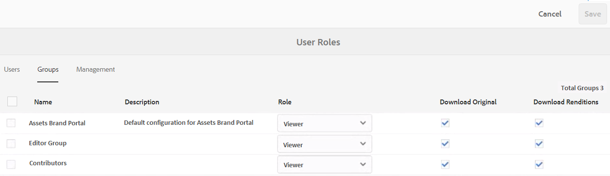
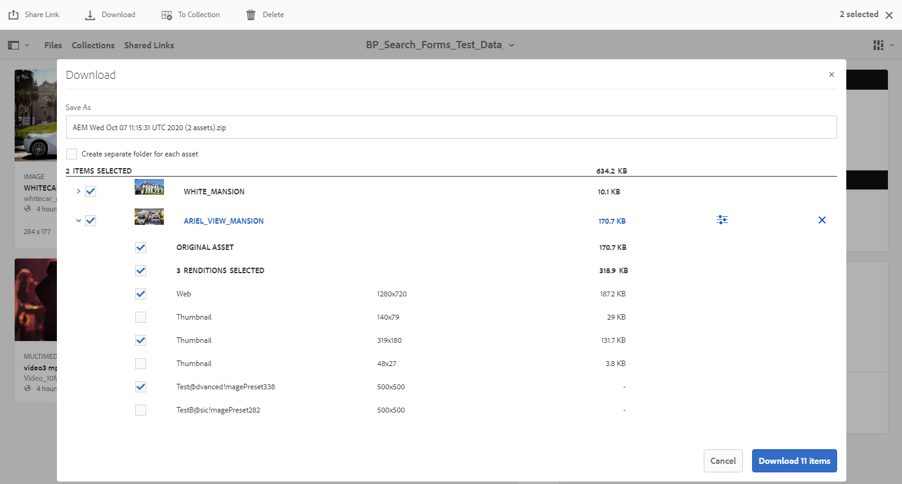
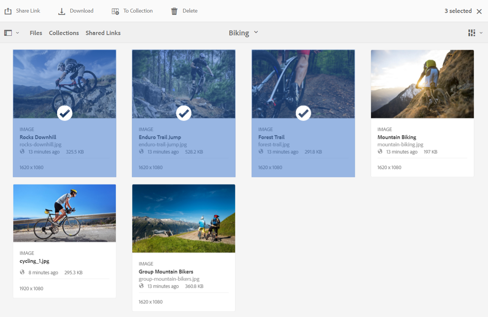
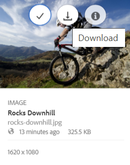
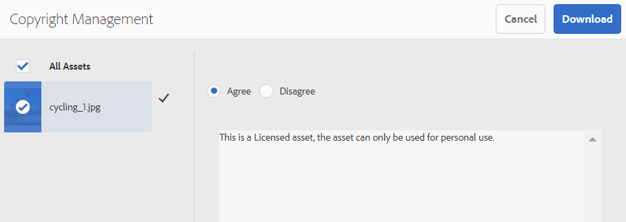
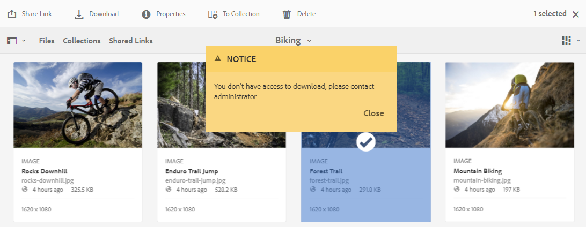

# 下載資產 {#download-assets-from-bp}

Adobe Experience Manager Assets 品牌入口網站可讓使用者在體驗中同時下載可存取資產和資料夾，從而增強下載品牌入口網站。 這樣，核准的品牌資產可以安全地分發，以供離線使用。 請閱讀以瞭解如何從品牌入口網站下載資產（核准資產），以及下載效能 ](#expected-download-performance) 的預期 [ 。

>[!NOTE]
>
>在品牌入口網站2020.10.0 （及更高版本）中，預設會啟用「快速下載 ]**」設定，**[!UICONTROL  以使用 IBM Aspera Connect 來加速資產的下載。在從品牌入口網站下載資產之前，請在瀏覽器的擴充功能中安裝 IBM Aspera Connect 3.9.9 （ `https://www.ibm.com/docs/en/aspera-connect/3.9.9` ）。 如需詳細資訊，請參閱 [ 指南以加速從品牌入口網站 ](../using/accelerated-download.md) 下載。
>
>如果您不想使用 IBM Aspera Connect 並繼續正常的下載程式，請聯絡品牌入口網站管理員以關閉 **[!UICONTROL 快速下載]** 設定。

## 設定資產下載 {#configure-download}

品牌入口網站管理員可以設定品牌入口網站使用者的資產下載和消費者群組設定，以允許他們從下載介面中存取和資產品牌入口網站轉譯。

>[!NOTE]
>
>應用於用戶介面上的下載設定可協助品牌入口網站使用者輕鬆設定和下載資產轉譯的自助服務體驗。 例如，使用者仍然可以使用完整的資產路徑來存取和下載 URL 轉譯，而不會限制應用程式層資產的下載。

存取和下載來自品牌入口網站介面的資產轉譯，由以下設定定義：

* 啟用下載設定
* 設定消費者群組設定

### 啟用下載設定 {#enable-download-settings}

管理員可以啟用資產 **[!UICONTROL 下載設定]** ，以定義品牌入口網站使用者可用於下載的轉譯。

可用的設定為：

* **[!UICONTROL 快速下載]**

   它使用IBMAspera Connect提供資產的快速下載。 預設情況下， **[!UICONTROL 快速下載]** 設定在 **[!UICONTROL 下載設定]**。

* **[!UICONTROL 自訂轉譯]**

   允許下載資產的自訂和（或）動態轉譯。

   原始資產和系統產生的轉譯以外的所有資產轉譯稱為自訂轉譯。 它包含靜態和可用於資產的動態轉譯。 任何用戶都可以在 Experience Manager Assets 中建立自訂靜態轉譯，但只有管理員可以建立自訂動態轉譯。 如需詳細資訊，請參閱 [ 如何套用影像預設集或動態 ](../using/brand-portal-image-presets.md) 轉譯。

* **[!UICONTROL 系統轉譯]**

   允許下載系統生成的資產格式副本。

   這些縮略圖是根據「DAM更新資產」工作流在Experience Manager Assets自動生成的。

* **[!UICONTROL 資產下載]**

   允許將格式副本下載到每個資產的單獨資料夾中。 該設定適用於資料夾、收集和大量下載資產（20多個資產）。

以管理員身份登錄到您的Brand Portal租戶並導航到 **[!UICONTROL 工具]** > **[!UICONTROL 下載]**。

管理員可以啟用Brand Portal用戶訪問和下載資產格式副本的任何設定組合。

>[!NOTE]
>
>只有管理員才能下載過期的資產。 有關過期資產的詳細資訊，請參閱 [管理資產的數字權利](../using/manage-digital-rights-of-assets.md)。

### 設定消費者群組設定 {#configure-user-group-settings}

除了 **[!UICONTROL 下載設定]** ，品牌入口網站管理員還可以進一步設定不同群組的使用者的設定，以視圖和（或）下載原始資產及其轉譯。

以管理員身份登入您的品牌入口網站出租，並導覽至 **[!UICONTROL 工具]** > **[!UICONTROL 的使用者]** 。 **[!UICONTROL 在「使用者角色]** 」頁面中，導覽至 **[!UICONTROL 「群組]** 」標籤，設定用戶群組的視圖和（或）下載設定。

>[!NOTE]
>
>如果將用戶添加到多個組，並且其中一個組具有限制，則限制將適用於用戶。

根據配置，下載工作流對於獨立資產、多個資產、包含資產的資料夾、許可或未授權資產以及使用共用連結下載資產保持恆定。

下面的矩陣根據 [下載配置](#configure-download):

| **下載設定：自訂轉譯** | **下載設定：系統轉譯** | **使用者群組設定：下載原始** | **使用者群組設定：下載轉譯** | **結果** |
|---|---|---|---|---|
| 開啟 | 開啟 | 開啟 | 開啟 | 查看和下載所有格式副本 |
| 開啟 | 開啟 | 關閉 | 關閉 | 查看原始資產 |
| 關閉 | 關閉 | 開啟 | 開啟 | 檢視和下載原始資產 |
| 開啟 | 關閉 | 開啟 | 開啟 | 檢視和下載原始資產和自訂轉譯 |
| 關閉 | 開啟 | 開啟 | 開啟 | 檢視和下載原始資產和系統轉譯 |
| 開啟 | 關閉 | 關閉 | 關閉 | 檢視原始資產 |
| 關閉 | 開啟 | 關閉 | 關閉 | 查看原始資產 |
| 關閉 | 關閉 | 關閉 | 開啟 | 查看原始資產 |
| 關閉 | 關閉 | 開啟 | 關閉 | 查看和下載原始資產 |
| 關閉 | 關閉 | 關閉 | 關閉 | 檢視原始資產 |

## 下載資產 {#download-assets}

Brand Portal用戶可以從Brand Portal介面下載多個資產、包含資產的資料夾和集合。

>[!NOTE]
>
>如果您沒有權限存取或下載資產轉譯，請聯絡品牌入口網站管理員。

如果用戶有可存取轉譯的許可權，則會使用具有下列功能的增強 **[!UICONTROL 下載]** 對話方塊提供用戶：

* 檢視下載清單中所有資產的可用轉譯。
* 排除下載不需要的資產轉譯。
* 一次按一下將同一組格式副本應用於所有類似的資產類型。
* 為不同的資產類型應用不同的格式副本集。
* 為每個資產建立單獨的資料夾。
* 下載所選資產及其格式副本。

>[!NOTE]
>
>的 **[!UICONTROL 下載]** 僅當 **[!UICONTROL 自定義格式副本]** 和（或） **[!UICONTROL 系統格式副本]** 在 **[!UICONTROL 下載設定]**。

### 下載資產的步驟 {#bulk-download}

以下是從Brand Portal介面下載包含資產的資產或資料夾的步驟：

1. 登錄到你的Brand Portal租客。 預設情況下， **[!UICONTROL 檔案]** 將開啟包含所有已發佈資產和資料夾的視圖。

   執行下列任一項作業：

   * 選取您要下載的資產或資料夾。 從頂部的工具列中，按一下 **[!UICONTROL 下載]** 圖示。

      

   * 要下載資產的特定資產格式副本，請將指針懸停在資產上，然後按一下 **[!UICONTROL 下載]** 表徵圖在快速操作縮略圖中可用。

      

      >[!NOTE]
      >
      >如果您是首次下載資產，且瀏覽器中未安裝IBMAspera Connect，它將提示您安裝Aspera下載加速器(`https://www.ibm.com/docs/en/aspera-connect/3.9.9`)。

      >[!NOTE]
      >
      >如果您要下載的資產也包含授權資產，則會重新導向至 **[!UICONTROL 版權管理]** 頁面。 在此頁面中，選擇資產，按一下 **[!UICONTROL 「同意]** 」，然後按一下 **[!UICONTROL 「下載]** 」。 如果您選擇不同意，則不會下載授權的資產。
      > 
      >授權保護資產擁有 [ 附加 ](https://experienceleague.adobe.com/docs/experience-manager-65/assets/administer/drm.html) 的授權合約，可透過設定資產的 [ 中繼資料屬性 ](https://experienceleague.adobe.com/docs/experience-manager-65/assets/administer/drm.html) 在 Experience Manager Assets 中完成。

      

1. **[!UICONTROL 「下載]** 」對話方塊會開啟所有選取的資產。

   按一下任何資產，視圖可用的轉譯，然後選取對應于您要下載的轉譯的核取方塊。

   您可以手動選取或排除個別資產的轉譯，或按一下 **「套用** 」圖示，選取相同的轉譯集，以下載相同的資產類型（本例中的所有影像檔案）。 **[!UICONTROL 在「套用所有]** 」對話方塊中，按一下 **[!UICONTROL 完成]** ，將規則套用至所有類似的資產。

   

   您也可以按一下 **移除** 圖示，從下載清單中移除資產（如果需要）。

   

   若要在下載資產時保留品牌入口網站資料夾階層，請為每個資產 ]**選取**[!UICONTROL  建立單獨的資料夾。

   下載按鈕反映所選項目的計數。 完成套用規則後，按一下 **[!UICONTROL 「下載專案]** 」。

   

1. 預設情況下 **[!UICONTROL ，「下載設定]** 中 **[!UICONTROL 已啟用快速下載]** 設定。因此，會顯示一個確認方塊，允許使用 IBM Aspera Connect 加速下載。

   若要繼續使用 **[!UICONTROL 快速下載]** ，請按一下 **[!UICONTROL 「允許]** 」。 所有選取的轉譯都會在使用 IBM Aspera Connect 的 ZIP 檔案夾中下載。

   如果您不想使用 IBM Aspera Connect，請按一下 **[!UICONTROL 「拒絕]** 」。 如果 **[!UICONTROL 快速下載]** 被拒絕或失敗，系統會填入錯誤訊息。 **[!UICONTROL 按一下正常的下載]** 按鈕以繼續下載資產。

<!-- removed the known issue from step 2 as it is fixed in 2022.02.0 release.
   >[!CAUTION]
   >
   >(**Experience Manager Assets as a Cloud Service** only) The following known issue will be fixed in the upcoming release:
   >
   >The download dialog lists the smart crop renditions of the selected asset, however, the user cannot download the smart crop renditions.
-->

>[!NOTE]
>
>**[!UICONTROL 如果管理員關閉「快速下載]** 」設定，則選取的轉譯會直接在 ZIP 檔案夾中下載，而不會使用 IBM Aspera Connect。

>[!NOTE]
>
>**[!UICONTROL 如果「下載設定]** 中 **[!UICONTROL 已啟用資產下載]** 設定，則會在單獨的檔案夾中為 zip 檔案夾內的每個資產下載資產轉譯。
>  
>如果資產從共用連結下載，則會在單獨的檔案夾中為 zip 檔案夾內的每個資產下載資產轉譯。
>
>如果選擇了資料夾、集合或20個以上的資產供下載， **[!UICONTROL 下載]** 對話框被跳過，用戶可訪問的所有資產格式副本（不包括動態格式副本）都下載到zip資料夾中。

>[!NOTE]
>
>Brand Portal支援在混合模式和場景7模式下配置Dynamic Media。
>
>（ *如果 Experience Manager Assets 作者執行個體正在動態媒體混合模式*** 中 **執行）
>
>若要預覽或下載資產的動態轉譯，請確保動態媒體已啟用，資產的棱錐 tiff 轉譯存在於 Experience Manager 已發佈之位置 Assets。 從 Experience Manager 品牌入口網站 Assets 發佈資產時，也會發佈其金字塔 tiff 轉譯。

[如果管理員無權存取原始 ](../using/brand-portal-adding-users.md#main-pars-procedure-202029708) 轉譯，則不會下載所選資產的原始轉譯。

<!-- This issue has been resolved, check with engineering.
>[!NOTE]
>
>Once you have downloaded the asset renditions, the **[!UICONTROL Download]** button is disabled to avoid creating duplicate copies of the renditions. To download more (missing or another copy of renditions), refresh the browser to re-enable the download button.
-->

### 從資產詳細資訊下載資產頁面 {#download-assets-from-asset-details-page}

除了下載工作流程之外，還有另一種方法可直接從資產詳細資料頁面下載個別資產的轉譯。

使用者可以預覽不同的資產轉譯、選擇特定轉譯、直接從資產詳細資料頁面中的 **** 轉譯面板下載資產轉譯，而無須開啟 **[!UICONTROL 「下載]** 」對話方塊。

以下是從資產詳細資訊頁面下載資產轉譯的步驟：

1. 登入您的品牌入口網站承租人，然後按一下資產以開啟資產詳細資訊頁面。
1. 按一下左側的「覆蓋」圖示，然後按一下 **** 轉譯。

   

1. **** 「轉譯」面板會根據資產 [ 下載 ](#configure-download) 設定列出所有可存取的資產轉譯。

   選取您要下載的特定轉譯，然後按一下 **[!UICONTROL 「下載專案]** 」。

   

1. 預設情況下， **[!UICONTROL 快速下載]** 設定在 **[!UICONTROL 下載設定]**。 因此，出現確認框，允許使用IBMAspera Connect加速下載。

   若要繼續使用 **[!UICONTROL 快速下載]** ，請按一下 **[!UICONTROL 「允許]** 」。 所有選取的轉譯都會在使用 IBM Aspera Connect 的 ZIP 檔案夾中下載。

   如果您拒絕使用 **[!UICONTROL 快速下載]** ，系統會填入錯誤訊息。 **[!UICONTROL 按一下正常的下載]** 按鈕以繼續下載資產。

<!-- removed the known issue from step 3 as it is fixed in 2022.02.0 release.
   >[!CAUTION]
   >
   >(**Experience Manager Assets as a Cloud Service** only) The following known issues will be fixed in the upcoming release:
   >
   >The **[!UICONTROL Renditions]** panel does not list all the static renditions of the assets that are published to Brand Portal after December 16, 2021.
   >
   >The **[!UICONTROL Renditions]** panel lists the smart crop renditions of the asset, however, the user cannot preview or download the smart crop renditions.
-->

>[!NOTE]
>
>**[!UICONTROL 如果管理員關閉「快速下載]** 」設定，則選取的轉譯會直接在 ZIP 檔案夾中下載，而不會使用 IBM Aspera Connect。

>[!NOTE]
>
>單獨下載的資產可在資產下載報告中看到。 但是，如果下載了包含資產的資料夾，則該資料夾和資產不會顯示在資產下載報告中。

<!--
>[!NOTE]
>
>Assets that are individually downloaded are visible in the assets download report. However, if a folder containing assets is downloaded, the folder and assets are not displayed in the assets download report.
-->

<!-- Backup of content before updating the new feature docs.
## Configure asset download {#configure-download}

The download configuration allows the Brand Portal administrators to define the set of renditions available to the Brand Portal users for downloading the assets. The administrator can configure the asset **[!UICONTROL Download]** settings from the Brand Portal interface. 

The available configurations are:

* **[!UICONTROL Fast Download]** 

  Enables high-speed download of the assets. To know more, see [guide to accelerate downloads from Brand Portal](../using/accelerated-download.md).

* **[!UICONTROL Custom Renditions]** 
  
  Download custom and (or) dynamic renditions of the assets. 
  All the asset renditions other than the original asset and system-generated renditions are called as custom renditions. It includes static as well as dynamic renditions available for the asset. Any user can create a custom static rendition in AEM Assets, whereas, only the AEM administrator can create custom dynamic renditions. To know more, see [how to apply image presets or dynamic renditions](../using/brand-portal-image-presets.md)

* **[!UICONTROL System Renditions]** 

  Download system-generated renditions of the assets. These are the thumbnails which are automatically generated in AEM Assets based on the "DAM update asset" workflow. 

Log in to your Brand Portal tenant as an administrator and navigate to **[!UICONTROL Tools]** > **[!UICONTROL Download]**. By default, the **[!UICONTROL Fast Download]** configuration is enabled in the **[!UICONTROL Download Settings]**. 

The administrators can enable any combination to configure the asset download process.

Based on the configuration, the download workflow remains constant for stand-alone assets, multiple assets, folders containing assets, licensed or unlicensed assets, and downloading assets using share link. 

* If both **[!UICONTROL Custom Renditions]** and **[!UICONTROL System Renditions]** configurations are turned-off, the original renditions of the assets are downloaded without any additional dialog being presented to the users.    

* If any of the **[!UICONTROL Custom Renditions]** or **[!UICONTROL System Renditions]** configuration is enabled, an additional **[!UICONTROL Download]** dialog box appears wherein you can choose whether to download the original asset along with its renditions, or download only specific renditions. 

>[!NOTE]
>
>Only the administrators can download the expired assets. For more information about expired assets, see [manage digital rights of assets](../using/manage-digital-rights-of-assets.md).

## Steps to download assets {#steps-to-download-assets}

Following are the steps to download assets or folders containing assets from Brand Portal:

1. From the Brand Portal interface, do one of the following:

   * Select the folders or assets you want to download. From the toolbar at the top, click the **[!UICONTROL Download]** icon.

     

   * To download a specific asset or folder, hover the pointer over the asset or folder and click the **[!UICONTROL Download]** icon available in the quick action thumbnails.

     

     >[!NOTE]
     >
     >If you are downloading the assets for the first time and do not have IBM Aspera Connect installed in your browser, it will prompt you to install the Aspera download accelerator. 

     >[!NOTE]
     >
     >If the assets you are downloading also include licensed assets, you are redirected to the **[!UICONTROL Copyright Management]** page. In this page, select the assets, click **[!UICONTROL Agree]**, and then click **[!UICONTROL Download]**. If you choose to disagree, licensed assets are not downloaded. 
     > 
     >License-protected assets have [license agreement attached]() to them, which is done by setting asset's [metadata property]() in Experience Manager Assets.

     

     
     >[!NOTE]
     >
     >Ensure to select all the required asset renditions while downloading them from the asset details page, and click **[!UICONTROL Download]**. The selected renditions are downloaded to your local machine.
     > 
     >Once you download, the **[!UICONTROL Download]** button is disabled to avoid creating duplicate copies of the downloaded renditions. To download more (missing or another copy of renditions), refresh the browser to re-enable the download button.

     If any of the **[!UICONTROL Custom Renditions]** or **[!UICONTROL System Renditions]** configuration is enabled in the **[!UICONTROL Download Settings]**, the **[!UICONTROL Download]** dialog appears with the **[!UICONTROL Asset(s)]** check box selected by default. If the **[!UICONTROL Fast Download]** configuration is enabled, the **[!UICONTROL Enable download acceleration]** check box is selected by default.

     

     >[!NOTE]
     >
     >If the downloading assets are image files, and you select only the **[!UICONTROL Asset(s)]** check box in the **[!UICONTROL Download]** dialog but are not [authorized by the administrator to have access to the original renditions of image files](../using/brand-portal-adding-users.md#main-pars-procedure-202029708) then no image files are downloaded and a notification appears, stating that you have been restricted by the administrator to access original renditions.

     

1. To download the renditions in addition to the original assets, select the **[!UICONTROL Rendition(s)]** check box. However, if you want to download the system-generated renditions along with the custom renditions, clear the **[!UICONTROL Exclude System Renditions]** check box.

   

   * To download only the renditions, clear the **[!UICONTROL Asset(s)]** check box.

     >[!NOTE]
     >
     >By default, only the assets are downloaded. However, original renditions of image files are not downloaded if you are not [authorized by the administrator to have access to the original renditions of image files](../using/brand-portal-adding-users.md#main-pars-procedure-202029708).

    * To share the selected assets with other users through a link, select the **[!UICONTROL Email]** check box. An email notification is sent to the users with the download link. To know how to download assets from shared links, see [downloading assets from shared links](../using/brand-portal-link-share.md#main-pars-header-1703469193).  

      

      >[!NOTE]
      >
      >The download link on email notification expires after 45 days.
      >
      >The administrators can customize email messages, that is, logo, description, and footer, using the [Branding](../using/brand-portal-branding.md) feature.

    * You can select a predefined image preset or create a custom dynamic rendition from the **[!UICONTROL Download]** dialog box. 

      To apply a [custom image preset to the asset and its renditions](../using/brand-portal-image-presets.md#applyimagepresetswhendownloadingimages), select the **[!UICONTROL Dynamic Rendition(s)]** check box. Specify the image preset properties (such as size, format, color space, resolution, and image modifier) to apply the custom image preset while downloading the asset and its renditions. To download only the dynamic renditions, clear the **[!UICONTROL Asset(s)]** check box.

      

      >[!NOTE]
      >
      >Brand Portal supports configuring Dynamic Media in both - Hybird and Scene 7 mode. 
      >
      >(*If AEM author instance is running on **Dynamic Media Hybrid mode***)
      >
      >To preview or download dynamic renditions of an asset, ensure that the dynamic media is enabled and the asset's Pyramid tiff rendition exists at the AEM Assets author instance from where the assets have been published. When an asset is published to Brand Portal, its Pyramid tiff rendition is also published.
      
  
    * To preserve the Brand Portal folder hierarchy while downloading assets, select the **[!UICONTROL Create separate folder for each asset]** check box. By default, the Brand Portal folder hierarchy is ignored and all the assets are downloaded in one folder in your local system.

1. Click **[!UICONTROL Download]**.

   The assets (and renditions if selected) are downloaded as a zip file to your local folder. However, no zip file is created if a single asset is downloaded without any of the renditions. 

   If you are not [authorized by the administrator to have access to the original renditions](../using/brand-portal-adding-users.md#main-pars-procedure-202029708), the original renditions of the selected assets are not downloaded. 

   >[!NOTE]
   >
   >Assets that are individually downloaded are visible in the assets download report. However, if a folder containing assets is downloaded, the folder and assets are not displayed in the assets download report.
-->

## 預期下載效能 {#expected-download-performance}

不同客戶端位置的用戶的檔案下載體驗可能不同，具體取決於本地Internet連接和伺服器延遲等因素。 在不同客戶端位置觀察到的2 GB檔案的預期下載效能如下，Brand Portal伺服器位於美國俄勒岡州：

| 客戶端位置 | 客戶端和伺服器之間的延遲 | 預期下載速度 | 下載2 GB檔案所花的時間 |
|-------------------------|-----------------------------------|-------------------------|------------------------------------|
| 美國西部（北美）加利福尼亞) | 18毫秒 | 7.68 MB/s | 4 分鐘 |
| 美國西部（俄勒岡州） | 42毫秒 | 3.84 MB/秒 | 9 分鐘 |
| 美國東部（弗吉尼亞州） | 85毫秒 | 1.61 MB/s | 21 分鐘 |
| APAC （東京） | 124毫秒 | 1.13 MB/s | 30 分鐘 |
| Noida | 275毫秒 | 0.5 MB/s | 68 分鐘 |
| 悉尼 | 175毫秒 | 0.49 MB/s | 69 分鐘 |
| 倫敦 | 179毫秒 | 0.32 MB/s | 106 分鐘 |
| 新加坡 | 196毫秒 | 0.5 MB/s | 68 分鐘 |

>[!NOTE]
>
>引用的資料會在測試條件下觀察，不同位置 witnessing 的使用者可能會有所不同延遲和頻寬。
