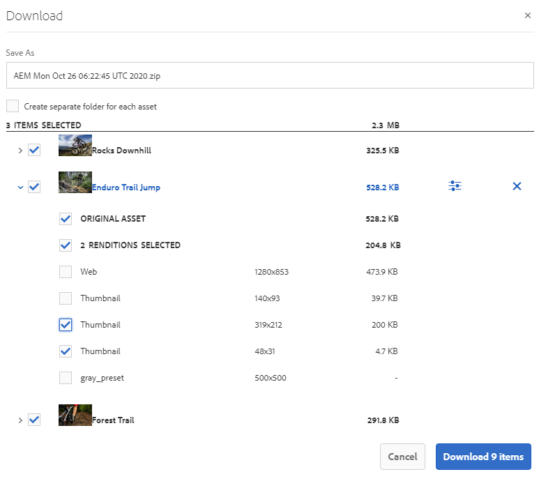

# 從品牌入口網站下載資產 {#download-assets-from-bp}

<!-- Before update in Download experience - 26th Aug 2020 comment by Vishabh.
 All users can simultaneously download multiple assets and folders accessible to them from Brand Portal. This way, approved brand assets can be securely distributed for offline use. Read on to know how to download approved assets from Brand Portal, and what to expect from the [download performance](../using/brand-portal-download-assets.md#main-pars-header).
-->

Adobe Experience Manager Assets Brand Portal可讓使用者同時下載多個資產和資料夾，讓他們從Brand Portal存取這些資產和資料夾，以增強下載體驗。 如此，就可安全地散發核准的品牌資產，以供離線使用。 閱讀以瞭解如何從品牌入口網站下載已核准的資產，以及從下載效能中預 [期的](../using/brand-portal-download-assets.md#expected-download-performance)。

>[!NOTE]
>
>在Brand Portal 2020.10.0（及更新版本）中，預設會啟用「 **[!UICONTROL Fast Download]** 」（快速下載）設定，此設定會使用IBM Aspera Connect來加速資產下載。 從Brand Portal下載資產前，請先在瀏覽器的擴充功能中安裝IBM Aspera Connect 3.9.9。 如需詳細資訊，請參 [閱指南以加速從品牌入口網站下載](../using/accelerated-download.md)。
>
>如果您不想使用IBM Aspera Connect並繼續正常的下載程式，請連絡品牌入口網站管理員以關閉「快速下 **[!UICONTROL 載]** 」設定。

## 設定資產下載 {#configure-download}

品牌入口網站管理員可以為品牌入口網站使用者設定資產下載設定和權限，讓他們能夠從品牌入口網站介面存取及下載資產轉譯。

從品牌入口網站存取和下載轉譯是由下列組態所定義：

* 啟用下載設定
* 設定下載權限

### 啟用下載設定 {#enable-download-settings}

管理員可以啟用資產下 **[!UICONTROL 載設定]** ，以定義品牌入口網站使用者可存取的轉譯集以供下載。

可用的設定包括：

* **[!UICONTROL 快速下載]**

   它使用IBM Aspera Connect來加速下載資產。 依預設，「下 **[!UICONTROL 載設定」中]** ，會啟用「快速 **[!UICONTROL 下載」設定]**。

* **[!UICONTROL 自訂轉譯]**

   可下載資產的自訂和（或）動態轉譯。

   除了原始資產和系統產生的轉譯以外，所有資產轉譯都稱為自訂轉譯。 它包含資產可用的靜態和動態轉譯。 任何使用者都可以在AEM Assets中建立自訂靜態轉譯，但只有AEM管理員可以建立自訂動態轉譯。 如需詳細資訊，請 [參閱如何套用影像預設集或動態轉譯](../using/brand-portal-image-presets.md)。

* **[!UICONTROL 系統轉譯]**

   啟用下載系統產生的資產轉譯。

   這些縮圖是根據「DAM更新資產」工作流程自動在AEM Assets中產生的。

以管理員身分登入您的品牌入口網站租戶，並導覽至「工 **[!UICONTROL 具]** >下 **[!UICONTROL 載]**」。

管理員可以為品牌入口網站使用者啟用任何組合的設定，以存取和下載轉譯。

>[!NOTE]
>
>只有管理員才能下載過期的資產。 如需過期資產的詳細資訊，請參 [閱「管理資產的數位權限」](../using/manage-digital-rights-of-assets.md)。

### 設定下載權限 {#configure-download-permissions}

除了「下載設 **[!UICONTROL 定」外]**，品牌入口網站管理員還可以進一步設定不同使用者群組的權限，以檢視和（或）下載原始資產及其轉譯。

以管理員身分登入您的品牌入口網站租戶，並導覽至「工 **[!UICONTROL 具]** >使 **[!UICONTROL 用者]**」。 在「使 **[!UICONTROL 用者角色]** 」頁面中，導覽至「群組 **** 」標籤，以設定使用者群組的檢視和（或）下載權限。

>[!NOTE]
>
>如果將使用者新增至多個群組，且其中一個群組有限制，則限制會套用至使用者。

根據此設定，單機資產、多個資產、包含資產的檔案夾、授權或未授權資產，以及使用共用連結下載資產的下載工作流程將維持不變。

下列矩陣會根據下載組態來定義使用者是否擁有轉譯 [的存取權](#configure-download):

| **下載設定：自訂轉譯** | **下載設定：系統轉譯** | **使用者群組權限：下載原稿** | **使用者群組權限：下載轉譯** | **結果** |
|---|---|---|---|---|
| 開啟 | 開啟 | 開啟 | 開啟 | 檢視並下載所有轉譯 |
| 開啟 | 開啟 | 關閉 | 關閉 | 檢視原始資產 |
| 關閉 | 關閉 | 開啟 | 開啟 | 檢視及下載原始資產 |
| 開啟 | 關閉 | 開啟 | 開啟 | 檢視並下載原始資產和自訂轉譯 |
| 關閉 | 開啟 | 開啟 | 開啟 | 檢視及下載原始資產和系統轉譯 |
| 開啟 | 關閉 | 關閉 | 關閉 | 檢視原始資產 |
| 關閉 | 開啟 | 關閉 | 關閉 | 檢視原始資產 |
| 關閉 | 關閉 | 關閉 | 開啟 | 檢視原始資產 |
| 關閉 | 關閉 | 開啟 | 關閉 | 檢視及下載原始資產 |
| 關閉 | 關閉 | 關閉 | 關閉 | 檢視原始資產 |

## 下載資產 {#download-assets}

品牌入口網站使用者可以從品牌入口網站介面下載多個資產、包含資產的檔案夾和系列。

>[!NOTE]
>
>如果您沒有存取或下載轉譯的權限，請連絡品牌入口網站管理員。

如果使用者擁有轉譯的存取權，則會提供使用者增強的「下 **[!UICONTROL 載]** 」對話方塊，其中包含下列功能：
* 在下載清單中檢視任何資產的所有可用轉譯。
* 排除下載不需要的資產轉譯。
* 只需按一下，即可將相同的轉譯集套用至所有類似的資產類型。
* 針對不同的資產類型套用不同的轉譯集。
* 為每個資產轉譯建立個別的檔案夾。
* 下載選取的資產及其轉譯。

>[!NOTE]
>
>只有在選 **[!UICONTROL 取要下載的資產，且「下載設定」中已啟用「自訂轉譯]** 」或「系統轉譯」時，才會顯示「下載 **[!UICONTROL 」對話方]**********&#x200B;塊。

### 下載資產的步驟 {#bulk-download}

以下是從品牌入口網站介面下載包含資產的資產或檔案夾的步驟：

1. 登入您的品牌入口網站租用戶。 依預設，「檔 **[!UICONTROL 案」檢視會開啟]** ，其中包含所有已發佈的資產和檔案夾。

   執行下列任一項作業：

   * 選取您要下載的資產或檔案夾。 從頂端的工具列，按一下「下 **[!UICONTROL 載]** 」圖示。

      

   * 若要下載資產的特定資產轉譯，請將指標暫留在資產上，然後按一下快速動作縮圖中 **[!UICONTROL 的]** 「下載」圖示。

      

      >[!NOTE]
      >
      >如果您是第一次下載資產，但瀏覽器中未安裝IBM Aspera Connect，則會提示您安裝Aspera下載加速器。

      >[!NOTE]
      >
      >如果您下載的資產也包含授權資產，則會將您重新導向至「版權 **[!UICONTROL 管理]** 」頁面。 在本頁中，選取資產，按一下「 **[!UICONTROL 同意]**」，然後按一下「 **[!UICONTROL 下載」]**。 如果您選擇不同意，則不會下載授權資產。
      > 
      >受授權保護的資產 [附加了授權合約](https://helpx.adobe.com/experience-manager/6-5/assets/using/drm.html#DigitalRightsManagementinAssets) ，這是透過在Experience Manager Assets中設定資產的 [中繼資料屬性](https://helpx.adobe.com/experience-manager/6-5/assets/using/drm.html#DigitalRightsManagementinAssets) 來完成的。

      

1. 「下 **[!UICONTROL 載]** 」對話方塊會開啟，其中列出所有選取的資產。

   按一下任何資產以檢視可用的轉譯，並選取與您要下載的轉譯對應的核取方塊。

   您可以手動選取或排除個別資產的轉譯，或按一下「套用 **** 」圖示，以選取相同的轉譯集，以供類似資產類型（此範例中的所有影像檔案）下載。 在「全 **[!UICONTROL 部套用]** 」對話方塊中，按一 **[!UICONTROL 下「完成]** 」，將規則套用至所有類似資產。

   

   您也可以按一下「移除」圖示，從下載清單中移除資產(如有需 **要** )。

   

   若要在下載資產時保留品牌入口網站檔案夾階層，請選取「為每個 **[!UICONTROL 資產建立個別檔案夾]** 」核取方塊。 依預設，會忽略「品牌入口網站」檔案夾階層，所有資產都會下載到zip檔案夾中。

   下載按鈕會反映所選項目的計數。 完成套用規則後，按一下「下 **[!UICONTROL 載項目」]**。

   

1. 依預設，「 **[!UICONTROL 下載設定]** 」中會啟用「快速 **[!UICONTROL 下載」設定]**。 因此，會出現確認方塊，允許使用IBM Aspera Connect加速下載。

   若要繼續使用「 **[!UICONTROL 快速下載]**」，請按 **[!UICONTROL 一下「允許」]**。 所有選取的轉譯都會使用IBM Aspera Connect下載到zip檔案夾中。

   如果您不想使用IBM Aspera Connect，請按一下「 **[!UICONTROL 拒絕]**」。 如果 **[!UICONTROL Fast Download]** （快速下載）被拒絕或失敗，系統會填入錯誤訊息。 按一下「 **[!UICONTROL 一般下載]** 」按鈕，繼續下載資產。 選取的轉譯會下載在zip檔案夾中，而不使用IBM Aspera Connect。

>[!NOTE]
>
>如果管 **[!UICONTROL 理員關閉了「快速下載]** 」設定，則選定的轉譯會直接下載到zip檔案夾中，而不使用IBM Aspera Connect。

>[!NOTE]
>
>如果選取了超過20個資產供下載，則會略過「 **[!UICONTROL Download]** 」（下載）對話方塊，而使用者可存取的所有轉譯（不包括動態轉譯）都會直接下載到Zip檔案夾中。
>
>下載包含資產和系列的檔案夾時，會遵循相同的行為。 可存取的轉譯（不包括動態轉譯）會直接下載在zip檔案夾中。

>[!NOTE]
>
>品牌入口網站支援在混合與場景7模式中設定動態媒體。
>
>(如&#x200B;*果AEM作者例項是在&#x200B;**Dynamic Media Hybrid模式上執行***)
>
>若要預覽或下載資產的動態轉譯，請確定已啟用動態媒體，且資產的Pyramidtiff轉譯存在於AEM Assets作者例項中，該資產是從該例項發佈的。 當資產從AEM發佈至品牌入口網站時，也會發佈其Pyramid tiff轉譯。

如果管理員未授 [權您存取原始轉譯](../using/brand-portal-adding-users.md#main-pars-procedure-202029708)，則不會下載所選資產的原始轉譯。

<!-- This issue has been resolved, check with engineering.
>[!NOTE]
>
>Once you have downloaded the asset renditions, the **[!UICONTROL Download]** button is disabled to avoid creating duplicate copies of the renditions. To download more (missing or another copy of renditions), refresh the browser to re-enable the download button.
-->

### 從資產詳細資訊頁面下載資產 {#download-assets-from-asset-details-page}

除了下載工作流程外，還有另一種方法可直接從資產詳細資料頁面下載個別資產的轉譯。

使用者可以預覽不同的轉譯、選取特定的轉譯，並直接從資產詳細資訊頁面的「轉譯」面板下載它們，而不需開啟「下 **[!UICONTROL 載]****** 」對話方塊。

以下是從資產詳細資料頁面下載資產轉譯的步驟：

1. 登入您的品牌入口網站租用戶，然後按一下資產以開啟資產詳細資訊頁面。
1. 按一下左側的覆蓋圖示，然後按一下「轉 **[!UICONTROL 譯」]**。

   

1. 「轉 **[!UICONTROL 譯]** 」面板會根據資產下載設定列出所有可存取的 [資產轉譯](#configure-download)。

   選取您要下載的特定轉譯，然後按一下「下 **[!UICONTROL 載項目」]**。

   

1. 依預設，「 **[!UICONTROL 下載設定]** 」中會啟用「快速 **[!UICONTROL 下載」設定]**。 因此，會出現確認方塊，允許使用IBM Aspera Connect加速下載。

   若要繼續使用「 **[!UICONTROL 快速下載]**」，請按 **[!UICONTROL 一下「允許」]**。 所有選取的轉譯都會使用IBM Aspera Connect下載到zip檔案夾中。

   如果您使用「快速下 **[!UICONTROL 載」拒絕]**，系統會填入「錯誤」訊息。 按一下「 **[!UICONTROL 正常下載]** 」按鈕以繼續下載。 選取的轉譯會下載在zip檔案夾中，而不使用IBM Aspera Connect。

>[!NOTE]
>
>如果管 **[!UICONTROL 理員關閉了「快速下載]** 」設定，則選定的轉譯會直接下載到zip檔案夾中，而不使用IBM Aspera Connect。

>[!NOTE]
>
>個別下載的資產會顯示在資產下載報表中。 不過，如果下載了包含資產的檔案夾，該檔案夾和資產不會顯示在資產下載報表中。

<!--
>[!NOTE]
>
>Assets that are individually downloaded are visible in the assets download report. However, if a folder containing assets is downloaded, the folder and assets are not displayed in the assets download report.
-->

<!-- Backup of content before updating the new feature docs.
## Configure asset download {#configure-download}

The download configuration allows the Brand Portal administrators to define the set of renditions available to the Brand Portal users for downloading the assets. The administrator can configure the asset **[!UICONTROL Download]** settings from the Brand Portal interface. 

The available configurations are:

* **[!UICONTROL Fast Download]** 

  Enables high-speed download of the assets. To know more, see [guide to accelerate downloads from Brand Portal](../using/accelerated-download.md).

* **[!UICONTROL Custom Renditions]** 
  
  Download custom and (or) dynamic renditions of the assets. 
  All the asset renditions other than the original asset and system-generated renditions are called as custom renditions. It includes static as well as dynamic renditions available for the asset. Any user can create a custom static rendition in AEM Assets, whereas, only the AEM administrator can create custom dynamic renditions. To know more, see [how to apply image presets or dynamic renditions](../using/brand-portal-image-presets.md)

* **[!UICONTROL System Renditions]** 

  Download system-generated renditions of the assets. These are the thumbnails which are automatically generated in AEM Assets based on the "DAM update asset" workflow. 

Log in to your Brand Portal tenant as an administrator and navigate to **[!UICONTROL Tools]** > **[!UICONTROL Download]**. By default, the **[!UICONTROL Fast Download]** configuration is enabled in the **[!UICONTROL Download Settings]**. 

The administrators can enable any combination to configure the asset download process.

Based on the configuration, the download workflow remains constant for stand-alone assets, multiple assets, folders containing assets, licensed or unlicensed assets, and downloading assets using share link. 

* If both **[!UICONTROL Custom Renditions]** and **[!UICONTROL System Renditions]** configurations are turned-off, the original renditions of the assets are downloaded without any additional dialog being presented to the users.    

* If any of the **[!UICONTROL Custom Renditions]** or **[!UICONTROL System Renditions]** configuration is enabled, an additional **[!UICONTROL Download]** dialog box appears wherein you can choose whether to download the original asset along with its renditions, or download only specific renditions. 

>[!NOTE]
>
>Only the administrators can download the expired assets. For more information about expired assets, see [manage digital rights of assets](../using/manage-digital-rights-of-assets.md).

## Steps to download assets {#steps-to-download-assets}

Following are the steps to download assets or folders containing assets from Brand Portal:

1. From the Brand Portal interface, do one of the following:

   * Select the folders or assets you want to download. From the toolbar at the top, click the **[!UICONTROL Download]** icon.

     

   * To download a specific asset or folder, hover the pointer over the asset or folder and click the **[!UICONTROL Download]** icon available in the quick action thumbnails.

     

     >[!NOTE]
     >
     >If you are downloading the assets for the first time and do not have IBM Aspera Connect installed in your browser, it will prompt you to install the Aspera download accelerator. 

     >[!NOTE]
     >
     >If the assets you are downloading also include licensed assets, you are redirected to the **[!UICONTROL Copyright Management]** page. In this page, select the assets, click **[!UICONTROL Agree]**, and then click **[!UICONTROL Download]**. If you choose to disagree, licensed assets are not downloaded. 
     > 
     >License-protected assets have [license agreement attached](https://helpx.adobe.com/experience-manager/6-5/assets/using/drm.html#DigitalRightsManagementinAssets) to them, which is done by setting asset's [metadata property](https://helpx.adobe.com/experience-manager/6-5/assets/using/drm.html#DigitalRightsManagementinAssets) in Experience Manager Assets.

     

     
     >[!NOTE]
     >
     >Ensure to select all the required asset renditions while downloading them from the asset details page, and click **[!UICONTROL Download]**. The selected renditions are downloaded to your local machine.
     > 
     >Once you download, the **[!UICONTROL Download]** button is disabled to avoid creating duplicate copies of the downloaded renditions. To download more (missing or another copy of renditions), refresh the browser to re-enable the download button.

     If any of the **[!UICONTROL Custom Renditions]** or **[!UICONTROL System Renditions]** configuration is enabled in the **[!UICONTROL Download Settings]**, the **[!UICONTROL Download]** dialog appears with the **[!UICONTROL Asset(s)]** check box selected by default. If the **[!UICONTROL Fast Download]** configuration is enabled, the **[!UICONTROL Enable download acceleration]** check box is selected by default.

     

     >[!NOTE]
     >
     >If the downloading assets are image files, and you select only the **[!UICONTROL Asset(s)]** check box in the **[!UICONTROL Download]** dialog but are not [authorized by the administrator to have access to the original renditions of image files](../using/brand-portal-adding-users.md#main-pars-procedure-202029708) then no image files are downloaded and a notification appears, stating that you have been restricted by the administrator to access original renditions.

     

1. To download the renditions in addition to the original assets, select the **[!UICONTROL Rendition(s)]** check box. However, if you want to download the system-generated renditions along with the custom renditions, clear the **[!UICONTROL Exclude System Renditions]** check box.

   

   * To download only the renditions, clear the **[!UICONTROL Asset(s)]** check box.

     >[!NOTE]
     >
     >By default, only the assets are downloaded. However, original renditions of image files are not downloaded if you are not [authorized by the administrator to have access to the original renditions of image files](../using/brand-portal-adding-users.md#main-pars-procedure-202029708).

    * To share the selected assets with other users through a link, select the **[!UICONTROL Email]** check box. An email notification is sent to the users with the download link. To know how to download assets from shared links, see [downloading assets from shared links](../using/brand-portal-link-share.md#main-pars-header-1703469193).  

      

      >[!NOTE]
      >
      >The download link on email notification expires after 45 days.
      >
      >The administrators can customize email messages, that is, logo, description, and footer, using the [Branding](../using/brand-portal-branding.md) feature.

    * You can select a predefined image preset or create a custom dynamic rendition from the **[!UICONTROL Download]** dialog box. 

      To apply a [custom image preset to the asset and its renditions](../using/brand-portal-image-presets.md#applyimagepresetswhendownloadingimages), select the **[!UICONTROL Dynamic Rendition(s)]** check box. Specify the image preset properties (such as size, format, color space, resolution, and image modifier) to apply the custom image preset while downloading the asset and its renditions. To download only the dynamic renditions, clear the **[!UICONTROL Asset(s)]** check box.

      

      >[!NOTE]
      >
      >Brand Portal supports configuring Dynamic Media in both - Hybird and Scene 7 mode. 
      >
      >(*If AEM author instance is running on **Dynamic Media Hybrid mode***)
      >
      >To preview or download dynamic renditions of an asset, ensure that the dynamic media is enabled and the asset's Pyramid tiff rendition exists at the AEM Assets author instance from where the assets have been published. When an asset is published to Brand Portal, its Pyramid tiff rendition is also published.
      
  
    * To preserve the Brand Portal folder hierarchy while downloading assets, select the **[!UICONTROL Create separate folder for each asset]** check box. By default, the Brand Portal folder hierarchy is ignored and all the assets are downloaded in one folder in your local system.

1. Click **[!UICONTROL Download]**.

   The assets (and renditions if selected) are downloaded as a zip file to your local folder. However, no zip file is created if a single asset is downloaded without any of the renditions. 

   If you are not [authorized by the administrator to have access to the original renditions](../using/brand-portal-adding-users.md#main-pars-procedure-202029708), the original renditions of the selected assets are not downloaded. 

   >[!NOTE]
   >
   >Assets that are individually downloaded are visible in the assets download report. However, if a folder containing assets is downloaded, the folder and assets are not displayed in the assets download report.
-->

## 預期的下載效能 {#expected-download-performance}

不同用戶端位置的使用者檔案下載體驗可能會因本端網際網路連線和伺服器延遲等因素而有所不同。 在美國俄勒岡州的Brand Portal伺服器上，在不同用戶端位置觀察到的2-GB檔案的預期下載效能如下：

| 用戶端位置 | 客戶端和伺服器之間的延遲 | 預期的下載速度 | 下載2-GB檔案所花的時間 |
|-------------------------|-----------------------------------|-------------------------|------------------------------------|
| 美國西部（北美）加州) | 18毫秒 | 7.68 MB/秒 | 4分鐘 |
| 美國西部（俄勒岡） | 42毫秒 | 3.84 MB/秒 | 9分鐘 |
| 美國東部(N.維吉尼亞) | 85毫秒 | 1.61 MB/秒 | 21分鐘 |
| 亞太地區（東京） | 124毫秒 | 1.13 MB/秒 | 30 分鐘 |
| 努瓦達 | 275毫秒 | 0.5 MB/秒 | 68分鐘 |
| 雪梨 | 175毫秒 | 0.49 MB/秒 | 69分鐘 |
| 倫敦 | 179毫秒 | 0.32 MB/秒 | 106分鐘 |
| 新加坡 | 196毫秒 | 0.5 MB/秒 | 68分鐘 |

>[!NOTE]
>
>引用的資料是在測試條件下觀察到的，不同位置的使用者會看到不同的延遲和頻寬。

