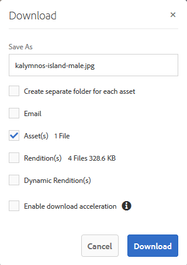
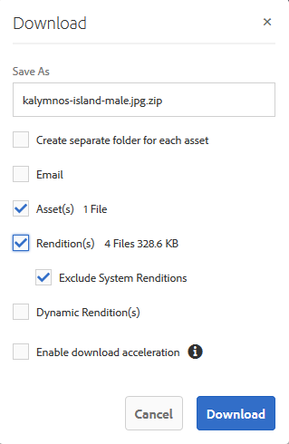

# 下載資產 {#download-assets}

所有使用者可同時從品牌入口網站下載多個資產和資料夾。如此，就可在離線使用時安全地發佈已核准的品牌資產。瞭解如何從品牌入口網站下載已核准資產，以及從 [下載效能中獲得哪些期待](../using/brand-portal-download-users.md#main-pars-header)。

>[!NOTE]
>
>只有管理員可以下載過期的資產。如需過期資產的詳細資訊，請參閱 [管理資產數位權利](../using/manage-digital-rights-of-assets.md)。

## 下載資產的步驟 {#steps-to-download-assets}

若要下載包含品牌入口網站資產的資產或資料夾，請依照下列步驟執行：

1. 從品牌入口網站介面，執行下列其中一項作業：

   * 選取您要下載的資料夾或資產。從頂端的工具列，按一下 **[!UICONTROL 「下載]** 」圖示。
   

   * 若要下載單一資料夾或資產，請將指標暫留在資料夾或資產上。從可用的快速動作縮圖中，按一下 **[!UICONTROL 「下載]** 」圖示。
   

   >[!NOTE]
   >
   >如果您下載的資產也包含授權資產，則會重新導向 **[!UICONTROL 至「版權管理]** 」頁面。在此頁面中，選取資產，按一下 **[!UICONTROL 「同意」]**，然後按一下 **[!UICONTROL 「下載]**」。如果您選擇不同意，則不會下載授權資產。\
   >受授權保護的資產具有 [附加的授權合約，可透過在AEM](https://helpx.adobe.com/experience-manager/6-5/assets/using/drm.html#DigitalRightsManagementinAssets) Assets中設定資產 [中繼資料屬性](https://helpx.adobe.com/experience-manager/6-5/assets/using/drm.html#DigitalRightsManagementinAssets) 來完成。

   

   「 **[!UICONTROL 下載」]** 對話方塊會出現，預設為選取 **[!UICONTROL 的資產]** 選項。

   

   >[!NOTE]
   >
   >如果您下載的資產是影像檔案，而您只選取「下載」對話方塊中 **[!UICONTROL 的「資產」]** 選項，但管理員 [未授權存取原始影像檔案](../using/brand-portal-adding-users.md#main-pars-procedure-202029708) ，則不會下載影像檔案，並通知您已受到管理員限制，指出您已受到管理員存取原始轉譯的限制。

   

2. 若要下載資產以外的資產，請選取 **[!UICONTROL 轉譯]**。不過，若要允許自動產生的轉譯連同自訂轉譯一起下載，請取消選取 **[!UICONTROL 「排除自動產生的轉譯]**」，預設為選取。

   

   若要僅下載轉譯，請取消選取 **[!UICONTROL 資產]**。

   >[!NOTE]
   >
   >依預設，僅下載資產。不過，如果管理員 [無權存取影像檔案的原始轉譯，則不會下載影像檔案的原始轉譯](../using/brand-portal-adding-users.md#main-pars-procedure-202029708)。

   * 若要加快從品牌入口網站下載資產檔案的速度，請選取 **[!UICONTROL 「啓用下載加速]** 選項」並 [遵循精靈](../using/accelerated-download.md#main-pars-header-405749062)。若要更快速地下載資產，請參閱 [指南，以加速從品牌入口網站下載的速度](../using/accelerated-download.md)。

   * 若要套用 [自訂影像預設集至資產及其轉譯](../using/brand-portal-image-presets.md#applyimagepresetswhendownloadingimages)，請選取 **[!UICONTROL 「動態轉譯]**」。指定自訂影像預設集屬性(大小、格式、顏色空間、解析度和影像修飾元)，以便在下載資產及其轉譯時套用自訂影像預設集。若要僅下載動態轉譯，請刪除 **[!UICONTROL 資產]**。
   

   >[!NOTE]
   >
   >若要預覽(或下載)任何資產的動態轉譯，請確定動態媒體已啓用，且資產的Blaid tiff轉譯存在於AEM作者實例中，來源是資產已發佈。當資產發佈至品牌入口網站時，也會發佈其Mercurid tiff轉譯。無法從品牌入口網站產生SocialMiddle偽造轉譯。

   * 若要在下載資產時保留品牌入口網站階層階層，請選取 **[!UICONTROL 為每個資產建立個別資料夾]**。依預設，品牌入口網站資料夾階層會被忽略，所有資產都會下載在本機系統的一個資料夾中。

   * 若要傳送電子郵件通知給使用者下載資產的連結，請選取 **[!UICONTROL 電子郵件]**。
   

   >[!NOTE]
   >
   >電子郵件通知的下載連結會在45天後過期。
   >
   >管理員可以使用 [品牌](../using/brand-portal-branding.md) 功能來自訂電子郵件訊息，包括標誌、描述和頁尾。

3. 按一下 **[!UICONTROL 「下載]**」。

   資產(若選取的話)會下載為ZIP檔案至您的本機資料夾。不過，如果下載單一資產而不使用任何轉譯，則不會建立郵遞區號，因此可確保快速下載。

   如果管理員 [無權存取原始轉譯](../using/brand-portal-adding-users.md#main-pars-procedure-202029708)，則無法下載所選資產的原始轉譯。

   >[!NOTE]
   >
   >個別選取並下載的資產會顯示在下載的資產報表中。不過，如果下載包含資產的資料夾，資料夾或資產都不會顯示在下載的報告中。

   若要瞭解如何從共用連結下載資產，請參閱 [從共用連結下載資產](../using/brand-portal-link-share.md#main-pars-header-1703469193)。

## 預期下載效能 {#expected-download-performance}

不同用戶端位置的使用者下載體驗可能會有所不同，例如當地網路連線和伺服器延遲等因素。在不同用戶端位置觀察到2GB檔案的預期下載效能如下：美國奧勒崗的品牌入口網站伺服器：

| 用戶端位置 | 用戶端與伺服器之間的延遲 | 預期下載速度 | 下載2GB檔案所花的時間 |
|-------------------------|-----------------------------------|-------------------------|------------------------------------|
| 美國西部(N. California) | 18毫秒 | 7.68MB/s | 分鐘 |
| 美國西部(Oregon) | 42毫秒 | 3.84MB/s | 分鐘 |
| 美國東部(N. Virginia) | 85毫秒 | 1.61MB/s | 21分鐘 |
| 亞太地區(東京) | 124毫秒 | 1.13MB/s | 30 分鐘 |
| Noida | 275毫秒 | 0.5MB/s | 68分鐘 |
| 雪梨 | 175毫秒 | 0.49MB/s | 69分鐘 |
| 倫敦 | 179毫秒 | 0.32MB/s | 106分鐘 |
| 新加坡 | 196毫秒 | 0.5MB/s | 68分鐘 |

**注意**：在測試條件下觀察到引用的資料，可能會因不同位置的使用者延遲延遲和頻寬而不同。
