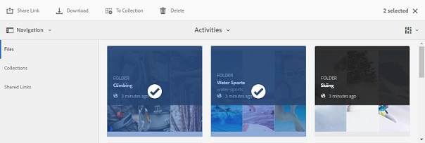

# 下載資產 {#download-assets}

所有使用者都可同時下載多個資產和資料夾，以便從品牌入口網站存取。 如此，就可安全地散發核准的品牌資產，以供離線使用。 閱讀以瞭解如何從品牌入口網站下載已核准的資產，以及從下載效能中預 [期的](../using/brand-portal-download-users.md#main-pars-header)。

>[!NOTE]
>
>只有管理員才能下載過期的資產。 如需過期資產的詳細資訊，請參 [閱管理資產的數位權限](../using/manage-digital-rights-of-assets.md)。

## 下載資產的步驟 {#steps-to-download-assets}

若要下載包含品牌入口網站資產的資產或檔案夾，請遵循下列步驟：

1. 從品牌入口網站介面，執行下列其中一項作業：

   * 選取您要下載的檔案夾或資產。 從頂端的工具列，按一下「下 **[!UICONTROL 載]** 」圖示。
   

   * 若要下載單一資料夾或資產，請將指標暫留在資料夾或資產上。 從可用的快速動作縮圖中，按一下「下 **[!UICONTROL 載]** 」圖示。
   

   >[!NOTE]
   >
   >如果您下載的資產也包含授權資產，則會將您重新導向至「版權 **[!UICONTROL 管理]** 」頁面。 在本頁中，選取資產，按一下「 **[!UICONTROL 同意]**」，然後按一下「 **[!UICONTROL 下載」]**。 如果您選擇不同意，則不會下載授權資產。\
   >受授權保護的資產 [會附加授權合約](https://helpx.adobe.com/experience-manager/6-5/assets/using/drm.html#DigitalRightsManagementinAssets) ，這是透過在AEM Assets中設定資產的 [中繼資料屬性](https://helpx.adobe.com/experience-manager/6-5/assets/using/drm.html#DigitalRightsManagementinAssets) 來完成。

   

   此時 **[!UICONTROL 會出現]** 「下載」對話方 **[!UICONTROL 塊，預設會選取「資產]** 」選項。

   

   >[!NOTE]
   >
   >如果您下載的資產是影像檔案，而您只在「下載」對話方塊中選取「資產」選項，但管理員未授權 **[!UICONTROL Assets]** (s)  ，無法存取影像檔案的原始轉譯，則不會下載影像檔案，並出現「通知」提示，指出管理員已限制您存取原始轉譯。

   

2. 若要下載資產的轉譯，除了資產，請選取「轉 **[!UICONTROL 譯」]**。 不過，若要允許自動產生的轉譯與自訂轉譯一起下載，請取消選取「排除自動產生的轉譯 ****」（預設為選取）。

   

   若要僅下載轉譯，請取消 **[!UICONTROL 選取「資產」]**。

   >[!NOTE]
   >
   >依預設，只會下載資產。 但是，如果管理員未授權您存取影像檔的原 [始轉譯，則不會下載影像檔的原始轉譯](../using/brand-portal-adding-users.md#main-pars-procedure-202029708)。

   * 若要加速從品牌入口網站下載資產檔案，請選取「啟用下載 **[!UICONTROL 加速]** 」選項， [然後遵循精靈](../using/accelerated-download.md#main-pars-header-405749062)。 若要進一步瞭解如何更快速下載資產，請參 [閱指南以加速從品牌入口網站的下載](../using/accelerated-download.md)。

   * 若要將自訂 [影像預設集套用至資產及其轉譯](../using/brand-portal-image-presets.md#applyimagepresetswhendownloadingimages)，請選 **[!UICONTROL 取「動態轉譯」]**。 指定自訂影像預設集屬性（大小、格式、色域、解析度和影像修飾元），以便在下載資產及其轉譯時套用自訂影像預設集。 若要僅下載動態轉譯，請 **[!UICONTROL 刪除資產]**。
   

   >[!NOTE]
   >
   >若要預覽（或下載）任何資產的動態轉譯，請確定動態媒體已啟用，且資產的Pyramid tiff轉譯存在於AEM作者例項中，資產是從何處發佈的。 當資產發佈至品牌入口網站時，也會發佈其金字塔轉譯。 無法從品牌入口網站產生金字塔型Tiff轉譯。

   * 若要在下載資產時保留品牌入口網站檔案夾階層，請為每 **[!UICONTROL 個資產選取「建立個別檔案夾」]**。 依預設，會忽略品牌入口網站資料夾階層，所有資產都會下載到您本機系統的一個資料夾中。

   * 若要傳送電子郵件通知給具有下載資產連結的使用者，請選取「電子 **[!UICONTROL 郵件]**」。
   

   >[!NOTE]
   >
   >電子郵件通知的下載連結會在45天後過期。
   >
   >管理員可使用品牌功能自訂電子郵件訊息，即標誌、說明 [和頁尾](../using/brand-portal-branding.md) 。

3. 按一 **[!UICONTROL 下下載]**。

   資產（若已選取，則轉譯）會下載為ZIP檔案至您的本機資料夾。 不過，如果下載單一資產而未包含任何轉譯，則不會建立任何zip檔案，因此可確保快速下載。

   如果管理員未授權您存取原始轉譯，則不會下 [載所選資產的原始轉譯](../using/brand-portal-adding-users.md#main-pars-procedure-202029708)。

   >[!NOTE]
   >
   >個別選取和下載的資產會顯示在已下載的資產報表中。 不過，如果下載包含資產的檔案夾，則該檔案夾和資產都不會顯示在下載的資產報表中。

   若要瞭解如何從共用連結下載資產，請參閱從 [共用連結下載資產](../using/brand-portal-link-share.md#main-pars-header-1703469193)。

## 預期的下載效能 {#expected-download-performance}

不同用戶端位置的使用者檔案下載體驗可能會因本端網際網路連線和伺服器延遲等因素而有所不同。 在美國俄勒岡州的Brand Portal伺服器上，在不同用戶端位置觀察到的2 GB檔案預期下載效能如下：

| 用戶端位置 | 客戶端和伺服器之間的延遲 | 預期的下載速度 | 下載2 GB檔案所花的時間 |
|-------------------------|-----------------------------------|-------------------------|------------------------------------|
| 美國西部（北美）加州) | 18毫秒 | 7.68 MB/秒 | 4分鐘 |
| 美國西部（俄勒岡） | 42毫秒 | 3.84 MB/秒 | 9分鐘 |
| 美國東部(N.維吉尼亞) | 85毫秒 | 1.61 MB/秒 | 21分鐘 |
| 亞太地區（東京） | 124毫秒 | 1.13 MB/秒 | 30 分鐘 |
| 努瓦達 | 275毫秒 | 0.5 MB/秒 | 68分鐘 |
| 雪梨 | 175毫秒 | 0.49 MB/秒 | 69分鐘 |
| 倫敦 | 179毫秒 | 0.32 MB/秒 | 106分鐘 |
| 新加坡 | 196毫秒 | 0.5 MB/秒 | 68分鐘 |

**注意**:引用的資料是在測試條件下觀察到的，不同位置的使用者會看到不同的延遲和頻寬。
