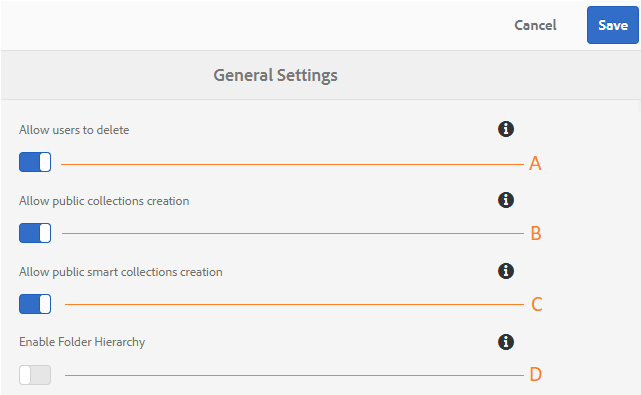

# 管理一般租用戶組態 {#administer-general-tenant-configurations}

AEM Assets Brand Portal可讓組織為特定租用戶設定下列功能：

* 管理員刪除資產
* 非管理員使用者建立公用集合
* 非管理員使用者建立公用智慧型集合
* 非管理員使用者可看見的共用資料夾的上層階層

這些設定已作為「管理工具」面板上的「一般設定」提供。****

****   設定，允許管理員從Brand Portal中刪除資產。（預設為啟用）

****   BConfiguration允許非管理員使用者建立公用集合。（預設為啟用）

****   設定，允許非管理員使用者建立公用智慧型集合。（預設為啟用）

****  DConfiguration（從根目錄）向非管理員使用者（編輯者、檢視者、訪客使用者）顯示共用資料夾階層。（預設為停用）

## 啟用/停用一般配置 {#enable-disable-general-configurations}

要啟用/禁用以下每種配置：

1. 以管理員權限登入。
1. 從頂端的工具列選取AEM標誌以存取管理工具。
1. 從管理工具面板中，選擇&#x200B;**[!UICONTROL 常規]**&#x200B;以開啟&#x200B;**[!UICONTROL 常規設定]**&#x200B;頁。
1. 使用相應的切換開關來啟用/禁用任何常規配置。
1. **[!UICONTROL 儲存變更。]**
1. 登出以讓變更生效。

## 允許管理員使用者從Brand Portal刪除資產 {#allow-admin-users-to-delete-assets-from-brand-portal}

**[!UICONTROL 允許使用者刪]** 除設定，可讓組織允許（或限制）具有管理員權限的使用者從Brand Portal刪除資產和資料夾。

## 允許非管理員建立公用集合 {#allow-public-collections-creation-by-non-admins}

[[!UICONTROL 允許公用集]](../using/brand-portal-share-collection.md#main-pars-text-1915052376) 合建立設定控制非管理員是否可以在Brand Portal上建立公用集合。預設會啟用設定。 禁用配置組織可以防止其門戶上有許多公共集合，從而可以保存系統空間。

## 允許非管理員建立公用智慧型集合 {#allow-public-smart-collections-creation-by-non-admins}

[[!UICONTROL 允許公用智慧型集]](../using/brand-portal-searching.md#main-pars-header-500620467) 合建立組態會控制非管理員是否可將其搜尋儲存為智慧型集合，並將其設為該租用戶的公用。預設會啟用設定。 停用設定可防止組織的Brand Portal上有大量非管理員使用者建立的公用智慧型集合。

<!-- 
## Allow download acceleration {#allow-download-acceleration}

[[!UICONTROL Allow download acceleration]](../using/accelerated-download.md) configuration lets the organizations to allow accelerated downloads of assets from Brand Portal and shared links, by integrating with IBM Aspera Connect that is an install-on-demand application. The application uses proprietary technology to remove TCP overheads.
-->

## 啟用資料夾階層 {#enable-folder-hierarchy}

[[!UICONTROL 「啟用資]](../using/brand-portal-sharing-folders.md#non-admin-user-access-to-shared-folders) 料夾層次結構」配置允許管理員控制非管理員用戶（編輯者、查看者和來賓用戶）在登錄後如何查看共用資料夾。
