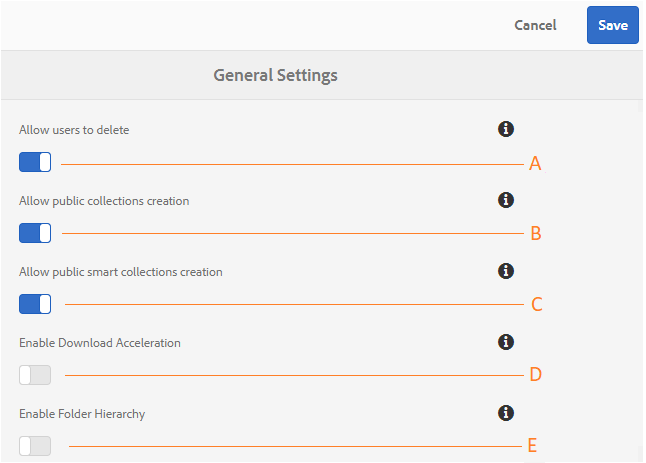

# 管理一般租用戶組態 {#administer-general-tenant-configurations}

AEM Assets Brand Portal可讓組織為特定租戶設定下列功能：

* 管理員刪除資產
* 非管理員使用者建立公開系列
* 非管理員使用者建立公用智慧型系列
* 下載加速
* 非管理員使用者可看見共用資料夾的上層階層

這些配置已作為「一般設 **[!UICONTROL 置」配置在管理工具面板上提供]** 。

**A** Configuration，允許管理員從品牌入口網站刪除資產。 （預設為啟用）

**B** 「設定」，允許非管理員使用者建立公用系列。 （預設為啟用）

**C** Configuration允許非管理員使用者建立公用智慧型系列。 （預設為啟用）

**D** Configuration：允許下載從入口網站和共用連結下載的資產的加速。 （預設為停用）

**E** Configuration（E配置），向非管理員用戶（編輯者、檢視者、來賓用戶）顯示共用資料夾的資料夾層次結構（從根目錄）。 （預設為停用）

## 啟用／禁用常規配置 {#enable-disable-general-configurations}

要啟用／禁用這些配置，請執行以下操作：

1. 以管理員權限登入。
2. 從頂端的工具列選取AEM標誌以存取管理工具。
3. 從管理工具面板中，選擇「 **[!UICONTROL 一般]** 」以開啟「 **** 一般設定」頁。
4. 使用相應的切換開關來啟用／禁用任何常規配置。
5. **[!UICONTROL 保存]** 更改。
6. 註銷，使更改生效。

## 允許管理員使用者從品牌入口網站刪除資產 {#allow-admin-users-to-delete-assets-from-brand-portal}

**[!UICONTROL 允許使用者刪除]** 設定可讓組織允許（或限制）具有管理員權限的使用者從品牌入口網站刪除資產和資料夾。

## 允許非管理員建立公開系列 {#allow-public-collections-creation-by-non-admins}

[[!UICONCONTROL允許建立公共系列]](../using/brand-portal-share-collection.md#main-pars-text-1915052376) 配置控制非管理員是否可以在品牌入口網站上建立公共系列。 預設會啟用設定。 停用組態可防止其入口網站上有許多公用系列，以儲存系統空間。

## 允許非管理員建立公用智慧型系列 {#allow-public-smart-collections-creation-by-non-admins}

[[!UICONTROL允許建立公共智慧系列]](../using/brand-portal-searching.md#main-pars-header-500620467) 配置控制非管理員是否可以將其搜索保存為智慧系列，並為該租用戶公開。 預設會啟用設定。 停用設定可防止組織的品牌入口網站上有大量由非管理員使用者建立的公開智慧型系列。

## 允許下載加速 {#allow-download-acceleration}

[[!UICONTROL允許下載加速]](../using/accelerated-download.md) Configuration允許組織透過與IBM Aspera Connect（隨選安裝應用程式）整合，加速從Brand Portal和共用連結下載資產。 該應用程式使用專有技術來消除TCP開銷。

## 啟用資料夾階層 {#enable-folder-hierarchy}

[[!UICONCONTROL啟用資料夾層次結構]](../using/brand-portal-sharing-folders.md#non-admin-user-access-to-shared-folders) 配置允許管理員控制非管理員用戶（編輯者、查看者和來賓用戶）在登錄後查看共用資料夾的方式。
