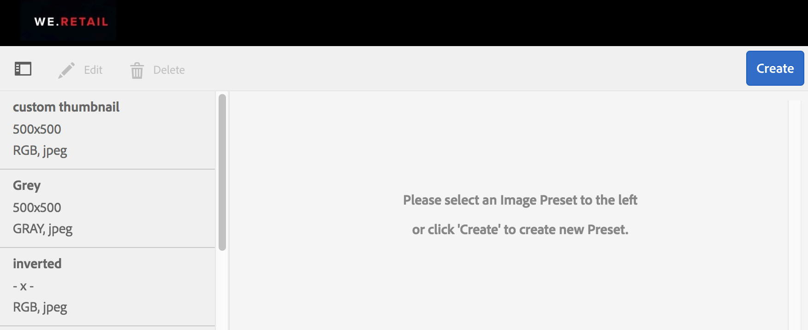
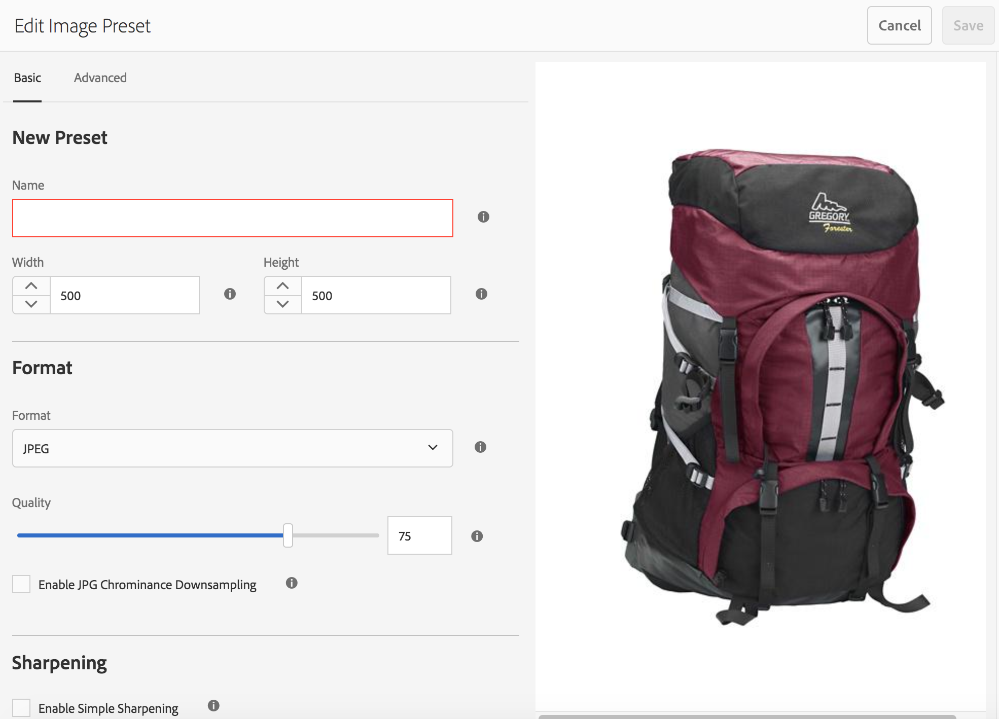
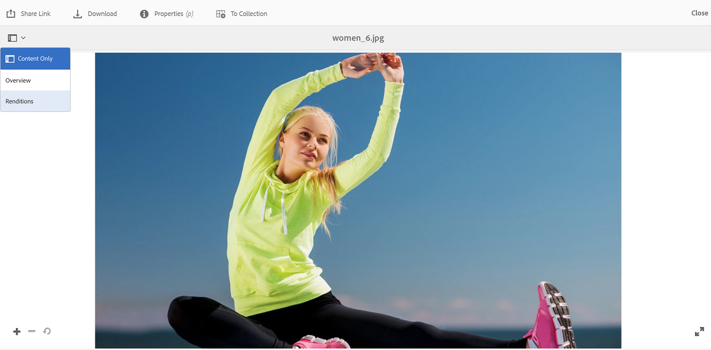
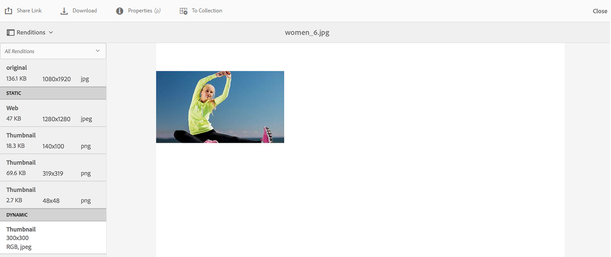
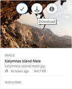
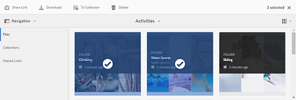
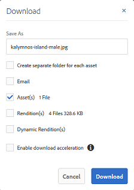
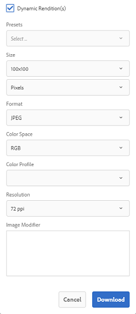

# 套用影像預設集或動態轉譯 {#apply-image-presets-or-dynamic-renditions}

像宏一樣，影像預設是以名稱保存的大小和格式命令的預定義集合。 影像預設使Experience Manager AssetsBrand Portal能夠動態地提供不同大小、格式和屬性的影像。

影像預設用於生成可預覽和下載的影像的動態呈現形式。 預覽影像及其格式副本時，您可以選擇一個預設來根據管理員設定的規範重新格式化影像。

(*如果Experience Manager Assets作者實例正在運行&#x200B;**Dynamic Media混合模式***)要查看Brand Portal中某資產的動態呈現形式，請確保其「金字塔」格式副本存在於您發佈到Brand Portal的Experience Manager Assets作者實例中。 發佈資產時，其PTIFF格式副本也會發佈到Brand Portal。

>[!NOTE]
>
>下載影像及其格式副本時，無法從現有預設中進行選擇。 相反，您可以指定自定義影像預設的屬性。 有關詳細資訊，請參見 [下載影像時應用影像預設](../using/brand-portal-image-presets.md#main-pars-text-1403412644)。

有關建立影像預設時所需參數的詳細資訊，請參見 [管理影像預設](../using/brand-portal-image-presets.md)。

## 建立影像預設 {#create-an-image-preset}

Experience Manager Assets管理員可以建立影像預設，這些預設在資產詳細資訊頁面上顯示為動態格式副本。 您可以從頭建立影像預設，或使用新名稱保存現有影像預設。 建立影像預設時，請選擇影像傳送的大小和格式命令。 當影像被遞送以供觀看時，其外觀根據所選擇的命令被優化。

>[!NOTE]
>
>使用影像的金字塔TIFF建立影像的動態格式副本。 如果金字塔TIFF不可用於任何資產，則無法在品牌門戶中提取該資產的動態格式副本。
>
>如果Experience Manager Assets作者實例正在運行 **Dynamic Media混合模式**，然後建立影像資產的金字塔TIFF格式副本並將其保存在Experience Manager Assets儲存庫中。
>
>但是，如果Experience Manager Assets的作者實例 **Dynamic Media場景7模式**，則影像資產的金字塔TIFF格式副本存在於場景7伺服器上。
>
>將這些資產發佈到品牌門戶時，將應用影像預設並顯示動態格式副本。

1. 在頂部的工具欄中，按一下Experience Manager徽標以訪問管理工具。

1. 在管理工具面板中，按一下 **[!UICONTROL 影像預設]**。

   

1. 在影像預設頁中，按一下 **[!UICONTROL 建立]**。

   

1. 在 **[!UICONTROL 編輯影像預設]** 頁面，在 **[!UICONTROL 基本]** 和 **[!UICONTROL 高級]** 頁籤，包括名稱。 預設集會出現在左窗格中，並可與其他資產一起即時使用。

   

   >[!NOTE]
   >
   >您還可以使用 **[!UICONTROL 編輯影像預設]** 的子菜單。 要編輯影像預設，請從影像預設頁面中選擇它，然後按一下 **[!UICONTROL 編輯]**。

1. 按一下「**[!UICONTROL 儲存]**」。建立影像預設並在影像預設頁面上顯示。
1. 要刪除影像預設，請從影像預設頁面中選擇它，然後按一下 **[!UICONTROL 刪除]**。 在確認頁中，按一下 **[!UICONTROL 刪除]** 確認刪除。 從影像預設頁面中刪除影像預設。

## 預覽影像時應用影像預設  {#apply-image-presets-when-previewing-images}

預覽影像及其格式副本時，請從現有預設中進行選擇，將影像重新格式化為管理員設定的規範。

1. 在Brand Portal介面中，按一下影像以開啟它。
1. 按一下左側的覆蓋表徵圖，然後選擇 **[!UICONTROL 格式副本]**。

   

1. 從 **[!UICONTROL 格式副本]** 清單中，選擇相應的動態格式副本，例如， **[!UICONTROL 縮略圖]**。 預覽影像將根據您對格式副本的選擇來呈現。

   

## 下載影像時應用影像預設 {#apply-image-presets-when-downloading-images}

從Brand Portal下載影像及其格式副本時，不能從現有影像預設中進行選擇。 但是，您可以根據要重新格式化影像的屬性來定制影像預設屬性。

1. 在Brand Portal介面中，執行以下操作之一：

   * 將指針懸停在要下載的影像上。 在可用的快速操作縮略圖中，按一下 **[!UICONTROL 下載]** 表徵圖

   

   * 選擇要下載的映像。 在頂部的工具欄中，按一下 **[!UICONTROL 下載]** 表徵圖

   

1. 從 **[!UICONTROL 下載]** 對話框，根據您是否要下載包含或不包含其格式副本的資產，選擇所需選項。

   

1. 要下載資產的動態格式副本，請選擇 **[!UICONTROL 動態格式副本]** 的雙曲餘切值。
1. 自定義影像預設屬性，根據這些屬性在下載期間要動態地重新格式化影像及其格式副本。 指定大小、格式、顏色空間、解析度和影像修飾符。

   

1. 按一下&#x200B;**[!UICONTROL 下載]**。自定義動態格式副本與您選擇下載的影像和格式副本一起下載到ZIP檔案中。 但是，如果下載了單個資產，則不會建立zip檔案，這樣可確保快速下載。
