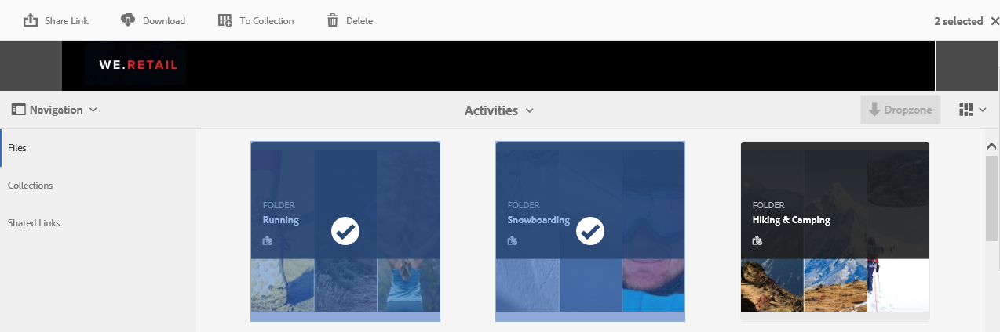
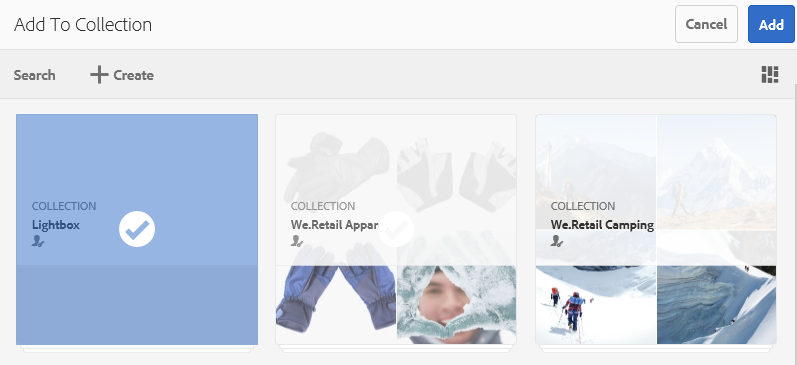
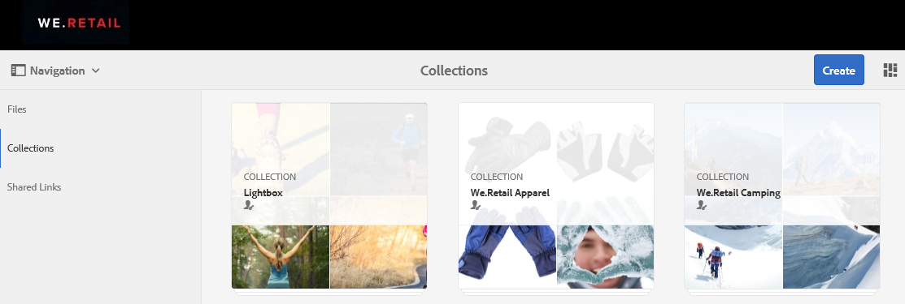
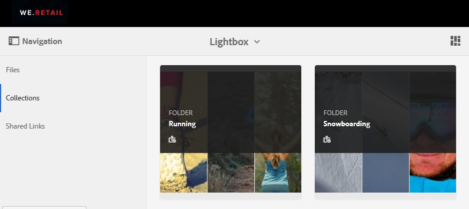
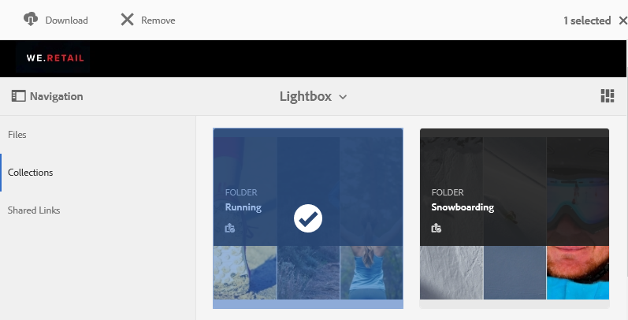

# 管理燈箱集合 {#manage-the-lightbox-collection}

**[!UICONTROL Lightbox]** 是一種特殊型別的集合，可讓您輕鬆存取資產。 每個使用者都有一個 **[!UICONTROL Lightbox]** 首次登入Brand Portal時會自動建立。 此 **[!UICONTROL Lightbox]** 無法刪除集合。

## 將資產新增至Lightbox {#add-assets-to-lightbox}

若要將資產新增至 **[!UICONTROL Lightbox]**，請執行下列動作：

1. 導覽至您要新增至的資產位置 **[!UICONTROL Lightbox]**，然後選取資產。

   

1. 在頂端的工具列中，按一下新增至集合圖示。

   

1. 於 **[!UICONTROL 新增至集合]** 頁面， **[!UICONTROL Lightbox]** 集合預設為選取。

   按一下 **[!UICONTROL 新增]**. 選取的資產會新增至 **[!UICONTROL Lightbox]**.

   

1. 若要檢閱新增至的資產 **[!UICONTROL Lightbox]**，按一下 **[!UICONTROL 集合]** ，然後按一下 **[!UICONTROL Lightbox]** 集合。

   

   資產已新增至 **[!UICONTROL Lightbox]** 出現在 **[!UICONTROL Lightbox]** 頁面。

   

## 從Lightbox中移除資產 {#remove-assets-from-lightbox}

1. 若要檢閱中的資產 [!UICONTROL Lightbox]，按一下 **[!UICONTROL 集合]** 然後按一下左側邊欄上的 [!UICONTROL Lightbox] 集合。

   

1. 選取您要從集合中移除的資料夾，然後按一下 **[!UICONTROL 移除]** 從頂端的工具列開啟。

   

1. 在警告訊息方塊中，按一下 **[!UICONTROL 移除]** 以確認移除。

資料夾會從 **[!UICONTROL Lightbox]** 集合。
