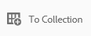

# 管理燈箱集合 {#manage-the-lightbox-collection}

**[!UICONTROL 燈箱]** 是一種特殊的收集類型，可方便地訪問資產。 每個用戶都有獨佔 **[!UICONTROL 燈箱]** 當他們第一次登錄Brand Portal時自動建立。 的 **[!UICONTROL 燈箱]** 無法刪除集合。

## 將資產添加到燈箱 {#add-assets-to-lightbox}

將資產添加到 **[!UICONTROL 燈箱]**，執行以下操作：

1. 導航到要添加到的資產的位置 **[!UICONTROL 燈箱]**，然後選擇資產。

   

1. 在頂部的工具欄中，按一下「添加到集合」表徵圖。

   

1. 在 **[!UICONTROL 添加到集合]** 頁 **[!UICONTROL 燈箱]** 預設情況下選擇集合。

   按一下 **[!UICONTROL 添加]**。 所選資產將添加到 **[!UICONTROL 燈箱]**。

   

1. 複查添加到 **[!UICONTROL 燈箱]**&#x200B;按一下 **[!UICONTROL 集合]** 在左滑軌上，然後按一下 **[!UICONTROL 燈箱]** 的下界。

   

   添加到的資產 **[!UICONTROL 燈箱]** 中 **[!UICONTROL 燈箱]** 的子菜單。

   

## 從「」(Light)框中刪除資產 {#remove-assets-from-lightbox}

1. 要審閱中的資產，請執行以下操作： [!UICONTROL 燈箱]按一下 **[!UICONTROL 集合]** 在左欄上，按一下 [!UICONTROL 燈箱] 的下界。

   

1. 選擇要從集合中刪除的資料夾，然後按一下 **[!UICONTROL 刪除]** 的上界。

   

1. 在警告消息框中，按一下 **[!UICONTROL 刪除]** 確認刪除。

資料夾將從 **[!UICONTROL 燈箱]** 的下界。
