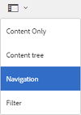
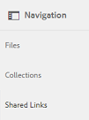
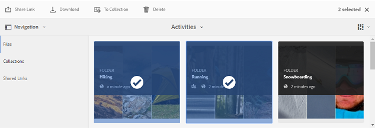
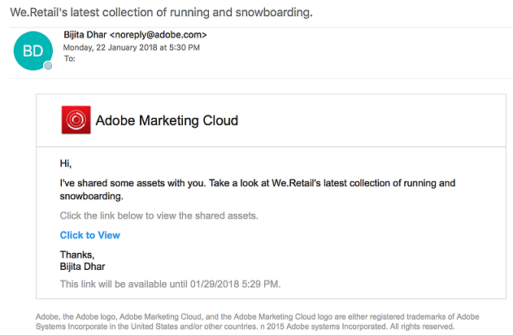
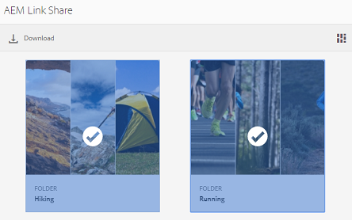
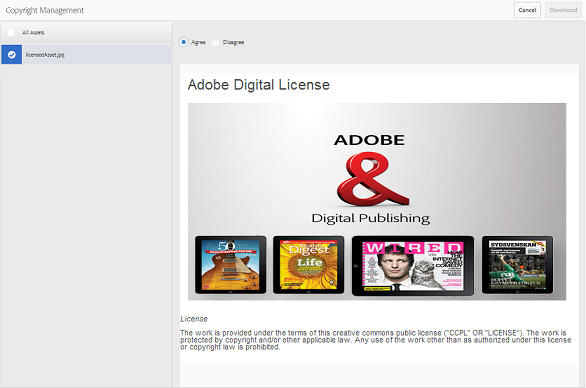
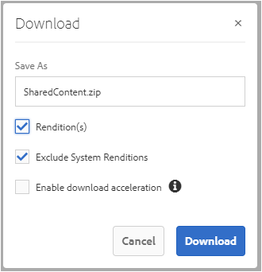
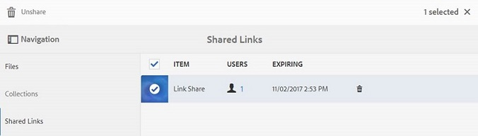

# 以連結方式共用資產 {#share-assets-as-a-link}

AEM Assets品牌入口網站管理員和編輯人員可與授權的內部使用者和外部實體（包括合作夥伴和廠商）共用多個資產的連結。 編輯人員只能檢視並共用與他們共用的資產。

透過連結分享資產是讓外部人士也能使用的便利方式，因為接收者不需要登入品牌入口網站即可存取資產。 接收者（檢視器使用者）可以存取和下載與他們共用的公用資產，並可以新增這些資產以建立其自己的系列。

如需詳細資訊，請 [參閱管理使用者、群組和使用者角色](../using/brand-portal-adding-users.md#manage-user-roles)。

>[!NOTE]
>
>品牌入口網站上的連結共用功能允許下載高達5GB的郵遞區號。

以下是將資產共用為連結的步驟：

1. 按一下左側的覆蓋圖示，然後選擇「導 **[!UICONTROL 覽」]**。

   

1. 從左側的脫軌處，按一下「檔 **[!UICONTROL 案]** 」以共用資料夾或影像。 若要共用系列，請按一下「 **[!UICONTROL 系列]**」。

   

1. 選取您要共用為連結的檔案夾或系列。

   

1. 在頂端的工具列中，按一下「共 **[!UICONTROL 用連結]** 」圖示。

   出現 **[!UICONTROL 「Link Sharing]** （連結共用）」對話框。

   

   >[!NOTE]
   >
   >「共 **[!UICONTROL 用連結]** 」欄位會顯示自動建立的資產連結。 此連結的預設過期時間為7天。 您可以複製連結，並與使用者分開分享，或從「連結共用」對話 **[!UICONTROL 方塊分享]** 。

1. 在電子郵件地址方塊中，輸入您要與其共用連結之使用者的電子郵件ID。 您可以與多位使用者共用連結。

   如果使用者是您組織的成員，請從下拉式清單中顯示的建議中選取其電子郵件ID。 如果使用者是外部使用者，請輸入完整的電子郵件ID，然後按 **[!UICONTROL Enter]**; 電子郵件ID會新增至使用者清單。

   

1. 在「主 **[!UICONTROL 旨]** 」方塊中，輸入您要共用之資產的主旨。
1. 在「消 **[!UICONTROL 息]** 」框中，根據需要鍵入消息。
1. 在「過 **[!UICONTROL 期]** 」欄位中，使用日期選擇器指定連結的到期日期和時間。 依預設，到期日會從您共用連結的日期開始設為7天。

   透過連結共用的資產會在超過「到期日」欄位中指定的日期和時間後 **[!UICONTROL 到期]** 。 如需有關過期資產行為以及基於品牌入口網站使用者角色之允許活動變更的詳細資訊，請參 [閱管理資產的數位權限](../using/manage-digital-rights-of-assets.md#asset-expiration)。

1. 按一下&#x200B;**[!UICONTROL 「共用」]**。訊息會確認連結已與使用者共用。 使用者會收到包含連結的電子郵件。

   

   >[!NOTE]
   >
   >管理員可自訂電子郵件訊息，包括使用品牌功能自訂標誌、說明 [和頁尾](../using/brand-portal-branding.md) 。

## 從共用連結下載資產 {#download-assets-from-shared-links}

按一下電子郵件中的連結，以檢視共用資產。 「AEM連結共用」頁面隨即開啟。

若要下載共用資產：

1. 按一下資產，然後按一下工 **[!UICONTROL 具列中]** 的「下載」圖示。

   

   >[!NOTE]
   >
   >目前，您只能針對特定資產產生預覽和縮圖，視檔案格式而定。 如需支援檔案格式的詳細資訊，請參 [閱資產格式的預覽和縮圖支援](#preview-thumbnail-support)。

   >[!NOTE]
   >
   >如果您下載的資產也包含授權資產，則會將您重新導向至「版權 **[!UICONTROL 管理]** 」頁面。 在本頁中，選取授權資產，按一下「 **[!UICONTROL 同意]**」，然後按一下「 **[!UICONTROL 下載」]**。 如果您選擇不同意，則只會下載未授權的資產。\
   >受授權保護的資產 [附加了授權合約](https://helpx.adobe.com/experience-manager/6-5/assets/using/drm.html#DigitalRightsManagementinAssets) ，這是透過在中設定資產的中繼資料屬性 [來完成](https://helpx.adobe.com/experience-manager/6-5/assets/using/drm.html#DigitalRightsManagementinAssets)[!DNL AEM Assets]。

   

   出現 **[!UICONTROL 「下載]** 」對話框。

   

   * 若要加速下載共用為連結的資產檔案，請選取「啟用下載 **[!UICONTROL 加速]** 」選項， [然後遵循精靈](../using/accelerated-download.md#download-workflow-using-file-accelerator)。 若要進一步瞭解品牌入口網站上資產的快速下載，請參 [閱指南以加速從品牌入口網站的下載](../using/accelerated-download.md)。

1. 若要從共用連結下載資產的轉譯，以及資產的轉譯，請選取「轉 **[!UICONTROL 譯」選項]** 。 執行此操作時，會出 **[!UICONTROL 現「排除系統轉譯]** 」選項，預設情況下該選項處於選中狀態。 這可防止下載現成可用的轉譯，以及已核准的資產或其自訂轉譯。

   不過，若要允許自動產生的轉譯與自訂轉譯一起下載，請取消選取「排 **[!UICONTROL 除系統轉譯」選項]** 。

   >[!NOTE]
   >
   >如果將資產共用為連結的使用者未獲管理員授權存取原始轉譯，則不會 [使用共用連結來下載原始轉譯](../using/brand-portal-adding-users.md#manage-group-roles-and-privileges)。

   

1. 點選／按一下「 **[!UICONTROL 下載]**」。 資產（若已選取，則轉譯）會下載為ZIP檔案至您的本機資料夾。 不過，如果下載單一資產而未包含任何轉譯，則不會建立任何zip檔案，因此可確保快速下載。

>[!NOTE]
>
>品牌入口網站限制每個檔案大小下載超過5 GB的資產。

## 資產格式的預覽和縮圖支援 {#preview-thumbnail-support}

下列矩陣列出品牌入口網站支援縮圖和預覽的資產格式：

| 資產格式 | 縮圖支援 | 預覽支援 |
|--------------|-------------------|-----------------|
| PNG | ✓ | ✓ |
| GIF | ✓ | ✓ |
| TIFF | ✓ | ✕ |
| JPEG | ✓ | ✓ |
| BMP | ✓ | ✕ |
| PNM* | 不適用 | 不適用 |
| PGM* | 不適用 | 不適用 |
| PBM* | 不適用 | 不適用 |
| PPM* | 不適用 | 不適用 |
| PSD | ✓ | ✕ |
| EPS | 不適用 | ✕ |
| DNG | ✓ | ✕ |
| PICT | ✓ | ✕ |
| PSB* | ✓ | ✕ |
| JPG | ✓ | ✓ |
| AI | ✓ | ✕ |
| DOC | ✕ | ✕ |
| DOCX | ✕ | ✕ |
| ODT* | ✕ | ✕ |
| PDF | ✓ | ✕ |
| HTML | ✕ | ✕ |
| RTF | ✕ | ✕ |
| TXT | ✓ | ✕ |
| XLS | ✕ | ✕ |
| XLSX | ✕ | ✕ |
| ODS | ✕ | ✕ |
| PPT | ✓ | ✕ |
| PPTX | ✕ | ✕ |
| ODP | ✕ | ✕ |
| INDD | ✓ | ✕ |
| PS | ✕ | ✕ |
| QXP | ✕ | ✕ |
| EPUB | ✓ | ✕ |
| AAC | ✕ | ✕ |
| MIDI | ✕ | ✕ |
| 3GP | ✕ | ✕ |
| MP3 | ✕ | ✕ |
| MP4 | ✕ | ✕ |
| OGA | ✕ | ✕ |
| OGG | ✕ | ✕ |
| RA | ✕ | ✕ |
| WAV | ✕ | ✕ |
| WMA | ✕ | ✕ |
| DVI | ✕ | ✕ |
| FLV | ✕ | ✕ |
| M4V | ✕ | ✕ |
| MPG | ✕ | ✕ |
| OGV | ✕ | ✕ |
| MOV | ✕ | ✕ |
| WMV | ✕ | ✕ |
| SWF | ✕ | ✕ |
| TGZ | 不適用 | ✕ |
| JAR | ✓ | ✕ |
| RAR | 不適用 | ✕ |
| TAR | 不適用 | ✕ |
| ZIP | ✓ | ✕ |

下圖說明矩陣中使用的符號：

| 符號 | 意義 |
|---|---|
| ✓ | 此檔案格式支援此功能 |
| ✕ | 此檔案格式不支援此功能 |
| 不適用 | 此功能不適用於此檔案格式 |
| * | 這項功能需要AEM作者例項上此檔案格式的附加支援，但是在資產發佈至品牌入口網站後，不需要在品牌入口網站上支援 |

## 取消共用共用為連結的資產 {#unshare-assets-shared-as-a-link}

若要取消共用先前共用的資產做為連結，請執行下列動作：

1. 若要檢視您共用為連結的資產，請按一下左側的覆蓋圖示，然後選擇「導 **[!UICONTROL 覽」]**。

   

1. 在脫軌中，按一下「共 **[!UICONTROL 用連結」]**。

   

1. 檢視您從顯示的清單中共用的連結。
1. 若要從清單中取消共用連結，請選取連結，然後按一下連結項目旁的bin圖示，或上方工具列中的 **[!UICONTROL Unshare]** 圖示。

   

   >[!NOTE]
   >
   >共用連結的顯示是使用者專屬的。 此功能不會顯示租用戶所有使用者共用的所有連結。

1. 在警告訊息方塊中，按一下「 **[!UICONTROL 繼續]** 」以確認取消共用。 連結的項目會從共用連結清單中移除。
