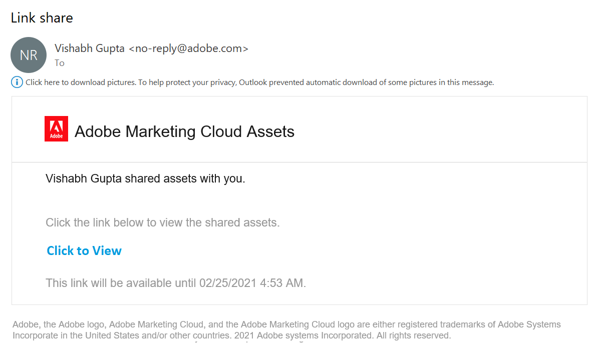
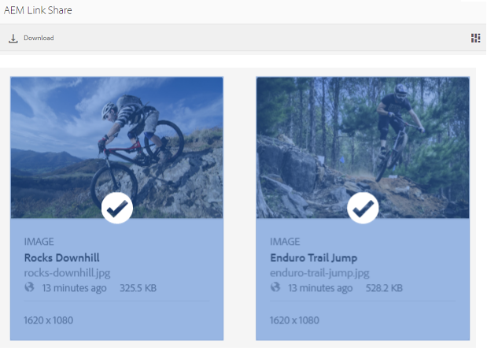
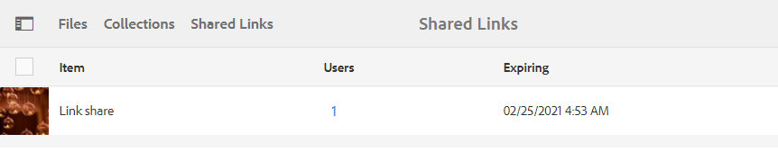
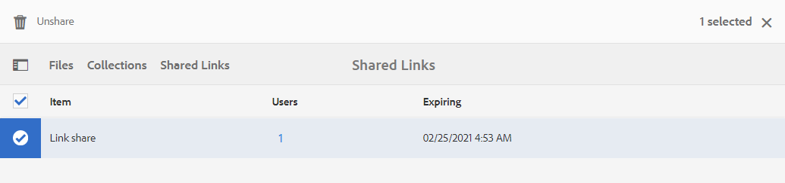

# 以連結方式共用資產 {#share-assets-as-a-link}

Adobe Experience Manager Assets Brand Portal管理員可與授權的內部使用者及外部實體（包括合作夥伴和廠商）共用多個資產的連結。 編輯人員只能檢視和共用與他們共用的資產。

透過連結共用資產是讓外部使用者能使用的便利方式，因為接收者不必登入Brand Portal即可存取資產。

<!-- Link sharing access is restricted to editors and administrators. 
-->

如需詳細資訊，請參閱[管理使用者、群組和使用者角色](../using/brand-portal-adding-users.md#manage-user-roles)。

>[!NOTE]
>
>使用Brand Portal上的連結共用功能最多可下載5GB的zip。

以下是以連結形式共用資產的步驟：

1. 登入您的Brand Portal租用戶。 依預設，會開啟&#x200B;**[!UICONTROL 檔案]**&#x200B;檢視，其中包含所有已發佈的資產和資料夾。

1. 選取您要共用的資產或資料夾，或導覽至&#x200B;**[!UICONTROL 集合]**&#x200B;檢視，以共用您已建立的集合。

   

1. 從頂端的工具列按一下&#x200B;**[!UICONTROL 共用連結]**&#x200B;圖示。

   此時將顯示&#x200B;**[!UICONTROL 連結共用]**&#x200B;對話框。

   

   * 在電子郵件地址方塊中，輸入您要共用連結之使用者的電子郵件ID。 您可以與多個使用者共用連結。 如果使用者是您組織的成員，請從下拉式清單中顯示的建議中選取其電子郵件ID。 如果使用者為外部，請輸入完整的電子郵件ID，然後按&#x200B;**[!UICONTROL Enter]**;電子郵件ID會新增至使用者清單。

      

   * 在&#x200B;**[!UICONTROL 主旨]**&#x200B;方塊中，輸入您要共用之資產的主旨。
   * 在&#x200B;**[!UICONTROL Message]**&#x200B;方塊中，視需要輸入訊息。
   * 在&#x200B;**[!UICONTROL 過期]**&#x200B;欄位中，使用日期選擇器來指定連結的過期日期和時間。 依預設，到期日會設為自您共用連結的日期起7天。
   * 啟用&#x200B;**[!UICONTROL 允許下載原始檔案]**&#x200B;複選框，以允許接收人下載原始格式副本。

   透過連結共用的資產會在超過&#x200B;**[!UICONTROL 到期]**&#x200B;欄位中指定的日期和時間後到期。 如需Brand Portal中過期資產的行為以及根據使用者角色允許的活動變更的相關資訊，請參閱[管理資產的數位權限](../using/manage-digital-rights-of-assets.md#asset-expiration)。

   >[!NOTE]
   >
   >連結的預設過期時間為7天。 必須使用&#x200B;**[!UICONTROL 連結共用]**&#x200B;對話方塊將連結以電子郵件方式傳送給使用者，請勿分別複製和共用連結。

1. 按一下&#x200B;**[!UICONTROL 「共用」]**。訊息會確認連結已與使用者共用。 使用者會收到包含共用連結的電子郵件。

   

   >[!NOTE]
   >
   >管理員可以自訂電子郵件訊息，包括使用[Branding](../using/brand-portal-branding.md)功能自訂標誌、說明和頁尾。

## 從共用連結{#download-assets-from-shared-links}下載資產

按一下電子郵件中的連結，以存取共用資產。 「 AEM連結共用」頁面隨即開啟。

若要下載共用資產：

1. 按一下資產或資料夾，然後按一下工具列中的&#x200B;**[!UICONTROL 下載]**&#x200B;圖示。

   

   >[!NOTE]
   >
   >目前，您只能根據檔案格式，針對特定資產產生預覽和縮圖。 如需支援的檔案格式的詳細資訊，請參閱[資產格式的預覽和縮圖支援](#preview-thumbnail-support)。

1. 此時將顯示&#x200B;**[!UICONTROL Download]**&#x200B;對話框。

   

1. 預設情況下，在&#x200B;**[!UICONTROL 下載設定]**&#x200B;中啟用了&#x200B;**[!UICONTROL 快速下載]**&#x200B;設定。 因此，確認框將使用IBM Aspera Connect繼續下載。

   若要繼續使用&#x200B;**[!UICONTROL 快速下載]**，請按一下&#x200B;**[!UICONTROL 允許]**。

   所有選取的轉譯都會下載至zip資料夾中，其中包含每個資產的個別資料夾。

   >[!NOTE]
   >
   >如果選取要下載的資料夾、集合或超過20個資產，則會略過&#x200B;**[!UICONTROL Download]**&#x200B;對話方塊，而除動態轉譯外之使用者可存取的所有資產轉譯會下載至Zip資料夾。 系統會為zip資料夾內的每個資產建立個別的資料夾。

   >[!NOTE]
   >
   >如果以連結形式共用資產的使用者未獲管理員授權存取原始轉譯](../using/brand-portal-adding-users.md#manage-group-roles-and-privileges)，則不會使用共用連結下載原始轉譯。[

>[!NOTE]
>
>Brand Portal限制下載每個檔案大小超過5GB的資產。

<!--
1. The **[!UICONTROL Download]** dialog box appears.

   

    * To speed up the download of asset files shared as the link, select **[!UICONTROL Enable download acceleration]** option and [follow the wizard](../using/accelerated-download.md#download-workflow-using-file-accelerator). To know more about the fast download of assets on Brand Portal refer [Guide to accelerate downloads from Brand Portal](../using/accelerated-download.md).
    
1. To download the renditions of assets in addition to the assets from the shared link, select **[!UICONTROL Rendition(s)]** option. When you do so, **[!UICONTROL Exclude System Renditions]** option appears that is selected by default. This prevents the download of out-of-the-box renditions along with approved assets or their custom renditions.

   However, to allow auto-generated renditions to download along with custom renditions, deselect the **[!UICONTROL Exclude System Renditions]** option.

   >[!NOTE]
   >
   >Original renditions are not downloaded using the shared link if the user who shared the assets as a link is not [authorized by the administrator to have access to the original renditions](../using/brand-portal-adding-users.md#manage-group-roles-and-privileges).

   

1. Click **[!UICONTROL Download]**. The assets (and renditions if selected) are downloaded as a ZIP file to your local folder. However, no zip file is created if a single asset is downloaded without any of the renditions, thereby ensuring speedy download.

>[!NOTE]
>
>Brand Portal restricts downloading assets larger than 5GB per file size.
-->

## 資產格式的預覽和縮圖支援{#preview-thumbnail-support}

下列矩陣列出Brand Portal支援縮圖和預覽的資產格式：

| 資產格式 | 縮圖支援 | 預覽支援 |
|--------------|-------------------|-----------------|
| PNG | ✓ | ✓ |
| GIF | ✓ | ✓ |
| TIFF | ✓ | ✕ |
| JPEG | ✓ | ✓ |
| BMP | ✓ | ✕ |
| PNM* | 不適用 | 不適用 |
| PGM* | 不適用 | 不適用 |
| PBM* | 不適用 | 不適用 |
| PPM* | 不適用 | 不適用 |
| PSD | ✓ | ✕ |
| EPS | 不適用 | ✕ |
| DNG | ✓ | ✕ |
| PICT | ✓ | ✕ |
| PSB* | ✓ | ✕ |
| JPG | ✓ | ✓ |
| AI | ✓ | ✕ |
| DOC | ✕ | ✕ |
| DOCX | ✕ | ✕ |
| ODT* | ✕ | ✕ |
| PDF | ✓ | ✕ |
| HTML | ✕ | ✕ |
| RTF | ✕ | ✕ |
| TXT | ✓ | ✕ |
| XLS | ✕ | ✕ |
| XLSX | ✕ | ✕ |
| ODS | ✕ | ✕ |
| PPT | ✓ | ✕ |
| PPTX | ✕ | ✕ |
| ODP | ✕ | ✕ |
| INDD | ✓ | ✕ |
| PS | ✕ | ✕ |
| QXP | ✕ | ✕ |
| EPUB | ✓ | ✕ |
| AAC | ✕ | ✕ |
| MIDI | ✕ | ✕ |
| 3GP | ✕ | ✕ |
| MP3 | ✕ | ✕ |
| MP4 | ✕ | ✕ |
| OGA | ✕ | ✕ |
| OGG | ✕ | ✕ |
| RA | ✕ | ✕ |
| WAV | ✕ | ✕ |
| WMA | ✕ | ✕ |
| DVI | ✕ | ✕ |
| FLV | ✕ | ✕ |
| M4V | ✕ | ✕ |
| MPG | ✕ | ✕ |
| OGV | ✕ | ✕ |
| MOV | ✕ | ✕ |
| WMV | ✕ | ✕ |
| SWF | ✕ | ✕ |
| TGZ | 不適用 | ✕ |
| JAR | ✓ | ✕ |
| RAR | 不適用 | ✕ |
| TAR | 不適用 | ✕ |
| ZIP | ✓ | ✕ |

下圖說明矩陣中使用的符號：

| 符號 | 意義 |
|---|---|
| ✓ | 此檔案格式支援此功能 |
| ✕ | 此檔案格式不支援此功能 |
| 不適用 | 此功能不適用於此檔案格式 |
| * | 此功能需要AEM製作例項上此檔案格式的附加支援，但在資產發佈至Brand Portal後，不需要在Brand Portal上支援 |

## 取消共用以連結{#unshare-assets-shared-as-a-link}共用的資產

若要取消共用先前共用的資產作為連結，請執行下列動作：

1. 登入Brand Portal時，預設會開啟&#x200B;**[!UICONTROL 檔案]**&#x200B;檢視。 若要檢視您以連結形式共用的資產，請導覽至「**[!UICONTROL 共用連結]**」檢視。

1. 從顯示的清單中檢閱您共用的連結。

   

1. 若要從清單中取消共用連結，請選取連結，然後按一下頂端工具列中的&#x200B;**[!UICONTROL 取消共用]**&#x200B;圖示。

   

   >[!NOTE]
   >
   >共用連結的顯示是使用者專屬的。 此功能不會顯示租用戶的所有使用者共用的所有連結。

1. 在警告消息框中，按一下&#x200B;**[!UICONTROL 繼續]**&#x200B;以確認取消共用。 連結的項目會從共用連結清單中移除。
