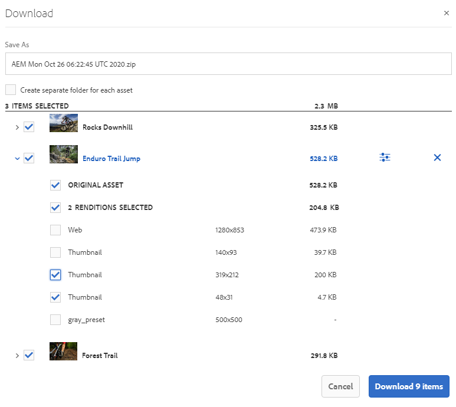
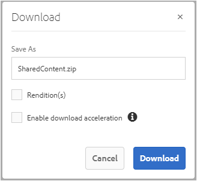

# 以連結方式共用資產 {#share-assets-as-a-link}

Adobe Experience Manager Assets Brand Portal管理員可以與授權的內部用戶和外部實體（包括合作夥伴和供應商）共用多個資產的連結。 編輯只能查看和共用與他們共用的資產。

通過連結共用資產是一種方便的方式，使外部方能夠獲得這些資產，因為接收方不必登錄Brand Portal即可訪問這些資產。

<!-- Link sharing access is restricted to editors and administrators. 
-->

有關詳細資訊，請參見 [管理用戶、組和用戶角色](../using/brand-portal-adding-users.md#manage-user-roles)。

以下是將資產作為連結共用的步驟：

1. 登錄到你的Brand Portal租客。 預設情況下， **[!UICONTROL 檔案]** 將開啟包含所有已發佈資產和資料夾的視圖。

1. 選擇要共用的資產或資料夾，或導航到 **[!UICONTROL 集合]** 視圖以共用已建立的集合。

   

1. 在頂部的工具欄中，按一下 **[!UICONTROL 共用連結]** 表徵圖

   的 **[!UICONTROL 連結共用]** 對話框。

   

   * 在電子郵件地址框中，鍵入要與其共用連結的用戶的電子郵件ID。 您可以與多個用戶共用該連結。 如果用戶是您組織的成員，請從下拉清單中顯示的建議中選擇其電子郵件ID。 如果用戶是外部用戶，請鍵入完整的電子郵件ID並按 **[!UICONTROL 輸入]**;電子郵件ID將添加到用戶清單。

      

   * 在 **[!UICONTROL 主題]** 框中，鍵入要共用的資產的主題。
   * 在 **[!UICONTROL 消息]** 框中，鍵入消息。
   * 在 **[!UICONTROL 到期]** 欄位，使用日期選取器指定連結的到期日期和時間。 預設情況下，到期日期設定為共用連結之日起7天。
   * 啟用 **[!UICONTROL 允許下載原始檔案]** 複選框以允許接收方下載原始格式副本。

   通過連結共用的資產在超過在 **[!UICONTROL 到期]** 的子菜單。 有關過期資產行為以及基於用戶角色在Brand Portal允許的活動更改的資訊，請參見 [管理資產的數字權利](../using/manage-digital-rights-of-assets.md#asset-expiration)。

   >[!NOTE]
   >
   >連結的預設到期時間為7天。 連結必須通過電子郵件發送給使用 **[!UICONTROL 連結共用]** 對話框，請勿單獨複製和共用連結。

1. 按一下 **[!UICONTROL 共用]**。 一條消息確認該連結已與用戶共用。 用戶收到包含共用連結的電子郵件。

   

   >[!NOTE]
   >
   >管理員可以自定義電子郵件消息，包括使用自定義徽標、說明和頁腳 [品牌](../using/brand-portal-branding.md) 的子菜單。

## 從共用連結下載資產 {#download-assets-from-shared-links}

按一下電子郵件中的連結以訪問共用資產。 將開啟AEM「連結共用」頁。

下載共用資產：

1. 按一下資產或資料夾，然後按一下 **[!UICONTROL 下載]** 的子菜單。

   

   >[!NOTE]
   >
   >目前，您只能根據檔案格式生成特定資產的預覽和縮略圖。 有關支援的檔案格式的詳細資訊，請參見 [資產格式的預覽和縮略圖支援](#preview-thumbnail-support)。

1. 的 **[!UICONTROL 下載]** 對話框。

   

1. 預設情況下， **[!UICONTROL 快速下載]** 設定在 **[!UICONTROL 下載設定]**。 因此，確認框似乎會繼續使用IBMAspera Connect下載。

   繼續使用 **[!UICONTROL 快速下載]**&#x200B;按一下 **[!UICONTROL 允許]**。

   所有選定的格式副本都下載到一個zip資料夾中，其中包含每個資產的單獨資料夾。

   >[!NOTE]
   >
   >在從共用連結下載資產時為每個資產建立單獨的資料夾。
   >
   >如果選擇了資料夾、集合或20個以上的資產供下載， **[!UICONTROL 下載]** 對話框被跳過，用戶可訪問的所有資產格式副本（不包括動態格式副本）都將下載到包含每個資產單獨資料夾的zip資料夾中。

   >[!NOTE]
   >
   >如果將資產作為連結共用的用戶沒有下載原始格式副本，則不會使用共用連結下載原始格式副本 [經管理員授權，可以訪問原始格式副本](../using/brand-portal-adding-users.md#manage-group-roles-and-privileges)。

>[!NOTE]
>
>Brand Portal限制使用連結共用下載大小大於5 GB的資料夾或資產。

<!--
1. The **[!UICONTROL Download]** dialog box appears.

   

    * To speed up the download of asset files shared as the link, select **[!UICONTROL Enable download acceleration]** option and [follow the wizard](../using/accelerated-download.md#download-workflow-using-file-accelerator). To know more about the fast download of assets on Brand Portal refer [Guide to accelerate downloads from Brand Portal](../using/accelerated-download.md).
    
1. To download the renditions of assets in addition to the assets from the shared link, select **[!UICONTROL Rendition(s)]** option. When you do so, **[!UICONTROL Exclude System Renditions]** option appears that is selected by default. This prevents the download of out-of-the-box renditions along with approved assets or their custom renditions.

   However, to allow auto-generated renditions to download along with custom renditions, deselect the **[!UICONTROL Exclude System Renditions]** option.

   >[!NOTE]
   >
   >Original renditions are not downloaded using the shared link if the user who shared the assets as a link is not [authorized by the administrator to have access to the original renditions](../using/brand-portal-adding-users.md#manage-group-roles-and-privileges).

   

1. Click **[!UICONTROL Download]**. The assets (and renditions if selected) are downloaded as a ZIP file to your local folder. However, no zip file is created if a single asset is downloaded without any of the renditions, thereby ensuring speedy download.

-->

## 資產格式的預覽和縮略圖支援 {#preview-thumbnail-support}

下表列出了Brand Portal支援縮略圖和預覽的資產格式：

| 資產格式 | 縮略圖支援 | 預覽支援 |
|--------------|-------------------|-----------------|
| PNG | ✓ | ✓ |
| GIF | ✓ | ✓ |
| TIFF | ✓ | ✕ |
| JPEG | ✓ | ✓ |
| BMP | ✓ | ✕ |
| PNM* | 不適用 | 不適用 |
| PGM* | 不適用 | 不適用 |
| PBM* | 不適用 | 不適用 |
| PPM* | 不適用 | 不適用 |
| PSD | ✓ | ✕ |
| EPS | 不適用 | ✕ |
| DNG | ✓ | ✕ |
| 皮克 | ✓ | ✕ |
| PSB* | ✓ | ✕ |
| JPG | ✓ | ✓ |
| AI | ✓ | ✕ |
| DOC | ✕ | ✕ |
| DOCX | ✕ | ✕ |
| ODT* | ✕ | ✕ |
| PDF | ✓ | ✕ |
| HTML | ✕ | ✕ |
| RTF | ✕ | ✕ |
| TXT | ✓ | ✕ |
| XLS | ✕ | ✕ |
| XLSX | ✕ | ✕ |
| 耗氧物質 | ✕ | ✕ |
| PPT | ✓ | ✕ |
| PPTX | ✕ | ✕ |
| 耗氧潛能 | ✕ | ✕ |
| INDD | ✓ | ✕ |
| PS | ✕ | ✕ |
| QXP | ✕ | ✕ |
| ePub | ✓ | ✕ |
| AAC | ✕ | ✕ |
| MIDI | ✕ | ✕ |
| 3GP | ✕ | ✕ |
| MP3 | ✕ | ✕ |
| MP4 | ✕ | ✕ |
| 奧加 | ✕ | ✕ |
| OGG | ✕ | ✕ |
| RA | ✕ | ✕ |
| WAV | ✕ | ✕ |
| WMA | ✕ | ✕ |
| DVI | ✕ | ✕ |
| FLV | ✕ | ✕ |
| M4V | ✕ | ✕ |
| MPG | ✕ | ✕ |
| OGV | ✕ | ✕ |
| MOV | ✕ | ✕ |
| WMV | ✕ | ✕ |
| SWF | ✕ | ✕ |
| TGZ | 不適用 | ✕ |
| JAR | ✓ | ✕ |
| RAR | 不適用 | ✕ |
| 塔爾 | 不適用 | ✕ |
| ZIP | ✓ | ✕ |

以下圖例說明矩陣中使用的符號：

| 符號 | 意義 |
|---|---|
| ✓ | 此檔案格式支援此功能 |
| ✕ | 此檔案格式不支援此功能 |
| 不適用 | 此功能不適用於此檔案格式 |
| &#42; | 此功能要求在作者實例上支援此檔案格式，AEM但在將資產發佈到Brand Portal後，在Brand Portal上不支援此檔案格式 |

## 取消共用作為連結共用的資產 {#unshare-assets-shared-as-a-link}

要取消共用以前共用的資產作為連結，請執行以下操作：

1. 當你登錄Brand Portal時， **[!UICONTROL 檔案]** 視圖預設開啟。 要查看作為連結共用的資產，請導航至 **[!UICONTROL 共用連結]** 的子菜單。

1. 查看從顯示的清單中共用的連結。

   

1. 要取消共用清單中的連結，請選擇該連結，然後按一下 **[!UICONTROL 取消共用]** 的上界。

   

   >[!NOTE]
   >
   >共用連結的顯示是用戶特定的。 此功能不顯示租戶的所有用戶共用的所有連結。

1. 在警告消息框中，按一下 **[!UICONTROL 繼續]** 確認取消共用。 連結的條目將從共用連結清單中刪除。
