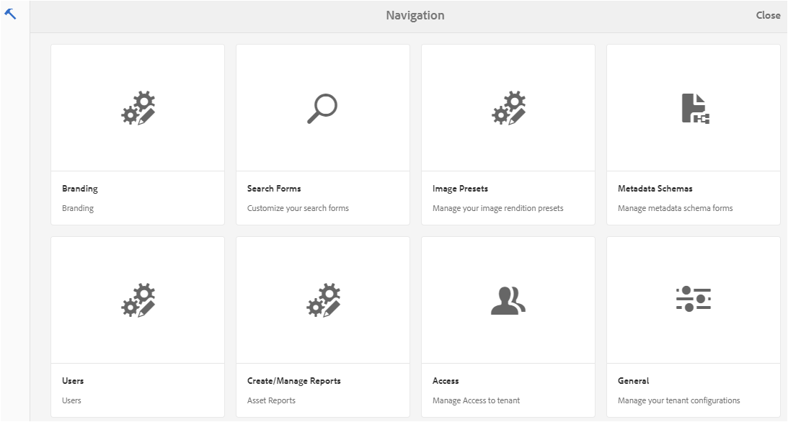
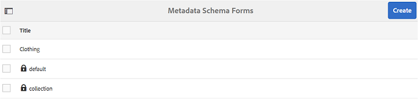
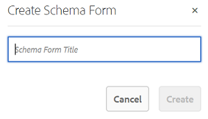
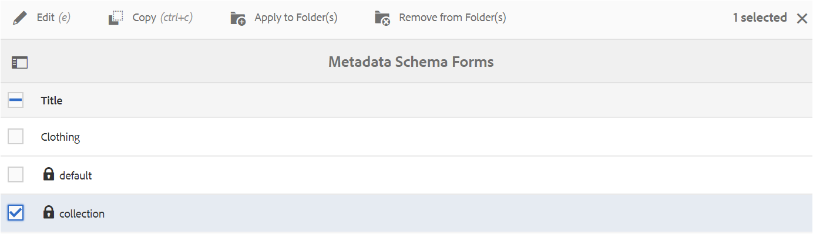
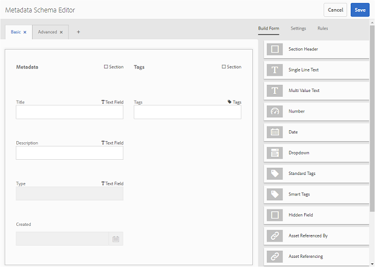
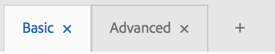
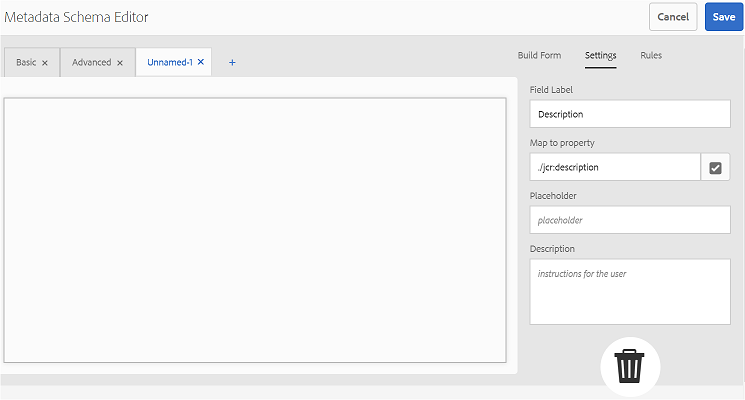
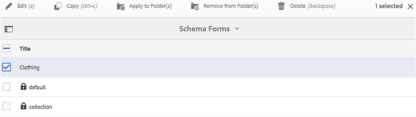
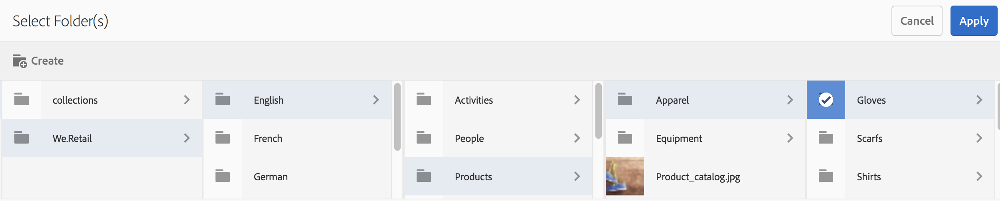
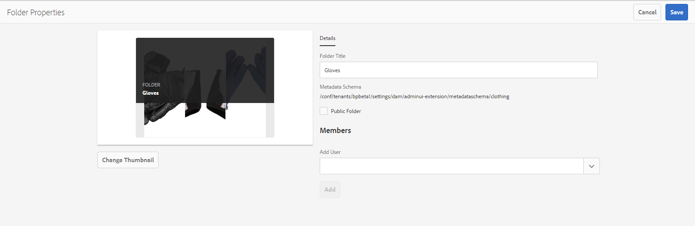

# 使用中繼資料結構表單 {#use-the-metadata-schema-form}

中繼資料結構描述「屬性」頁面的版面配置，以及使用特定結構的資產所顯示的中繼資料屬性。 您套用至資產的架構會決定顯示在其「屬性」頁面上的中繼資料欄位。

每個 **[!UICONTROL 資產的]** 「屬性」頁面會包含預設中繼資料屬性，視資產的MIME類型而定。 管理員可以使用中繼資料結構編輯器來修改現有結構或新增自訂的中繼資料結構。 AEM Assets品牌入口網站提供各種MIME類型資產的預設表單。 不過，您也可以為此類資產新增自訂表格。

## 新增中繼資料結構表單 {#add-a-metadata-schema-form}

要建立新的元資料架構表單，請執行以下操作：

1. 從頂端的AEM工具列，按一下Adobe標誌以存取管理工具。

   

2. 在管理工具面板中，按一下中繼資 **[!UICONTROL 料結構]**。

   

3. 在「中繼資 **[!UICONTROL 料結構表單]** 」頁面上，按一 **[!UICONTROL 下建立]**。

   

4. 在「創 **[!UICONTROL 建架構表單]** 」對話框中，指定架構表單的標題，然後按一下「創 **[!UICONTROL 建]** 」以完成表單建立過程。

   

## Edit a metadata schema form {#edit-a-metadata-schema-form}

您可以編輯新增或現有的中繼資料結構表單。 中繼資料結構表單包含衍生自其父項的內容，包括標籤和標籤內的表單項目。 您可以將這些表單項目映射或設定至中繼資料節點內的欄位。

您可以將新標籤或表單項目新增至中繼資料結構表單。 衍生標籤和表單項（來自父項）處於鎖定狀態。 您無法在子級更改它們。

要編輯元資料結構表單，請執行以下操作：

1. 從頂端的AEM工具列，按一下Adobe標誌以存取管理工具。

   

2. 在管理工具面板中，按一下中繼資 **[!UICONTROL 料結構]**。
3. 從「元數 **[!UICONTROL 據結構表單]** 」頁中，選擇一個結構表單以編輯其屬性，例如 **[!UICONTROL 集合]**。

   

   >[!NOTE]
   >
   >未編輯的範本會在其前顯示鎖定符號。 如果自定義任何模板，則模板前的「鎖定」符號將消失。

4. 在頂端的工具列中，按一下「編 **[!UICONTROL 輯」]**。

   「中 **[!UICONTROL 繼資料結構編輯器]** 」頁面隨即開啟，左側的「基本 **[!UICONTROL 」索引標籤隨即開啟，右側的「]** 建立表單 **** 」索引標籤隨即開啟。

5. 在「元數 **[!UICONTROL 據結構編輯器]** 」頁中，通過從「構建表單」頁籤的元件類型清單中拖動一個或多個元件到「基本」頁籤，自定義資產的「屬 ************ 性」頁。

   

6. 要配置元件，請選擇該元件並在「設定」頁籤中修改 **[!UICONTROL 其屬]** 性。

### 「生成表單」頁籤中的元件 {#components-in-the-build-form-tab}

「建 **[!UICONTROL 立表單]** 」標籤會列出您可在架構表單中使用的項目。 「設 **[!UICONTROL 定]** 」標籤提供您在「建置表單」標籤中選取之每 **[!UICONTROL 個項目的屬性]** 。 下表列出了「生成表單」頁籤中可 **[!UICONTROL 用的表單項]** :

| 元件名稱 | 說明 |
|---------------------|--------------------------------------------------------------------------------------------------------------------------------------------------------------------------------------------------------------------------------------------------------------------------------------------|
| [!UICONTROL 區段標題] | 新增共用元件清單的區段標題。 |
| [!UICONTROL 單行文字] | 新增單行文字屬性。 它儲存為字串。 |
| [!UICONTROL 多值文字] | 新增多值文字屬性。 它儲存為字串陣列。 |
| [!UICONTROL 數字] | 添加數字元件。 |
| [!UICONTROL 日期] | 新增日期元件。 |
| [!UICONTROL 下拉式] | 新增下拉式清單。 |
| [!UICONTROL 標準標記] | 新增標記. **** 注意：例如，如果管理員從 `/etc/tags/mac/<tenant_id>/<custom_tag_namespace>`AEM發佈中繼資料結構表單，而路徑不包含租用戶資訊，則可能需要變更路徑值 `/etc/tags/<custom_tag_namespace>`。 |
| [!UICONTROL 智慧標記] | 如果您已購買並設定AEM智慧型標籤附加元件，則自動偵測標籤。 |
| [!UICONTROL 隱藏欄位] | 新增隱藏欄位。 儲存資產時，會以POST參數傳送。 |
| [!UICONTROL 資產引用者] | 新增此元件以檢視資產參考的資產清單。 |
| [!UICONTROL 資產引用] | 新增以顯示參考資產的資產清單。 |
| [!UICONTROL 資產評等] | 從AEM Assets新增資產在發佈至品牌入口網站之前的平均評分。 |
| [!UICONTROL 關聯式中繼資料] | 新增以控制資產「屬性」頁面中其他中繼資料標籤的顯示。 |

>[!NOTE]
>
>請勿使用 **[!UICONTROL 「產品參考]**」，因為它不起作用。

#### 編輯中繼資料元件 {#edit-the-metadata-component}

若要編輯表單上中繼資料元件的屬性，請按一下元件，然後在「設定」索引標籤中編輯 **[!UICONTROL 其屬]** 性。

* **[!UICONTROL 欄位標籤]**:顯示在資產「屬性」頁面上的中繼資料屬性名稱。

* **[!UICONTROL 對應至屬性]**:此屬性的值為保存在CRX儲存庫中的資產節點提供相對路徑／名稱。 它開頭是"**./**」，因為這表示路徑位於資產節點下。

以下是此屬性的有效值：

— [!UICONTROL `./jcr:content/metadata/dc:title`]:將值儲存在資產的中繼資料節點，做為屬性 [!UICONTROL `dc:title`]。

— [!UICONTROL `./jcr:created`]:在資產節點顯示jcr屬性。 如果您在檢視屬性上設定這些屬性，建議您將它們標示為「停用編輯」，因為這些屬性受到保護。 否則，當您儲存資產的屬性時，會出現「資產無法修改」錯誤。

* **[!UICONTROL 預留位置]**:使用此屬性可向使用者提供與中繼資料屬性相關的任何資訊。
* **[!UICONTROL 必要]**:使用此屬性可將中繼資料屬性標示為「屬性」頁面上的必要屬性。
* **[!UICONTROL 停用編輯]**:使用此屬性可讓中繼資料屬性在「屬性」頁面上無法編輯。
* **[!UICONTROL 在唯讀中顯示空白欄位]**:標籤此屬性可在「屬性」頁面上顯示中繼資料屬性，即使它沒有值亦然。 預設情況下，當中繼資料屬性沒有值時，它不會列在「屬性」頁面上。
* **[!UICONTROL 說明]**:使用此屬性可為中繼資料元件新增簡短說明。
* **[!UICONTROL 刪除圖示]**:按一下此表徵圖可從架構表單中刪除元件。

>[!NOTE]
>
>所有中繼資料欄位都是資產的中繼資料編輯器形式中的唯讀欄位。 由於資產的中繼資料必須在AEM Assets中編輯，才能將資產發佈至品牌入口網站。

#### 在架構表單中添加或刪除頁籤 {#add-or-delete-a-tab-in-the-schema-form}

預設模式表單包括 **[!UICONTROL Basic]** 和 **[!UICONTROL Advanced頁籤]** 。 架構編輯器可讓您新增或刪除標籤。

* 要在模式表單上添加新頁籤，請按一下 **[!UICONTROL +]**。 依預設，新標籤的名稱為「未命名-1」。 您可以從「設定」索引標籤修 **[!UICONTROL 改名稱]** 。

* 要刪除頁籤，請按一下 **[!UICONTROL x]**。 按一 **[!UICONTROL 下「儲存]** 」以儲存變更。

## 將中繼資料結構套用至資料夾 {#apply-a-metadata-schema-to-a-folder}

品牌入口網站可讓您自訂和控制中繼資料結構，讓資產的 [!UICONTROL Properties] （屬性）頁面僅顯示您選擇要顯示的特定資訊。 要控制「屬性」頁中顯示的元數 [!UICONTROL 據] ，請從元資料模式表單中刪除所需的元資料，並將其應用於特定資料夾。

要將元資料結構表單應用於資料夾，請執行以下操作：

1. 從頂端的AEM工具列，按一下Adobe標誌以存取管理工具。

   

2. 在管理工具面板中，按一下中繼資 **[!UICONTROL 料結構]**。

3. 從「中 **[!UICONTROL 繼資料結構表單]** 」頁面中，選取您要套用至資產（例如服裝）的結構 [!UICONTROL 結構表單]。

   

4. 在頂端的工具列中，按一 **[!UICONTROL 下套用至資料夾]**。

5. 從「選 **[!UICONTROL 取檔案夾]** 」頁面，導覽至您要套用Clothing **[!UICONTROL 中繼資料結構的資料夾，例如]** Gloves ****。

   

6. 按一下 **[!UICONTROL 應用]** ，將元資料架構表單應用到資料夾。

   Clothing **** metadata結構表單中可用的中繼資料會套用至 **[!UICONTROL Gloves]** 檔案夾，並在檔案夾的「 **[!UICONTROL Properties]** 」（屬性）頁面中顯示。

   

>[!NOTE]
>
>如果您將包含巢狀結構描述的結構描述套用至包含視訊檔案的資料夾，則視訊檔案的中繼資料屬性可能無法正確呈現。 為確保元資料屬性正確顯示，請刪除嵌套的方案，並僅將父方案應用到資料夾。

## Delete a metadata schema form {#delete-a-metadata-schema-form}

品牌入口網站可讓您僅刪除自訂結構描述表單。 它不允許您刪除預設模式表單／模板。 不過，您可以刪除這些表單中的任何自訂變更。

要刪除表單，請選擇一個表單並按一下「刪 **[!UICONTROL 除]** 」表徵圖。

>[!NOTE]
>
>刪除對預設表單所做的自定義更改後， **[!UICONTROL Lock]** （鎖定）符號會重新顯示在元資料架構介面上的表單名稱之前，以指示表單已恢復為預設狀態。

## MIME類型的架構表單 {#schema-forms-for-mime-types}

### 為MIME類型添加新表單 {#adding-new-forms-for-mime-types}

除了預設表單外，您還可以為各種MIME類型的資產新增自訂表單，或在適當的表單類型下建立新表單。 例如，若要新增影像/png子類型 **[!UICONTROL 的新範本]** ，請在「影像」表單下建立表單。 方案表單的標題是子類型名稱。 在本例中，標題為"png"。

#### 對各種MIME類型使用現有模式模板 {#using-an-existing-schema-template-for-various-mime-types}

您可以針對不同的MIME類型使用現有範本。 例如，對於MIME類型 **的image/png資產，請使** 用image/jpeg表單 ****。

在這種情況下，請在CRX儲存庫中 [!UICONTROL `/etc/dam/metadataeditor/mimetypemappings`] 建立新節點。 指定節點的名稱並定義以下屬性：

| **名稱** | **類型** | **值** |
|---|---|---|
| 外露型 | 字串 | image/jpeg |
| mimetypes | String[] | image/png |

* **exposedmimetype**:要映射的現有表單的名稱
* **mimetypes**:使用exposedmitype屬性中定義的表單的MIME類 **型清單**

品牌入口網站會對應下列MIME類型和架構表單：

| **架構表單** | **MIME類型** |
|---|---|
| image/jpeg | image/pjpeg |
| image/tiff | image/x-tiff |
| application/pdf | application/postscript |
| application/x-ImageSet | Multipart/Related; type=application/x-ImageSet |
| application/x-SpinSet | Multipart/Related; type=application/x-SpinSet |
| application/x-MixedMediaSet | Multipart/Related; type=application/x-MixedMediaSet |
| video/quicktime | video/x-quicktime |
| video/mpeg4 | video/mp4 |
| video/avi | 視訊/avi，視訊/msvideo，視訊/x-msvideo |
| video/wmv | video/x-ms-wmv |
| 視訊/flv | video/x-flv |

以下是預設中繼資料屬性的清單：

* jcr:content/metadata/cq:tags
* jcr:content/metadata/dc:format
* jcr:content/metadata/dam:status
* jcr:content/metadata/videoCodec
* jcr:content/metadata/audioCodec
* jcr:content/metadata/dc:title
* jcr:content/metadata/dc:description
* jcr:content/metadata/xmpMM:InstanceID
* jcr:content/metadata/xmpMM:DocumentID
* jcr:content/metadata/dam:sha1
* jcr:content/metadata/dam:solutionContext
* jcr:content/metadata/videoBitrate
* jcr:content/metadata/audioBitrate
* jcr:content/usages/usedBy
* jcr:content/jcr:lastModified
* jcr:content/metadata/prism:expirationDate
* jcr:content/onTime
* jcr:content/offTime
* jcr:content/metadata/dam:size
* jcr:content/metadata/tiff:ImageWidth
* jcr:content/metadata/tiff:ImageLength
