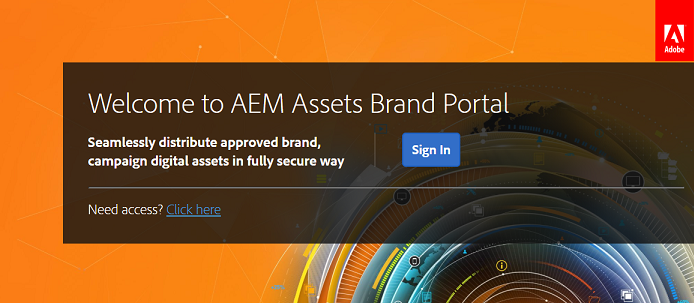

# 首次登入體驗 {#first-time-login-experience}

所有新的AEM Assets品牌入口網站使用者（包括管理員）都會使用首次登入體驗。 管理員將您新增至組織的品牌入口網站帳戶後，您不需要接受邀請，就會自動新增您。 您會收到歡迎電子郵件，其中包含貴組織品牌入口網站帳戶的連結。

以下是首次登入品牌入口網站的使用者要執行的步驟：

1. 開啟歡迎電子郵件，然後按一 **[!UICONTROL 下開始]**。

1. 在註冊頁面中，指定您的詳細資訊（包括名字、姓氏、密碼和國家／地區）。
   >[!NOTE]
   >
   >如果您是現有的Adobe Marketing cloud使用者，系統會顯示登入頁面，而非登入頁面。 若要登入Adobe Marketing Cloud，請輸入您的Adobe ID和密碼。

   >[!NOTE]
   >
   >如果您的組織使用企業ID，而非檢視此註冊頁面，則會將您重新導向至企業登入頁面。 如需詳細資訊，請 [參閱「企業ID」、登入和帳戶說明](https://helpx.adobe.com/in/enterprise/kb/enterprise-id-faq.html)。

1. 按一 **[!UICONTROL 下「繼續]**」，繼續前往您組織的品牌入口網站頁面。
1. 從「品牌入口網站」登入頁面，按一 **[!UICONTROL 下「登入]**」以登入品牌入口網站。

   

   >[!NOTE]
   >
   >如果您未與任何產品設定檔關聯，則無法存取品牌入口網站。 若要能夠登入品牌入口網站，您必須至少與一個AEM產品設定檔相關聯。
