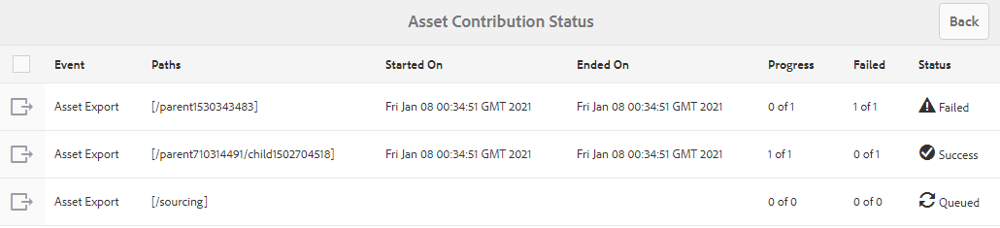

# 將貢獻資料夾發佈至Experience Manager Assets {#using-asset-souring-in-bp}

擁有適當權限的Brand Portal使用者可上傳多個資產或包含多個資產的資料夾至貢獻資料夾。 不過，Brand Portal使用者只能將資產上傳至 **新增** 檔案夾。 此 **共用** 資料夾的用途為發佈基線資產（參考內容），供Brand Portal使用者在建立要貢獻的新資產時使用。

Brand Portal使用者若有存取貢獻資料夾的權限，可執行下列活動：

* [下載資產需求](#download-asset-requirements)
* [上傳新資產至貢獻資料夾](#uplad-new-assets-to-contribution-folder)
* [將貢獻資料夾發佈至Experience Manager Assets](#publish-contribution-folder-to-aem)

## 下載資產需求 {#download-asset-requirements}

Brand Portal使用者只要Experience Manager Assets使用者共用貢獻資料夾，就能自動收到電子郵件/脈衝通知，讓他們下載簡短（資產需求）檔案，並從下載基線資產（參考內容） **共用** 資料夾，確保他們了解資產需求。

Brand Portal使用者會執行下列活動來下載資產需求：

* **下載簡介**:下載附加至貢獻資料夾的簡短（資產需求檔案），該資料夾包含資產相關資訊，例如資產類型、用途、支援的格式、最大資產大小等。
* **下載基準資產**:下載可用來了解所需資產類型的基準資產。 Brand Portal使用者可以參照這些資產，建立要貢獻的新資產。

Brand Portal控制面板會反映Brand Portal使用者可使用的所有現有資料夾，以及新共用的貢獻資料夾。 在此範例中，Brand Portal使用者只能存取新建立的貢獻資料夾，不會與使用者共用其他現有資料夾。

**若要下載資產需求：**

1. 登入您的Brand Portal執行個體。
1. 從Brand Portal控制面板選取貢獻資料夾。
1. 按一下 **[!UICONTROL 屬性]**. 將開啟包含貢獻資料夾詳細資訊的「屬性」窗口。

   

   

1. 按一下 **[!UICONTROL 下載簡介]** 在本機電腦上下載資產需求檔案的選項。

   

1. 返回Brand Portal控制面板。
1. 按一下以開啟貢獻資料夾，您會看到兩個子資料夾 — **[!UICONTROL 共用]** 和 **[!UICONTROL 新增]** 內。 SHARED資料夾包含管理員共用的所有基線資產（參考內容）。
1. 您可以下載 **[!UICONTROL 共用]** 包含本機電腦上所有基線資產的資料夾。
或者，您可以開啟 **[!UICONTROL 共用]** ，然後按一下 **下載** 圖示來下載個別檔案/資料夾。

   

   

請閱讀簡介（資產需求檔案），並參考基準資產以了解資產需求。 現在，您可以建立新的供貢獻資產，並將其上傳至貢獻資料夾。

## 上傳資產至貢獻資料夾 {#uplad-new-assets-to-contribution-folder}

完成資產需求後，Brand Portal使用者可以建立要貢獻的新資產，並將其上傳至貢獻資料夾內的NEW資料夾。

>[!NOTE]
>
>Brand Portal使用者只能將資產上傳至NEW資料夾。
>
>任何Brand Portal租用戶的上傳上限為 **10** GB會累計套用至所有貢獻資料夾。
>
>上傳至Brand Portal的資產不會處理以進行轉譯，也不會包含預覽。

>[!NOTE]
>
>建議在將貢獻資料夾發佈至Experience Manager Assets後釋放上傳空間，以便其他Brand Portal使用者能夠使用此資料夾進行貢獻。
>
>如果您需要將Brand Portal租用戶的上傳限制擴充至 **10** GB，請聯繫客戶支援，指定要求。

**上傳新資產：**

1. 登入您的Brand Portal執行個體。
Brand Portal控制面板會反映Brand Portal使用者可使用的所有現有資料夾，以及新共用的貢獻資料夾。

1. 選取貢獻資料夾，然後按一下以開啟它。 貢獻資料夾包含兩個子資料夾 —  **[!UICONTROL 共用]** 和 **[!UICONTROL 新增]**.

1. 按一下 **[!UICONTROL 新增]** 檔案夾。

   

1. 按一下 **[!UICONTROL 建立]** > **[!UICONTROL 檔案]** 上傳包含多個資產的個別檔案或資料夾(.zip)。

   

1. 瀏覽資產（檔案或資料夾）並上傳至 **[!UICONTROL 新增]** 檔案夾。

   

將所有資產或資料夾上傳至NEW資料夾後，將貢獻資料夾發佈至Experience Manager Assets。

## 將貢獻資料夾發佈至Experience Manager Assets {#publish-contribution-folder-to-aem}

Brand Portal使用者無需存取Experience Manager製作例項，即可將貢獻資料夾發佈至Experience Manager Assets。

請確定您已完成資產需求，並上傳新建立的資產於 **新增** 檔案夾。

**若要發佈貢獻資料夾：**

1. 登入您的Brand Portal執行個體。

1. 從Brand Portal控制面板選取貢獻資料夾。
1. 按一下 **[!UICONTROL 發佈至AEM]**.

   

   

會在發佈工作流程的不同階段，傳送電子郵件/脈衝通知給Brand Portal使用者和管理員：

1. **已排隊**  — 在Brand Portal中觸發發佈工作流程時，系統會傳送通知給Brand Portal使用者和Brand Portal管理員。

1. **完成**  — 貢獻資料夾成功發佈至Brand Portal時，系統會傳送通知給Experience Manager Assets使用者和Brand Portal管理員。

將新建立的資產發佈至Experience Manager Assets後，Brand Portal使用者可從NEW資料夾中刪除資產。 但Brand Portal管理員可從NEW和SHARED資料夾刪除資產。

建立貢獻資料夾的目標一旦達成，Brand Portal管理員就可以刪除貢獻資料夾，以釋放其他使用者的上傳空間。

## 發佈作業狀態 {#publishing-job-status}

管理員可使用兩份報表，檢視從Brand Portal發佈至Experience Manager Assets的資產貢獻資料夾狀態。

* 在Brand Portal中，導覽至 **[!UICONTROL 工具]** > **[!UICONTROL 資產貢獻狀態]**. 此報表會反映發佈工作流程不同階段的所有發佈作業的狀態。

   

* 在Experience Manager Assets中（內部部署或托管服務），導覽至 **[!UICONTROL 資產]** > **[!UICONTROL 工作]**. 此報表會反映所有發佈作業的最終狀態（成功或錯誤）。

   

* 在Experience Manager Assets as a Cloud Service中，導覽至 **[!UICONTROL 資產]** > **[!UICONTROL 工作]**.

   或者，您可以直接導覽至 **[!UICONTROL 工作]** 從全局導航。

   此報表會反映所有發佈作業的最終狀態（成功或錯誤），包括從Brand Portal匯入資產至Experience Manager Assetsas a Cloud Service。

   

<!--
>[!NOTE]
>
>Currently, no report is generated in AEM Assets as a Cloud Service for the Asset Sourcing workflow. 
-->
