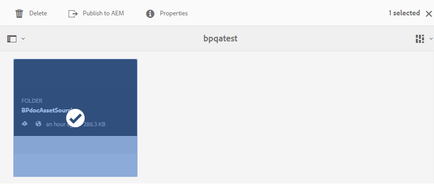

# 將貢獻資料夾發佈至AEM Assets {#publish-contribution-folder-to-aem}

品牌入口網站使用者可以將貢獻檔案夾發佈至AEM Assets，而不需存取AEM作者實例。

請確定您已完成[資產需求](brand-portal-download-asset-requirements.md)，並在貢獻檔案夾的&#x200B;**NEW**&#x200B;資料夾中上傳新建立的資產。 請參閱[將資產上傳至貢獻資料夾](brand-portal-upload-assets-to-contribution-folder.md)。

**若要發佈貢獻資料夾：**

1. 登入您的品牌入口網站例項。

1. 從「品牌入口網站」控制面板選取貢獻資料夾。
1. 按一下「發佈至AEM **[!UICONTROL 」。]**

   

   

在發佈工作流程的不同階段，會傳送電子郵件／脈衝通知給品牌入口網站使用者和管理員：
1. **已佇列** -當品牌入口網站中觸發發佈工作流程時，會傳送通知給品牌入口網站使用者和品牌入口網站管理員。

1. **完成** -當貢獻資料夾成功發佈至AEM Assets時，會傳送通知給品牌入口網站使用者和品牌入口網站管理員。

