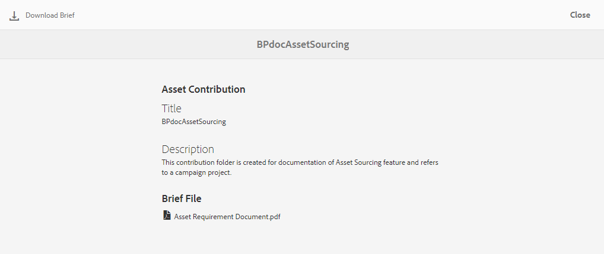

# 將貢獻資料夾發佈至AEM Assets{#using-asset-souring-in-bp}

具有適當權限的品牌入口網站使用者可以將多個資產或包含多個資產的檔案夾上傳至貢獻檔案夾。 不過，品牌入口網站使用者只能將資產上傳至&#x200B;**NEW**&#x200B;資料夾。 **SHARED**&#x200B;檔案夾的用途是分發基準資產（參考內容），供品牌入口網站使用者在建立新資產以作貢獻時使用。

具有存取貢獻資料夾權限的品牌入口網站使用者可執行下列活動：

* [下載資產需求](#download-asset-requirements)
* [將新資產上傳至貢獻資料夾](#uplad-new-assets-to-contribution-folder)
* [將貢獻資料夾發佈至AEM Assets](#publish-contribution-folder-to-aem)

## 下載資產需求{#download-asset-requirements}

每當使用者共用貢獻資料夾時，品牌入口網站的使用者都會自動收到電子郵件／脈衝通知AEM，讓他們從&#x200B;**SHARED**&#x200B;資料夾下載簡短（資產需求）檔案，以及下載基準資產（參考內容），以確保他們瞭解資產需求。

品牌入口網站使用者會執行下列活動以下載資產需求：

* **下載簡介**:下載附在貢獻檔案夾中的簡短（資產需求檔案），該檔案夾包含資產相關資訊，例如資產類型、用途、支援的格式、最大資產大小等。
* **下載基準資產**:下載可用來瞭解所需資產類型的基準資產。品牌入口網站使用者可使用這些資產作為參考，以建立新資產以作貢獻。

「品牌入口網站」控制面板會反映品牌入口網站使用者允許的所有現有資料夾，以及新共用的貢獻資料夾。 在此範例中，品牌入口網站使用者僅能存取新建立的貢獻資料夾，不會與使用者共用其他現有資料夾。

**若要下載資產需求：**

1. 登入您的品牌入口網站例項。
1. 從「品牌入口網站」控制面板選取貢獻資料夾。
1. 按一下&#x200B;**[!UICONTROL 屬性]**。 此時將開啟包含貢獻資料夾詳細資訊的「屬性」窗口。

   

   

1. 按一下&#x200B;**[!UICONTROL 下載簡報]**&#x200B;選項，將資產需求檔案下載至本機電腦。

   

1. 返回品牌入口網站儀表板。
1. 按一下以開啟貢獻資料夾，您可在貢獻資料夾中看到兩個子資料夾-**[!UICONTROL SHARED]**&#x200B;和&#x200B;**[!UICONTROL NEW]**。 SHARED資料夾包含管理員共用的所有基準資產（參考內容）。
1. 您可以下載&#x200B;**[!UICONTROL SHARED]**資料夾，其中包含本機電腦上所有的基準資產。
或者，您可以開啟**[!UICONTROL SHARED]**&#x200B;資料夾，然後按一下&#x200B;**下載**&#x200B;表徵圖以下載單個檔案／資料夾。

   

   

請詳閱簡介（資產需求檔案），並參考基準資產以瞭解資產需求。 現在，您可以建立新的貢獻資產，並將其上傳至貢獻資料夾。

## 上傳資產至貢獻資料夾{#uplad-new-assets-to-contribution-folder}

在完成資產需求後，品牌入口網站使用者可以建立新資產以供貢獻，並將它們上傳至貢獻資料夾中的NEW資料夾。

>[!NOTE]
>
>品牌入口網站使用者只能將資產上傳至NEW檔案夾。
>
>任何品牌入口網站租用戶的上傳上限為&#x200B;**10** GB，累計會套用至所有貢獻資料夾。

>[!NOTE]
>
>建議在將貢獻資料夾發佈至AEM Assets後釋放上傳空間，以便讓其他品牌入口網站使用者可使用該資料夾進行貢獻。
>
>如果您需要將品牌入口網站的上傳限制擴充至&#x200B;**10** GB以外，請連絡Adobe支援，指定此需求。

**若要上傳新資產：**

1. 登入您的品牌入口網站例項。
「品牌入口網站」控制面板會反映品牌入口網站使用者允許使用的所有現有資料夾，以及新共用的貢獻資料夾。

1. 選取貢獻資料夾，然後按一下以開啟它。 貢獻資料夾包含兩個子資料夾- **[!UICONTROL SHARED]**&#x200B;和&#x200B;**[!UICONTROL NEW]**。

1. 按一下&#x200B;**[!UICONTROL NEW]**&#x200B;資料夾。

   

1. 按一下「建立&#x200B;**[!UICONTROL >]** > **[!UICONTROL 檔案]**」，上傳包含多個資產的個別檔案或檔案夾(.zip)。

   

1. 瀏覽資產（檔案或檔案夾）並上傳至&#x200B;**[!UICONTROL NEW]**&#x200B;檔案夾。

   

將所有資產或檔案夾上傳至NEW檔案夾後，將貢獻檔案夾發佈至AEM Assets。

## 將貢獻資料夾發佈至AEM Assets{#publish-contribution-folder-to-aem}

品牌入口網站使用者可將貢獻資料夾發佈至AEM Assets，而不需存取作AEM者例項。

請確定您已完成資產需求並上傳貢獻資料夾內&#x200B;**NEW**&#x200B;資料夾中新建立的資產。

**若要發佈貢獻資料夾：**

1. 登入您的品牌入口網站例項。

1. 從「品牌入口網站」控制面板選取貢獻資料夾。
1. 按一下「發佈至AEM ]**」。**[!UICONTROL 

   

   

在發佈工作流程的不同階段，會傳送電子郵件／脈衝通知給品牌入口網站使用者和管理員：
1. **已佇列** -當品牌入口網站中觸發發佈工作流程時，會傳送通知給品牌入口網站使用者和品牌入口網站管理員。

1. **完成** -當貢獻資料夾成功發佈至AEM Assets時，會傳送通知給品牌入口網站使用者和品牌入口網站管理員。

將新建立的資產發佈至AEM Assets後，品牌入口網站使用者可以從NEW檔案夾中刪除這些資產。 但是，品牌入口網站管理員可以從NEW和SHARED資料夾刪除資產。

當建立貢獻資料夾的目標達成後，品牌入口網站管理員可以刪除貢獻資料夾，以釋放其他使用者的上傳空間。

## 發佈工作狀態{#publishing-job-status}

管理員可使用兩個報告來檢視從Brand Portal發佈至AEM Assets的資產貢獻資料夾狀態。

* 在品牌入口網站中，導覽至「工具&#x200B;**** > **[!UICONTROL 資產貢獻狀態]**」。 此報表反映發佈工作流程不同階段的所有發佈工作狀態。

   

* 在AEM Assets（內部部署或受管理服務），導航至&#x200B;**[!UICONTROL Assets]** > **[!UICONTROL Jobs]**。 此報告反映所有發佈工作的最終狀態（成功或錯誤）。

   

* 在AEM Assets作為Cloud Service，導航至&#x200B;**[!UICONTROL Assets]** > **[!UICONTROL Jobs]**。

   或者，您也可以從全域導覽直接導覽至&#x200B;**[!UICONTROL Jobs]**。

   此報表反映所有發佈工作的最終狀態（成功或錯誤），包括將資產從Brand Portal匯入至AEM Assets做為Cloud Service。

   

<!--
>[!NOTE]
>
>Currently, no report is generated in AEM Assets as a Cloud Service for the Asset Sourcing workflow. 
-->

