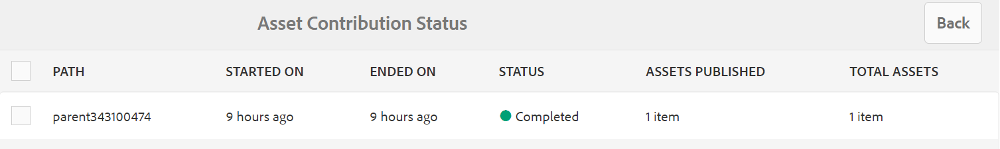
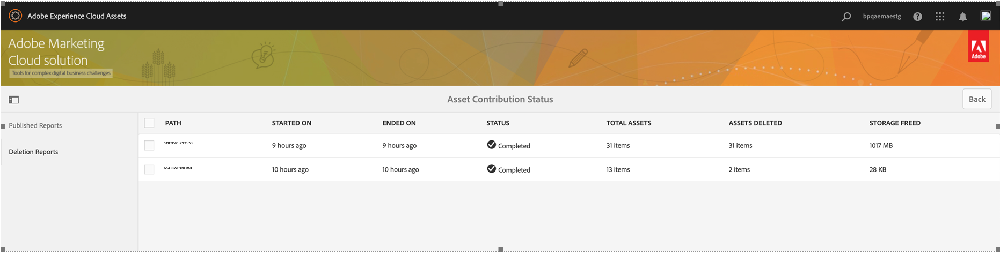

# 將貢獻資料夾發佈至Experience Manager Assets {#using-asset-souring-in-bp}

具有適當許可權的Brand Portal使用者可以將多個資產或包含多個資產的資料夾上傳至貢獻資料夾。 不過，Brand Portal使用者只能將資產上傳至 **新增** 資料夾。 此 **已共用** 資料夾用於散佈基線資產（參考內容），供Brand Portal使用者在建立新資產以進行貢獻時使用。

有權存取「貢獻」資料夾的Brand Portal使用者可以執行下列活動：

* [下載資產需求](#download-asset-requirements)
* [將新資產上傳至貢獻資料夾](#uplad-new-assets-to-contribution-folder)
* [將貢獻資料夾發佈至Experience Manager Assets](#publish-contribution-folder-to-aem)

## 下載資產需求 {#download-asset-requirements}

每當Brand Portal使用者共用貢獻資料夾時，Experience Manager Assets使用者會自動收到電子郵件/脈衝通知，好讓他們下載簡短（資產需求）檔案，以及從 **已共用** 資料夾，確保他們瞭解資產需求。

Brand Portal使用者會執行下列活動來下載資產需求：

* **下載簡介**：下載附加至貢獻資料夾的簡報（資產需求檔案），其中包含資產型別、用途、支援的格式、資產大小上限等資產相關資訊。
* **下載基準線資產**：下載基線資產，瞭解所需的資產型別。 Brand Portal使用者可以使用這些資產作為參考，以建立新的資產進行貢獻。

Brand Portal儀表板會反映Brand Portal使用者允許的所有現有資料夾，以及新共用的貢獻資料夾。 在此範例中，Brand Portal使用者僅能存取新建立的貢獻資料夾，其他現有資料夾不會與使用者共用。

**若要下載資產需求：**

1. 登入您的Brand Portal執行個體。
1. 從Brand Portal儀表板選取貢獻資料夾。
1. 按一下 **[!UICONTROL 屬性]**. 包含貢獻資料夾詳細資訊的「屬性」視窗隨即開啟。

   

   

1. 按一下 **[!UICONTROL 下載簡介]** 將資產需求檔案下載至本機電腦的選項。

   

1. 返回Brand Portal儀表板。
1. 按一下以開啟貢獻資料夾，您可以看到兩個子資料夾 — **[!UICONTROL 已共用]** 和 **[!UICONTROL 新增]** 在貢獻資料夾中。 「共用」資料夾包含管理員共用的所有基準資產（參考內容）。
1. 您可以下載 **[!UICONTROL 已共用]** 包含您本機電腦上所有基準資產的資料夾。
或者，您也可以開啟 **[!UICONTROL 已共用]** 資料夾，然後按一下 **下載** 圖示可下載個別檔案/資料夾。

   

   

瀏覽簡報（資產需求檔案），並參閱基準資產，以瞭解資產需求。 現在，您可以為貢獻建立新資產，並將其上傳至貢獻資料夾。

## 將資產上傳至貢獻資料夾 {#upload-new-assets-to-contribution-folder}

完成資產要求後，Brand Portal使用者可以為貢獻建立新資產，並將它們上傳到貢獻資料夾內的NEW資料夾。 使用者可以將多個資產上傳到資產貢獻資料夾。 不過，一次只能建立一個資料夾。

>[!NOTE]
>
>Brand Portal使用者可以上傳資產(最多 **2** GB （每個檔案大小）。
>
>任何Brand Portal租使用者的最大上傳限製為 **10** GB，會累計套用至所有貢獻資料夾。
>
>上傳至Brand Portal的資產不會處理轉譯，且不包含預覽。

>[!NOTE]
>
>建議在發佈貢獻資料夾至Experience Manager Assets後發佈上傳空間，以供其他Brand Portal使用者貢獻。
>
>如果需要延長Brand Portal租使用者的上傳限制超過 **10** GB，請聯絡客戶支援以指定需求。

**若要上傳新資產：**

1. 登入您的Brand Portal執行個體。
Brand Portal儀表板會反映Brand Portal使用者允許的所有現有資料夾，以及新共用的貢獻資料夾。

1. 選取貢獻資料夾，然後按一下以開啟它。 貢獻資料夾包含兩個子資料夾 —  **[!UICONTROL 已共用]** 和 **[!UICONTROL 新增]**.

1. 按一下 **[!UICONTROL 新增]** 資料夾。

   

1. 按一下 **[!UICONTROL 建立]** > **[!UICONTROL 檔案]** 上傳個別檔案或包含多個資產的資料夾(.zip)。

   

1. 瀏覽並將資產（檔案或資料夾）上傳至 **[!UICONTROL 新增]** 資料夾。

   

將所有資產或資料夾上傳至「新增」資料夾後，將貢獻資料夾發佈至Experience Manager Assets。

## 將貢獻資料夾發佈至Experience Manager Assets {#publish-contribution-folder-to-aem}

Brand Portal使用者可以將contribution資料夾發佈到Experience Manager Assets，而不需要存取Experience Manager作者例項。

確保您已滿足資產需求，並在中上傳新建立的資產 **新增** 貢獻資料夾中的資料夾。

**若要發佈貢獻資料夾：**

1. 登入您的Brand Portal執行個體。

1. 從Brand Portal儀表板選取貢獻資料夾。
1. 按一下 **[!UICONTROL 發佈至AEM]**.

   

   

在發佈工作流程的不同階段會傳送電子郵件/脈衝通知給Brand Portal使用者和管理員：

1. **已排入佇列**  — 在Brand Portal中觸發發佈工作流程時，會傳送通知給Brand Portal使用者和Brand Portal管理員。

1. **完成**  — 當貢獻資料夾成功發佈至Experience Manager Assets時，會傳送通知給Brand Portal使用者和Brand Portal管理員。

將新建立的資產發佈到Experience Manager Assets後，Brand Portal使用者可以從「新增」資料夾中刪除這些資產。 然而，Brand Portal管理員可以從NEW和SHARED資料夾中刪除資產。

一旦達到建立貢獻資料夾的目標，Brand Portal管理員可以刪除貢獻資料夾，以釋出上傳空間給其他使用者。

## 發佈工作狀態 {#publishing-job-status}

管理員可以利用兩個報表來檢視從Brand Portal發佈到Experience Manager Assets的資產貢獻資料夾狀態。

* 在Brand Portal中，導覽至 **[!UICONTROL 工具]** > **[!UICONTROL 資產貢獻狀態]**. 此報表反映發佈工作流程不同階段的所有發佈工作狀態。

   

* 在Experience Manager Assets （內部部署或受管理的服務）中，導覽至 **[!UICONTROL 資產]** > **[!UICONTROL 工作]**. 此報表可反映所有發佈工作的最終狀態（成功或錯誤）。

   

* 在Experience Manager Assetsas a Cloud Service中，導覽至 **[!UICONTROL 資產]** > **[!UICONTROL 工作]**.

   或者，您可以直接導覽至 **[!UICONTROL 工作]** 從全域導覽。

   此報表可反映所有發佈工作的最終狀態（成功或錯誤），包括從Brand Portal將資產匯入Experience Manager Assetsas a Cloud Service。

   

<!--
>[!NOTE]
>
>Currently, no report is generated in AEM Assets as a Cloud Service for the Asset Sourcing workflow. 
-->

## 從「貢獻」資料夾中自動刪除發佈至Experience Manager Assets的資產 {#automatically-delete-published-assets-from-contribution-folder}

Brand Portal現在每十二小時執行一次自動作業，以掃描所有「貢獻」資料夾並刪除發佈至AEM的所有資產。 因此，您不需要手動刪除「貢獻」資料夾中的資產，以將資料夾大小保持在 [臨界值限制](#upload-new-assets-to-contribution-folder). 您也可以監視過去七天內自動執行的刪除工作的狀態。 工作的報表提供下列詳細資訊：

* 工作開始時間
* 工作結束時間
* 工作狀態
* 工作中包含的資產總數
* 在工作中成功刪除的資產總數
* 因工作執行而可供使用的儲存空間總計

   

您也可以進一步向下展開，以檢視刪除工作中每個資產的詳細資訊。 資產標題、大小、作者、刪除狀態和刪除時間等詳細資訊會包含在報表中。

>[!NOTE]
>
> * 客戶可以要求Adobe客戶支援停用和重新啟用自動刪除工作功能，或變更其執行頻率。
> * Experience Manager 6.5.13.0和更新版本提供此功能。

### 檢視和下載刪除報告 {#view-delete-jobs}

若要檢視和下載刪除工作的報告：

1. 在Brand Portal中，導覽至 **[!UICONTROL 工具]**>**[!UICONTROL 資產貢獻狀態]**>**[!UICONTROL 刪除報告]** 選項。

1. 選取工作並按一下 **[!UICONTROL 檢視]** 以檢視報表。

   檢視刪除工作中每個資產的詳細資訊。 資產標題、大小、作者、刪除狀態和刪除時間等詳細資訊會包含在報表中。 按一下 **[!UICONTROL 下載]** 若要以CSV格式下載工作的報表。

   報表中資產的刪除狀態可能具有以下值：

   * **已刪除**  — 已成功從「貢獻」資料夾中刪除資產。

   * **找不到** - Brand Portal在「貢獻」資料夾中找不到資產。 資產已手動從資料夾中刪除。

   * **已略過** - Brand Portal已略過資產刪除，因為「貢獻」資料夾中的資產有可用的新版本，而且尚未發佈至Experience Manager。

   * **已失敗** - Brand Portal無法刪除資產。 刪除具有下列專案的資產會有三次重試嘗試： `Failed` 刪除狀態。 如果資產在第三次重試刪除嘗試時失敗，您需要手動刪除資產。

### 刪除報告

Brand Portal也可讓您選取一或多個報表，然後手動將其刪除。

若要刪除報告：

1. 導覽至 **[!UICONTROL 工具]**>**[!UICONTROL 資產貢獻狀態]**>**[!UICONTROL 刪除報告]** 選項。

1. 選取一或多個報告並按一下 **[!UICONTROL 刪除]**.

