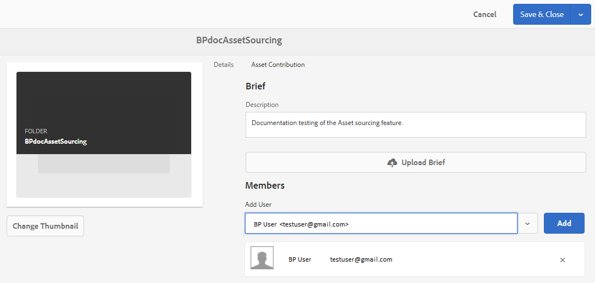
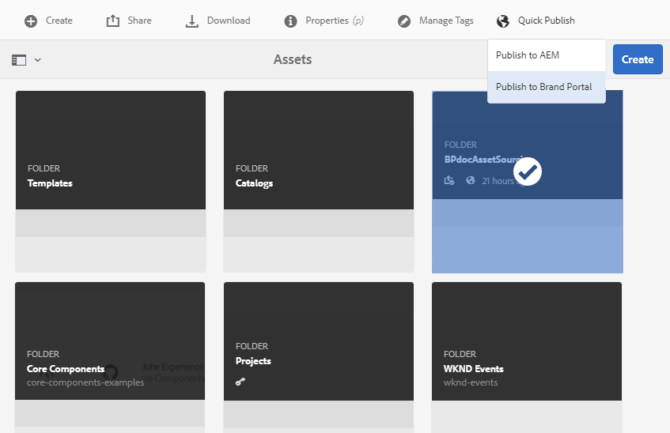

# 在AEM Assets {#configure-contribution-folder}中設定貢獻資料夾

對於協作資產來源補充，AEM使用者（管理員和非擁有權限的管理員使用者）可以建立類型&#x200B;**Asset Contribution**&#x200B;的新資料夾，確保所建立的新資料夾可供Brand Portal使用者提交資產。  這會自動觸發在新建立的&#x200B;**Contribution**&#x200B;資料夾內建立另外兩個子資料夾（稱為&#x200B;**SHARED**&#x200B;和&#x200B;**NEW**）的工作流程。

接著，AEM使用者將應新增至貢獻資料夾的資產類型以及一組基準資產上傳至&#x200B;**SHARED**&#x200B;資料夾以定義資產需求，確保Brand Portal使用者具備所需資訊。 然後，管理員可先授與作用中Brand Portal使用者對貢獻資料夾的存取權，再將新建立的貢獻資料夾發佈至Brand Portal。

下列影片示範如何在AEM Assets中設定「貢獻」資料夾：

>[!VIDEO](https://video.tv.adobe.com/v/30547)

AEM使用者在設定貢獻資料夾時執行下列活動：

* [建立貢獻資料夾](#create-contribution-folder)
* [上傳資產需求並指派貢獻者](#configure-contribution-folder-properties)
* [上傳基線資產](#uplad-new-assets-to-contribution-folder)
* [將貢獻資料夾從AEM Assets發佈至Brand Portal](#publish-contribution-folder-to-brand-portal)

## 建立貢獻資料夾{#create-contribution-folder}

AEM管理員和非擁有建立新資料夾權限的管理員使用者，可以在AEM Assets中建立貢獻資料夾。
若要建立貢獻資料夾，請建立「資產貢獻」類型的新資料夾，確保已建立的新資料夾可供Brand Portal使用者提交資產。  這會自動觸發工作流程，在貢獻資料夾內建立另外兩個子資料夾，稱為SHARED和NEW。

>[!NOTE]
>
>您可以在資料夾內建立多個貢獻資料夾。 請勿在另一個貢獻資料夾內建立貢獻資料夾。

您可以在建立貢獻資料夾時個別設定貢獻資料夾屬性。 在此範例中，我們會個別設定屬性。

**若要建立貢獻資料夾：**
1. 登入您的AEM Assets執行個體。

1. 導覽至&#x200B;**[!UICONTROL Assets]** > **[!UICONTROL Files]**。 它會列出AEM Assets存放庫中的所有現有資料夾。

1. 按一下&#x200B;**[!UICONTROL 建立]**&#x200B;以建立新資料夾。 **[!UICONTROL 「建立資]** 料夾」對話框開啟。

1. 輸入資料夾的&#x200B;**[!UICONTROL Title]**&#x200B;和&#x200B;**[!UICONTROL Name]**&#x200B;並選中&#x200B;**[!UICONTROL 資產貢獻]**複選框。
建議使用小寫字母而不含任何空格來命名資料夾。

1. 按一下&#x200B;**[!UICONTROL 建立]**。您可以在AEM Assets存放庫中看到列出的貢獻資料夾。

   >[!NOTE]
   >
   >非管理員使用者可以建立和共用資產貢獻資料夾，但無法修改或刪除。

   

1. 按一下以開啟貢獻資料夾，您會看到兩個子資料夾 — **[!UICONTROL SHARED]**&#x200B;和&#x200B;**[!UICONTROL NEW]**&#x200B;會自動在貢獻資料夾中建立。

   

## 配置貢獻資料夾屬性{#configure-contribution-folder-properties}

AEM管理員在設定貢獻資料夾的屬性時，會執行下列活動。

* **新增說明**:提供貢獻資料夾的高階說明。
* **上傳簡報**:上傳包含資產相關資訊的資產需求檔案。
* **新增貢獻者**:新增Brand Portal使用者，以授與他們對貢獻資料夾的存取權。

資產需求是指管理員為協助貢獻者(Brand Portal使用者)了解貢獻資料夾的需求和需求而提供的詳細資訊。 管理員上傳資產需求檔案，其中包含應新增至貢獻資料夾的資產類型及資產相關資訊（例如用途、影像類型、最大大小等）的簡介。

**若要設定貢獻資料夾屬性：**

1. 登入您的AEM Assets執行個體。

1. 導覽至「**[!UICONTROL 資產>檔案]**」，然後找出貢獻資料夾。
1. 選擇貢獻資料夾，然後按一下&#x200B;**[!UICONTROL 屬性]**&#x200B;以開啟資料夾屬性窗口。

   

   

1. 導覽至&#x200B;**[!UICONTROL 資產貢獻]**&#x200B;標籤。
1. 輸入貢獻資料夾的高層級&#x200B;**[!UICONTROL 說明]**。
1. 按一下&#x200B;**[!UICONTROL 上傳簡報]**&#x200B;從本機電腦瀏覽並上傳&#x200B;**資產需求檔案**。

   

1. 在&#x200B;**[!UICONTROL 新增使用者]**&#x200B;欄位中，新增您要與其共用貢獻資料夾的Brand Portal使用者。 這些使用者可使用Brand Portal介面存取內容，並上傳至貢獻資料夾。
1. 按一下「**[!UICONTROL 儲存]**」。

   

>[!NOTE]
>
>搜尋結果以AEM Assets中設定的Brand Portal使用者清單為基礎。 請確定您有更新的Brand Portal使用者清單。

## 上傳資產至貢獻資料夾{#uplad-new-assets-to-contribution-folder}

Brand Portal使用者可下載資產需求，以了解貢獻的需求。
然後，他們可以建立貢獻的新資產，並將其上傳至貢獻資料夾內的NEW資料夾。

>[!NOTE]
>
>Brand Portal使用者只能將資產上傳至NEW資料夾。
>
>任何Brand Portal租用戶的上傳上限為&#x200B;**10** GB，會累計套用至所有貢獻資料夾。

將新建立的資產發佈至AEM Assets後，Brand Portal使用者可從NEW資料夾中刪除資產。 但Brand Portal管理員可從NEW和SHARED資料夾刪除資產。

建立貢獻資料夾的目標一旦達成，Brand Portal管理員就可以刪除貢獻資料夾，以釋放其他使用者的上傳空間。

>[!NOTE]
>
>建議在將貢獻資料夾發佈至AEM Assets後釋放上傳空間，以便其他Brand Portal使用者能夠使用此資料夾進行貢獻。
>
>如果需要將Brand Portal租用戶的上傳限制延長至&#x200B;**10** GB以外，請聯絡Adobe支援，指定需求。

**上傳新資產：**

1. 登入您的Brand Portal執行個體。
Brand Portal控制面板會反映Brand Portal使用者可使用的所有現有資料夾，以及新共用的貢獻資料夾。

1. 選取貢獻資料夾，然後按一下以開啟它。 貢獻資料夾包含兩個子資料夾 — **[!UICONTROL SHARED]**&#x200B;和&#x200B;**[!UICONTROL NEW]**。

1. 按一下&#x200B;**[!UICONTROL NEW]**&#x200B;資料夾。

   

1. 按一下「**[!UICONTROL 建立]** > **[!UICONTROL 檔案]**」以上傳包含多個資產的個別檔案或資料夾(.zip)。

   

1. 瀏覽資產（檔案或資料夾）並上傳至&#x200B;**[!UICONTROL NEW]**&#x200B;資料夾。

   

將所有資產或資料夾上傳至NEW資料夾後，將貢獻資料夾發佈至AEM Assets。

## 將貢獻資料夾發佈至Brand Portal {#publish-contribution-folder-to-brand-portal}

設定貢獻資料夾後，AEM使用者（管理員/非管理員使用者）就可以將貢獻資料夾從AEM Assets發佈至Brand Portal。 擁有存取貢獻資料夾權限的Brand Portal使用者會在完成發佈動作時收到電子郵件/脈衝通知。

**若要發佈貢獻資料夾：**

1. 登入您的AEM Assets執行個體。

1. 導覽至&#x200B;**[!UICONTROL Assets > Files]**，然後找出您要發佈至Brand Portal的貢獻資料夾。
1. 選取貢獻資料夾，然後按一下&#x200B;**[!UICONTROL 快速發佈]** > **[!UICONTROL 發佈至Brand Portal]**。

   

   貢獻資料夾發佈至Brand Portal後，您會收到成功訊息。

會傳送電子郵件/脈衝通知給指派給貢獻資料夾的Brand Portal使用者。 Brand Portal使用者可以存取貢獻資料夾並開始貢獻。 請參閱[將資產上傳至貢獻資料夾並發佈至AEM Assets](brand-portal-publish-contribution-folder-to-aem-assets.md)。
