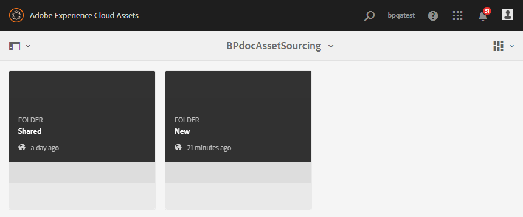

# 在Experience Manager Assets中設定貢獻資料夾 {#configure-contribution-folder}

對於合作資產來源，Experience Manager Assets使用者（擁有許可權的管理員和非管理員使用者）可以建立型別為的新資料夾 **資產貢獻**，確保建立的新資料夾可供Brand Portal使用者提交資產。  這會自動觸發建立兩個額外子資料夾的工作流程，稱為 **已共用** 和 **新增**，在新建立的 **貢獻** 資料夾。

Experience Manager Assets使用者接著會上傳應新增至貢獻資料夾的資產型別簡介，以及一組基準資產，以定義資產需求。 **已共用** 資料夾，以確保Brand Portal使用者擁有他們需要的資訊。 然後，管理員可在將新建立的Contribution資料夾發佈至Brand Portal之前，先授予作用中Brand Portal使用者對貢獻資料夾的存取權。

以下影片示範如何在Experience Manager Assets中設定「貢獻」資料夾：

>[!VIDEO](https://video.tv.adobe.com/v/30547)

Experience Manager Assets使用者會在設定貢獻資料夾時執行下列活動：

* [建立貢獻資料夾](#create-contribution-folder)
* [上傳資產需求並指派貢獻者](#configure-contribution-folder-properties)
* [上傳基準線資產](#uplad-new-assets-to-contribution-folder)
* [從Experience Manager Assets發佈貢獻資料夾到Brand Portal](#publish-contribution-folder-to-brand-portal)

## 建立貢獻資料夾 {#create-contribution-folder}

有權建立新資料夾的Experience Manager Assets管理員和非管理員使用者可以在Experience Manager Assets中建立貢獻資料夾。
若要建立貢獻資料夾，請建立「資產貢獻」型別的新資料夾，以確保建立的新資料夾可供Brand Portal使用者提交資產。  這會自動觸發在貢獻資料夾中建立兩個其他子資料夾（稱為SHARED和NEW）的工作流程。

>[!NOTE]
>
>管理員可以在一個資料夾中建立多個資產貢獻資料夾。
>
>資產貢獻資料夾包含用於資產分佈和貢獻的NEW和SHARED資料夾。 請勿在貢獻資料夾中建立資產、資料夾或貢獻資料夾。

您可以在建立貢獻資料夾時，個別設定貢獻資料夾屬性。 在此範例中，我們分別設定屬性。

**若要建立貢獻資料夾：**

1. 登入您的Experience Manager Assets執行個體。

1. 導覽至 **[!UICONTROL 資產]** > **[!UICONTROL 檔案]**. 其中列出Experience Manager Assets存放庫中的所有現有資料夾。

1. 按一下 **[!UICONTROL 建立]** 以建立新資料夾。 **[!UICONTROL 建立資料夾]** 對話方塊開啟。

1. 輸入 **[!UICONTROL 標題]** 和 **[!UICONTROL 名稱]** ，然後選取 **[!UICONTROL 資產貢獻]** 核取方塊。
建議使用不含任何空格的小寫字母來命名資料夾。

1. 按一下&#x200B;**[!UICONTROL 建立]**。您可以看到Experience Manager Assets存放庫中列出的貢獻資料夾。

   >[!NOTE]
   >
   >非管理員使用者可以建立和共用資產貢獻資料夾，但無法修改或刪除它。

   

1. 按一下以開啟貢獻資料夾，您可以看到兩個子資料夾 — **[!UICONTROL 已共用]** 和 **[!UICONTROL 新增]** 都會自動在「貢獻」資料夾中建立。

   

## 設定貢獻資料夾屬性 {#configure-contribution-folder-properties}

Experience Manager Assets管理員會在設定貢獻資料夾的屬性時執行下列活動。

* **新增說明**：提供貢獻資料夾的高層級說明。
* **上傳簡報**：上傳包含資產相關資訊的資產需求檔案。
* **新增參與者**：新增Brand Portal使用者，以授予他們貢獻資料夾的存取權。

資產需求是指管理員提供的詳細資訊，可協助貢獻者(Brand Portal使用者)瞭解貢獻資料夾的需求和需求。 管理員會上傳資產需求檔案，其中包含應新增至貢獻資料夾的資產型別簡介以及資產相關資訊，例如用途、影像型別、最大大小等。

**若要設定貢獻資料夾屬性：**

1. 登入您的Experience Manager Assets執行個體。

1. 導覽至 **[!UICONTROL 「資產」>「檔案」]** 並找到貢獻資料夾。
1. 選取貢獻資料夾並按一下 **[!UICONTROL 屬性]** 以開啟「資料夾屬性」視窗。

   

   

1. 導覽至 **[!UICONTROL 資產貢獻]** 標籤。
1. 輸入高階 **[!UICONTROL 說明]** 貢獻資料夾的。
1. 按一下 **[!UICONTROL 上傳簡報]** 從本機電腦瀏覽並上傳 **資產需求檔案**.

   

1. 在 **[!UICONTROL 新增使用者]** 欄位中，新增您要共用貢獻資料夾的Brand Portal使用者。 這些使用者可以使用Brand Portal介面存取內容並將其上傳到貢獻資料夾。
1. 按一下「**[!UICONTROL 儲存]**」。

   

>[!NOTE]
>
>搜尋結果以Experience Manager Assets中設定的Brand Portal使用者清單為基礎。 確定您有更新的Brand Portal使用者清單。

管理員可以下載 `user.csv` 檔案來源 [!DNL Admin Console] 並將其作為新增Brand Portal使用者的基本範本。 前往 [!UICONTROL 使用者] 並按一下 [!UICONTROL 將使用者清單匯出為csv] 下載選項 `users.csv` 檔案。 下列範例使用者列出新增使用者所需的詳細屬性。 使用者專案的唯一必要屬性是 `Email` 而所有其他屬性則為選用屬性。

[取得檔案](assets/users.csv)

## 將資產上傳至貢獻資料夾 {#uplad-new-assets-to-contribution-folder}

Experience Manager Assets使用者將一組基準資產上傳至 **已共用** 資料夾，以確保Brand Portal使用者擁有他們需要的資訊。

**若要上傳基準線資產：**

1. 登入您的Experience Manager Assets執行個體。

1. 導覽至 **[!UICONTROL 「資產」>「檔案」]** 並找到貢獻資料夾。

1. 選取貢獻資料夾，然後按一下以開啟它。

1. 按一下 **[!UICONTROL 新增]** 資料夾。

   

1. 按一下 **[!UICONTROL 建立]** > **[!UICONTROL 檔案]** 上傳個別檔案或包含多個資產的資料夾(.zip)。

   

1. 瀏覽並將資產（檔案或資料夾）上傳至 **[!UICONTROL 新增]** 資料夾。

   

將所有資產或資料夾上傳至「新增」資料夾後，將貢獻資料夾發佈至Experience Manager Assets。

## 將貢獻資料夾發佈至Brand Portal {#publish-contribution-folder-to-brand-portal}

設定貢獻資料夾後，Experience Manager Assets使用者（管理員/非管理員使用者）可以將貢獻資料夾從Experience Manager Assets發佈到Brand Portal。 有權存取「貢獻」資料夾的Brand Portal使用者將在發佈動作完成後收到電子郵件/脈衝通知。

**若要發佈貢獻資料夾：**

1. 登入您的Experience Manager Assets執行個體。

1. 導覽至 **[!UICONTROL 「資產」>「檔案」]** 並找到您要發佈至Brand Portal的貢獻資料夾。
1. 選取貢獻資料夾並按一下 **[!UICONTROL 快速發佈]** > **[!UICONTROL 發佈至Brand Portal]**.

   

   一旦貢獻資料夾發佈至Brand Portal，您將會收到一則成功訊息。

電子郵件/脈衝通知會傳送給指派至貢獻資料夾的Brand Portal使用者。 Brand Portal使用者可以存取貢獻資料夾並開始貢獻。 請參閱， [將資產上傳至貢獻資料夾並發佈至Experience Manager Assets](brand-portal-publish-contribution-folder-to-aem-assets.md).
