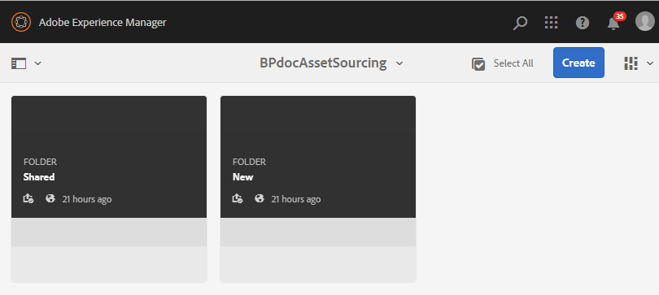
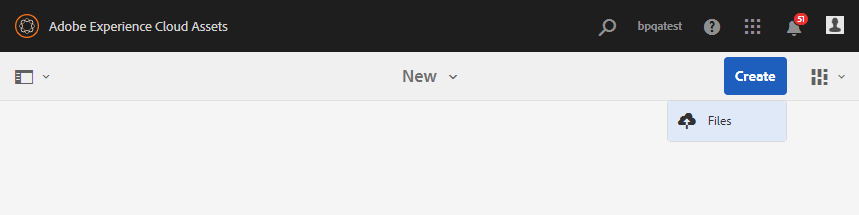

# 在Experience Manager Assets配置稿件夾 {#configure-contribution-folder}

對於協作資產採購，Experience Manager Assets用戶（具有權限的管理員和非管理員用戶）可以建立新類型的資料夾 **資產貢獻**，確保建立的新資料夾可由Brand Portal用戶提交資產。  這將自動觸發建立兩個附加子資料夾的工作流，該子資料夾稱為 **共用** 和 **新建**，位於新建立的 **貢獻** 的子菜單。

然後，Experience Manager Assets用戶通過將應添加到貢獻資料夾的資產類型以及一組基準資產的簡介上載到該資料夾來定義資產需求 **共用** 資料夾，確保Brand Portal用戶獲得所需資訊。 然後，管理員可以在將新建立的「貢獻」資料夾發佈到Brand Portal之前，授予活動的Brand Portal用戶對貢獻資料夾的訪問權限。

以下視頻演示了如何在Experience Manager Assets配置Contribution資料夾：

>[!VIDEO](https://video.tv.adobe.com/v/30547)

Experience Manager Assets用戶在配置貢獻資料夾時執行以下活動：

* [建立稿件資料夾](#create-contribution-folder)
* [上載資產需求並分配參與者](#configure-contribution-folder-properties)
* [上載基準資產](#uplad-new-assets-to-contribution-folder)
* [發佈從Experience Manager Assets到Brand Portal的稿件資料夾](#publish-contribution-folder-to-brand-portal)

## 建立稿件資料夾 {#create-contribution-folder}

Experience Manager Assets管理員和非管理員用戶有權建立新資料夾，可以在Experience Manager Assets建立貢獻資料夾。
要建立貢獻資料夾，請建立一個「資產貢獻」類型的新資料夾，確保建立的新資料夾可由Brand Portal用戶提交資產。  這會自動觸發一個工作流，該工作流在貢獻資料夾內建立另外兩個子資料夾，稱為SHARED和NEW。

>[!NOTE]
>
>管理員可以在一個資料夾中建立多個資產貢獻資料夾。
>
>資產貢獻資料夾包含用於資產分配和貢獻的NEW和SHARED資料夾。 不要在貢獻資料夾中建立資產、資料夾或貢獻資料夾。

您可以在建立貢獻資料夾時分別配置貢獻資料夾屬性。 在本示例中，我們將分別配置屬性。

**要建立稿件夾，請執行以下操作：**

1. 登錄到您的Experience Manager Assets實例。

1. 導航到 **[!UICONTROL 資產]** > **[!UICONTROL 檔案]**。 它列出了Experience Manager Assets儲存庫中的所有現有資料夾。

1. 按一下 **[!UICONTROL 建立]** 的子菜單。 **[!UICONTROL 建立資料夾]** 對話框。

1. 輸入 **[!UICONTROL 標題]** 和 **[!UICONTROL 名稱]** ，然後選擇 **[!UICONTROL 資產貢獻]** 的子菜單。
建議使用不帶空格的小寫字母來命名資料夾。

1. 按一下&#x200B;**[!UICONTROL 建立]**。您可以在Experience Manager Assets儲存庫中看到列出的貢獻資料夾。

   >[!NOTE]
   >
   >非管理員用戶可以建立和共用資產貢獻資料夾，但無法修改或刪除它。

   

1. 按一下以開啟稿資料夾，您可以看到兩個子資料夾 — **[!UICONTROL 共用]** 和 **[!UICONTROL 新建]** 在貢獻資料夾中自動建立。

   

## 配置稿資料夾屬性 {#configure-contribution-folder-properties}

Experience Manager Assets管理員在配置貢獻資料夾的屬性時執行以下活動。

* **添加說明**:提供貢獻資料夾的高級描述。
* **上載簡報**:載入包含資產相關資訊的資產需求文檔。
* **添加參與者**:添加Brand Portal用戶以授予他們對貢獻資料夾的訪問權限。

資產要求是指管理員為幫助撰稿人(Brand Portal用戶)瞭解稿件夾的需要和要求而提供的詳細資訊。 管理員上載資產需求文檔，其中包含應添加到貢獻資料夾的資產類型和資產相關資訊的簡要說明，例如用途、影像類型、最大大小等。

**要配置貢獻資料夾屬性：**

1. 登錄到您的Experience Manager Assets實例。

1. 導航到 **[!UICONTROL 資產>檔案]** 並找到貢獻資料夾。
1. 選擇貢獻資料夾，然後按一下 **[!UICONTROL 屬性]** 開啟「資料夾屬性」窗口。

   

   

1. 導航到 **[!UICONTROL 資產貢獻]** 頁籤。
1. 進入高級 **[!UICONTROL 說明]** 的子菜單。
1. 按一下 **[!UICONTROL 上載摘要]** 從本地電腦瀏覽並上載 **資產需求文檔**。

   

1. 在 **[!UICONTROL 添加用戶]** 欄位中，添加要與其共用貢獻資料夾的Brand Portal用戶。 這些用戶可以使用Brand Portal介面訪問內容並將內容上載到貢獻資料夾。
1. 按一下「**[!UICONTROL 儲存]**」。

   

>[!NOTE]
>
>搜索結果基於在Experience Manager Assets配置的Brand Portal用戶清單。 確保您有更新的Brand Portal用戶清單。

管理員可以下載 `user.csv` 檔案 [!DNL Admin Console] 並作為添加Brand Portal用戶的基本模板。 轉到 [!UICONTROL 用戶] 按一下 [!UICONTROL 將用戶清單導出為csv] 下載 `users.csv` 的子菜單。 以下示例用戶列出了添加用戶所需的屬性。 用戶條目的唯一必需屬性是 `Email` 所有其它屬性都是可選的。

[取得檔案](assets/users.csv)

## 將資產上載到貢獻資料夾 {#uplad-new-assets-to-contribution-folder}

Experience Manager Assets用戶將一組基準資產上載到 **共用** 資料夾，確保Brand Portal用戶獲得所需資訊。

**要上載基準資產，請執行以下操作：**

1. 登錄到您的Experience Manager Assets實例。

1. 導航到 **[!UICONTROL 資產>檔案]** 並找到貢獻資料夾。

1. 選擇貢獻資料夾，然後按一下將其開啟。

1. 按一下 **[!UICONTROL 新建]** 的子菜單。

   

1. 按一下 **[!UICONTROL 建立]** > **[!UICONTROL 檔案]** 上載包含多個資產的單個檔案或資料夾(.zip)。

   

1. 瀏覽資產（檔案或資料夾）並將其上載到 **[!UICONTROL 新建]** 的子菜單。

   

將所有資產或資料夾上載到NEW資料夾後，將貢獻資料夾發佈到Experience Manager Assets。

## 將稿資料夾發佈到Brand Portal {#publish-contribution-folder-to-brand-portal}

配置了貢獻資料夾後，Experience Manager Assets用戶（管理員/非管理員用戶）可以將貢獻資料夾從Experience Manager Assets發佈到Brand Portal。 Brand Portal用戶有權訪問貢獻資料夾，在完成發佈操作時將收到電子郵件/脈衝通知。

**要發佈稿件資料夾：**

1. 登錄到您的Experience Manager Assets實例。

1. 導航到 **[!UICONTROL 資產>檔案]** 找到要發佈到Brand Portal的稿件資料夾。
1. 選擇貢獻資料夾，然後按一下 **[!UICONTROL 快速發佈]** > **[!UICONTROL 發佈到Brand Portal]**。

   

   在將貢獻資料夾發佈到Brand Portal後，您將收到成功消息。

電子郵件/脈衝通知被發送給分配給貢獻資料夾的Brand Portal用戶。 Brand Portal用戶可以訪問貢獻資料夾並開始貢獻。 看， [將資產上載到貢獻資料夾並發佈到Experience Manager Assets](brand-portal-publish-contribution-folder-to-aem-assets.md)。
