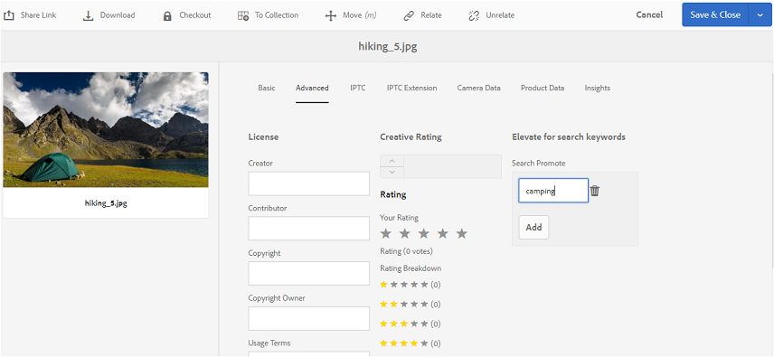

# Publish tags to Brand Portal {#publish-tags-to-brand-portal}

瞭解如何從AEM Assets發佈標籤至品牌入口網站。

標籤在組織資產時非常有用，並可增強與其關聯的資產的可搜尋性。 標籤可視為附加資產的關鍵字或標籤（中繼資料），並可讓搜尋結果快速找到資產。 若要瞭解如何在AEM Assets中指派標籤給資產，請參 [閱使用標籤來組織資產](https://helpx.adobe.com/experience-manager/6-5/assets/using/organize-assets.html#Usetagstoorganizeassets)。

當具有相關標籤的資產（和系列）發佈至品牌入口網站時，標籤（與AEM中的資產和系列相關聯）會自動發佈至品牌入口網站。 發佈的標籤有助於讓搜尋找到相關的資產。

>[!NOTE]
>
>不過，建議您在發佈與標籤相關聯的資產（和系列）之前，先排他性地將標籤發佈至品牌入口網站。 這可確保資產（和系列）更快地發佈至品牌入口網站。

## Manage tags {#manage-tags}

您可以使用預先存在的標籤來附加至資產，或從AEM標籤主控台(工&#x200B;**[!UICONTROL 具)建立新標籤|標籤| AEM標籤]**)。 在這兩種情況下，您必須先將標籤發佈至品牌入口網站，然後將其與適當的資產建立關聯。

若要在AEM上建立標籤、在品牌入口網站上發佈標籤，並將標籤與適當的資產（或系列）產生關聯，請依照下列步驟進行：

1. **建立標籤**&#x200B;以管理權限登入AEM Author例項，並從全域導覽存取 **[!UICONTROL AEM Tags]** console:

   1. 選擇工 **[!UICONTROL 具]**

   1. 選擇一 **[!UICONTROL 般]**

   1. 選擇標 **[!UICONTROL 記]**

1. 選取「 **[!UICONTROL 建立]** 」，然後選 **[!UICONTROL 取「建立標籤]** 」選項。
1. 指定：

   * **[!UICONTROL 標題]**
      *（必要）* ，標籤的顯示標題。
   * **[!UICONTROL 名稱]**
      *(required) A name for the tag.* If not specified, a valid node name is created from the Title. See TagID.
   * **說明**
      *(optional) A description of the tag.*
   * **Tag Path
JCR path of the tag.**

1. Select Submit to create the tag.****

   Once you have created a tag on AEM instance, the tag will be available to be attached to an asset (using Properties section or Manage Tags section of that asset).

1. **將標籤發佈至品牌入口網站**。

   Go to AEM Tags console (Tools | Tagging | AEM Tags), select the desired tag and Publish to Brand Portal.****

1. **將標籤附加至資產（或系列）**。

   選取資產（或系列），然後使用該資產的「屬性」區段或「管理標籤」區段附加所要的標籤。 若要進一步瞭解如何在AEM Assets中指派標籤給資產，請參 [閱使用標籤來組織資產](https://helpx.adobe.com/experience-manager/6-5/assets/using/organize-assets.html#Usetagstoorganizeassets)。

1. **將資產（或系列）發佈至品牌入口網站**。\
   當您將資產（或系列）發佈至品牌入口網站時，附加的標籤也可在品牌入口網站上使用。

   若要在品牌入口網站中查看個別資產（或系列）上的附加標籤，請登入品牌入口網站並選取資產，在「屬性」區段下，您會看到附加的標籤。

## 搜尋提升 {#search-promote}

AEM Assets品牌入口網站可讓您讓特定資產成為根據關鍵字標籤搜尋的最佳結果。

若要提升搜尋關鍵字的資產，請遵循下列步驟：

1. 在AEM作 **[!UICONTROL 者例項上]** ，開啟資產的「屬性」頁面。
1. 前往「進 **[!UICONTROL 階]** 」標籤。
1. 在「 **[!UICONTROL Elevate中]****[!UICONTROL 搜尋關鍵字」區段的「Search Promote]** 」中，選 **[!UICONTROL 取「Add]** 」以新增搜尋關鍵字或標籤。

   

1. 儲存變更。
1. 將資產發佈至 Brand Portal.
1. Log in to Brand Portal. View Advanced tab in Properties section of the asset.
******** Note that the Search Promote keyword is also visible in the Properties of that asset.****
