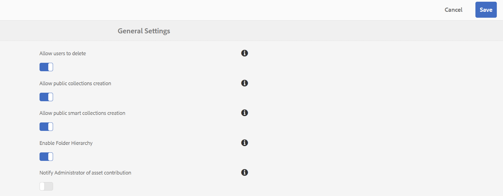

# 發行說明 {#release-notes}

深入瞭解Adobe Experience Manager Assets Brand Portal 2023.10.0版中的新功能、增強功能、已修正的嚴重問題和已知問題。

## 發行資訊 {#release-information}

| 產品 | Adobe Experience Manager Assets Brand Portal |
|---|---|
| 版本 | 2023.10.0 |
| 日期 | 2023年10 |

## 概觀 {#overview}

Adobe Experience Manager (AEM) Assets Brand Portal可協助您輕鬆取得、控制核准的創意資產，並安全分發給跨裝置的外部團體和內部業務使用者。 它有助於提高資產共用效率、加快資產上市時間，並降低不合規和未經授權存取的風險。 Brand Portal可讓使用者隨時隨地以公司核准的格式瀏覽、搜尋、預覽、下載和匯出資產。

## 2023.10.0版新增功能 {#whats-new-in-2023.10.0}

### 已修正的重大問題 {#critical-issues-fixed}

#### 錯誤修正 {#bug-fixes}

此版本包含下列錯誤修正：

* 無法儲存 [!UICONTROL 日期] 和 [!UICONTROL 選項] 述詞 [!UICONTROL 智慧型集合].

* 此 [!UICONTROL 日期和時間] 使用英語以外的地區設定時，格式不一致。

* 執行資產搜尋時， [!UICONTROL 刪除] 按鈕遺失。

* 如果 [!UICONTROL 標題] 欄位包含多位元組符號 [!UICONTROL 連結共用]，則無法下載報表。

* 檢視PDF型別的檔案時，標籤和工具提示未當地語系化。

#### 增強功能 {#enhancements}

此版本包含下列增強功能：

* 瀏覽時的效能改善 [!UICONTROL 集合].

* 當您使用OmniSearch欄位執行部分搜尋時，結果並不準確。

## 舊版

### 2023年8月發行版本 {#aug-2023}

**錯誤修正和增強功能**
此版本包含下列增強功能：

* 改善在上載入資產時的效能 [!UICONTROL 下載] 快顯視窗。
* 當您下載資產或資產的轉譯時，現在會以其原始檔案型別格式（而非zip檔案）下載。

此版本包含下列錯誤修正：

* 長標籤或標籤無法適當地顯示在搜尋篩選器中。
* 無法在下載對話方塊中顯示長轉譯名稱。
* 無法在卡片檢視中預覽視訊資產。

### 2023年5月發行版本 {#may-2023}

**錯誤修正**
此版本包含下列嚴重問題的修正：

* 如果從共用連結下載資產時發生錯誤， `Notice` 和 `Close` 錯誤提示的標籤未當地語系化。
* Brand Portal顯示 **請求標頭欄位太大** 使用存取搜尋篩選器時發生錯誤 `Filter` 窗格。

**已知問題**
此版本包含下列已知問題：

* 資產來源報表內容中的部分本地化。
* 使用者設定檔的少數欄位無法在使用者設定檔上編輯。

### 2023年2月發行版本 {#feb-2023}

**錯誤修正**

此版本包含下列嚴重問題的修正：

* 無法在Brand Portal上更新設定檔圖片。
* 內容樹窗格無法調整大小。 如果檔案名稱長於內容樹的預設寬度，則無法水平與垂直拖曳內容樹。 因此，較長的檔案名稱將無法讀取。
* 在搜尋表單中使用兩次的相同屬性述詞搜尋結果不一致。
* 中繼登入頁面上的文字並未針對所有語言進行當地語系化。

**增強功能**

此版本包含下列增強功能：

* 新的現代PDF檢視器現已推出，以改善PDF資產的預覽。
* 您現在可以選擇啟用或停用管理員的Asset sourcing通知。 瀏覽至 [!UICONTROL 一般設定] 然後啟用或停用 [!UICONTROL `Notify Administrator of asset contribution`].

  

* 如果要求存取權已停用，未經授權的使用者就無法要求存取Brand Portal。
* 設定檔選擇器清單上只會顯示為Brand Portal布建的組織。

**已知問題**

此版本包含下列已知問題：

* 資產來源報表內容中的部分本地化。
* 使用者設定檔的少數欄位無法在使用者設定檔上編輯。

### 2022年10月發行版本 {#oct-2022}

**已修正的重大問題**

此版本包含下列嚴重問題的修正：

* 將大型檔案從Brand Portal複製到協力廠商工具時，回應速度緩慢。
* 當您選取轉譯計數核取方塊時，會停用選取個別轉譯的核取方塊。
* 搜尋的回應時間緩慢。

>[!IMPORTANT]
>
>AEM Assets Brand Portal中的Pulse通知將從2022年12月1日起終止。 您將會繼續收到下列事件的電子郵件通知，而非Pulse通知：
>* 透過連結共用資產
>* 請求存取工作流程
>* 共用貢獻資料夾
>* 正在起始匯出至AEM的作業
>* 已完成匯出至AEM
>

### 2022年8月發行版本 {#aug-2022}

**已修正的重大問題**

此版本包含下列重大問題的修正：

* 當NUI無法在Experience Manager中處理資產時，Brand Portal會顯示不準確的資產匯入狀態。
* 預覽動作失敗時，沒有通知可傳達失敗。
* 修正了每個資產的totalUploadedSize屬性值不準確的問題。
* 當您按一下 **下載所有專案** 而且資產有大量的轉譯可供使用，Brand Portal會下載無效的.ZIP檔案。
* Brand Portal使用者介面上某些字串的轉譯會遭到截斷。

### 2022年5月發行版本 {#may-2022}

**新功能**

Brand Portal現在每十二小時執行一次自動工作，以刪除發佈至AEM的所有Brand Portal資產。 因此，您不需要手動刪除「貢獻」資料夾中的資產，以使資料夾大小低於臨界值限制。

**已修正的重大問題**

此版本包含下列嚴重問題的修正：

* 當您下載的資料夾或集合包含具有顏色標籤的資產時，XML檔案也會一併下載。
* 下載包含轉譯的視訊時，Brand Portal會建立無效的.ZIP檔案。
* 當您在AEM作者上建立預設集和資產，並將其發佈到Brand Portal，然後在下載資產時選取動態轉譯時，您無法解壓縮下載的.ZIP檔案。
* 從Brand Portal上提供的某些資料夾下載視訊資產時發生問題。
* 當您使用電子郵件共用「貢獻」資料夾的URL時，檢視者和編輯者角色在使用階層連結存取其父資料夾時會遇到問題。
* Sourcing已發佈報告顯示不正確的工單開始時間。

### 2022年2月發行版本 {#feb-2022}

**新功能**

* 訪客使用者的工作階段逾時臨界值已從2小時降低至15分鐘。
* 其他 **[!UICONTROL 檢視頁面]** 多頁PDF的選項已移除，因為使用者現在可以從Adobe Document Cloud檢視器檢視PDF頁面。
* 使用者無法搜尋、導覽或開啟資料夾。 使用者介面會反映錯誤訊息： `Failed to load data`.
* 此 **[!UICONTROL 轉譯]** 面板不會列出發佈至Brand Portal之資產的所有靜態轉譯。
* 此 **[!UICONTROL 轉譯]** 面板會列出資產的智慧型裁切轉譯，但使用者無法預覽或下載智慧型裁切轉譯。
* 下載對話方塊會列出所選資產的智慧型裁切轉譯，但使用者無法下載智慧型裁切轉譯。
* 非管理員使用者在下載資產時只會取得原始資產轉譯。 不會下載系統和自訂轉譯。
* 套用搜尋篩選條件以下載資產時， `Download` 下載對話方塊中的按鈕已停用，不允許使用者下載資產。
* 如果 `Smart Tags` 和（或） `Color Tags` 已啟用，「下載」對話方塊會列出 `json` 檔案做為轉譯並下載這些 `json` 封存的zip資料夾中的檔案。
* 匿名使用者無法使用共用連結下載資產，因為連結會重新導向至Brand Portal登入頁面。
* 系統未反映作用中同時使用者人數的正確值。

<!--
### New Features {#new-features}

This release includes the following new features:

* AEM Assets as a Cloud Service is now entitled to have a pre-configured Brand Portal instance. The Cloud Manager user can activate Brand Portal on the AEM Assets as a Cloud Service instance.

* Asset Sourcing feature is now available on AEM Assets as a Cloud Service. It allows the Brand Portal users to upload assets to the permitted contribution folders and publish the contribution folder from Brand Portal to AEM Assets as a Cloud Service instance. 

* An additional **[!UICONTROL Asset Download]** setting has been introduced under the **[!UICONTROL Download Settings]**. It creates a separate folder for each asset while downloading the folders, collections, or bulk download of assets. 
-->
<!-- 
* The **[!UICONTROL Download]** dialog is revamped in a list view with additional options to exclude the renditions which are not required, apply the same set of rules for similar asset types, and download the selected asset renditions.
-->

<!--
* The new **[!UICONTROL Download]** dialog now appears with all the renditions of the selected assets or folders containing assets in a list view, wherein the Brand Portal users can apply same set of renditions for similar asset types and download the selected asset renditions. 
-->

<!-- 
* Navigation to the **[!UICONTROL Files]**, **[!UICONTROL Collections]**, and **[!UICONTROL Shared Links]** is now possible from all the Brand Portal pages in one-click.  

* The **[!UICONTROL Renditions]** panel in the asset details page now allows the Brand Portal users to select the original asset and (or) specific asset renditions, and directly download them from the **[!UICONTROL Renditions]** panel without having to open the **[!UICONTROL Download]** dialog.
-->

<!--
Brand Portal users can exclude specific renditions which are not required and directly download the original asset and its renditions from the **[!UICONTROL Renditions]** panel on the asset details page. 
-->

<!-- 
* In addition to the existing **[!UICONTROL Download]** configurations, the Brand Portal administrators can also [configure permissions for different group of users]() to view and (or) download the original asset and its renditions from the asset details page. These configurations will define who can access and (or) download the asset renditions.
-->

<!--
### Enhancements {#enhancements}

Brand Portal 2021.08.0 is an internal release that introduces Business profiles for enterprise and teams customers to give organizations better control over their assets. 

This release includes the following enhancements:

* The users now have organization-specific entitlement on the new and migrated organizations. If a user is entitled to multiple organizations, the user has to select the organization at the time of login.

* The new users that are added in Admin Console must **Join Team** to get entitled to the organization. 

>[!NOTE]
>
>Business profiles are currently applicable for the new organizations that are created after August 16, 2021. 
>
>Until your organization is migrated, you can continue to use Adobe ID, Enterprise ID, or Federated ID types to access the organization.   
-->

<!-- 
* For folder download, a separate folder is created for each asset using share link irrespective of the **[!UICONTROL Download Settings]**. 
* The Brand Portal **[!UICONTROL Usage Report]** has been modified to reflect only the active Brand Portal users.
-->

<!--
* The threshold of session timeout for the guest users has been reduced from 2 hours to 15 minutes.
* The additional **[!UICONTROL View pages]** option has been removed for multi-page PDFs as the user can now view the PDF pages from the Adobe Document Cloud Viewer.

* The users are unable to search, navigate, or open folders. The user interface reflects the error message: `Failed to load data`. 
* The **[!UICONTROL Renditions]** panel does not list all the static renditions of the assets that are published to Brand Portal.
* The **[!UICONTROL Renditions]** panel lists the smart crop renditions of the asset, however, the user cannot preview or download the smart crop renditions.
* The download dialog lists the smart crop renditions of the selected asset, however, the user cannot download the smart crop renditions. 
* A non-admin user is getting only the original asset rendition when downloading an asset. The system and custom renditions are not downloaded.  
* When applying search filter to download an asset, the `Download` button is disabled in the download dialog and does not allows the user to download the asset.
* If `Smart Tags` and (or) `Color Tags` are enabled, the download dialog lists the `json` files as renditions and downloads these `json` files in the archived zip folder.
* The anonymous users are unable to download assets using a shared link because the link redirects to the Brand Portal login page. 
* The system is not reflecting the correct value for the number of active concurrent users.
-->

<!--
### New features {#new-features}

Brand Portal now executes automatic jobs every twelve hours to delete all Brand Portal assets that are published to AEM. As a result, you do not need to delete the assets in the Contribution folder manually to keep the folder size below the threshold limit. See [What's new in Experience Manager Assets Brand Portal](whats-new.md).
-->

<!--
This release includes fixes to the following critical issues:

* When you download a folder or a collection that includes assets with color tags, an XML file gets downloaded as well.

* When you download a video that includes renditions, Brand Portal creates an invalid .ZIP file.

* When you create presets and assets on AEM author and publish them to Brand Portal and then select dynamic renditions while downloading the assets, you cannot extract the downloaded .ZIP file.

* Issues while downloading video assets from certain folders available on Brand Portal.

* When you share the Contribution folder's URL using an email, Viewer and Editor roles face issues while accessing its parent folder using the breadcrumb.

* Sourcing published report displays an incorrect job start time.
>
 
<!--
* Asset Sourcing email notifications are not delivered for some organizations. 

* Video files with extension `.mov` are not running on Brand Portal. 

* In the **[!UICONTROL Smart Collections]** dropdown list, only ten saved collections are visible. 
-->
<!--
* *_deleted tenants are listed as valid tenant which fails during the execution of TenantCustomizers/TenantUpdates where tenant id is returned as /etc/tenants/`<nodename>`.
-->

<!--
In case only the original assets are downloaded, the asset reflects its own extension and does not open until the extension is manually changed to zip. 
* The user interface of the collection folder does not respond on clicking the navigation arrow. 
* **[!UICONTROL Create]** button is visible in the **[!UICONTROL Column]** view even when the folders are empty.
* **[!UICONTROL Omni search]** fails with a 414 error message (Request-URI Too Long) if the dispatcher is bypassed while accessing the Brand Portal instance.
* An empty zip folder is downloaded if the asset contains a comma (`,`) in the file name.
* The viewer users get the option to add users to the collection they have created. 
* Inconsistent behavior is experienced when an asset (thumbnail or web rendition) is downloaded using share link.

See [what's new in Brand Portal 2021.02.0](whats-new.md).
-->

<!--
### Known Issues {#known-issues}

This release includes the following known issue:

* Search on the **[!UICONTROL Asset Reports]** shows processing on the product interface with no search result.
* The video DM encodes are not visible to the non-admin users on the asset details page.
* The alignment of the size of individual asset renditions and total download size is distorted in the Download dialog.
-->

<!--
* Download Settings configuration to configure asset download from Brand Portal. Fast download, custom renditions, and system renditions are the available configurations. 
-->

<!--
* Document Viewer has been introduced to enhance the PDF viewing experience. New options are available for viewing the PDF files in Brand Portal.

* Advances in the asset download process which improves the Brand Portal user experience while [downloading assets from Brand Portal](brand-portal-download-assets.md). Brand Portal administrators can configure **[!UICONTROL Fast Download]**, **[!UICONTROL Custom Renditions]**, and **[!UICONTROL System Renditions]** from the **[!UICONTROL Download]** settings. 

For details, see [what's new in Brand Portal 6.4.7](whats-new.md). 

### Critical Issues Fixed {#critical-issues-fixed-647}

This release includes fixes to the following critical issues:

* The viewer users are not permitted to share link for collections but the option to share is visible to them on the product interface.

* The **[!UICONTROL Download]** button on the options bar does not list all the licensed assets of the selected folder.

* The search takes longer to show the results for certain keywords.

* The **[!UICONTROL Agree]** and **[!UICONTROL Disagree]** check boxes does not appear on bulk selection of licensed and unlicensed assets during download.

* Filter-based search shows processing on the product interface with no search result. 

* The assets do not download from share link if the shared folder contains numerous and large assets.

### Known Issues {#known-issues-647}

This release includes the following known issues:

* If multiple assets are selected, license text does not appear on clicking Terms and Conditions on the license agreement page during download using share link.   

-->

## 語言 {#languages}

Brand Portal使用者介面提供下列語言版本：

* 英文
* 德文
* 法文
* 西班牙文
* 義大利文
* 巴西葡萄牙文
* 日文
* 簡體中文
* 韓文

## 認證平台 {#certified-platforms}

若要確定哪些平台通過認證可以使用此版本的Brand Portal，請參閱 **支援觸控最佳化的UI** 中的資料行。 **編寫使用者介面的支援瀏覽器** 部分 [技術需求](https://experienceleague.adobe.com/docs/experience-manager-65/deploying/introduction/technical-requirements.html).

## 連結 {#links}

* [adobe.com上的Adobe Experience Manager產品頁面](https://business.adobe.com/in/products/experience-manager/adobe-experience-manager.html)
* [Assets Brand Portal檔案](https://experienceleague.adobe.com/docs/experience-manager-brand-portal/using/home.html)

## 產品存取與支援（受限制的網站） {#product-access-and-support-restricted-sites}

這些網站僅供客戶使用。 如果您是客戶且需要存取權，請聯絡您的Adobe客戶經理。

<!--
* [https://daycare.day.com](https://daycare.day.com) 
-->

<!--
* [Customer Support]()
-->
