# 使用報表 {#work-with-reports}

報告功能有助於評估Brand Portal的使用情況，並瞭解內部和外部用戶如何與批准的資產進行交互。 管理員可以查看「資產報告」頁上始終可用的「Brand Portal使用情況」報告。 但是，可以從「資產報告」頁生成和查看用戶登錄和資產下載、過期、發佈和通過連結共用的資產的報告。 這些報告有助於分析資產部署，使您能夠得出關鍵的成功度量，以衡量組織內外批准資產的採用情況。

報表管理介面是直觀的，包括訪問已保存報表的細粒度選項和控制項。 您可以從「資產報告」頁查看、下載或刪除報告，其中列出了以前生成的所有報告。

## 查看報告 {#view-reports}

要查看報告，請執行以下步驟：

1. 在頂部的工具欄上，點擊/按一下Experience Manager徽標以訪問管理工具。

   

1. 在管理工具面板中，按一下 **[!UICONTROL 建立/管理報告]** 開啟 **[!UICONTROL 資產報表]** 的子菜單。

   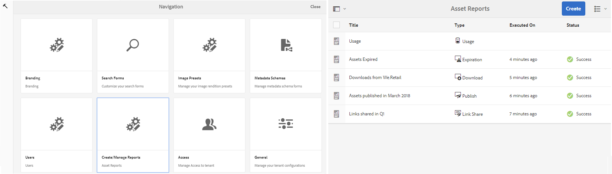

1. 訪問 **[!UICONTROL 用法]** 「資產報表」頁中的報表和其他生成的報表。

   >[!NOTE]
   >
   >使用情況報告是在Brand Portal生成的預設報告。 無法建立或刪除。 但是，您可以建立、下載和刪除「下載」、「過期」、「發佈」、「連結共用」和「用戶登錄」報告。

   要查看報告，請按一下報告連結。 或者，選擇報告，然後從工具欄中點擊/按一下「查看」表徵圖。

   **[!UICONTROL 使用情況報告]** 顯示有關Brand Portal活動用戶數、所有資產佔用的儲存空間以及Brand Portal總資產計數的資訊。 未分配給Admin Console中任何產品配置檔案的品牌門戶用戶被視為非活動用戶，不會反映在 **[!UICONTROL 使用情況報告]**。
此報表還顯示這些資訊度量中每個指標的允許能力。

   

   **[!UICONTROL 用戶登錄]** 報告提供了有關登錄到Brand Portal的用戶的資訊。 該報告顯示從Brand Portal6.4.2部署到生成報告之前的每個用戶的顯示名稱、電子郵件ID、personas(admin、viewer、editor、guest)、組、上次登錄、活動狀態和登錄計數。

   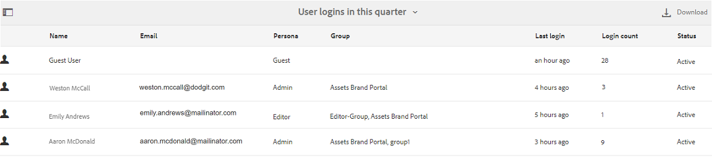

   **[!UICONTROL 下載]** 報告清單和特定日期和時間範圍內下載的所有資產的詳細資訊。

   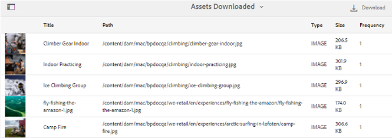

   >[!NOTE]
   >
   >資產 **[!UICONTROL 下載]** 報告僅顯示從Brand Portal單獨選擇和下載的資產。 如果用戶已下載包含資產的資料夾，則報表不顯示資料夾或資料夾內的資產。

   **[!UICONTROL 到期]** 報告列出並詳細列出在特定時間範圍內到期的所有資產。

   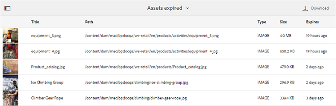

   **[!UICONTROL 發佈]** 報告列出並提供有關在指定時間範圍內從Experience Manager Assets發佈到Brand Portal的所有資產的資訊。

   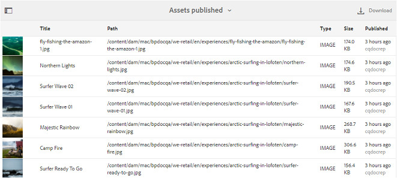

   >[!NOTE]
   >
   >「發佈報告」不顯示有關內容片段的資訊，因為內容片段無法發佈到Brand Portal。

   **[!UICONTROL 連結共用報告]** 列出特定時間範圍內通過Brand Portal介面連結共用的所有資產。 該報告還通知通過連結共用資產的時間、用戶、連結到期的時間、租戶（以及與資產連結共用的用戶）的共用連結數。 連結共用報表的列不可自定義。

   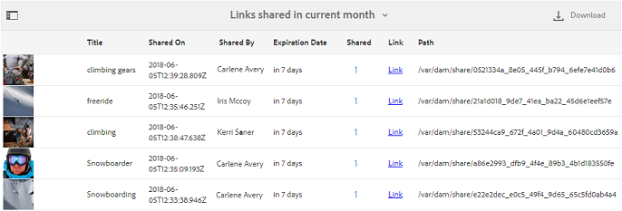

   >[!NOTE]
   >
   >連結共用報表不顯示有權訪問通過連結共用的資產或已通過連結下載資產的用戶。
   >
   >要通過共用連結跟蹤下載，您需要在選擇 **[!UICONTROL 僅連結共用下載]** 選項 **[!UICONTROL 建立報告]** 的子菜單。 但是，在本例中，用戶（下載者）是匿名的。

## 生成報告 {#generate-reports}

管理員可以生成和管理以下標準報告，一旦生成，這些報告將保存為 [訪問](../using/brand-portal-reports.md#main-pars-header) 稍後：

* 使用者登入
* 下載
* 過期
* 發佈
* 連結共用

可以自定義「下載」、「到期」和「發佈」報告中的列以供查看。 要生成報告，請執行以下步驟：

1. 在頂部的工具欄上，點擊/按一下Experience Manager徽標以訪問管理工具。

1. 在管理工具面板中，點擊/按一下 **[!UICONTROL 建立/管理報告]** 開啟 **[!UICONTROL 資產報表]** 的子菜單。

   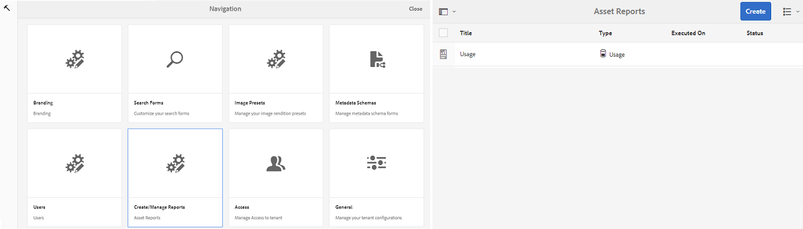

1. 在「資產 報表」頁面 ，點選/按一下「 **[!UICONTROL 建立」]**。
1. 從 **[!UICONTROL 建立報告]** 頁，選擇要建立的報告，然後點擊/按一下 **[!UICONTROL 下一個]**。

   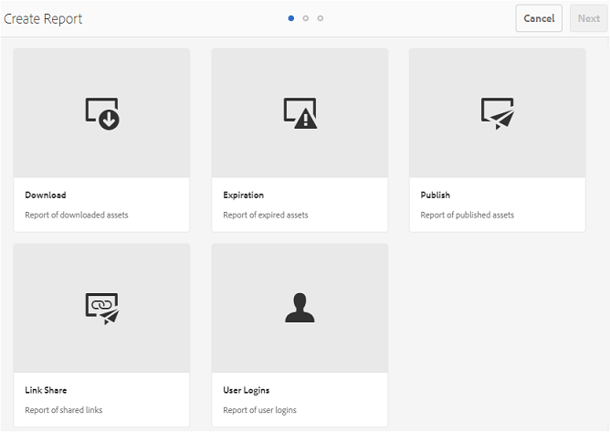

1. 配置報告詳細資訊。 指定標題、說明、資料夾結構（其中需要運行和生成統計資訊的報告）和日期範圍 **[!UICONTROL 下載]**。 **[!UICONTROL 到期]**, **[!UICONTROL 發佈]** 報告。

   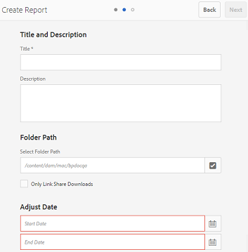

   然而， **[!UICONTROL 連結共用報告]** 只需要標題、說明和日期範圍參數。

   

   >[!NOTE]
   >
   >報告標題中的特殊字元#和%在生成報告時被連字元(-)替換。

1. 點擊/按一下 **[!UICONTROL 下一個]**，以配置「下載」、「到期」和「發佈」報告的列。
1. 根據需要選擇或取消選擇相應的複選框。 例如，要在中查看用戶（下載了資產）的名稱 **[!UICONTROL 下載]** 報告，選擇 **[!UICONTROL 下載者]**。 下圖說明了在「下載」報告中選擇預設列。

   

   您還可以向這些報告添加自定義列，以根據自定義要求顯示更多資料。

   要將自定義列添加到「下載」、「發佈」或「過期」報告，請執行以下步驟：

   1. 要顯示自定義列，請點擊/按一下 **[!UICONTROL 添加]** 內 [!UICONTROL 自定義列]。
   1. 指定中列的名稱 **[!UICONTROL 列名]** 的子菜單。
   1. 使用屬性選取器選擇列需要映射到的屬性。

      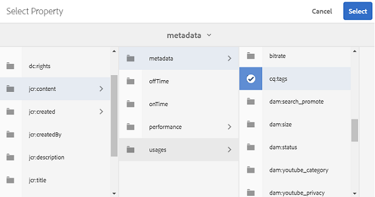
或者，在屬性路徑欄位中鍵入路徑。

      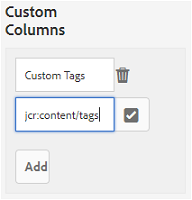

      要添加更多自定義列，請點擊/按一下 **添加** 重複步驟2和3。

1. 點擊/按一下 **[!UICONTROL 建立]**。 消息通知已啟動報告生成。

## 下載報告 {#download-reports}

要將報告另存為.csv檔案並下載，請執行以下操作之一：

* 在「資產報告」頁面上選擇報告，然後點擊/按一下 **[!UICONTROL 下載]** 的上界。

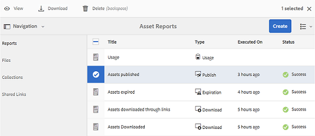

* 在「資產報表」頁中，開啟報表。 選擇 **[!UICONTROL 下載]** 的子菜單。

## 刪除報告 {#delete-reports}

要刪除現有報表，請從中選擇報表 **[!UICONTROL 資產報表]** 點擊/按一下 **[!UICONTROL 刪除]** 的上界。

>[!NOTE]
>
>**[!UICONTROL 用法]** 無法刪除報告。
