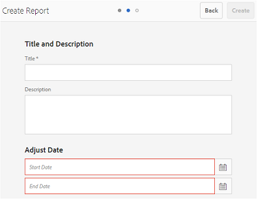
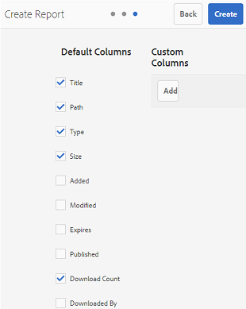

# 使用報表 {#work-with-reports}

報告功能有助於評估Brand Portal的使用情形，並了解內部和外部使用者如何與核准的資產互動。 管理員可以檢視Brand Portal使用量報表，該報表一律可在資產報表頁面上使用。 不過，使用者登入和下載、過期、發佈及透過連結共用的資產報表，可從「資產報表」頁面產生及檢視。 這些報表有助於分析資產部署，可讓您衍生關鍵成功量度，以評估組織內外核准資產的採用情形。

報表管理介面直覺式，包含存取儲存報表的微調選項和控制項。 您可以從「資產報表」頁面檢視、下載或刪除報表，其中會列出所有先前產生的報表。

## 檢視報表 {#view-reports}

若要檢視報表，請依照下列步驟操作：

1. 從頂端的工具列，點選/按一下Experience Manager標誌以存取管理工具。

   

1. 在管理工具面板中，按一下&#x200B;**[!UICONTROL 建立/管理報表]**&#x200B;以開啟&#x200B;**[!UICONTROL 資產報表]**&#x200B;頁面。

   

1. 從「資產報表」頁面存取&#x200B;**[!UICONTROL 使用狀況]**&#x200B;報表和其他產生的報表。

   >[!NOTE]
   >
   >使用狀況報表是Brand Portal中產生的預設報表。 無法建立或刪除。 不過，您可以建立、下載及刪除「下載」、「過期」、「發佈」、「連結共用」及「使用者登入」報表。

   若要檢視報表，請按一下報表連結。 或者，選取報表，然後點選/按一下工具列中的「檢視」圖示。

   **[!UICONTROL 使]** 用狀況報表會顯示Brand Portal使用者人數、所有資產佔用的儲存空間，以及Brand Portal中的資產總數的相關資訊。未指派給Admin Console中任何產品設定檔的Brand Portal使用者會視為非作用中使用者，且不會反映在&#x200B;**[!UICONTROL 使用狀況報表]**中。
報表也會顯示這些資訊量度的允許容量。

   

   **[!UICONTROL 「使]** 用者登入」報表提供登入Brand Portal的使用者的相關資訊。報表會顯示在產生報表之前，每個使用者的顯示名稱、電子郵件ID、角色（管理員、檢視者、編輯者、訪客）、群組、上次登入、活動狀態，以及Brand Portal 6.4.2部署中的登入計數。

   

   **** 下載報表會列出特定日期和時間範圍內下載的所有資產的詳細資訊。

   

   >[!NOTE]
   >
   >資產&#x200B;**[!UICONTROL 下載]**&#x200B;報表只會顯示個別選取並從Brand Portal下載的資產。 如果使用者下載了包含資產的資料夾，報表就不會顯示資料夾或資料夾內的資產。

   **** 到期報告會列出並詳細說明特定時間範圍內到期的所有資產。

   

   **** 發佈報表會列出並提供在指定時間範圍內從Experience Manager資產發佈至Brand Portal的所有資產的相關資訊。

   

   >[!NOTE]
   >
   >「發佈報表」不會顯示內容片段的相關資訊，因為內容片段無法發佈至Brand Portal。

   **[!UICONTROL 「連結共]** 用」報表會列出特定時間範圍內，透過Brand Portal介面的連結共用的所有資產。報表也會通知透過連結共用資產的時間、連結的到期時間，以及租用戶（以及共用資產連結的使用者）的共用連結數。 無法自訂「連結共用報表」的欄。

   

   >[!NOTE]
   >
   >「連結共用報表」不會顯示可存取透過連結共用之資產，或已透過連結下載資產的使用者。
   >
   >若要透過共用連結追蹤下載，您必須在&#x200B;**[!UICONTROL 建立報表]**&#x200B;頁面上選取&#x200B;**[!UICONTROL 僅連結共用下載]**&#x200B;選項後產生下載報表。 但在此情況下，使用者（下載者）是匿名的。

## 產生報表 {#generate-reports}

管理員可產生和管理下列標準報表，一旦產生，便會儲存為[accessed](../using/brand-portal-reports.md#main-pars-header)以後：

* 使用者登入
* 下載
* 過期
* 發佈
* 連結共用

「下載」、「過期」和「發佈」報表中的欄可自訂以供檢視。 若要產生報表，請依照下列步驟操作：

1. 從頂端的工具列，點選/按一下Experience Manager標誌以存取管理工具。

1. 從管理工具面板，點選/按一下「建立/管理報表」]**以開啟「資產報表」****頁面。**[!UICONTROL 

   

1. 在「資產 報表」頁面 ，點選/按一下「 **[!UICONTROL 建立」]**。
1. 從&#x200B;**[!UICONTROL 建立報表]**&#x200B;頁面中，選取要建立的報表，然後點選/按一下&#x200B;**[!UICONTROL 下一步]**。

   

1. 設定報表詳細資訊。 指定標題、說明、資料夾結構（其中報表需要執行並產生統計資料），以及&#x200B;**[!UICONTROL Download]**、**[!UICONTROL Expiration]**&#x200B;和&#x200B;**[!UICONTROL Publish]**&#x200B;報表的日期範圍。

   

   但是，**[!UICONTROL 連結共用報表]**&#x200B;只需要標題、說明和日期範圍參數。

   

   >[!NOTE]
   >
   >報表標題中的特殊字元#和%會在報表產生時以連字型大小(-)取代。

1. 點選/按一下&#x200B;**[!UICONTROL Next]**，以設定「下載」、「過期」和「發佈」報表的欄。
1. 根據需要選擇或取消選擇相應的複選框。 例如，若要在&#x200B;**[!UICONTROL Download]**&#x200B;報表中檢視使用者（已下載資產）的名稱，請選取&#x200B;**[!UICONTROL Downloaded By]**。 下圖說明如何在「下載」報表中選取預設欄。

   

   您也可以將自訂欄新增至這些報表，以根據您的自訂需求顯示更多資料。

   若要新增自訂欄至「下載」、「發佈」或「到期」報表，請遵循下列步驟：

   1. 若要顯示自訂欄，請點選/按一下[!UICONTROL 自訂欄]內的「新增&#x200B;]**」。**[!UICONTROL 
   1. 在&#x200B;**[!UICONTROL 欄名稱]**&#x200B;欄位中指定欄的名稱。
   1. 使用屬性選擇器，選擇列需要映射到的屬性。

      
或者，在屬性路徑欄位中輸入路徑。

      

      若要新增更多自訂欄，請點選/按一下「**新增**」，並重複步驟2和3。

1. 點選/按一下&#x200B;**[!UICONTROL 建立]**。 訊息會通知報表產生已開始。

## 下載報表 {#download-reports}

若要將報表儲存並下載為.csv檔案，請執行下列其中一項操作：

* 在「資產報表」頁面上選取報表，然後從頂端的工具列點選/按一下「下載&#x200B;****」。

* 從「資產報表」頁面，開啟報表。 從報表頁面頂端選取&#x200B;**[!UICONTROL 下載]**&#x200B;選項。

## 刪除報表 {#delete-reports}

若要刪除現有報表，請從&#x200B;**[!UICONTROL 資產報表]**&#x200B;頁面選取報表，然後從頂端的工具列點選/按一下&#x200B;**[!UICONTROL 刪除]**。

>[!NOTE]
>
>**** 無法刪除使用報告。
