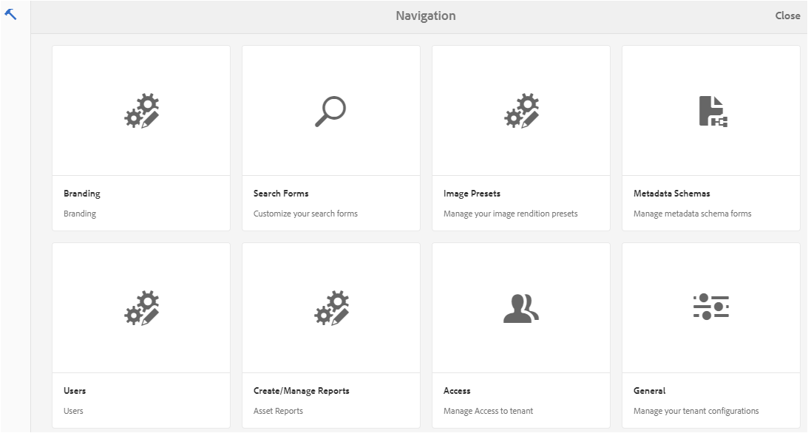
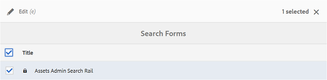
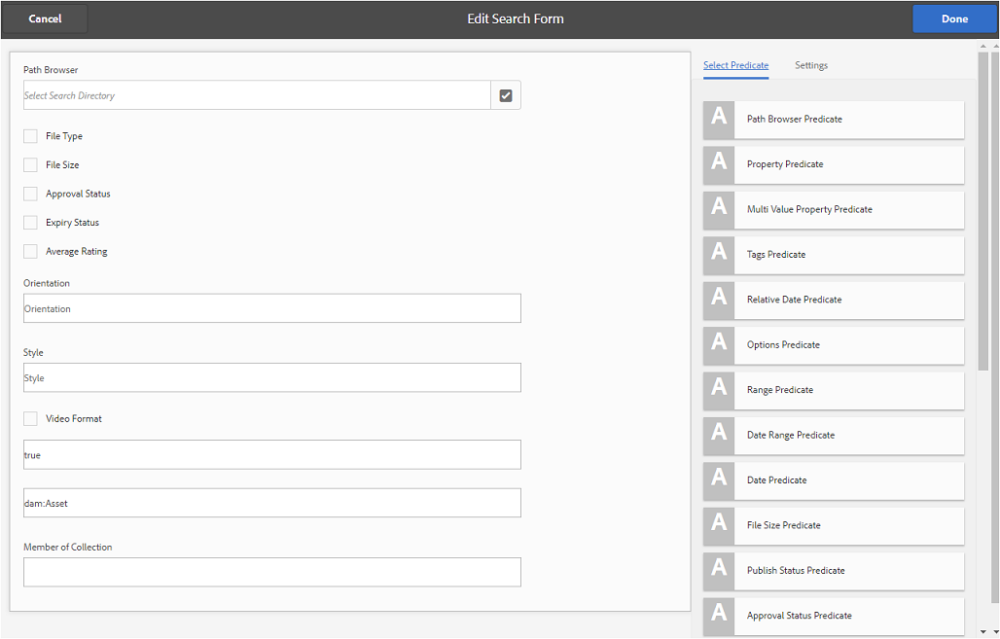
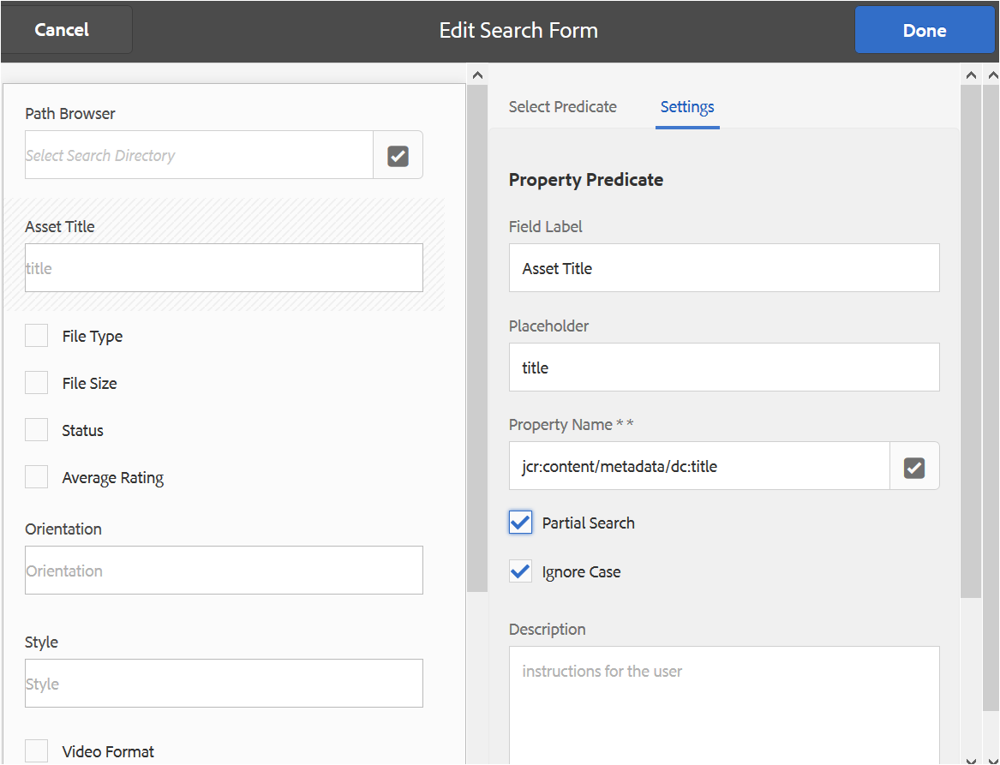
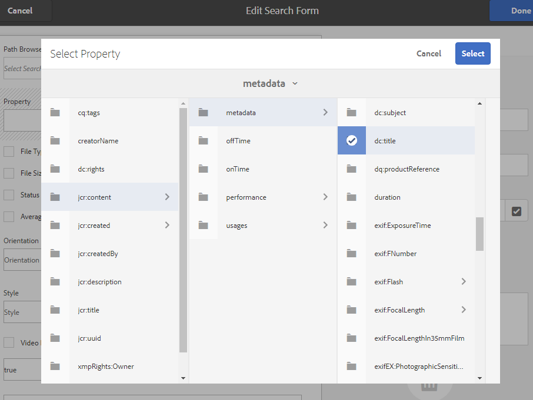
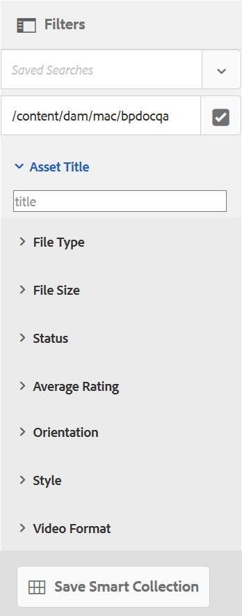
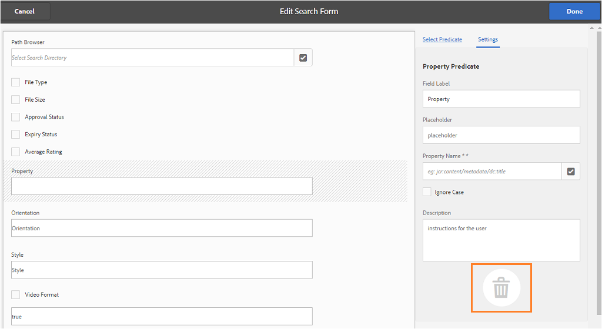

# 使用自訂搜尋Facet {#use-custom-search-facets}

管理員可將搜尋謂語新增至「篩 [!UICONTROL 選器] 」面板，以自訂搜尋並讓搜尋功能變得多用。

品牌入口網站支 [援多面搜尋](../using/brand-portal-searching.md#search-using-facets-in-filters-panel) ，以細微搜尋已核准的品牌資產，這是由於「篩選器 [**」面板所造成的**](../using/brand-portal-searching.md#search-using-facets-in-filters-panel)。 「篩選器」面板可透過管理工具的「 **[!UICONTROL 搜尋表單]** 」使用搜尋Facet。 管理工具的「搜尋表單」頁面中，存在名為「資產管理搜尋邊欄」的預設搜尋表單。 不過，管理員可以透過新增、修改或移除搜尋謂語來編輯預設的搜尋表單（資產管理搜尋邊欄），自訂預設的「篩選」面板，讓搜尋功能變得通用。

您可以使用各種搜尋謂語來自訂「篩選 **[!UICONTROL 器]** 」面板。 例如，新增屬性述詞以搜尋符合您在此述詞中指定之單一屬性的資產。 新增選項述詞，以搜尋符合您為特定屬性所指定之一或多個值的資產。 新增日期範圍述詞，以搜尋在指定日期範圍內建立的資產。

>[!NOTE]
>
>AEM可讓組織 [將自訂的搜尋表單從AEM Author](../using/publish-schema-search-facets-presets.md#publish-search-facets-to-brand-portal) 發佈至品牌入口網站，而不是在品牌入口網站上重新建立相同的表單。

## 新增搜尋述詞 {#add-a-search-predicate}

要將搜索謂語添加到「篩 **[!UICONTROL 選器]** 」面板：

1. 若要存取管理工具，請按一下頂端工具列中的AEM標誌。

   

2. 在管理工具面板中，按一下「搜 **[!UICONTROL 尋表格」]**。

   

3. 在「搜尋 **[!UICONTROL 表單」頁]** ，選取「資 **[!UICONTROL 產管理搜尋邊欄」]**。

   

4. 在出現在頂端的工具列上，按一下「 **[!UICONTROL 編輯]** 」以開啟編輯搜尋表單。

   

5. 在「編 [!UICONTROL 輯搜索表單] 」頁中，將謂詞從「選擇謂詞  」頁籤拖到主窗格。 例如，拖曳 **[!UICONTROL Property Predicate]**。

   「屬 **[!UICONTROL 性]** 」欄位會出現在主窗格中，右側的「設定 **** 」標籤會顯示屬性謂語。

   

   >[!NOTE]
   >
   >「設定」標籤中的標 **[!UICONTROL 題標籤]** ，可識別您選取的謂詞類型。

6. 在「設 **[!UICONTROL 定]** 」標籤中，輸入屬性謂語的標籤、預留位置文字和說明。

   * 如果 ****&#x200B;您想要允許根據指定的屬性值對資產進行部分片語搜尋（和萬用字元搜尋），請選取「部分搜尋」。 預設情況下，謂詞支援全文搜索。
   * 如果 ****&#x200B;您希望根據屬性值進行資產搜尋時不區分大小寫，請選取「忽略大小寫」。 依預設，搜尋篩選器中的屬性值會區分大小寫。
   >[!NOTE]
   >
   >在選擇「部 **[!UICONTROL 分搜索]** 」(Partial Search [!UICONTROL )複選框時，] 預設情況下會選擇「忽略大小寫」(Ignore Case)。

7. 在「屬 [!UICONTROL 性名稱] 」欄位中，開啟屬性選擇器並選擇執行搜索的屬性。 或者，輸入屬性的名稱。 例如，輸入 [!UICONTROL `  jcr :content/metadata/dc:title`] 或 [!UICONTROL `./jcr:content/metadata/dc:title`]。

   

8. 按一 **[!UICONTROL 下「完成]** 」以儲存設定。
9. 在「資 [!UICONTROL 產] 」使用者介面中，按一下覆蓋圖示，然後選擇「篩選」以導覽至「篩選 **[!UICONTROL 器]****** 」面板。 The **[!UICONTROL Property]** predicate is added to the panel.

   

10. 在「屬性」文字方塊中輸入要搜尋的資產 **[!UICONTROL 標題]** 。 例如，「Adobe」。 當您執行搜尋時，標題符合「Adobe」的資產會顯示在搜尋結果中。

## 搜索謂語清單 {#list-of-search-predicates}

與您新增 **[!UICONTROL Property]** predicate的方式類似 **[!UICONTROL ，您可將下列謂語新增至]** Filters面板：

| **謂詞名稱** | **說明** | **屬性** |
|-------|-------|----------|
| [!UICONTROL 路徑瀏覽器] | 搜尋謂詞以搜尋特定位置的資產。 **** 注意：對於 *登入的使用者，「篩選」上的路徑瀏覽器只會顯示與使用者共用之資料夾（及其祖先）的內容結構。* 管   理員使用者可使用路徑瀏覽器導覽至該資料夾，以搜尋任何資料夾中的資產。   但是，非管理員使用者可在路徑瀏覽器中導覽至該資料夾，以搜尋資料夾中的資產（可供他們存取）。 | <ul><li>欄位標籤</li><li>路徑</li><li>說明</li></ul> |
| [!UICONTROL 屬性] | 根據特定中繼資料屬性搜尋資產。 **** 注意：在選 *取「部分搜尋」時，預設會選取「忽略大小寫」*。 | <ul><li>欄位標籤</li><li>預留位置</li><li>屬性名稱</li><li>部分搜尋</li><li>忽略大小寫</li><li> 說明</li></ul> |
| [!UICONTROL 多值屬性] | 與屬性謂語類似，但允許以分隔字元分隔的多個輸入值(預設為COMMA[,])，在結果中傳回符合任何輸入值的資產。 | <ul><li>欄位標籤</li><li>預留位置</li><li>屬性名稱</li><li>分隔符號支援</li><li>忽略大小寫</li><li>說明</li></ul> |
| [!UICONTROL 標記] | 搜尋謂詞以根據標籤搜尋資產。 您可以設定Path屬性，以填入「標籤」清單中的各種標籤。 *注意：例如，如果管理員從 [!UICONTROL `/etc/tags/mac/<tenant_id>/<custom_tag_namespace>`]AEM發佈搜尋表單，而路徑不包含租用戶資訊，則可能需要變更路徑值 [!UICONTROL `/etc/tags/<custom_tag_namespace>`]。 | <ul><li>欄位標籤</li><li>屬性名稱</li><li>路徑</li><li>說明</li></ul> |
| [!UICONTROL 路徑] | 搜尋謂詞以搜尋特定位置的資產。 | <ul><li>欄位標籤</li><li>路徑</li><li>說明</li></ul> |  |
| [!UICONTROL 相對日期] | 搜尋謂詞以根據資產建立的相對日期來搜尋資產。 | <ul><li>欄位標籤</li><li>屬性名稱</li><li>相對日期</li></ul> |
| [!UICONTROL 範圍] | 搜尋謂詞，以搜尋位於指定屬性值範圍內的資產。 在「篩選器」面板中，您可以指定範圍的最小和最大屬性值。 | <ul><li>欄位標籤</li><li>屬性名稱</li><li>說明</li></ul> |
| [!UICONTROL 日期範圍] | 搜尋謂詞，以搜尋在指定範圍內建立的日期屬性資產。 在「篩選」面板中，您可以指定「開始」和「結束」日期。 | <ul><li>欄位標籤</li><li>預留位置</li><li>屬性名稱</li><li>範圍文字（自）</li><li>範圍文字（至）</li><li>說明</li></ul> |
| [!UICONTROL 日期] | 根據日期屬性搜尋資產的滑桿式搜尋謂詞。 | <ul><li>欄位標籤</li><li>屬性名稱</li><li>說明</li></ul> |
| [!UICONTROL 檔案大小] | 搜尋謂詞以根據資產大小搜尋資產。 | <ul><li>欄位標籤</li><li>屬性名稱</li><li>路徑</li><li>說明</li></ul> |
| [!UICONTROL 上次修改的資產] | 搜尋謂詞以根據上次修改的日期搜尋資產。 | <ul><li>欄位標籤</li><li>屬性名稱</li><li>說明</li></ul> |
| [!UICONTROL 核准狀態] | 依據核准中繼資料屬性搜尋資產的搜尋述詞。 預設屬性名稱 **為dam:status**。 | <ul><li>欄位標籤</li><li>屬性名稱</li><li>說明</li></ul> |
| [!UICONTROL 簽出狀態] | 從AEM Assets發佈資產時，搜尋謂詞以根據資產的檢出狀態來搜尋資產。 | <ul><li>欄位標籤</li><li>屬性名稱</li><li>說明</li></ul> |
| [!UICONTROL 簽出者] | 搜尋謂詞，以根據已簽出資產的用戶搜索資產。 | <ul><li>欄位標籤</li><li>屬性名稱</li><li>說明</li></ul> |
| [!UICONTROL 到期狀態] | 根據到期狀態搜尋資產的搜尋謂詞。 | <ul><li>欄位標籤</li><li>屬性名稱</li><li>說明</li></ul> |
| [!UICONTROL 系列成員] | 搜尋謂詞，以根據資產是否屬於系列的一部分來搜尋資產。 | 說明 |
| [!UICONTROL 隱藏] | 此謂語未明確顯示給使用者，且用於任何隱藏的約束，通常用於將搜尋結果類型限制 **為dam:Asset**。 | <ul><li>欄位標籤</li><li>屬性名稱</li><li>說明</li></ul> |

>[!NOTE]
>
>請勿使用 **[!UICONTROL Options Predicate]**、 **[!UICONTROL Publish Status Predicate]**&#x200B;和 **[!UICONTROL Rating Predicate]** ，因為這些謂語在Brand Portal中不起作用。

## 刪除搜索謂語 {#delete-a-search-predicate}

要刪除搜索謂語，請遵循以下步驟：

1. 按一下Adobe標誌以存取管理工具。

   

2. 在管理工具面板中，按一下「搜 **[!UICONTROL 尋表格」]**。

   

3. 在「搜尋 **[!UICONTROL 表單」頁]** ，選取「資 **[!UICONTROL 產管理搜尋邊欄」]**。

   

4. 在出現在頂端的工具列上，按一下「 **[!UICONTROL 編輯]** 」以開啟編輯搜尋表單。

   

5. 在「編 [!UICONTROL 輯搜索表單] 」頁的主窗格中，選擇要刪除的謂詞。 例如，選擇 **[!UICONTROL Property Predicate]**。

   右側 **[!UICONTROL 的「設定]** 」標籤會顯示屬性謂詞欄位。

6. 若要刪除屬性謂語，請按一下bin圖示。 在「刪 **[!UICONTROL 除欄位]** 」對話方塊中，按一 **[!UICONTROL 下「刪除]** 」以確認刪除動作。

   The **[!UICONTROL Property Predicate]** field is removed from the main pane, and the **[!UICONTROL Settings]** tab bempty.

   

7. 要保存更改，請按一下工 **[!UICONTROL 具欄]** 中的「完成」。
8. 在「資 **[!UICONTROL 產]** 」使用者介面中，按一下覆蓋圖示，然後選擇「篩選」以導覽至「篩選 **[!UICONTROL 器]****** 」面板。 The **[!UICONTROL Property]** predicate is removed from the panel.

   
