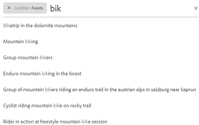
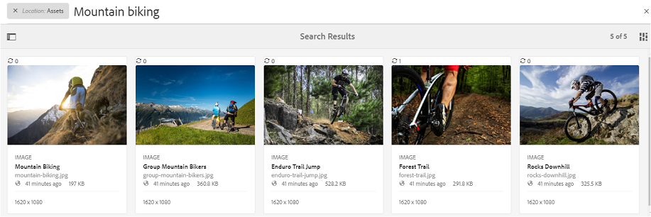
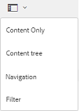
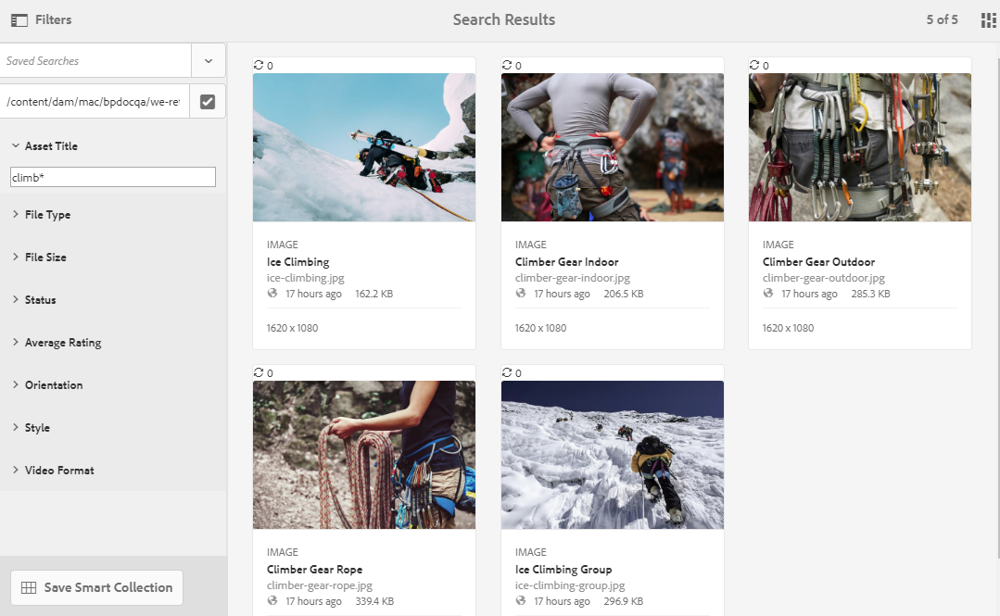
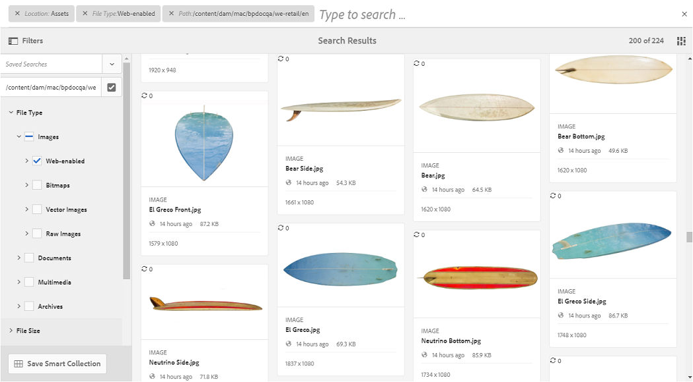
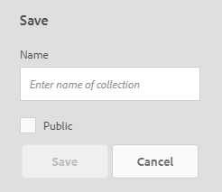
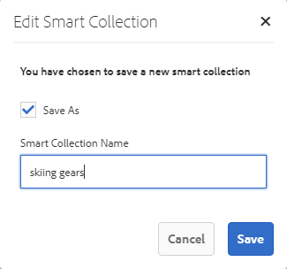

# 在 Brand Portal 上搜尋資產 {#search-assets-on-brand-portal}

品牌入口網站搜尋功能可讓您使用搜尋功能快速搜尋相關資產，而分面搜尋則使用篩選器協助您進一步縮小搜尋範圍。 您也可以將搜尋儲存為智慧型系列，以供日後使用。

## 使用Omnisearch搜尋資產 {#search-assets-using-omnisearch}

若要在品牌入口網站上搜尋資產：

1. 在工具列中，按一 **[!UICONTROL 下「搜尋]** 」圖示，或按&#x200B;**[!UICONTROL "/]**"鍵啟動Omnisearch。

   

1. 在搜尋方塊中，輸入您要搜尋之資產的關鍵字。

   

   >[!NOTE]
   >
   >Omnisearch至少需要3個字元，才能顯示搜尋建議。

1. 從下拉式清單中顯示的相關建議中選取，以快速存取相關資產。

   

   *使用Omnisearch進行資產搜尋*

若要瞭解使用智慧型標籤資產的搜尋行為，請參閱了 [解搜尋結果和行為](https://helpx.adobe.com/experience-manager/6-5/assets/using/search-assets.html)。

## 在「濾鏡」面板中使用Facet進行搜尋 {#search-using-facets-in-filters-panel}

「篩選」面板中的搜尋Facet可為您的搜尋體驗增加精細度，並讓搜尋功能更有效率。 搜尋刻面使用多個維度（謂語），可讓您執行複雜的搜尋。 您可以輕鬆深入瞭解所需的詳細程度，以便進行更專注的搜尋。

例如，如果您要尋找影像，可以選擇要點陣圖還是向量影像。 您可以在「檔案類型」搜尋Facet中指定影像的MIME類型，進一步縮小搜尋範圍。 同樣地，在搜尋檔案時，您可以指定格式，例如PDF或MS Word格式。 

「濾 [!UICONTROL 鏡] 」面板包含一些標準面板，例如： [!UICONTROL Path Browser]、 [!UICONTROL File Type]、 [!UICONTROL File Size Pacets、Adobe File Size Status、Adobe Facets]等。 不過，您可以在 [基礎的搜尋表單中新增或移除謂語，以新增自訂搜尋Facet](../using/brand-portal-search-facets.md) ，或從「篩選器  」面板移除特定的搜尋Facet。 請參閱品牌入口網站上可用和可 [用搜尋謂語的清單](../using/brand-portal-search-facets.md#list-of-search-predicates)。

若要將篩選套用至您的搜尋，請使用可用的 [搜尋刻面](../using/brand-portal-search-facets.md):

1. 按一下覆蓋圖示，然後選取「 **[!UICONTROL 篩選」]**。

   

1. 從左側 **[!UICONTROL 的「篩選]** 」面板中，選取適當的選項以套用相關的篩選。
例如，請使用下列標準篩選：

   * **[!UICONTROL 路徑瀏覽器]** ，以搜尋特定目錄中的資產。 路徑瀏覽器的謂詞的預設搜索路徑是 `/content/dam/mac/<tenant-id>/`，可通過編輯預設搜索表單來配置。
   >[!NOTE]
   >
   >對於非管理員用戶，「篩 [!UICONTROL 選器」面板中的「路徑瀏覽器] 」僅顯示與其共用的資料夾（及其原級資料夾）的內容結構。\
   >對於管理員使用者，路徑瀏覽器允許導覽至品牌入口網站中的任何資料夾。

   * **[!UICONTROL 檔案類型]** ，指定您要尋找的資產檔案的類型（影像、檔案、多媒體、封存）。 此外，您還可以縮小搜尋範圍，例如，為檔案指定影像或格式（PDF或MS Word）的MIME類型(Tiff、Bitmap、GIMP Images)。
   * **[!UICONTROL 檔案大小]** ，以根據資產大小來搜尋資產。 您可以指定大小範圍的下限和上限，以縮小搜尋範圍並指定要搜尋的單位。
   * **[!UICONTROL 狀態]** ：根據資產狀態搜尋資產，例如「核准」（已核准）、「請求變更」、「已拒絕」、「待定」和「到期」。
   * **[!UICONTROL 平均評分]** ，以根據資產的評分來搜尋資產。
   * **[!UICONTROL 方向]** ，以根據資產的方向（水準、垂直、正方形）來搜尋資產。
   * **[!UICONTROL 樣式]** ，以根據資產的樣式（彩色、單色）來搜尋資產。
   * **[!UICONTROL 視訊格式]** ，以根據其格式(DVI、Flash、MPEG4、MPEG、OGG Theora、QuickTime、Windows Media、WebM)來搜尋視訊資產。
   您可以編輯 [基礎的搜尋表單](../using/brand-portal-search-facets.md) ，在「篩選器」面板中使用自訂搜尋Facet。

   * **[!UICONTROL Property Predicate]** （如果在搜尋表單中使用）可讓您搜尋符合中繼資料屬性的資產，該中繼資料屬性會映射至該謂詞。\
      例如，如果Property Predicate已映射至， [!UICONTROL `jcr:content /metadata/dc:title`]您可以根據資產標題來搜尋資產。\
      The [!UICONTROL Property Predicate] supports text searches for:

      **部分詞組**
若要允許以屬性述詞中的部分詞組搜尋資產，請啓用「搜尋表單」中的**[!UICONTROL 「部分搜尋」]核取方塊。**\
      如此一來，便可讓您搜尋所需資產，即使您未指定資產中繼資料裡所使用的確切單字/詞組。\
      您可以：*在「篩選」面板的Facet中，指定在您搜尋的片語中發生的字詞。 For example, if you search for the term **climb** (and Property Predicate is mapped to [!UICONTROL `dc:title`] property), then all the assets with the word **climb** in their title phrase are returned.
*指定字詞的一部分（發生在您搜尋的片語中）以及萬用字元(*)以填補空白。
例如，搜尋:
      **climb*** 傳回所有具有字詞的資產，字詞開頭為標題片語中的字元「climb」。
      ***climb** 會傳回所有資產，其標題片語中的字詞結尾為「climb」。
      ***climb*** 傳回所有包含字元「climb」在其標題片語中的資產。\
      **非區分大小寫文字**&#x200B;若要允許屬性謂語中的非區分大小寫搜尋，請啟用「搜尋表單」中的 **[!UICONTROL Ignore Case]** （忽略大小寫）核取方塊。 預設情況下，對屬性謂語的文本搜索區分大小寫。
   >[!NOTE]
   >
   >在選擇「部 **[!UICONTROL 分搜索]** 」(Partial Search [!UICONTROL )複選框時，] 預設情況下會選擇「忽略大小寫」(Ignore Case)。

   

   搜尋結果會根據套用的篩選條件以及搜尋結果計數來顯示。

   

   具有搜尋結果計數的資產搜尋結果

1. 您可以輕鬆從搜尋結果導覽至項目，並使用瀏覽器中的上一頁按鈕返回相同的搜尋結果，而不需重新執行搜尋查詢。

## 將搜尋儲存為智慧型系列 {#save-your-searches-as-smart-collection}

您可以將搜尋設定儲存為智慧型系列，以便快速重複相同的搜尋，而不需稍後重做相同的設定。

要將搜索設定保存為智慧系列，請執行以下操作：

1. 點選／按一 **[!UICONTROL 下「儲存智慧型系列]** 」，並提供智慧型系列的名稱。

   若要讓所有使用者都能存取智慧型系列，請選取「公 **[!UICONTROL 用」]**。 訊息會確認智慧型系列已建立並新增至儲存的搜尋清單。

   >[!NOTE]
   >
   >非管理員使用者可能無法公開智慧型系列，以避免組織品牌入口網站上有大量非管理員使用者建立的公開智慧型系列。 組織可以停用「 **[!UICONTROL 管理工具」面板中]** 「一般 **** 」設定的「允許公用智慧型系列建立設定」。

   

1. 若要以不同名稱儲存智慧型系列，並選取或清除「公用」核取方塊 **[!UICONTROL ，請按一]** 下「編輯智慧型系列」 ****。

   

1. 在「編 **[!UICONTROL 輯智慧型系列]** 」對話框中，選擇「另 **[!UICONTROL 存新檔」]** ，然後輸入智慧型系列的名稱。 Click **[!UICONTROL Save]**.

   
