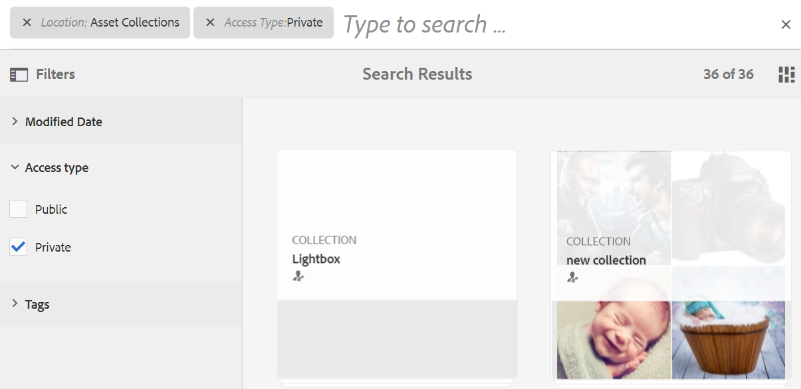

# 在 Brand Portal 上搜尋資產 {#search-assets-on-brand-portal}

Brand Portal搜尋功能可讓您使用omnisearch和facet搜尋來快速搜尋相關資產，這些搜尋使用篩選器來協助您進一步縮小搜尋範圍。 您可以在檔案或資料夾層級搜尋資產，並將搜尋結果儲存為智慧型集合。

>[!NOTE]
>
>Brand Portal不支援使用omnisearch進行集合搜尋。
>
>不過，您可以使用 [搜尋篩選器以取得相關集合的清單](#search-collection).

## 使用Omnisearch搜尋資產 {#search-assets-using-omnisearch}

若要在Brand Portal上搜尋資產：

1. 在工具列中，按一下 **[!UICONTROL 搜尋]** 表徵圖，或按「**[!UICONTROL /]**&quot;鍵以啟動Omnisearch。

   

1. 在搜尋方塊中，輸入您要搜尋資產的關鍵字。

   

   >[!NOTE]
   >
   >Omnisearch中至少需要3個字元，才能顯示搜尋建議。

1. 從下拉式清單中顯示的相關建議中選取，以快速存取相關資產。

   

   *使用Omnisearch搜尋資產*

若要了解智慧標籤資產的搜尋行為，請參閱 [了解搜尋結果和行為](https://experienceleague.adobe.com/docs/experience-manager-65/assets/using/search-assets.html).

## 在「篩選器」面板中使用Facet進行搜尋 {#search-using-facets-in-filters-panel}

在「篩選器」面板中搜尋Facet可為您的搜尋體驗增加粒度，並讓搜尋功能更有效率。 搜尋Facet使用多個維度（述詞），可讓您執行複雜的搜尋。 您可以輕鬆深入到所需的詳細程度，以便進行更集中的搜尋。

例如，如果要查找影像，則可以選擇要點陣圖還是向量影像。 您可以在「檔案類型」搜尋刻面中指定影像的MIME類型，進一步縮小搜尋範圍。 同樣，在搜索文檔時，可以指定格式，例如PDF或MS® Word格式。

此 **[!UICONTROL 篩選器]** 面板包含一些標準Facet，例如 **[!UICONTROL 路徑瀏覽器]**, **[!UICONTROL 檔案類型]**, **[!UICONTROL 檔案大小]**, **[!UICONTROL 狀態]**，和 **[!UICONTROL 方向]**. 不過，您可以 [新增自訂搜尋facet](../using/brand-portal-search-facets.md) 或從 **[!UICONTROL 篩選器]** 面板，方法是在基礎搜尋表單中新增或移除謂語。 請參閱可用和可用的清單 [在Brand Portal上搜尋述詞](../using/brand-portal-search-facets.md#list-of-search-predicates).

若要將篩選器套用至您的搜尋，請使用 [搜尋面向](../using/brand-portal-search-facets.md):

1. 按一下覆蓋圖示並選取 **[!UICONTROL 篩選]**.

   

1. 從 **[!UICONTROL 篩選器]** 面板中，選取適當的選項以套用相關篩選器。
例如，使用下列標準篩選器：

   * **[!UICONTROL 路徑瀏覽器]** 在特定目錄中搜尋資產。 路徑瀏覽器的謂語的預設搜索路徑為 `/content/dam/mac/<tenant-id>/`，編輯預設搜尋表單即可設定此欄位。
   >[!NOTE]
   >
   >對於非管理員使用者， [!UICONTROL 路徑瀏覽器] in [!UICONTROL 篩選] 面板僅顯示與其共用的資料夾（及其上階資料夾）的內容結構。\
   >若為管理員使用者，路徑瀏覽器可讓您導覽至Brand Portal中的任何資料夾。

   * **[!UICONTROL 檔案類型]** 要指定您要查找的資產檔案的類型（影像、文檔、多媒體、歸檔）。 此外，您還可以縮小搜索範圍，例如，為影像或格式(PDF或MS® Word)指定MIME類型（Tiff、點陣圖、GIMP影像）。
   * **[!UICONTROL 檔案大小]** 依資產大小來搜尋資產。 您可以指定大小範圍的下限和上限以縮小搜尋範圍，並指定要搜尋的單位。
   * **[!UICONTROL 狀態]** 要根據資產狀態搜索資產，例如「批准」（「批准」）、「請求更改」(「拒絕」（「待定」）和「有效期」(Expiration)。
   * **[!UICONTROL 平均評等]** 以根據資產評等來搜尋資產。
   * **[!UICONTROL 方向]** 依據資產的方向（水準、垂直、平方）來搜尋資產。
   * **[!UICONTROL 樣式]** 依據資產的樣式（彩色、單色）來搜尋資產。
   * **[!UICONTROL 視訊格式]** 根據其格式(DVI、Flash、MPEG4、MPEG、OGG Theora、QuickTime、Windows Media、WebM)搜索視頻資產。

   您可以使用 [自訂搜尋Facet](../using/brand-portal-search-facets.md) 編輯基礎的「搜尋表單」，即可在「篩選器」面板中取得。

   * **[!UICONTROL 屬性述詞]** 如果在搜尋表單中使用，可讓您搜尋符合中繼資料屬性且與述詞對應的資產。\
      例如，如果「屬性述詞」對應至 [!UICONTROL `jcr:content /metadata/dc:title`]，您可以根據資產的標題來搜尋資產。\
      此 [!UICONTROL 屬性述詞] 支援文本搜索：

      **部分詞組**
若要允許以屬性述詞中的部分詞組搜尋資產，請啓用「搜尋表單」中的**[!UICONTROL 「部分搜尋」]**&#x200B;核取方塊。如此一來，便可讓您搜尋所需資產，即使您未指定資產中繼資料裡所使用的確切單字/詞組。

      >[!NOTE]
      >
      > Brand Portal支援下列「部分搜尋」相關欄位：
      >* jcr:content/metadata/dc:title
      >* jcr:content/jcr:title
      >* jcr:content/metadata/dam:search_promote
      >* jcr:content/metadata/dc:format

      您可以：
      * 在「篩選器」面板的Facet中，指定搜尋片語中出現的字詞。 例如，如果您搜尋詞 **爬** (且屬性述詞已對應至 [!UICONTROL `dc:title`] 屬性)，則會是包含單字的所有資產 **爬** 會傳回其標題片語。
      * 指定搜尋片語中單字的一部分，連同萬用字元(&#42;)來填補空白。
例如，搜尋：
         * **爬&#42;** 傳回標題片語中字元為「climb」的所有字詞。
         * **&#42;爬** 傳回標題片語中字元結尾為「climb」的所有資產。
         * **&#42;爬&#42;** 傳回標題片語中包含「climb」字元的所有資產。

若要允許屬性述詞中不區分大小寫的搜尋，請啟用       **不區分大小寫的文本**
若要允許屬性述詞中不區分大小寫的搜尋，請啟用 **[!UICONTROL 忽略大小寫]** 複選框。 依預設，屬性述詞的文字搜尋會區分大小寫。
   >[!NOTE]
   >
   >選取時 **[!UICONTROL 部分搜尋]** 核取方塊， **[!UICONTROL 忽略大小寫]** 預設為選取。

   

   搜尋結果會根據套用的篩選條件以及搜尋結果計數顯示。

   

   具有搜尋結果計數的資產搜尋結果。

1. 您可以輕鬆地從搜索結果導航到項目，並使用瀏覽器中的返回按鈕返回到相同的搜索結果，而無需重新運行搜索查詢。

## 將搜尋儲存為智慧型系列 {#save-your-searches-as-smart-collection}

您可以將搜尋設定儲存為智慧型系列，以便快速重複相同的搜尋，而不需稍後重做相同的設定。 不過，您無法在集合中套用搜尋篩選器。

要將搜索設定另存為智慧系列，請執行以下操作：

1. 點選/按一下 **[!UICONTROL 儲存智慧型集合]** 和提供智慧型系列的名稱。

   若要讓所有使用者都能存取智慧型系列，請選取 **[!UICONTROL 公開]**. 訊息會確認智慧型系列已建立，並新增至已儲存搜尋的清單中。

   >[!NOTE]
   >
   >可限制非管理員使用者將智慧型集合設為公用，以避免組織之Brand Portal上非管理員使用者建立大量公用智慧型集合。 組織可停用 **[!UICONTROL 允許建立公用智慧型集合]** 配置 **[!UICONTROL 一般]** 「管理工具」面板中可用的設定。

   

1. 若要以不同名稱儲存智慧型系列，請選取或清除 **[!UICONTROL 公開]** 核取方塊，按一下 **[!UICONTROL 編輯智慧型集合]**.

   

1. 在 **[!UICONTROL 編輯智慧型集合]** 對話框，選擇 **[!UICONTROL 另存新檔]** 並輸入智慧型集合的名稱。 按一下「**[!UICONTROL 儲存]**」。

   

## 搜尋集合 {#search-collection}

集合不支援Omnisearch。 不過，您可以套用搜尋篩選器，從 [!UICONTROL 集合] 介面。

從 [!UICONTROL 集合] 介面，按一下覆蓋圖示以開啟左側邊欄中的篩選面板。 從可用篩選器套用單一或多個搜尋篩選器(`modified date`, `access type`，和 `tags`)。 它會根據套用的篩選器，列出最相關的集合集合。

