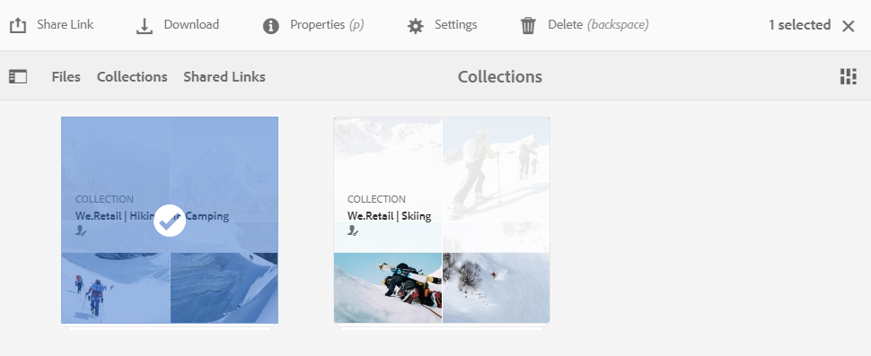

# 共用集合{#share-collections}

集合代表儲存在Adobe Experience Manager Assets Brand Portal中的一組相關資產。 使用者可透過[套用omnisearch或facet搜尋來建立智慧型集合，以篩選掉相關資產](brand-portal-searching.md)並將它們儲存在一起，以方便存取，並進一步與其他Brand Portal使用者共用。

管理員可與獲授權的Brand Portal使用者共用及取消共用集合。 編輯者和檢視者可以檢視和共用由他們建立、與他們共用的集合，以及公開的集合。

>[!NOTE]
>
>編輯器無法將公用集合變更為非公用集合，因此在&#x200B;**[!UICONTROL 集合設定]**&#x200B;對話方塊中沒有&#x200B;**[!UICONTROL 公用集合]**&#x200B;核取方塊可用。

## 共用集合 {#share-collection}

以下是與授權Brand Portal使用者共用集合的步驟：

1. 登入您的Brand Portal租用戶。 依預設，會開啟&#x200B;**[!UICONTROL 檔案]**&#x200B;檢視，其中包含所有已發佈的資產和資料夾。

1. 在頂端的快速導覽中，按一下&#x200B;**[!UICONTROL 集合]**。

1. 在&#x200B;**[!UICONTROL 集合]**&#x200B;控制台中，執行下列任一操作：

   * 將指標暫留在您要共用的集合上。 在集合可用的快速操作縮圖中，按一下&#x200B;**[!UICONTROL Settings]**&#x200B;表徵圖。

      

   * 選取您要共用的集合。 從頂端的工具列按一下&#x200B;**[!UICONTROL 設定]**。

      

1. 在&#x200B;**[!UICONTROL 集合設定]**&#x200B;對話框中，選擇要與其共用集合的用戶，並為用戶選擇角色以匹配其全局角色。 例如，將編輯者角色指派給全域編輯者，將檢視者角色指派給全域檢視者。

   或者，若要讓集合可供所有使用者使用（無論其群組成員資格和角色為何），請選取&#x200B;**[!UICONTROL 公用集合]**&#x200B;核取方塊，將集合公開。

   >[!NOTE]
   >
   >不過，可限制非管理員使用者建立公用集合，以避免擁有大量公用集合，以便儲存系統空間。 組織可以從「管理工具」面板中可用的&#x200B;**[!UICONTROL 「一般」]**&#x200B;設定停用「允許建立公用集合」]**設定。**[!UICONTROL 

   

   編輯器無法將公用集合變更為非公用集合，因此在&#x200B;**[!UICONTROL 集合設定]**&#x200B;對話方塊中沒有&#x200B;**[!UICONTROL 公用集合]**&#x200B;核取方塊可用。

   

1. 按一下&#x200B;**[!UICONTROL Add]**&#x200B;按鈕以添加用戶，然後按一下&#x200B;**[!UICONTROL Save]**。 集合會與使用者共用。

   >[!NOTE]
   >
   >使用者的角色控制對集合內資產和資料夾的存取。 如果使用者沒有資產的存取權，則會與使用者共用空白集合。 此外，使用者的角色會控制集合可用的動作。

## 取消共用集合{#unshare-a-collection}

若要取消共用先前共用的集合，請執行下列動作：

1. 在&#x200B;**[!UICONTROL 集合]**&#x200B;控制台中，選擇要取消共用的集合。

   從頂端的工具列按一下&#x200B;**[!UICONTROL 設定]**。

   

1. 在&#x200B;**[!UICONTROL 集合設定]**&#x200B;對話框的&#x200B;**[!UICONTROL 成員]**&#x200B;部分下，按一下用戶旁的&#x200B;**[!UICONTROL x]**&#x200B;符號，從有權訪問集合的用戶清單中刪除它們。

   

1. 出現警告訊息。 按一下&#x200B;**[!UICONTROL Confirm]**&#x200B;以取消共用集合。

1. 按一下&#x200B;**[!UICONTROL Save]**&#x200B;以應用更改。

   從共用清單中移除使用者後，非共用集合即會從使用者的&#x200B;**[!UICONTROL 集合]**&#x200B;主控台中移除。

<!--
1. Click the overlay icon on the left, and choose **[!UICONTROL Navigation]**.

   

1. From the siderail on the left, click **[!UICONTROL Collections]**.

   

1. From the **[!UICONTROL Collections]** console, do one of the following:

    * Hover the pointer over the collection you want to share. From the quick action thumbnails available for the collection, click the **[!UICONTROL Settings]** icon.

   

    * Select the collection you want to share. From the toolbar at the top, click **[!UICONTROL Settings]**.
    
   

1. In the [!UICONTROL Collection Settings] dialog box, select the users or groups with whom you want to share the collection and select the role for a user or a group to match their global role. For example, assign the Editor role to a global editor, the Viewer role to a global viewer.

   Alternatively, to make the collection available to all users irrespective of their group membership and role, make it public by selecting the **[!UICONTROL Public Collection]** check-box.

   >[!NOTE]
   >
   >However, non-admin users can be restricted from creating public collections, to avoid having numerous public collections so that system space can be saved. Organizations can disable the **[!UICONTROL Allow public collections creation]** configuration from [!UICONTROL General] settings available in admin tools panel.

   

   Editors cannot change a public collection to a non-public collection and, therefore, do not have **[!UICONTROL Public Collection]** check-box available in **[!UICONTROL Collection Settings]** dialog.

   

1. Select **[!UICONTROL Add]**, and then **[!UICONTROL Save]**. The collection is shared with the chosen users.

   >[!NOTE]
   >
   >A user's role governs access to the assets and folders inside a collection. If a user does not have access to assets, an empty collection is shared with the user. Also, a user's role governs the actions available for collections.

## Unshare a collection {#unshare-a-collection}

To unshare a previously shared collection, do the following:

1. From the **[!UICONTROL Collections]** console, select the collection you want to unshare.

   In the toolbar, click **[!UICONTROL Settings]**.

   

1. On the **[!UICONTROL Collection Settings]** dialog box, under **[!UICONTROL Members]**, click the **[!UICONTROL x]** symbol next to users or groups to remove them from the list of users you shared the collection with.

   

1. In the warning message box, click **[!UICONTROL Confirm]** to confirm unshare.

   Click **[!UICONTROL Save]**.

1. Log in to Brand Portal with the credentials of the user you removed from the shared list. The collection is removed from the **[!UICONTROL Collections]** console.
-->
