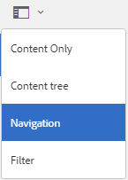
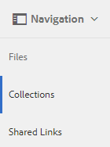
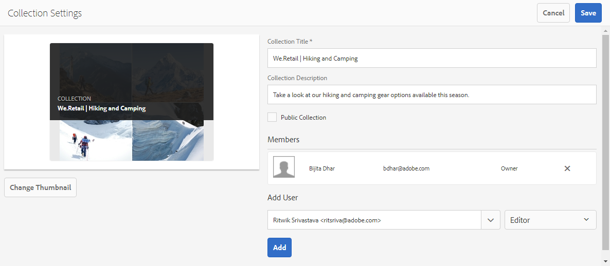
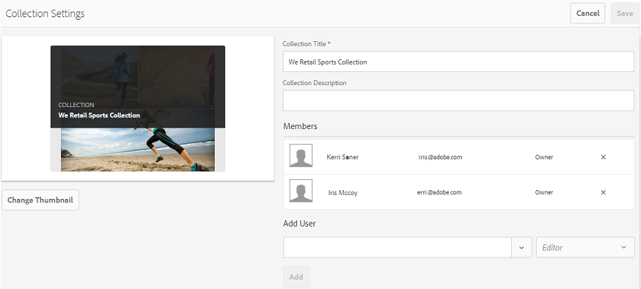
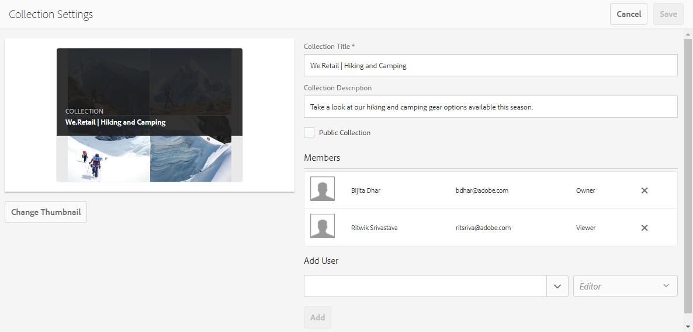

# 在品牌入口網站上共用系列 {#share-collections-bp}

AEM Assets品牌入口網站管理員可以與授權使用者共用或取消共用系列或智慧型系列。 編輯人員只能檢視和共用由他們建立、與他們共用的系列，以及公開的系列。 不過，編輯者無法將公開系列變更為非公開系列。

>[!NOTE]
>
>編輯者無法將公開系列變更為非公開的系列，因此，「系列設定」對話方塊中沒有「公 [!UICONTROL 開系列] 」核取 [!UICONTROL 方塊可用] 。

## 共用系列 {#share-collection}

To share a collection, follow these steps:

1. Click the overlay icon on the left, and choose Navigation.****

   

1. 從左側的脫軌中，按一下「系 **[!UICONTROL 列」]**。

   

1. 從「系 **[!UICONTROL 列]** 」主控台，執行下列其中一項作業：

   * Hover the pointer over the collection you want to share. 從系列的快速動作縮圖中，按一下「設 **[!UICONTROL 定]** 」圖示。
   

   * 選取您要共用的系列。 在頂端的工具列中，按一下「設 **[!UICONTROL 定」]**。
   

1. 在「系 [!UICONTROL 列設定] 」對話方塊中，選取您要與其共用系列的使用者或群組，並選取使用者或群組的角色，以符合其全域角色。 例如，將編輯器角色指派給全域編輯器，將檢視器角色指派給全域檢視器。

   或者，若要讓系列可供所有使用者使用，而不論其群組成員資格和角色為何，請選取「公用系列」核取方塊 **[!UICONTROL ，將其公開]** 。

   >[!NOTE]
   >
   >不過，非管理員使用者可能無法建立公用系列，以避免擁有大量公用系列，以節省系統空間。 組織可以停用「 **[!UICONTROL 管理工具」面板中]** 「一般  」設定中的「允許公開系列建立設定」。

   

   編輯者無法將公開系列變更為非公開的系列，因此，「系列設定」對話方塊中沒有「公開系列 [!UICONTROL 」核取方] 塊可用  。

   

1. 選擇 **[!UICONTROL 添加]**，然後選擇 **[!UICONTROL 保存]**。 系列會與所選的使用者共用。

   >[!NOTE]
   >
   >使用者的角色控制對系列內資產和資料夾的存取。 如果使用者沒有資產的存取權，則會與使用者共用空的系列。 此外，使用者的角色也會控制系列的可用動作。

## 取消共用系列 {#unshare-a-collection}

若要取消共用先前共用的系列，請執行下列動作：

1. 從「系 [!UICONTROL 列] 」主控台中，選取您要取消共用的系列。

   在工具列中，按一下「 **[!UICONTROL 設定」]**。

   

1. 在「系 [!UICONTROL 列設定] 」對話方塊的「成員」下方，按一下使用者或群組旁的 **** x符號，從您共用系列的使用者清單中移除它們。

   

1. 在警告訊息方塊中，按一下「 **[!UICONTROL 確認]** 」以確認取消共用。

   Click **[!UICONTROL Save]**.

1. 使用您從共用清單中移除的使用者認證登入品牌入口網站。 系列會從「系列」控制 **[!UICONTROL 台移除]** 。
