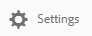

# 共用集合 {#share-collections}

集合代表一組儲存在Adobe Experience Manager Assets Brand Portal的相關資產。 用戶可通過 [應用nisearch或facet搜索篩選相關資產](brand-portal-searching.md) 並將它們儲存在一起，以便於訪問，並進一步與其他Brand Portal用戶共用。

管理員可以與授權的品牌入口網站使用者共用和取消共用集合。 編輯器和檢視器可以視圖和共用由他們建立的集合、與他們共用和公開集合。

>[!NOTE]
>
>編輯器無法將公用集合變更為非公共集合，因此 **[!UICONTROL 在「集合設定]** 對話方塊中 **[!UICONTROL 沒有「公開搜集]** 」核取方塊。

## 共用集合 {#share-collection}

以下是與授權的品牌入口網站使用者共用集合的步驟：

1. 登入您的品牌入口網站出租。 依預設，會開啟檔案 ]**視圖，**[!UICONTROL  其中包含所有發佈的資產和資料夾。

1. 從頂部的快速導航中，按一下 **[!UICONTROL 「集合]** 」。

1. 從 **[!UICONTROL 集合]** console，執行下列操作之一：

   * 將指針懸停在要共用的集合上。 在可用於集合的快速操作縮略圖中，按一下 **[!UICONTROL 設定]** 表徵圖

      

   * 選擇要共用的集合。 在頂部的工具欄中，按一下 **[!UICONTROL 設定]**。

      

1. **[!UICONTROL 在「集合設定]** 」對話方塊中，選取您要與其共用集合的使用者，然後選取用戶的角色以符合其全域角色。例如，將編輯器角色指派給全域編輯者，檢視器角色至全域檢視者。

   或者，若要讓所有使用者都能使用集合而不管其群組成員資格和角色，請選取 **[!UICONTROL 「公開集合]** 」核取方塊以加以公開。

   >[!NOTE]
   >
   >不過，非管理員使用者可以受到限制，無法建立公共集合，以避免擁有大量公用集合，以便儲存系統空間。 組織可以從 **[!UICONTROL 「管理工具」面板中的「一般]** 設定」停 **[!UICONTROL 用「允許公用集合建立]** 」配置。

   

   編輯器無法將公用集合變更為非公共集合，因此 **[!UICONTROL ，「集合設定]** 對話方塊中 **[!UICONTROL 不可用「公開搜集]** 」核取方塊。

   

1. **[!UICONTROL 按一下「增加]** 按鈕以新增用戶，然後按一下 **[!UICONTROL 儲存]** 。集合共用給使用者。

   >[!NOTE]
   >
   >用戶的角色管轄集合內的資產和資料夾存取權。 如果用戶沒有訪問資產的權限，則與用戶共用空集合。 此外，用戶的角色會控制可供收集的動作。

## 取消共用集合 {#unshare-a-collection}

要取消共用以前共用的集合，請執行以下操作：

1. **[!UICONTROL 從「集合]** 」主控台中，選擇您要取消共用的集合。

   在頂部的工具列中，按一下 **[!UICONTROL 設定]** 。

   

1. **[!UICONTROL 在「集合設定]** 」對話方塊的「成員 ]**」區域下**[!UICONTROL  ，按一下使用者旁邊的 **[!UICONTROL x]** 符號，將其從可存取集合的使用者清單中移除。

   

1. 顯示警告訊息。 按一下 **[!UICONTROL 確認]** 以取消共用集合。

1. 按一下 **[!UICONTROL 儲存]** 以套用變更。

   從共用清單中移除用戶後，將從用戶的 **[!UICONTROL 集合]** 主控台中移除非共用集合。

<!--
1. Click the overlay icon on the left, and choose **[!UICONTROL Navigation]**.

   

1. From the siderail on the left, click **[!UICONTROL Collections]**.

   

1. From the **[!UICONTROL Collections]** console, do one of the following:

    * Hover the pointer over the collection you want to share. From the quick action thumbnails available for the collection, click the **[!UICONTROL Settings]** icon.

   

    * Select the collection you want to share. From the toolbar at the top, click **[!UICONTROL Settings]**.
    
   

1. In the [!UICONTROL Collection Settings] dialog box, select the users or groups with whom you want to share the collection and select the role for a user or a group to match their global role. For example, assign the Editor role to a global editor, the Viewer role to a global viewer.

   Alternatively, to make the collection available to all users irrespective of their group membership and role, make it public by selecting the **[!UICONTROL Public Collection]** check-box.

   >[!NOTE]
   >
   >However, non-admin users can be restricted from creating public collections, to avoid having numerous public collections so that system space can be saved. Organizations can disable the **[!UICONTROL Allow public collections creation]** configuration from [!UICONTROL General] settings available in admin tools panel.

   

   Editors cannot change a public collection to a non-public collection and, therefore, do not have **[!UICONTROL Public Collection]** check-box available in **[!UICONTROL Collection Settings]** dialog.

   

1. Select **[!UICONTROL Add]**, and then **[!UICONTROL Save]**. The collection is shared with the chosen users.

   >[!NOTE]
   >
   >A user's role governs access to the assets and folders inside a collection. If a user does not have access to assets, an empty collection is shared with the user. Also, a user's role governs the actions available for collections.

## Unshare a collection {#unshare-a-collection}

To unshare a previously shared collection, do the following:

1. From the **[!UICONTROL Collections]** console, select the collection you want to unshare.

   In the toolbar, click **[!UICONTROL Settings]**.

   

1. On the **[!UICONTROL Collection Settings]** dialog box, under **[!UICONTROL Members]**, click the **[!UICONTROL x]** symbol next to users or groups to remove them from the list of users you shared the collection with.

   

1. In the warning message box, click **[!UICONTROL Confirm]** to confirm unshare.

   Click **[!UICONTROL Save]**.

1. Log in to Brand Portal with the credentials of the user you removed from the shared list. The collection is removed from the **[!UICONTROL Collections]** console.
-->
