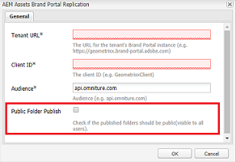
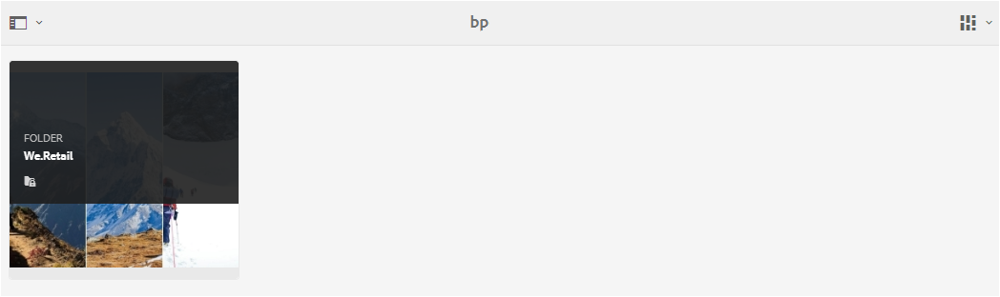
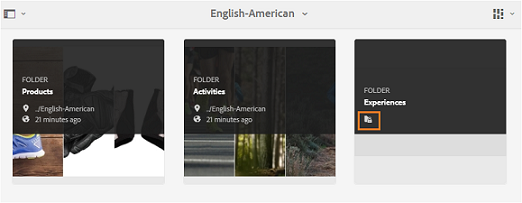
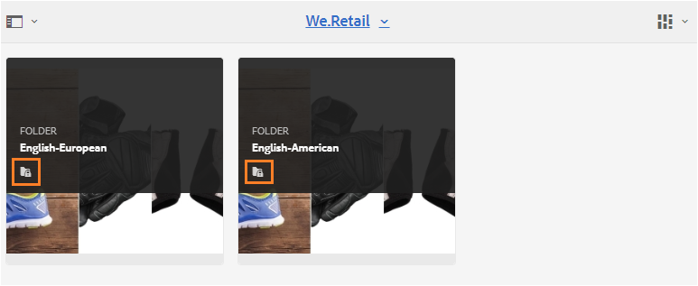
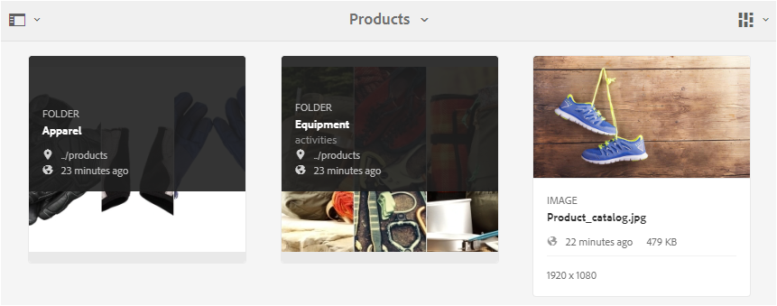
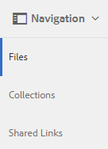
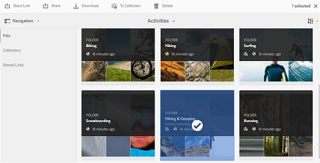
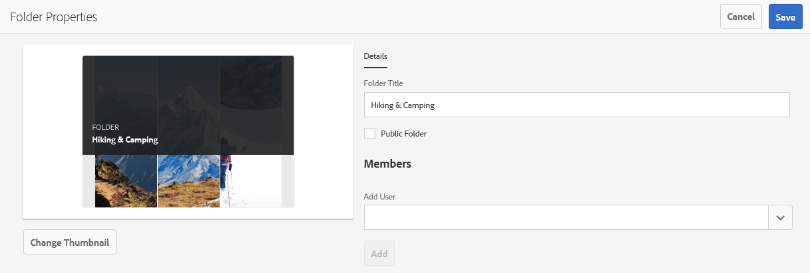
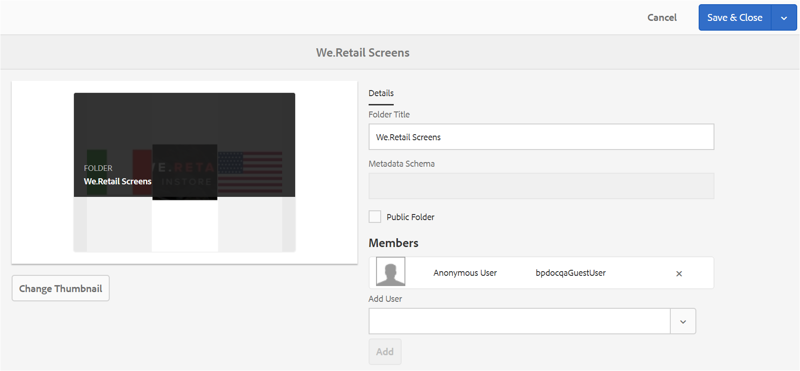

# 在品牌入口網站上共用資料夾 {#share-folders}

需要從預先設定的AEM作者實例將資產發佈至品牌入口網站，因為品牌入口網站不支援資產擷取。

## 品牌入口網站中的資料夾共用工作流程 {#folder-sharing-workflow-in-brand-portal}

以下說明資料夾共用工作流程和使用者存取：

* 根據預設，所有從AEM Assets發佈到品牌入口網站的資料夾只會顯示給品牌入口管理員，除非在設定複製時標示為公用。
* 管理員會使用 **資料夾屬性** 主控台來共用資料夾與選擇性使用者或群組。只有已共用資料夾的使用者或群組才能在他們登入品牌入口網站後看見資料夾。其他使用者看不到此資料夾。
* 管理員也可以選擇透過資料夾屬性主控台中的「 **公用資料夾** 」核取方塊，將 **資料夾設** 為公用。所有使用者都可看到公用資料夾。

* 不論使用者角色和權限為何，當使用者登入品牌入口網站時，他們會看到所有公開資料夾，以及直接共用給他們或其所屬群組的資料夾。所有使用者看不到私人資料夾或與其他使用者共用的資料夾。

### 與品牌入口網站上的使用者群組共用資料夾 {#sharing-folders-with-user-groups-on-brand-portal}

資料夾的資產存取權取決於其父資料夾的存取權限，而不考慮子資料夾的設定。此行為由AEM中 [的ACL](https://helpx.adobe.com/experience-manager/6-5/sites/administering/using/security.html#PermissionsinAEM) 控管，因為子資料夾會繼承其父資料夾中的ACL。例如，如果檔案夾A包含檔案夾B，其中包含資料夾C，則資料夾A上擁有存取權限的使用者群組(或使用者)也具有相同的資料夾B和資料夾C存取權限。資料夾B是繼承其ACLs的子資料夾，而資料夾C則繼承其ACLs。

同樣地，只有存取資料夾B權限的使用者群組(或使用者)具有資料夾C而非資料夾A的存取權限。因此，建議組織排列其內容，以便將最公開的資產放置在子資料夾中，而從子項到根資料夾存取權可能受到限制。

### Public folder publish {#public-folder-publish}

除非在設定品牌入口網站複製時選取 **「公開資料夾發佈** 」選項，否則非管理員使用者(例如編輯和檢視者)無法存取從AEM Assets發佈至品牌入口網站的資產。

如果「 **Public Folder Publish** 」(公開資料夾發佈)選項停用，管理員就必須使用共用功能，與非管理員使用者明確共用這些資產。

>[!NOTE]
>
>啓用 **「Public Folder Publish」(公開資料夾發佈** )選項可在AEM6.3.2.1線上使用。

## 存取共用資料夾 {#access-to-shared-folders}

下列矩陣討論針對各種使用者角色共用/取消共用資產的存取權限和權限：

|  | 存取從AEM Assets發佈至品牌入口網站的所有資料夾 | 存取共用資料夾 | 共用/取消共用資料夾權限 |
|---------------|-----------|-----------|------------|
| 管理員 | 是 | 是 | 是 |
| 編輯者 | 否* | 是，只有在共用給他們或 | 是，只有共用給他們的資料夾或其所屬群組 |
| 檢視者 | 否* | 是，只有在共用給他們或 | 否 |
| 訪客使用者 | 否* | 是，只有在共用給他們或 | 否 |

**依預設，在使用AEM作者設定品牌入口網站的複製時&#x200B;**，「公開資料夾發佈**」選項會停用。如果選項已啓用，則預設會讓所有使用者(非管理員使用者)存取發佈至品牌入口網站的資料夾。*

### 非管理員使用者存取共用資料夾 {#non-admin-user-access-to-shared-folders}

非管理員使用者只能存取品牌入口網站上與其共用的資料夾。不過，這些資料夾在入口網站上顯示的方式取決於「啓用資料夾階層」設定的設定。

**如果設定停用**

非管理員使用者會在登陸頁面上看到與它們共用的所有資料夾，並登入品牌入口網站。

**如果設定已啓用**

非管理員使用者會在登入品牌入口網站時，看到資料夾樹狀結構(從根資料夾開始)和已排列的共用資料夾。

這些父資料夾是虛擬資料夾，無法執行任何動作。您可以使用鎖定圖示辨識這些虛擬資料夾。

與共用資料夾不同的是，在「卡片檢視」中不會顯示任何動作任務，也不會顯示任何動作任務。「概述」按鈕會顯示在選取「欄檢視」和「清單檢視」中的虛擬資料夾。

>[!NOTE]
>
>請注意，虛擬檔案夾的預設縮圖是第一個共用資料夾的縮圖影象。

   

## 共用資料夾 {#how-to-share-folders}

若要與品牌入口網站上的使用者共用資料夾，請依照下列步驟執行：

1. 按一下左側的覆蓋圖示，然後選擇 **「導覽**」。

   

2. 從左側的側邊圖中，選取 **「檔案**」。

   

3. 從品牌入口網站介面中，選取您要共用的資料夾。

   

4. 從上方的工具列，選取 **「共用**」。

   

   **「資料夾屬性** 」主控台隨即出現。

   

5. 在 **資料夾屬性** 控制台中，如果您不希望將預設名稱顯示給使用者，請在 **「資料夾標題」** 欄位中指定資料夾標題。
6. 從 **「新增使用者** 」清單中，選取您要與其共用資料夾的使用者或群組，然後按一下 **「新增**」。
若要與僅限來賓使用者共用資料夾，而不是其他使用者，請從 ******「成員** 」下拉式清單中選取「匿名使用者」。

   

   >[!NOTE]
   >
   >若要讓所有使用者都能使用該資料夾而不考慮其群組成員資格和角色，請選取 **「公開資料夾** 」核取方塊。

7. 如有必要，按一下 **「變更縮圖** 」以修改資料夾的縮圖影象。
8. 按一下&#x200B;**「儲存」**。
9. 若要存取共用資料夾，請使用您共用資料夾的使用者認證登入品牌入口網站。檢閱介面中的共用資料夾。

## 取消共用資料夾 {#unshare-the-folders}

若要取消共用先前共用資料夾，請遵循下列步驟：

1. 從品牌入口網站介面中，選取您要取消共用的資料夾。

   

2. 從上方的工具列，按一下 **「共用**」。
3. 在 **「資料夾屬性** 控制台」的 **「成員」**&#x200B;下方，按一下使用者旁邊的 **x** 符號，將其從您共用資料夾的使用者清單中移除。

   

4. 在警告訊息方塊中，按一下 **確認** 確認取消共用。
按一下**「儲存」**。

5. 使用您從共用清單中移除的使用者認證登入品牌入口網站。此資料夾已不再適用於使用者的品牌入口網站介面。
