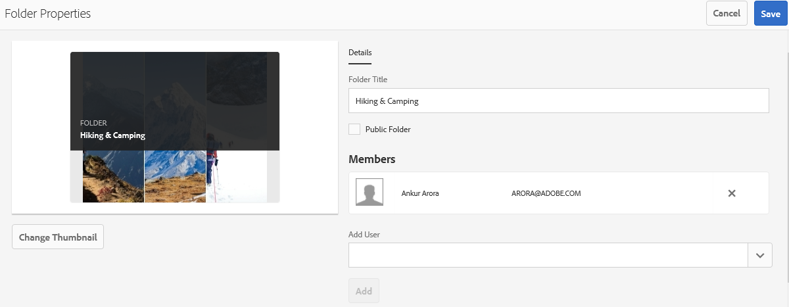

# 品牌入口網站{#share-folders}上的共用資料夾

資產必須從預先設定的AEM作者例項發佈至品牌入口網站，因為品牌入口網站不支援資產擷取。

## 品牌入口網站{#folder-sharing-workflow-in-brand-portal}中的資料夾共用工作流程

以下說明資料夾共用工作流程和使用者存取權：

* 依預設，從AEM Assets發佈至品牌入口網站的所有資料夾都只會對品牌入口網站管理員顯示，除非在設定複製時標示為公用。
* 管理員使用&#x200B;**[!UICONTROL 資料夾屬性]**&#x200B;控制台與選擇性用戶或組共用資料夾。 只有共用資料夾的使用者或群組在登入品牌入口網站後，才能看到資料夾。 其他使用者看不到該資料夾。
* 管理員也可以選擇通過&#x200B;**[!UICONTROL 資料夾屬性]**&#x200B;控制台中的&#x200B;**[!UICONTROL 公共資料夾]**&#x200B;複選框將資料夾設為公用。 所有使用者都可看到公用資料夾。

* 不論使用者角色和權限為何，當使用者登入品牌入口網站時，都會看到所有公用資料夾，以及直接與其共用或與其所屬群組共用的資料夾。 私人檔案夾或與其他使用者共用的檔案夾，並非所有使用者都能看見。

### 與品牌入口網站{#sharing-folders-with-user-groups-on-brand-portal}上的使用者群組共用資料夾

資料夾資產的存取權限取決於其父資料夾的存取權限，而與子資料夾的設定無關。 此行為受AEM中[ACL](https://helpx.adobe.com/experience-manager/6-5/sites/administering/using/security.html#PermissionsinAEM)的控制，因為子資料夾從其父資料夾繼承ACL。 例如，如果資料夾A包含包含資料夾C的資料夾B，則對資料夾A具有訪問權限的用戶組（或用戶）對資料夾B和資料夾C也具有相同的訪問權限。資料夾B是A的子資料夾，它繼承其ACL，資料夾C是B的子資料夾繼承其ACL。

同樣地，具有僅訪問資料夾B權限的用戶組（或用戶）對資料夾C具有相同的訪問權限，但對資料夾A則不具有相同的訪問權限。因此，建議組織安排其內容，以便將大部分暴露的資產放置在子資料夾中，並限制從子資料夾到根資料夾的訪問。

### 公用資料夾發佈{#public-folder-publish}

除非在設定品牌入口網站複製時選取「**[!UICONTROL 公用資料夾發佈]**」選項，否則非管理員使用者（例如編輯和檢視器）無法存取從AEM資產發佈至品牌入口網站的資產。

如果&#x200B;**[!UICONTROL 公用資料夾發佈]**&#x200B;選項已停用，管理員必須使用共用功能，特別將這些資產與非管理員使用者共用。

>[!NOTE]
>
>AEM 6.3.2.1以後版本提供啟用&#x200B;**[!UICONTROL 公用資料夾發佈]**&#x200B;的選項。

## 訪問共用資料夾{#access-to-shared-folders}

以下矩陣討論不同使用者角色的共用／取消共用資產的存取權限與權限：

|  | 存取從AEM Assets發佈至品牌入口網站的所有資料夾 | 存取共用資料夾 | 共用／取消共用資料夾權限 |
|---------------|-----------|-----------|------------|
| 管理員 | 是 | 是 | 是 |
| 編輯者 | 否* | 是，僅當與他們共用或與他們所屬的群組共用時 | 是的，僅適用於與他們或他們所屬的組共用的資料夾 |
| 檢視者 | 否* | 是，僅當與他們共用或與他們所屬的群組共用時 | 否 |
| 訪客使用者 | 否* | 是，僅當與他們共用或與他們所屬的群組共用時 | 否 |

>[!NOTE]
>
>依預設，在設定品牌入口網站與AEM作者複製時，會停用&#x200B;**[!UICONTROL 公用資料夾發佈]**&#x200B;選項。 如果啟用此選項，則所有使用者（非管理員使用者）都預設可存取發佈至品牌入口網站的資料夾。

### 非管理員用戶訪問共用資料夾{#non-admin-user-access-to-shared-folders}

非管理員使用者只能存取品牌入口網站上與他們共用的資料夾。 不過，這些資料夾登入時在入口網站上的顯示方式取決於&#x200B;**[!UICONTROL 啟用資料夾階層]**&#x200B;組態的設定。

**如果配置已禁用**

非管理員使用者登入品牌入口網站時，會在登陸頁面上看到與他們共用的所有資料夾。

**如果已啟用配置**

非管理員使用者登入品牌入口網站時，會看到資料夾樹狀結構（從根資料夾開始）和位於其各自父資料夾內的共用資料夾。

這些父資料夾是虛擬資料夾，不能對其執行任何操作。 您可以使用鎖定表徵圖來識別這些虛擬資料夾。

與共用資料夾不同，當懸停或在&#x200B;**[!UICONTROL 卡片視圖]**&#x200B;中選擇操作任務時，不會顯示任何操作任務。 **[!UICONTROL 在「]** 列視圖」和「清單視圖」中選擇虛擬資料夾時， **[!UICONTROL 將]** 顯示「概述 **[!UICONTROL 」按鈕]**。

>[!NOTE]
>
>請注意，虛擬資料夾的預設縮略圖是第一個共用資料夾的縮略圖。

   

## 共用資料夾 {#how-to-share-folders}

若要與品牌入口網站上的使用者共用資料夾，請遵循下列步驟：

1. 按一下左側的覆蓋圖示，然後選擇&#x200B;**[!UICONTROL Navigation]**。

   

1. 從左側的脫軌中，選擇&#x200B;**[!UICONTROL 檔案]**。

   

1. 從品牌入口網站介面中，選取您要共用的資料夾。

   

1. 從頂部的工具欄中，選擇&#x200B;**[!UICONTROL Share]**。

   

   將顯示[!UICONTROL 資料夾屬性]控制台。

   

1. 在&#x200B;**[!UICONTROL 資料夾屬性]**&#x200B;主控台中，如果您不希望將預設名稱顯示給使用者，請在&#x200B;**[!UICONTROL 資料夾標題]**&#x200B;欄位中指定資料夾標題。
1. 從&#x200B;**[!UICONTROL 添加用戶]**&#x200B;清單中，選擇要與其共用資料夾的用戶或組，然後按一下&#x200B;**[!UICONTROL 添加]**。
要僅與來賓用戶共用資料夾，而不與其他用戶共用資料夾，請從**[!UICONTROL 成員]**&#x200B;下拉菜單中選擇&#x200B;**[!UICONTROL 匿名用戶]**。

   

   >[!NOTE]
   >
   >要使資料夾對所有用戶都可用，而不管其組成員資格和角色如何，請通過選中「公用資料夾」(Public Folder)**[!UICONTROL 複選框將其公開。]**

1. 如有必要，按一下「更改縮略圖」(Change Thumbnail)**[!UICONTROL 以修改資料夾的縮略圖。]**
1. 按一下&#x200B;**[!UICONTROL 「儲存」]**。

1. 若要存取共用資料夾，請使用您共用資料夾之使用者的認證登入品牌入口網站。 查看介面中的共用資料夾。

## 取消共用資料夾{#unshare-the-folders}

要取消共用以前共用的資料夾，請執行以下步驟：

1. 從品牌入口網站介面中，選取您要取消共用的資料夾。

   

1. 在頂部的工具欄上，按一下&#x200B;**[!UICONTROL Share]**。
1. 在&#x200B;**[!UICONTROL 資料夾屬性]**&#x200B;控制台的&#x200B;**[!UICONTROL 成員]**&#x200B;下，按一下用戶旁邊的&#x200B;**[!UICONTROL x]**&#x200B;符號，將它們從與共用資料夾的用戶清單中刪除。

   

1. 在警告訊息方塊中，按一下「確認&#x200B;****」以確認取消共用。
按一下**[!UICONTROL 「儲存」]**。

1. 使用您從共用清單中移除的使用者認證登入品牌入口網站。 該資料夾不再適用於使用者的品牌入口網站介面。
