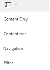

# 在Brand Portal上共用資料夾 {#share-folders}

資產需要從預先配置的「Experience Manager作者」實例發佈到Brand Portal，因為Brand Portal不支援資產接收。

## Brand Portal的資料夾共用工作流 {#folder-sharing-workflow-in-brand-portal}

下面介紹了資料夾共用工作流和用戶訪問：

* 預設情況下，從Experience Manager Assets發佈到Brand Portal的所有資料夾只對Brand Portal管理員可見，除非在配置複製時標籤為公共。
* 管理員使用 **[!UICONTROL 資料夾屬性]** 控制台與選擇性用戶或組共用資料夾。 只有與資料夾共用的用戶或組才能在登錄到Brand Portal後查看該資料夾。 其他用戶看不到該資料夾。
* 管理員還可以選擇通過 **[!UICONTROL 公用資料夾]** 的子菜單。 **[!UICONTROL 資料夾屬性]** 控制台。 公共資料夾對所有用戶可見。

* 無論用戶角色和權限如何，當用戶登錄Brand Portal時，他們都會看到所有公共資料夾，以及直接與他們或他們所屬的組共用的資料夾。 專用資料夾或與其他用戶共用的資料夾對所有用戶都不可見。

### 與Brand Portal上的用戶組共用資料夾 {#sharing-folders-with-user-groups-on-brand-portal}

對資料夾資產的訪問權限取決於其父資料夾的訪問權限，而不考慮子資料夾的設定。 此行為受 [ACL](https://experienceleague.adobe.com/docs/experience-manager-65/administering/security/security.html) 中，AEM子資料夾從其父資料夾繼承ACL。 例如，如果資料夾A包含包含資料夾C的資料夾B，則對資料夾A具有訪問權限的用戶組（或用戶）對資料夾B和資料夾C也具有相同的訪問權限。資料夾B是A的子資料夾繼承其ACL，而資料夾C是B的子資料夾繼承其ACL。

同樣，具有僅訪問資料夾B權限的用戶組（或用戶）對資料夾C具有相同的訪問權限，但對資料夾A沒有相同的訪問權限。因此，建議組織安排其內容，以便將大多數暴露的資產放置在子資料夾中，並限制從子資料夾到根資料夾的訪問。

### 公用資料夾發佈 {#public-folder-publish}

除非 **[!UICONTROL 公用資料夾發佈]** 選項在配置Brand Portal複製時選中，非管理員用戶（如編輯和查看者）無權訪問從AEM Assets發佈到Brand Portal的資產。

如果 **[!UICONTROL 公用資料夾發佈]** 選項被禁用，管理員需要使用共用權能與非管理員用戶專門共用這些資產。

>[!NOTE]
>
>啟用的選項 **[!UICONTROL 公用資料夾發佈]** 6.3.2.1版。

## 訪問共用資料夾 {#access-to-shared-folders}

下表討論了對不同用戶角色共用/取消共用資產的訪問權限和權限：

|  | 訪問從AEM Assets到Brand Portal發佈的所有資料夾 | 訪問共用資料夾 | 共用/取消共用資料夾權限 |
|---------------|-----------|-----------|------------|
| 管理員 | 是 | 是 | 是 |
| 編輯者 | 否* | 是，僅當與他們或他們所屬的組共用時 | 是，僅用於與他們共用的資料夾或與他們所屬的組共用的資料夾 |
| 檢視者 | 否* | 是，僅當與他們或他們所屬的組共用時 | 否 |
| 訪客使用者 | 否* | 是，僅當與他們或他們所屬的組共用時 | 否 |

>[!NOTE]
>
>預設情況下， **[!UICONTROL 公用資料夾發佈]** 選項在配置使用AEM作者複製Brand Portal時禁用。 如果啟用該選項，則所有用戶（非管理員用戶也可訪問）預設情況下將可訪問發佈到Brand Portal的資料夾。

### 非管理員用戶對共用資料夾的訪問 {#non-admin-user-access-to-shared-folders}

非管理員用戶只能訪問與他們在Brand Portal上共用的資料夾。 但是，這些資料夾登錄時在門戶上的顯示方式取決於 **[!UICONTROL 啟用資料夾層次結構]** 配置。

**如果禁用了配置**

非管理員用戶在登錄Brand Portal時會在登錄頁上看到與他們共用的所有資料夾。

**如果啟用了配置**

非管理員用戶在登錄Brand Portal時會看到資料夾樹（從根資料夾開始）和在其各自父資料夾內排列的共用資料夾。

這些父資料夾是虛擬資料夾，不能對它們執行任何操作。 您可以使用鎖定表徵圖識別這些虛擬資料夾。

懸停或在中選擇操作任務時不可見 **[!UICONTROL 卡視圖]**，與共用資料夾不同。 **[!UICONTROL 概述]** 中選擇虛擬資料夾時顯示 **[!UICONTROL 列視圖]** 和 **[!UICONTROL 清單視圖]**。

>[!NOTE]
>
>請注意，虛擬資料夾的預設縮略圖是第一個共用資料夾的縮略圖。

   

## 共用資料夾 {#how-to-share-folders}

要與Brand Portal上的用戶共用資料夾，請執行以下步驟：

1. 按一下左側的覆蓋表徵圖，然後選擇 **[!UICONTROL 導航]**。

   

1. 從左側的脫軌處，選擇 **[!UICONTROL 檔案]**。

   

1. 從Brand Portal介面中，選擇要共用的資料夾。

   

1. 從頂部的工具欄中，選擇 **[!UICONTROL 共用]**。

   

   的 [!UICONTROL 資料夾屬性] 控制台。

   

1. 在 **[!UICONTROL 資料夾屬性]** 控制台，在 **[!UICONTROL 資料夾標題]** 的子菜單。
1. 從 **[!UICONTROL 添加用戶]** 清單，選擇要與其共用資料夾的用戶或組，然後按一下 **[!UICONTROL 添加]**。
要僅與來賓用戶共用資料夾，而不與其他用戶共用，請選擇 **[!UICONTROL 匿名用戶]** 從 **[!UICONTROL 成員]** 下拉清單。

   

   >[!NOTE]
   >
   >要使資料夾對所有用戶都可用，而不管其組成員和角色如何，請通過選擇 **[!UICONTROL 公用資料夾]** 的子菜單。

1. 如有必要，按一下 **[!UICONTROL 更改縮略圖]** 修改資料夾的縮略圖。
1. 按一下「**[!UICONTROL 儲存]**」。

1. 要訪問共用資料夾，請使用與共用資料夾的用戶的憑據登錄到Brand Portal。 查看介面中的共用資料夾。

## 取消共用資料夾 {#unshare-the-folders}

要取消共用以前的共用資料夾，請執行以下步驟：

1. 從Brand Portal介面中，選擇要取消共用的資料夾。

   

1. 在頂部的工具欄中，按一下 **[!UICONTROL 共用]**。
1. 在 **[!UICONTROL 資料夾屬性]** 控制台，在 **[!UICONTROL 成員]**，按一下 **[!UICONTROL x]** 符號，用於從與共用資料夾的用戶清單中刪除這些符號。

   

1. 在警告消息框中，按一下 **[!UICONTROL 確認]** 確認取消共用。
按一下「**[!UICONTROL 儲存]**」。

1. 使用從共用清單中刪除的用戶的憑據登錄到Brand Portal。 該資料夾在Brand Portal介面中不再可用於用戶。
