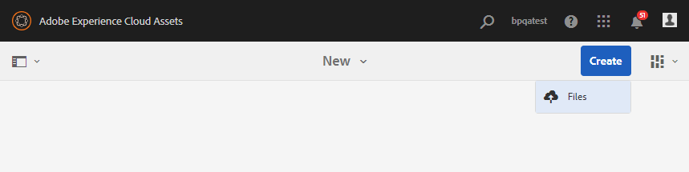

# 將新資產上傳至貢獻檔案夾 {#uplad-new-assets-to-contribution-folder}

品牌入口網 [站使用者下載資產需求](brand-portal-download-asset-requirements.md) -貢獻資料夾附加的簡要檔案，並從 **SHARED** 資料夾下載基準資產，以瞭解貢獻的需要。
然後，品牌入口網站使用者可以建立新的貢獻資產，並將它們上傳至貢 **獻資料夾的** 「新增」資料夾。

>[!NOTE]
>
>品牌入口網站使用者只能將內容／資產上傳 **至** NEW檔案夾。 他們沒有刪除已上傳資產的權限。
>
>任何品牌入口網站帳戶／租用戶的上傳上限 **為** 10 GB。

**若要上傳新資產：**

1. 登入您的品牌入口網站實例。
「品牌入口網站」控制面板會反映品牌入口網站使用者允許的所有現有資料夾，以及新共用的貢獻資料夾。
1. 按一下以開啟貢獻資料夾，您可在貢獻資料夾中看到兩個子&#x200B;**[!UICONTROL 資料夾]** - **[!UICONTROL SHARED]** 和NEW。
1. 按一 **[!UICONTROL 下「新]** 」檔案夾。
   
1. 按一 **[!UICONTROL 下「建立]** &gt;檔案」  ，上傳包含多個資產的個別檔案或檔案夾(.zip)。
   
1. 在「新增」檔案夾中瀏覽及上傳新資產(檔案/ **[!UICONTROL 檔案夾]** )。
   

上傳完成後，品牌入口網站使用者可以將貢獻資料夾發佈回AEM Assets。 請參閱「 [將貢獻資料夾發佈至AEM資產」](brand-portal-publish-contribution-folder-to-aem-assets.md)。