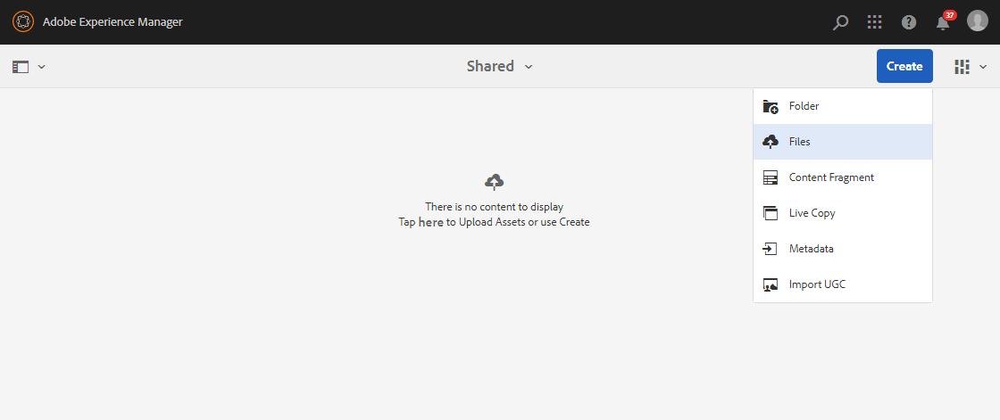
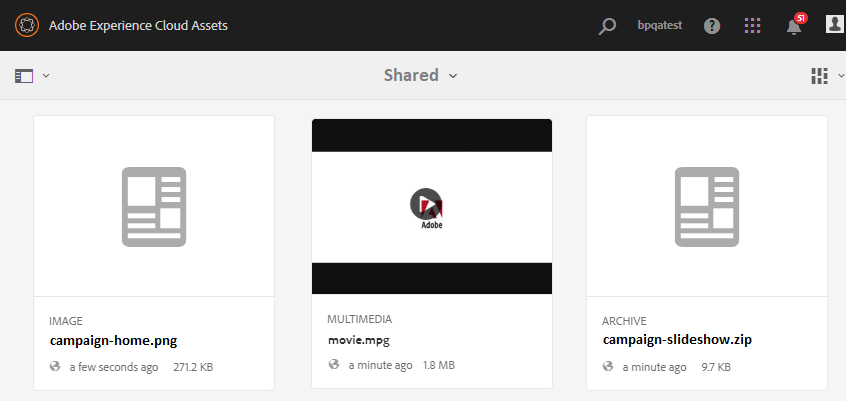

# 上傳基準資產{#upload-baseline-assets}

AEM管理員會上傳&#x200B;**SHARED**&#x200B;資料夾中的基準資產，以協助品牌入口網站使用者瞭解貢獻期間所需的資產類型。 這些資產可供品牌入口網站使用者用來做為參考內容，同時建立新資產以供貢獻。

**若要上傳基準資產：**

1. 登入您的AEM作者實例。
預設URL:http:// localhost:4502/aem/start.html
1. 導覽至「**[!UICONTROL 資產>檔案]**」，並找出您要上傳基準資產的貢獻資料夾。
1. 按一下以開啟貢獻資料夾，您可在貢獻資料夾中看到兩個子資料夾-**[!UICONTROL SHARED]**&#x200B;和&#x200B;**[!UICONTROL NEW]**。
1. 按一下&#x200B;**[!UICONTROL SHARED]**&#x200B;資料夾。
1. 按一下「建立>檔案&#x200B;****」以上傳個別資產。
或者，按一下「建立>資料夾&#x200B;**[!UICONTROL 」以上傳包含多個資產的資料夾(.zip)。]**
   
1. 瀏覽並上傳&#x200B;**[!UICONTROL SHARED]**資料夾中的基準資產（檔案／資料夾）。
   

上傳完成後，管理員可以將貢獻資料夾發佈至品牌入口網站。 請參閱[將貢獻資料夾發佈至品牌入口網站](brand-portal-publish-contribution-folder-to-brand-portal.md)。